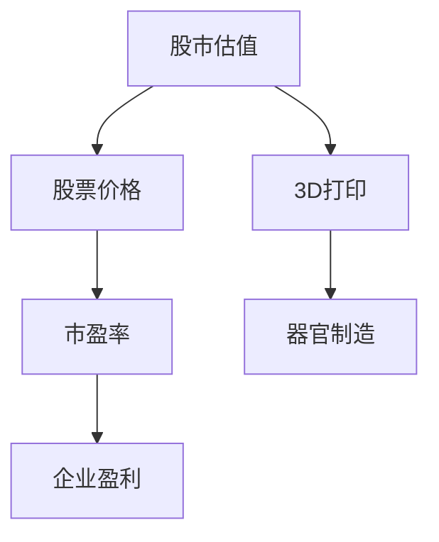
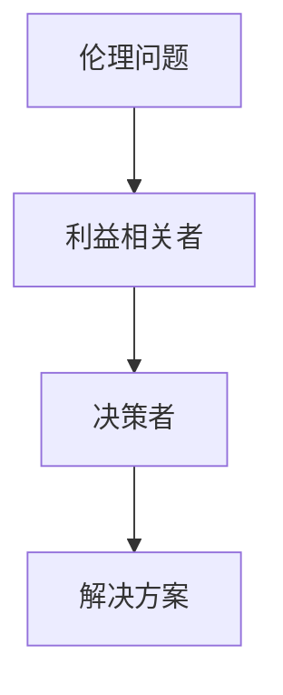
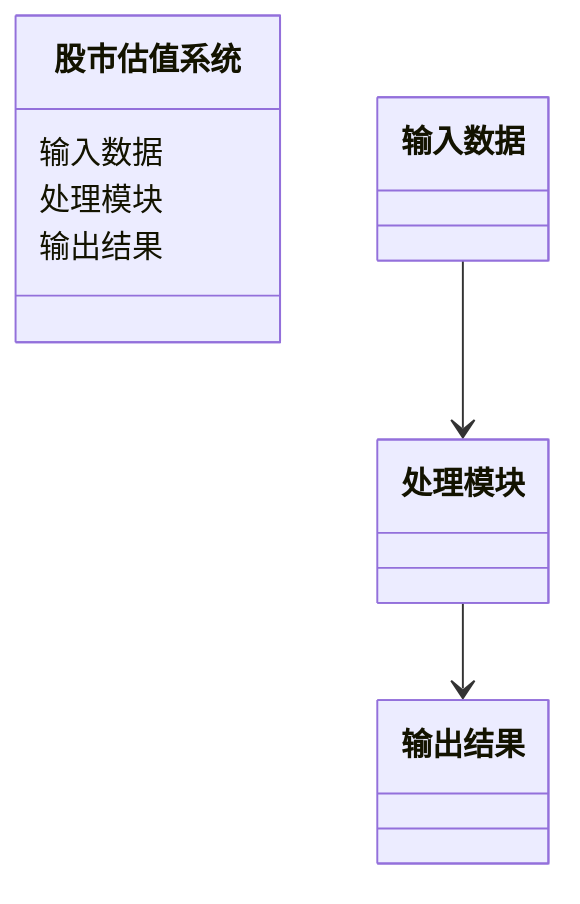
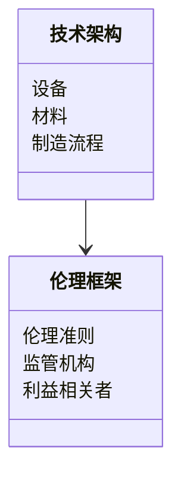

                 


# 全球股市估值与3D打印器官移植的伦理问题

> 关键词：全球股市估值，3D打印器官，伦理问题，技术伦理，股市分析

> 摘要：本文探讨了全球股市估值与3D打印器官移植技术之间的伦理交集，分析了股市估值的核心算法、3D打印技术的伦理挑战，并结合实际案例进行系统分析。文章旨在为技术与伦理的交叉领域提供深入的见解。

---

## 第1章 背景介绍

### 1.1 核心概念

#### 1.1.1 股市估值的基本定义
股市估值是指对上市公司股票价格进行合理评估的过程，旨在确定其内在价值。常用的方法包括市盈率（P/E）、市净率（P/B）等指标。

#### 1.1.2 3D打印技术的基本原理
3D打印是一种通过逐层叠加材料来制造物体的技术，广泛应用于医疗领域，特别是器官移植。

### 1.2 问题背景

#### 1.2.1 股市估值的重要性
准确的估值有助于投资者做出决策，影响市场的稳定性和发展。

#### 1.2.2 3D打印技术的创新性
3D打印技术为医疗行业带来了革命性的变化，尤其是在器官移植方面。

### 1.3 问题解决

#### 1.3.1 技术创新如何影响股市估值
技术创新可以提升企业的竞争力，从而影响其股票估值。

#### 1.3.2 伦理问题如何影响技术创新
伦理问题可能限制技术的推广和应用，影响其市场价值。

---

## 第2章 核心概念与联系

### 2.1 核心概念的属性对比

| 概念       | 股市估值          | 3D打印技术         |
|------------|-------------------|--------------------|
| 定义       | 股票价值评估      | 逐层叠加材料制造物体 |
| 应用领域   | 金融投资         | 医疗、制造业        |
| 伦理问题   | 投资道德、利益冲突| 技术滥用、隐私问题  |

### 2.2 概念结构与核心要素



---

## 第3章 算法原理

### 3.1 股市估值的数学模型

#### 3.1.1 CAPM模型

公式：$$ E(R_i) = R_f + β_i (E(R_m) - R_f) $$

其中，$R_f$是无风险利率，$\beta_i$是股票的贝塔系数，$E(R_m)$是市场预期回报率。

#### 3.1.2 市盈率计算

公式：$$ P/E = \frac{股价}{每股收益} $$

### 3.2 3D打印技术的伦理框架

#### 3.2.1 伦理决策流程



---

## 第4章 系统分析

### 4.1 股市估值系统的构成

#### 4.1.1 系统模块



### 4.2 3D打印技术的伦理框架

#### 4.2.1 系统架构



---

## 第5章 项目实战

### 5.1 股市估值模型的实现

#### 5.1.1 环境安装

```bash
pip install pandas numpy matplotlib
```

#### 5.1.2 代码实现

```python
import pandas as pd
import numpy as np

def calculate_expected_return(rf, beta, rm):
    return rf + beta * (rm - rf)
```

#### 5.1.3 案例分析

分析某科技公司股票，计算其预期回报率。

### 5.2 3D打印器官移植的伦理案例

#### 5.2.1 案例背景

描述某公司使用3D打印技术制造器官的过程。

#### 5.2.2 伦理问题分析

探讨隐私、知情同意等伦理挑战。

---

## 第6章 小结

通过系统的分析，本文揭示了股市估值与3D打印技术在伦理和实际应用中的重要性。技术与伦理的结合将对未来的发展产生深远影响，需在创新与道德之间找到平衡。

---

作者：AI天才研究院 & 禅与计算机程序设计艺术

