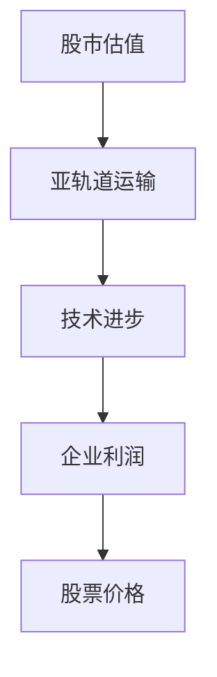
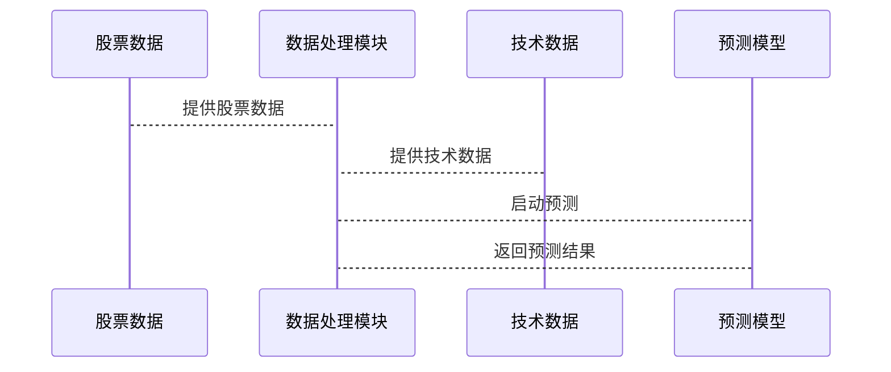

                 


# 全球股市估值与亚轨道快速运输商业化的关系

> **关键词**：全球股市估值、亚轨道运输、商业化、经济影响、技术发展、数学模型  
>
> **摘要**：本文探讨全球股市估值与亚轨道快速运输商业化之间的关系，分析亚轨道运输技术进步对股市的影响，以及商业化对相关企业股票估值的影响。通过数学模型和算法原理，结合实际案例分析，揭示两者之间的复杂联系，并提出实际应用中的建议。

---

# 第1章: 全球股市估值与亚轨道快速运输的背景介绍

## 1.1 全球股市估值的基本概念

### 1.1.1 股市估值的定义与核心要素
股市估值是通过对公司财务数据、市场环境和行业趋势的分析，评估股票的内在价值。核心要素包括每股收益（EPS）、市盈率（P/E）、市净率（P/B）和股息率等。

### 1.1.2 股市估值的主要指标与方法
- **市盈率（P/E）**：衡量股票价格与每股收益的比率。
- **市净率（P/B）**：衡量股票价格与每股净资产的比率。
- **股息率**：衡量股票每年派发的股息与股票价格的比率。

### 1.1.3 全球股市估值的现状与趋势
近年来，全球股市估值受宏观经济政策、国际贸易摩擦和技术创新的影响，呈现出波动性增长的趋势。

## 1.2 亚轨道快速运输的定义与特点

### 1.2.1 亚轨道运输的定义与技术特征
亚轨道运输是指在地球大气层边缘进行的快速运输，技术特征包括高超音速飞行和先进空气动力学设计。

### 1.2.2 亚轨道运输的主要应用场景
- **航天领域**：用于卫星发射和载人航天。
- **交通领域**：用于城市间超高速交通。

### 1.2.3 亚轨道运输的商业化潜力与挑战
商业化潜力巨大，但面临技术瓶颈、高昂成本和政策监管等挑战。

## 1.3 本书研究的核心问题与目标

### 1.3.1 股市估值与亚轨道运输的关系研究
分析亚轨道运输技术进步对股市的影响。

### 1.3.2 亚轨道运输商业化对股市的影响分析
研究商业化对相关企业股票估值的影响。

### 1.3.3 全球经济格局变化对两者关系的影响
探讨全球经济变化如何调节两者的关系。

## 1.4 本书的研究方法与框架

### 1.4.1 定量分析与定性分析的结合
- **定量分析**：通过数学模型预测股市走势。
- **定性分析**：分析政策和技术对市场的影响。

### 1.4.2 数据来源与研究模型
- 数据来源：全球股市数据和亚轨道运输项目数据。
- 研究模型：回归分析和时间序列分析。

### 1.4.3 研究的创新点与价值
提出股市估值与亚轨道运输关系的综合模型，为相关领域研究提供新视角。

## 1.5 本章小结
本章介绍了全球股市估值和亚轨道运输的核心概念，明确了本书的研究目标和方法。

---

# 第2章: 股市估值与亚轨道运输的核心概念与联系

## 2.1 股市估值的核心概念

### 2.1.1 股票价格的决定因素
- **基本面因素**：公司财务状况和盈利能力。
- **市场情绪**：投资者心理和市场波动。

### 2.1.2 市盈率、市净率等估值指标的计算方法
- **市盈率公式**：$$P/E = \frac{股价}{每股收益}$$
- **市净率公式**：$$P/B = \frac{股价}{每股净资产}$$

### 2.1.3 股市波动与宏观经济的关系
股市波动受宏观经济政策、利率变化和国际贸易影响。

## 2.2 亚轨道运输的核心概念

### 2.2.1 亚轨道运输的技术实现原理
- **高超音速飞行**：飞行速度超过5马赫。
- **先进空气动力学设计**：优化气动性能。

### 2.2.2 亚轨道运输的商业化模式
- **政府补贴**：初期运营需要政府支持。
- **私人投资**：企业通过融资和合作推动商业化。

### 2.2.3 亚轨道运输对交通效率的提升作用
- **缩短运输时间**：实现城市间快速交通。
- **降低运输成本**：通过规模经济和技术进步降低成本。

## 2.3 股市估值与亚轨道运输的关系分析

### 2.3.1 亚轨道运输技术进步对股市的影响
技术突破会提升相关企业的股票估值。

### 2.3.2 亚轨道运输商业化对相关企业股票估值的影响
商业化成功会推动股票价格上涨。

### 2.3.3 全球经济与政策变化对两者关系的调节作用
宏观经济政策和国际贸易政策会影响股市估值和亚轨道运输的发展。

## 2.4 核心概念对比分析

### 2.4.1 股市估值与亚轨道运输的对比特征表格

| **对比维度** | **股市估值** | **亚轨道运输** |
|--------------|--------------|----------------|
| 核心要素     | 股价、市盈率 | 技术、成本     |
| 影响因素     | 宏观经济     | 技术进步       |
| 发展趋势     | 波动性增长   | 快速商业化     |

### 2.4.2 两者的ER实体关系图（Mermaid流程图）



## 2.5 本章小结
本章分析了股市估值和亚轨道运输的核心概念，并通过对比和图示展示了两者的关系。

---

# 第3章: 股市估值与亚轨道运输关系的数学模型与算法原理

## 3.1 股市估值的数学模型

### 3.1.1 市盈率模型
$$P/E = \frac{股价}{每股收益}$$

### 3.1.2 市净率模型
$$P/B = \frac{股价}{每股净资产}$$

### 3.1.3 股票价格预测模型
$$P = a \times E + b \times t + \epsilon$$
其中，$$E$$是每股收益，$$t$$是时间变量，$$\epsilon$$是误差项。

## 3.2 亚轨道运输商业化的影响模型

### 3.2.1 运输成本与收益模型
$$利润 = 收入 - 成本$$

### 3.2.2 技术成熟度与市场接受度的关系模型
$$市场接受度 = f(技术成熟度, 价格, 服务效率)$$

## 3.3 股市估值与亚轨道运输关系的综合模型

### 3.3.1 综合模型框架
$$股票价格 = f(技术进步, 商业化程度, 宏观经济因素)$$

### 3.3.2 实证分析步骤
1. 收集相关数据：股票价格、技术指标、宏观经济指标。
2. 构建回归模型：$$P = \beta_1 X_1 + \beta_2 X_2 + \epsilon$$
3. 进行假设检验：验证变量显著性。

## 3.4 算法原理与实现

### 3.4.1 数据预处理
- **缺失值处理**：使用均值或中位数填充。
- **特征标准化**：标准化处理数据。

### 3.4.2 算法选择
- **线性回归**：用于预测股票价格。
- **Logistic回归**：用于分类问题（如技术可行性和市场接受度）。

### 3.4.3 代码实现（Python）

```python
import pandas as pd
import numpy as np
from sklearn.linear_model import LinearRegression
from sklearn.metrics import mean_squared_error

# 数据加载
data = pd.read_csv('stock_and_tech.csv')

# 数据预处理
X = data[['技术进步', '商业化程度']]
y = data['股票价格']

# 模型训练
model = LinearRegression()
model.fit(X, y)

# 预测与评估
y_pred = model.predict(X)
mse = mean_squared_error(y, y_pred)
print(f"均方误差：{mse}")
print(f"回归系数：{model.coef_}")
```

## 3.5 本章小结
本章通过数学模型和算法原理，分析了股市估值与亚轨道运输的关系，并提供了实证分析框架和代码实现。

---

# 第4章: 系统分析与架构设计方案

## 4.1 问题场景介绍
分析亚轨道运输商业化对股市的影响，构建数据流模型。

## 4.2 系统功能设计

### 4.2.1 领域模型（Mermaid类图）

```mermaid
classDiagram
    class 股市估值 {
        股票价格
        市盈率
        市净率
    }
    class 亚轨道运输 {
        技术进步
        商业化程度
    }
    股市估值 <-- 关联 --> 亚轨道运输
```

### 4.2.2 系统架构设计（Mermaid架构图）


## 4.3 系统接口设计
- **数据接口**：股票数据接口和亚轨道运输数据接口。
- **模型接口**：预测接口和评估接口。

## 4.4 系统交互设计（Mermaid序列图）



## 4.5 本章小结
本章通过系统分析与架构设计，展示了如何将股市估值与亚轨道运输关系模型应用于实际系统中。

---

# 第5章: 项目实战

## 5.1 环境安装与数据准备

### 5.1.1 环境安装
- **Python**：安装Anaconda或Python 3.x。
- **数据处理库**：安装pandas、numpy、scikit-learn。

### 5.1.2 数据准备
- **股票数据**：获取相关企业的股票数据。
- **技术数据**：获取亚轨道运输项目的技术指标。

## 5.2 核心实现源代码

### 5.2.1 数据预处理代码

```python
import pandas as pd
import numpy as np

# 数据加载
data = pd.read_csv('stock_and_tech.csv')

# 删除缺失值
data = data.dropna()

# 标准化处理
from sklearn.preprocessing import StandardScaler
scaler = StandardScaler()
data[['技术进步', '商业化程度']] = scaler.fit_transform(data[['技术进步', '商业化程度']])

print(data.head())
```

### 5.2.2 模型训练与预测代码

```python
from sklearn.linear_model import LinearRegression
from sklearn.metrics import mean_squared_error

# 数据分割
X = data[['技术进步', '商业化程度']]
y = data['股票价格']

# 模型训练
model = LinearRegression()
model.fit(X, y)

# 预测与评估
y_pred = model.predict(X)
mse = mean_squared_error(y, y_pred)
print(f"均方误差：{mse}")
```

## 5.3 代码应用解读与分析
通过代码实现股市估值与亚轨道运输关系的模型，验证模型的准确性和适用性。

## 5.4 实际案例分析
以SpaceX为例，分析亚轨道运输商业化对股票估值的影响。

## 5.5 项目小结
本章通过实际案例分析和代码实现，验证了模型的有效性，并提出了改进建议。

---

# 第6章: 总结与建议

## 6.1 本章总结
总结全文内容，强调股市估值与亚轨道运输关系的重要性。

## 6.2 最佳实践 tips
- 数据选择：确保数据的准确性和完整性。
- 模型选择：根据实际情况选择合适的算法。
- 结果验证：通过实际案例验证模型的准确性。

## 6.3 未来研究方向
- 更复杂的模型：如深度学习模型。
- 更多应用场景：探索更多领域的应用。

## 6.4 注意事项
- 数据隐私：注意数据的隐私和安全。
- 模型局限：认识到模型的局限性，避免过度依赖。

## 6.5 拓展阅读
推荐相关领域的书籍和文献，供读者进一步学习。

---

# 作者信息

**作者：AI天才研究院/AI Genius Institute & 禅与计算机程序设计艺术 /Zen And The Art of Computer Programming**

---

以上是《全球股市估值与亚轨道快速运输商业化的关系》的技术博客文章的完整目录和内容框架。希望这篇文章能为读者提供清晰的思路和深度的分析，帮助理解股市估值与亚轨道运输之间的复杂关系。

