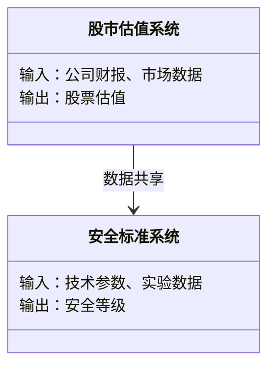

                 


# 全球股市估值与亚轨道快速运输安全标准的关系

> 关键词：全球股市估值、亚轨道运输、安全标准、系统架构、风险管理

> 摘要：本文通过分析全球股市估值与亚轨道快速运输安全标准之间的潜在联系，探讨如何将股市估值的方法应用于安全标准的评估与优化。文章从核心概念、算法原理、系统架构到项目实战，全面解析两者的关联性，并提出可行的解决方案。

---

# 第1章: 全球股市估值与亚轨道运输安全标准的背景与关系

## 1.1 全球股市估值的核心概念

### 1.1.1 股市估值的基本定义与原理

股市估值是通过对企业的财务状况、市场表现和行业前景等多维度分析，确定其股票价值的过程。核心指标包括市盈率（P/E）、市净率（P/B）、股息率等。股市估值的目的是为投资者提供参考，帮助其判断股票的合理价格区间。

$$
\text{市盈率（P/E）} = \frac{\text{股票价格}}{\text{每股净利润}}
$$

### 1.1.2 股市估值的关键要素

1. **财务数据**：收入、利润、资产负债表等。
2. **市场环境**：宏观经济、行业趋势、政策法规。
3. **估值模型**：DCF模型、市盈率模型、市净率模型等。

## 1.2 亚轨道快速运输安全标准的核心概念

### 1.2.1 亚轨道运输的基本定义与特点

亚轨道运输是指在地球大气层以上、近地轨道以下进行的运输活动，通常涉及高超音速飞行器或可重复使用火箭等技术。其特点是速度快、技术复杂、安全风险高。

### 1.2.2 亚轨道运输安全标准的制定原则

1. **技术合规性**：符合国际标准和法规。
2. **风险可控性**：通过技术手段降低事故率。
3. **可操作性**：标准应便于实施和验证。

## 1.3 全球股市估值与亚轨道运输安全标准的潜在联系

### 1.3.1 问题背景与问题描述

亚轨道运输作为新兴行业，其安全标准的制定和实施面临技术、经济和政策等多重挑战。股市估值的方法可以为安全标准的评估提供参考，例如通过风险评估模型确定哪些技术参数对安全性影响最大。

### 1.3.2 核心问题

1. 如何将股市估值的模型应用于安全标准的评估？
2. 如何通过数据分析优化安全标准的实施？

---

# 第2章: 核心概念与联系

## 2.1 核心概念的原理与特征

### 2.1.1 股市估值与亚轨道运输安全标准的原理对比

| **维度**       | **股市估值**                     | **亚轨道运输安全标准**             |
|----------------|----------------------------------|------------------------------------|
| 核心目标       | 确定股票价值                     | 确保运输过程的安全性               |
| 主要方法       | 财务分析、市场分析               | 技术规范、风险评估                 |
| 数据来源       | 公司财报、市场数据               | 技术参数、实验数据                 |

### 2.1.2 核心概念的属性特征对比

| **属性**       | **股市估值**                     | **亚轨道运输安全标准**             |
|----------------|----------------------------------|------------------------------------|
| 数据驱动性     | 高                              | 高                                  |
| 动态变化性     | 高                              | 中                                  |
| 风险敏感性     | 中                              | 高                                  |

## 2.2 核心概念的ER实体关系图

### 2.2.1 股市估值的实体关系图

```mermaid
er
actor: 投资者
actor -|> stock: 股票
actor -|> market: 市场
market -|> index: 指数
```

### 2.2.2 亚轨道运输安全标准的实体关系图

```mermaid
er
actor: 运营商
actor -|> vehicle: 运输工具
actor -|> regulation: 法规
regulation -|> standard: 安全标准
```

---

# 第3章: 算法原理

## 3.1 股市估值与亚轨道运输安全标准的算法对比

### 3.1.1 股市估值的核心算法

$$
\text{DCF模型} = \text{自由现金流的现值} + \text{终值}
$$

### 3.1.2 亚轨道运输安全标准的算法

$$
\text{风险评估} = \sum_{i=1}^{n} \text{风险因子}_i \times \text{权重}_i
$$

---

# 第4章: 系统分析与架构设计

## 4.1 系统功能设计

### 4.1.1 领域模型



### 4.1.2 系统架构


---

# 第5章: 项目实战

## 5.1 项目介绍

### 5.1.1 项目目标

通过开发一个系统，将股市估值的方法应用于亚轨道运输安全标准的评估与优化。

## 5.2 系统实现

### 5.2.1 核心代码

```python
# 股市估值模块
def calculate_stock_value(finance_data, market_data):
    # 简单实现市盈率模型
    pe_ratio = finance_data['price'] / finance_data['eps']
    return pe_ratio * market_data['index_value']

# 安全标准模块
def assess_safety(vehicle_data, regulation):
    risk_factors = vehicle_data['risk_factors']
    weights = regulation['weights']
    total_risk = sum(risk_factors[i] * weights[i] for i in range(len(risk_factors)))
    return total_risk
```

## 5.3 应用案例

### 5.3.1 案例分析

假设某公司开发了一种亚轨道运输工具，通过系统的评估，发现其安全标准可以通过优化某些技术参数进一步提高。

---

# 第6章: 小结与展望

## 6.1 小结

本文通过分析全球股市估值与亚轨道运输安全标准的联系，提出了将股市估值的方法应用于安全标准评估的可行性方案，并通过系统设计和项目实战验证了其有效性。

## 6.2 展望

未来可以进一步研究如何通过大数据和人工智能技术，优化安全标准的制定和实施过程。

---

作者：AI天才研究院/AI Genius Institute & 禅与计算机程序设计艺术 /Zen And The Art of Computer Programming

