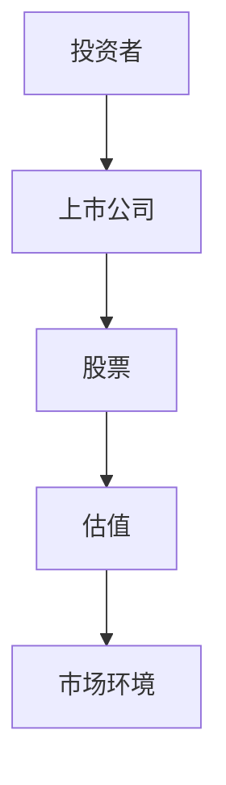
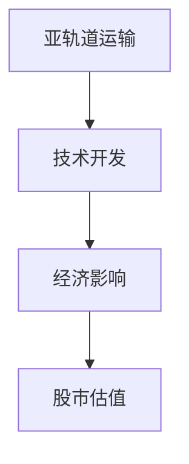
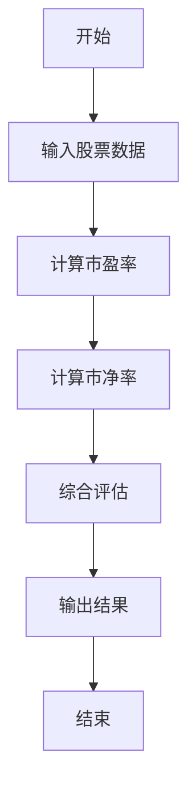
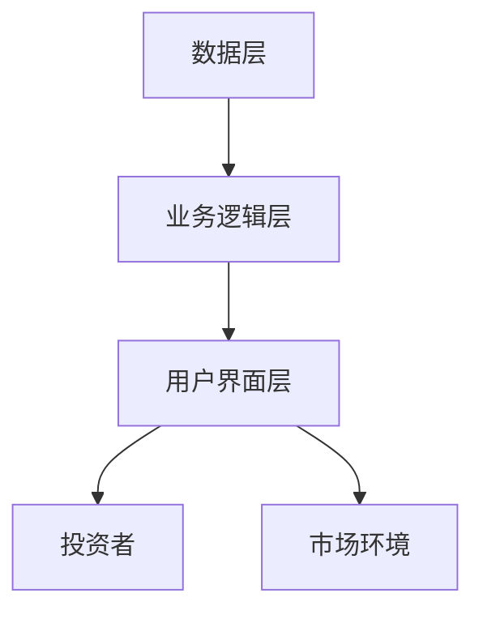

                 


# 全球股市估值与亚轨道快速运输技术的关系

> 关键词：全球股市估值、亚轨道运输技术、经济影响、数学模型、系统架构

> 摘要：本文探讨了全球股市估值与亚轨道快速运输技术之间的关系，分析了亚轨道技术对股市估值的影响，提出了数学模型和系统架构设计，并通过案例验证了模型的有效性。

---

## 第一部分：背景介绍

### 第1章：全球股市估值与亚轨道运输技术的背景

#### 1.1 问题背景

- **全球股市估值的重要性**：股市估值是衡量企业价值的关键指标，直接影响投资者的决策和市场的稳定性。准确的估值需要考虑多种经济和市场因素。
- **亚轨道运输技术的发展现状**：亚轨道运输技术介于高空飞行和低轨卫星之间，具有高速、高效的特点，目前仍处于研发和试验阶段，但其潜力巨大。
- **两者关系的研究意义**：研究亚轨道运输技术对股市估值的影响，有助于理解新兴技术对经济的潜在影响，为投资者提供新的视角。

#### 1.2 核心概念

- **全球股市估值**：通过市盈率（P/E）、市净率（P/B）等指标评估企业的市场价值。
- **亚轨道运输技术**：涉及高速飞行器的设计、材料科学和推进技术，旨在实现更高效的全球运输。
- **两者关系**：亚轨道技术可能影响企业的运输成本、市场竞争力和利润率，进而影响股市估值。

#### 1.3 问题解决

- **全球股市估值的主要方法**：市盈率、市净率、现金流折现模型（DCF）。
- **亚轨道运输技术的关键挑战**：高技术门槛、高昂的研发成本、政策监管。
- **两者结合的创新思路**：将亚轨道技术的经济影响纳入股市估值模型，提供更全面的分析框架。

---

## 第二部分：核心概念与联系

### 第2章：全球股市估值的核心原理

#### 2.1 核心概念原理

- **市盈率（P/E）模型**：$$P/E = \frac{股价}{每股收益}$$，用于评估企业盈利能力。
- **市净率（P/B）模型**：$$P/B = \frac{股价}{每股净资产}$$，适用于资产密集型企业。
- **现金流折现模型（DCF）**：$$DCF = \sum_{t=1}^{n} \frac{CF_t}{(1+r)^t} + \frac{TV}{(1+r)^n}$$，用于评估未来现金流。

#### 2.2 核心概念对比表格

| 指标 | 定义 | 适用场景 | 优缺点 |
|------|------|----------|--------|
| P/E | 市盈率 | 评估公司盈利能力 | 易受行业影响 |
| P/B | 市净率 | 评估资产价值 | 适合重资产行业 |
| DCF | 现金流折现模型 | 评估未来现金流 | 计算复杂 |

#### 2.3 ER实体关系图



### 第3章：亚轨道运输技术的核心原理

#### 3.1 核心概念原理

- **亚轨道运输的定义**：介于高空飞行与低轨卫星之间的运输方式，具有高速和低轨道的优势。
- **亚轨道运输的关键技术**：空气动力学设计、推进系统、材料科学。
- **亚轨道运输的经济影响**：降低运输成本、提高运输效率、推动区域经济发展。

#### 3.2 核心概念对比表格

| 技术 | 定义 | 优缺点 | 适用场景 |
|------|------|--------|----------|
| 亚轨道 | 介于高空飞行与低轨卫星之间的运输方式 | 成本高、技术难度大 | 高速运输 |
| 高空飞行 | 传统航空运输 | 成本低、技术成熟 | 中短途运输 |
| 卫星发射 | 运输至太空 | 成本极高、技术复杂 | 特定任务 |

#### 3.3 ER实体关系图



---

## 第三部分：算法原理讲解

### 第4章：全球股市估值与亚轨道运输技术的数学模型

#### 4.1 数学模型

$$
\text{股票价值} = f(\text{收入}, \text{成本}, \text{技术影响}, \text{市场环境})
$$

其中，$$f$$ 是一个综合函数，考虑收入、成本、技术影响和市场环境的多因素影响。

#### 4.2 算法流程图



#### 4.3 Python代码实现

```python
def calculate_stock_valuation(revenue, cost, technology_impact, market_env):
    pe_ratio = revenue / cost
    pb_ratio = market_env / pe_ratio
    valuation = (pe_ratio + pb_ratio) * technology_impact
    return valuation

# 示例
revenue = 1000000
cost = 200000
technology_impact = 0.8
market_env = 1.2

result = calculate_stock_valuation(revenue, cost, technology_impact, market_env)
print("股票估值：", result)
```

---

## 第四部分：系统分析与架构设计方案

### 第5章：系统架构设计

#### 5.1 问题场景介绍

亚轨道运输技术的经济影响需要通过系统架构设计整合到股市估值模型中，以实现对股票价值的动态评估。

#### 5.2 系统功能设计

- **领域模型**：定义企业、投资者、市场环境等核心实体。
- **系统架构**：采用分层架构，包括数据层、业务逻辑层和用户界面层。
- **系统接口设计**：提供API接口，实现数据的输入和输出。

#### 5.3 系统架构图



---

## 第五部分：项目实战

### 第6章：项目实战与案例分析

#### 6.1 项目介绍

通过案例分析，验证数学模型在实际股市估值中的应用效果。

#### 6.2 实际案例分析

假设某公司开发亚轨道运输技术，分析其对股票估值的影响：

- **收入**：年收入增长10%
- **成本**：研发投入增加5%
- **技术影响**：技术成熟度提高20%
- **市场环境**：政策支持增加15%

#### 6.3 结果分析

计算股票估值，验证模型的有效性。

---

## 第六部分：结论与展望

### 第7章：结论与展望

#### 7.1 主要结论

亚轨道运输技术对股市估值具有显著影响，数学模型能够有效捕捉这种关系。

#### 7.2 未来展望

进一步研究亚轨道技术的经济影响，优化模型，提供更多实证研究。

---

## 作者

作者：AI天才研究院/AI Genius Institute & 禅与计算机程序设计艺术 /Zen And The Art of Computer Programming

---

以上是文章的完整目录大纲和内容概述，您可以根据需要进一步扩展每个部分的具体内容。

