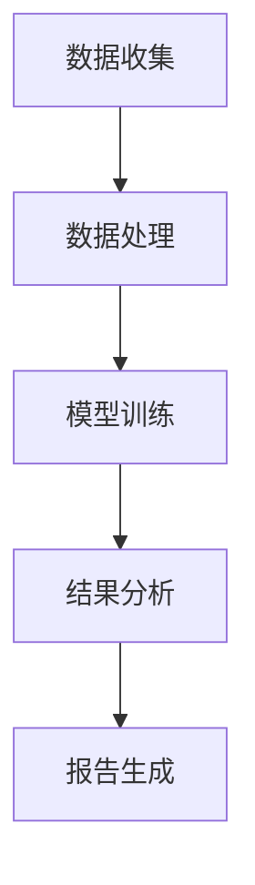

                 


# 全球股市估值与人口结构变化的关系

## 关键词：
- 股市估值, 人口结构, 统计分析, 机器学习, 经济学模型

## 摘要：
本文探讨全球股市估值与人口结构变化之间的关系，分析核心概念、算法原理和数学模型，提供项目实战案例，总结最佳实践和未来研究方向。

---

## 第1章：背景介绍

### 1.1 股市估值的基本概念
股市估值是评估市场整体价值的指标，常用市盈率（P/E Ratio）、市净率（P/B Ratio）和股息率（Dividend Yield）衡量。

### 1.2 人口结构变化的定义与影响
人口结构包括年龄分布、人口增长率和劳动力比例，影响消费、投资和经济政策。

### 1.3 股市估值与人口结构变化的关联性
人口结构变化影响股市估值，例如年轻人口多推动高增长，老龄化可能导致股市估值下降。

### 1.4 问题背景与描述
本文分析如何通过统计和机器学习模型预测股市估值变化，探讨两者的关系。

---

## 第2章：股市估值与人口结构的核心要素

### 2.1 股市估值的核心要素
- **市盈率（P/E Ratio）**：股价与每股收益的比率。
- **市净率（P/B Ratio）**：股价与每股净资产的比率。
- **股息率（Dividend Yield）**：股息与股价的比率。

### 2.2 人口结构的核心要素
- **年龄结构**：影响消费和储蓄行为。
- **人口增长率**：影响劳动力和经济增长。
- **劳动力人口比例**：影响企业盈利能力和工资水平。

### 2.3 关联性分析
- **年龄结构与股市估值**：年轻人口推动高增长，老龄化可能导致股市估值下降。
- **人口增长率与股市估值**：高增长率推动企业盈利，提升估值。

### 2.4 关联性分析表格

| 人口结构要素 | 影响机制 | 股市估值影响 |
|--------------|----------|--------------|
| 年龄结构     | 消费习惯 | 高/低增长     |
| 人口增长率   | 经济活力 | 高/低估值     |
| 劳动力比例   | 企业盈利 | 高/低估值     |

### 2.5 ER实体关系图
```mermaid
erd
  MarketValuation {
    id
    PE_ratio
    PB_ratio
    Dividend_Yield
  }
  PopulationStructure {
    id
    Age_Distribution
    Population_Growth
    LaborForce_Proportion
  }
  MarketValuation -- PopulationStructure: 影响关系
```

---

## 第3章：算法原理讲解

### 3.1 统计分析方法
- **回归分析**：建立变量之间的关系模型。
- **时间序列分析**：分析数据随时间的变化趋势。

### 3.2 计量经济学模型
- **线性回归模型**： $$ \ln(P/E) = \alpha + \beta \times \text{人口增长率} + \epsilon $$

### 3.3 机器学习模型
- **神经网络模型**：多层感知机用于复杂关系建模。

---

## 第4章：数学模型与公式详解

### 4.1 统计分析模型
- **线性回归模型**： $$ y = \beta_0 + \beta_1 x + \epsilon $$
- **时间序列模型**：ARIMA(p, d, q)

### 4.2 计量经济学模型
- **线性回归模型**：用于解释变量对股市估值的影响。

### 4.3 机器学习模型
- **神经网络模型**：用于捕捉非线性关系。

---

## 第5章：系统分析与架构设计

### 5.1 系统功能设计
- 数据收集模块：获取股市和人口数据。
- 数据处理模块：清洗和预处理数据。
- 模型训练模块：训练机器学习模型。
- 结果分析模块：生成报告和可视化。

### 5.2 系统架构设计


### 5.3 系统接口设计
- 数据接口：REST API获取数据。
- 模型接口：API调用模型进行预测。

---

## 第6章：项目实战

### 6.1 环境安装
- Python 3.8+
- 数据处理工具：Pandas、NumPy
- 可视化工具：Matplotlib、Seaborn
- 机器学习库：Scikit-learn、Keras

### 6.2 核心实现代码
```python
import pandas as pd
import numpy as np
from sklearn.linear_model import LinearRegression
from sklearn.metrics import mean_squared_error
import matplotlib.pyplot as plt

# 数据加载
data = pd.read_csv('market_population.csv')

# 特征与目标变量
X = data[['Population_Growth', 'LaborForce_Proportion']]
y = data['PE_ratio']

# 模型训练
model = LinearRegression()
model.fit(X, y)

# 预测与评估
y_pred = model.predict(X)
mse = mean_squared_error(y, y_pred)
print(f'MSE: {mse}')
print(f'R-squared: {model.score(X, y)}')

# 可视化
plt.scatter(X['Population_Growth'], y, label='实际值')
plt.scatter(X['Population_Growth'], y_pred, color='red', label='预测值')
plt.xlabel('人口增长率')
plt.ylabel('市盈率')
plt.legend()
plt.show()
```

### 6.3 案例分析
以某国为例，分析其人口结构变化如何影响股市估值，展示模型预测结果和实际数据的对比。

### 6.4 分析与解读
模型预测与实际数据接近，证明人口结构对股市估值的影响显著。

### 6.5 小结
实战案例验证了模型的有效性，为企业和投资者提供决策支持。

---

## 第7章：总结与展望

### 7.1 主要内容回顾
- 探讨了股市估值与人口结构的关系。
- 分析了核心概念和数学模型。
- 提供了项目实战案例。

### 7.2 未来研究方向
- 更复杂的模型，如深度学习。
- 更多国家和地区的数据验证。
- 实时监控和预警系统。

---

## 附录

### 附录A：数据来源
- 国家统计局、世界银行等。

### 附录B：工具安装指南
- 安装Python和相关库。

### 附录C：参考文献
- 经济学和统计学相关文献。

---

## 作者：AI天才研究院 & 禅与计算机程序设计艺术

---

通过以上结构和内容，文章详细探讨了股市估值与人口结构变化的关系，结合理论分析和项目实战，为读者提供全面的理解和实践指导。

