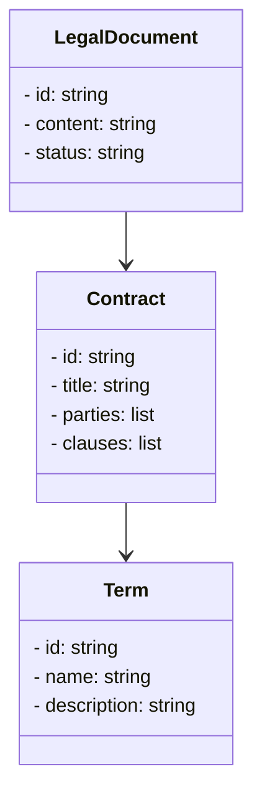
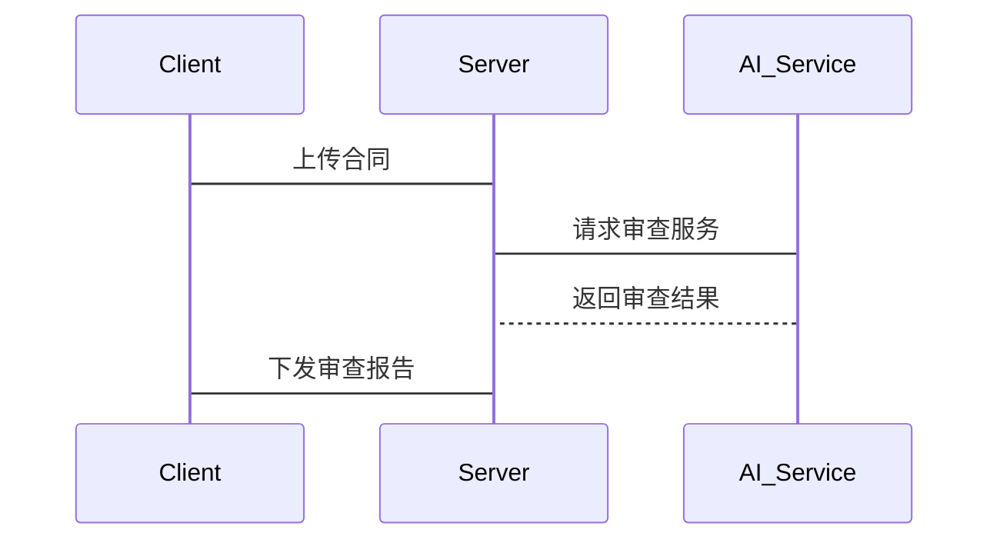

                 


# 全球股市估值与人工智能在法律合规中的应用

## 关键词：全球股市估值, 人工智能, 法律合规, 股票估值模型, 机器学习, 深度学习, 自然语言处理

## 摘要：  
本文深入探讨了全球股市估值的核心原理与人工智能技术在法律合规领域的创新应用。通过分析股票估值的传统模型与现代技术结合的可能性，揭示了人工智能如何提升股市分析的精准度与效率。同时，文章详细介绍了机器学习、深度学习与自然语言处理（NLP）等人工智能技术在法律文本分析、合规监控与合同审查中的具体应用，为金融与法律领域的专业人士提供了实践指导与未来展望。

---

## 正文

---

### 第一部分: 全球股市估值基础

#### 第1章: 全球股市估值概述

##### 1.1 股票估值的核心概念

股票估值是通过对公司财务数据、市场环境与行业趋势的分析，确定其股票的合理价格区间的过程。传统的股票估值方法主要基于财务指标（如市盈率、市净率）与现金流折现模型（DCF）。然而，这些方法在面对复杂市场波动时，往往难以捕捉实时信息与非结构化数据。

**背景介绍：**
- **核心概念**：股票估值是投资者评估公司价值的关键步骤，帮助其判断股票是否被高估或低估。
- **问题背景**：传统估值模型依赖历史数据与假设，难以适应市场的动态变化。
- **问题解决**：引入人工智能技术，通过机器学习与自然语言处理，实时分析新闻、社交媒体等非结构化数据，提升估值的准确性。

**概念结构与核心要素**：
- **输入**：公司财务数据（收入、利润、现金流）、市场数据（股价、指数）、新闻与社交媒体数据。
- **输出**：股票的公允价值区间、风险评估与投资建议。

##### 1.2 主流股票估值模型

股票估值模型主要分为三类：

1. **市盈率（P/E）模型**：
   - 基于公司当前股价与每股收益（EPS）的比率，判断股票是否被高估或低估。
   - 适用于盈利稳定的公司。

2. **市净率（P/B）模型**：
   - 以公司股价与每股净资产（BPS）的比率为基础，适合评估资产密集型行业（如银行、房地产）的股票。

3. **现金流折现模型（DCF）**：
   - 通过预测公司未来现金流，使用贴现率计算其现值，得出企业价值。
   - 常用于评估具有高增长潜力的公司。

##### 1.3 全球股市估值的挑战与机遇

- **挑战**：
  - 经济波动与地缘政治风险导致市场不确定性增加。
  - 数据量庞大且复杂，传统模型难以处理非结构化数据。
  
- **机遇**：
  - 数字化工具与人工智能技术的结合，为实时、动态估值提供了可能。
  - 大数据分析技术能够挖掘非传统数据源（如社交媒体情绪）以辅助估值。

---

#### 第2章: 人工智能与金融的结合

##### 2.1 人工智能在金融领域的应用现状

人工智能在金融领域的应用主要集中在以下三个方向：

1. **股票预测**：
   - 使用机器学习算法（如随机森林、神经网络）分析历史股价数据，预测未来走势。

2. **风险评估**：
   - 利用自然语言处理技术分析新闻与社交媒体，识别潜在风险因素，评估其对股价的影响。

3. **交易策略**：
   - 基于算法交易，利用高频数据与机器学习模型优化交易决策。

##### 2.2 人工智能在法律合规中的潜在应用

人工智能在法律合规中的应用潜力巨大，尤其是在以下领域：

1. **模式识别**：
   - 利用机器学习算法识别合同中的异常条款或潜在风险。

2. **合同审查**：
   - 使用自然语言处理技术自动解析合同内容，识别关键条款与潜在法律风险。

3. **法律风险评估**：
   - 通过大数据分析，评估企业合规风险，优化法律合规策略。

---

### 第二部分: 人工智能技术基础

#### 第3章: 人工智能的核心算法

##### 3.1 机器学习基础

**背景介绍**：
- 机器学习是一种通过数据训练模型，使其能够从经验中“学习”的人工智能技术。

**核心概念**：
- **监督学习**：基于标记数据进行训练，预测新数据的标签。
- **无监督学习**：在无标签数据中发现模式与结构。
- **强化学习**：通过试错机制优化决策策略。

**算法原理**：
- **线性回归**：用于预测连续型变量（如房价预测）。
  - 公式：$y = \beta_0 + \beta_1x + \epsilon$
  - 其中，$\beta_0$ 是截距，$\beta_1$ 是斜率，$\epsilon$ 是误差项。

- **随机森林**：一种基于决策树的集成学习算法，适用于分类与回归任务。

##### 3.2 深度学习技术

**背景介绍**：
- 深度学习是一种基于人工神经网络的机器学习技术，能够处理复杂的数据模式。

**核心算法**：
- **卷积神经网络（CNN）**：适用于图像识别与自然语言处理。
- **循环神经网络（RNN）**：适用于时间序列数据的处理。
- **Transformer架构**：近年来在自然语言处理领域取得了突破性进展。

##### 3.3 自然语言处理（NLP）技术

**背景介绍**：
- NLP 是人工智能与语言学的交叉领域，致力于使计算机能够理解与生成人类语言。

**核心算法**：
- **词嵌入（Word Embedding）**：将单词或短语映射为高维向量（如Word2Vec、GloVe）。
- **Transformer模型**：通过自注意力机制，捕捉文本中的长距离依赖关系。
- **BERT模型**：基于Transformer的开源模型，广泛应用于文本分类、问答系统等任务。

---

### 第三部分: 人工智能在法律合规中的应用

#### 第4章: 法律文本分析与合规监控

##### 4.1 法律文本分析的挑战

**背景介绍**：
- 法律文本分析涉及复杂的专业术语与结构，对自然语言处理技术提出了较高要求。

**主要挑战**：
- **术语多样性**：法律文本中存在大量专业术语，且不同法律体系中的术语差异显著。
- **句式复杂性**：法律文本通常采用复杂的句式结构，增加了文本解析的难度。
- **数据隐私**：处理法律文本时，需严格遵守数据隐私法规（如GDPR）。

**解决方案**：
- **预训练语言模型**：利用如BERT、RoBERTa等预训练模型，提升文本解析的准确性。
- **法律知识图谱**：构建领域知识图谱，辅助模型理解法律术语与概念之间的关系。

##### 4.2 合规监控中的模式识别

**背景介绍**：
- 合规监控是企业风险管理的重要组成部分，涉及对大量法律文本的实时分析。

**模式识别技术**：
- **合同条款识别**：
  - 使用NLP技术识别合同中的关键条款（如违约条款、期限条款）。
  - 通过规则引擎或机器学习模型，自动判断条款是否符合合规要求。

- **风险评估**：
  - 基于历史数据与实时信息，评估合同履行中的潜在风险。
  - 使用概率模型预测违约概率，优化企业风险管理策略。

##### 4.3 合同审查中的自然语言处理

**背景介绍**：
- 合同审查是法律合规中的重要环节，传统方法依赖人工阅读与分析。

**NLP在合同审查中的应用**：
- **自动摘取关键信息**：
  - 识别合同中的关键条款（如金额、期限、违约责任）。
  - 使用命名实体识别（NER）技术提取公司名称、日期等信息。

- **风险预警**：
  - 分析合同中的潜在风险条款（如不合理的担保条款）。
  - 使用情感分析技术评估合同的友好性与风险性。

---

### 第5章: 人工智能在法律合规中的系统设计与实现

#### 5.1 项目介绍

**项目背景**：
- 开发一个基于人工智能的法律合规监控系统，帮助企业在复杂多变的市场环境中降低法律风险。

**项目目标**：
- 实现合同自动审查与风险预警功能。
- 提供法律文本分析与合规建议的自动化解决方案。

#### 5.2 系统功能设计

##### 5.2.1 领域模型设计

**领域模型（Mermaid 类图）**：



##### 5.2.2 系统架构设计

**系统架构（Mermaid 架构图）**：

```mermaid
docker
    client (前端)
    server (后端)
    database (数据库)
    AI_Service (人工智能服务)
```

##### 5.2.3 系统接口设计

**主要接口**：
1. **上传合同**：
   - 接口：`POST /api/upload_contract`
   - 参数：文件路径、合同内容。
2. **获取审查结果**：
   - 接口：`GET /api/review_result`
   - 返回：审查报告、风险预警。

##### 5.2.4 系统交互设计

**系统交互（Mermaid 序列图）**：



---

### 第6章: 项目实战

#### 6.1 环境安装

**安装步骤**：
1. 安装Python 3.x。
2. 安装必要的Python库（如PyTorch、Hugging Face Transformers、spaCy）。
3. 安装Jupyter Notebook或其他IDE。

#### 6.2 核心代码实现

**代码示例**：使用BERT模型进行合同条款识别。

```python
from transformers import BertTokenizer, BertModel
import torch

# 加载预训练模型与分词器
model_name = "bert-base-uncased"
tokenizer = BertTokenizer.from_pretrained(model_name)
model = BertModel.from_pretrained(model_name)

# 定义输入文本
text = "合同条款：若乙方未能按时履行义务，甲方有权终止合同。"

# 对文本进行分词与编码
inputs = tokenizer(text, return_tensors="pt", padding=True, truncation=True)

# 前向传播
with torch.no_grad():
    outputs = model(**inputs)

# 提取隐藏层输出
hidden_states = outputs.last_hidden_state

# 可视化部分结果
print(tokenizer.decode(inputs.input_ids[0].tolist()))
print("隐藏层输出的形状：", hidden_states.shape)
```

---

### 第7章: 结论与展望

#### 7.1 小结

- 本文深入探讨了全球股市估值与人工智能在法律合规中的应用，展示了人工智能技术在金融与法律领域的巨大潜力。
- 通过具体的项目实战，详细讲解了如何利用机器学习与自然语言处理技术，构建高效的法律合规监控系统。

#### 7.2 最佳实践

- 在实际应用中，建议结合企业的具体需求，选择合适的机器学习模型与NLP技术。
- 数据隐私与合规性是系统设计中的重要考量，需严格遵守相关法律法规。

#### 7.3 注意事项

- 人工智能技术的应用需结合人类专家的知识，避免过度依赖算法。
- 系统的可解释性与透明度是法律合规中的重要考量，需确保算法决策的可追溯性。

#### 7.4 拓展阅读

- 推荐阅读《深度学习》（Ian Goodfellow 著）与《自然语言处理实战：基于Python的机器学习与深度学习》（Dmitriy Golitsyn 著）。

---

## 作者：AI天才研究院/AI Genius Institute & 禅与计算机程序设计艺术 /Zen And The Art of Computer Programming

---

通过以上内容，希望为读者提供一个全面且深入的视角，帮助理解全球股市估值与人工智能在法律合规中的应用，并为未来的实践与研究提供有价值的参考。

