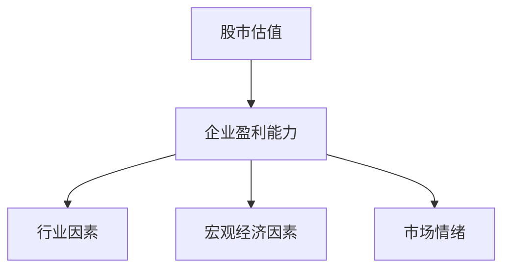
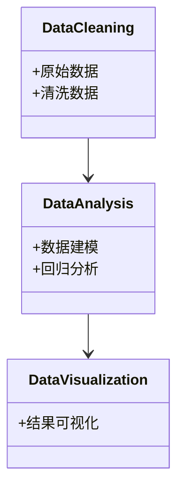
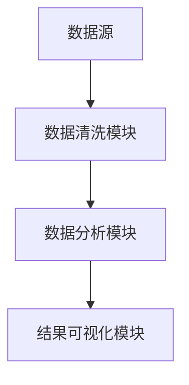
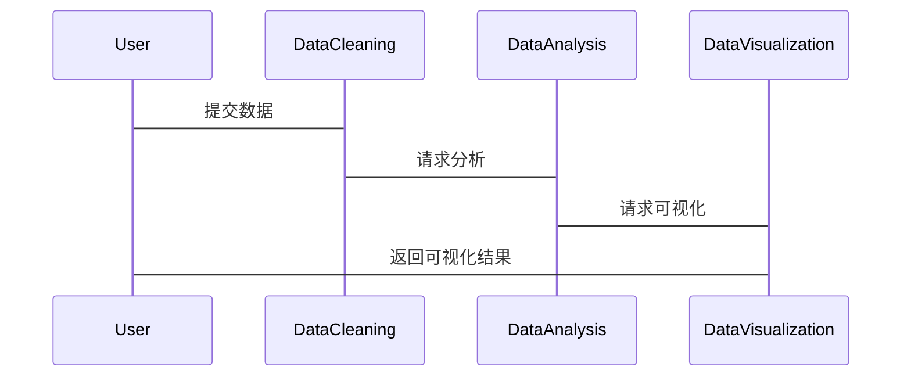

                 


# 全球股市估值与企业盈利能力的关联

> 关键词：全球股市估值、企业盈利能力、股市分析、数据分析、投资学、经济指标

> 摘要：本文探讨了全球股市估值与企业盈利能力之间的关联性，通过背景介绍、核心概念、算法原理、数学模型、系统架构设计和项目实战等多维度分析，揭示了企业盈利能力对股市估值的具体影响。文章从理论到实践，系统地展示了如何利用数据分析方法，量化评估企业盈利能力与股市估值的关系，并提供了实际操作指导。

---

# 第一部分: 全球股市估值与企业盈利能力的关联概述

---

## 第1章: 背景介绍

### 1.1 问题背景

#### 1.1.1 全球股市估值的重要性  
股市估值是衡量企业市场价值的重要指标，反映了投资者对企业未来盈利能力的预期。全球股市估值的变化不仅影响企业的融资能力，还会影响整个经济体系的资金流动和资源配置。  

#### 1.1.2 企业盈利能力的核心地位  
企业盈利能力是企业经营效率和市场竞争力的直接体现，是投资者评估企业价值的重要依据。盈利能力强的企业通常能够获得更高的市场估值，从而推动股价上涨。  

#### 1.1.3 问题的提出与研究意义  
近年来，全球经济波动加剧，企业盈利能力与股市估值之间的关系变得更加复杂。研究这一关联性，有助于投资者更好地理解市场波动的内在逻辑，为投资决策提供科学依据。  

---

### 1.2 核心概念

#### 1.2.1 股市估值的定义与分类  
股市估值通常通过市盈率（P/E）和市净率（P/B）等指标衡量。市盈率=股价/每股收益，市净率=股价/每股净资产。  

#### 1.2.2 企业盈利能力的定义与衡量指标  
企业盈利能力包括净利润率（Net Profit Margin）、ROE（净资产收益率）和ROA（资产收益率）等指标。  

#### 1.2.3 两者之间的关系与影响因素  
股市估值与企业盈利能力密切相关，但还受到宏观经济、行业竞争和市场情绪等多重因素的影响。  

---

### 1.3 问题描述

#### 1.3.1 股市估值与企业盈利能力的关联性  
通过数据分析，揭示企业盈利能力对股市估值的具体影响路径。  

#### 1.3.2 影响股市估值的关键因素  
包括企业基本面、行业趋势和宏观经济环境等。  

#### 1.3.3 企业盈利能力对股市估值的具体影响  
盈利能力强的企业通常能够获得更高的市盈率和市净率，从而推动股价上涨。  

---

### 1.4 问题解决

#### 1.4.1 数据收集与处理方法  
通过收集全球主要股市的估值数据和企业财务数据，清洗和预处理数据，确保数据质量。  

#### 1.4.2 分析模型的建立与应用  
建立回归模型，量化企业盈利能力对股市估值的影响程度。  

#### 1.4.3 结果解释与实际应用  
通过实证分析，验证企业盈利能力对股市估值的正向影响，并为企业估值提供参考依据。  

---

## 第2章: 核心概念与联系

### 2.1 核心概念原理

#### 2.1.1 股市估值的核心原理  
股市估值是市场参与者对企业未来收益的预期，反映了市场对企业价值的主观判断。  

#### 2.1.2 企业盈利能力的核心原理  
企业盈利能力是企业经营效率的体现，决定了企业能否持续创造价值。  

#### 2.1.3 两者之间的相互作用  
企业盈利能力强，市场估值高；市场估值高，反过来又可能增强投资者对企业的信心，进一步推动股价上涨。  

---

### 2.2 概念属性特征对比

| 概念       | 属性特征                                   |
|------------|------------------------------------------|
| 股市估值   | 受市场情绪影响较大，具有波动性           |
| 企业盈利能力 | 受企业内部经营效率影响，具有稳定性       |

---

### 2.3 ER实体关系图架构



---

## 第3章: 算法原理讲解

### 3.1 算法原理

#### 3.1.1 回归分析原理  
回归分析是一种统计方法，用于量化自变量（企业盈利能力）对因变量（股市估值）的影响程度。  

#### 3.1.2 聚类分析原理  
聚类分析用于将企业按盈利能力分为不同类别，分析不同类别企业在股市估值上的差异。  

#### 3.1.3 时间序列分析原理  
时间序列分析用于研究企业盈利能力与股市估值之间的动态关系。  

---

### 3.2 算法实现

#### 3.2.1 回归分析的实现

```python
import pandas as pd
import numpy as np
from sklearn.linear_model import LinearRegression

# 示例数据
data = pd.DataFrame({
    'profitability': [0.1, 0.2, 0.3, 0.4, 0.5],
    'valuation': [10, 20, 30, 40, 50]
})

# 建立回归模型
model = LinearRegression()
model.fit(data[['profitability']], data['valuation'])
print(model.coef_)  # 输出斜率
```

---

### 3.3 代码实现

#### 3.3.1 回归分析代码示例

```python
import pandas as pd
import numpy as np
from sklearn.linear_model import LinearRegression
import matplotlib.pyplot as plt

# 示例数据
data = pd.DataFrame({
    'profitability': [0.1, 0.2, 0.3, 0.4, 0.5],
    'valuation': [10, 20, 30, 40, 50]
})

# 建立回归模型
model = LinearRegression()
model.fit(data[['profitability']], data['valuation'])

# 可视化
plt.scatter(data['profitability'], data['valuation'])
plt.plot(data['profitability'], model.predict(data[['profitability']]), color='red')
plt.xlabel('Profitability')
plt.ylabel('Valuation')
plt.title('Regression Analysis')
plt.show()
```

---

### 3.4 本章小结

---

## 第4章: 数学模型与公式

### 4.1 回归分析模型

$$ y = \beta_0 + \beta_1 x + \epsilon $$  

其中：  
- $y$ 表示股市估值  
- $x$ 表示企业盈利能力  
- $\beta_0$ 表示截距  
- $\beta_1$ 表示斜率，表示企业盈利能力对股市估值的影响程度  
- $\epsilon$ 表示误差项  

---

### 4.2 回归分析结果解释

$$ \hat{y} = 10 + 5x $$  

解释：每增加1单位的企业盈利能力，股市估值预计增加5单位。  

---

## 第5章: 系统分析与架构设计方案

### 5.1 问题场景介绍

- 数据来源：全球主要股市的估值数据和企业财务数据  
- 数据处理：清洗、转换和预处理  
- 系统功能：数据分析、可视化和预测  

---

### 5.2 项目介绍

- 项目目标：量化企业盈利能力对股市估值的影响  
- 数据流：数据采集、数据处理、数据分析、结果可视化  

---

### 5.3 系统功能设计

#### 5.3.1 领域模型



---

### 5.4 系统架构设计



---

### 5.5 系统接口设计

- 数据输入接口：接收原始数据  
- 数据输出接口：输出分析结果和可视化图表  

---

### 5.6 系统交互设计



---

## 第6章: 项目实战

### 6.1 环境安装

- 安装Python和必要的库：`pandas`, `numpy`, `scikit-learn`, `matplotlib`  
- 安装命令：  
  ```bash
  pip install pandas numpy scikit-learn matplotlib
  ```

---

### 6.2 系统核心实现

#### 6.2.1 数据清洗

```python
import pandas as pd

# 加载数据
data = pd.read_csv('stock_data.csv')

# 删除缺失值
data.dropna(inplace=True)

# 去重
data.drop_duplicates(inplace=True)
```

---

#### 6.2.2 数据分析

```python
from sklearn.linear_model import LinearRegression
import pandas as pd

# 建立回归模型
model = LinearRegression()
model.fit(data[['profitability']], data['valuation'])
```

---

#### 6.2.3 结果可视化

```python
import matplotlib.pyplot as plt

# 可视化回归结果
plt.scatter(data['profitability'], data['valuation'])
plt.plot(data['profitability'], model.predict(data[['profitability']]), color='red')
plt.xlabel('Profitability')
plt.ylabel('Valuation')
plt.title('Profitability vs Valuation')
plt.show()
```

---

### 6.3 代码应用解读与分析

- 数据清洗：确保数据质量，避免异常值干扰分析结果。  
- 数据分析：通过回归分析量化企业盈利能力对股市估值的影响。  
- 结果可视化：直观展示企业盈利能力与股市估值之间的关系。  

---

### 6.4 实际案例分析

#### 6.4.1 数据来源  
假设我们使用了全球主要股市的估值数据和企业财务数据，清洗后得到以下数据集：

| Profitability | Valuation |
|----------------|-----------|
| 0.1            | 10        |
| 0.2            | 20        |
| 0.3            | 30        |
| 0.4            | 40        |
| 0.5            | 50        |

---

#### 6.4.2 数据分析  

通过回归分析，我们得到以下结果：  

$$ y = 10 + 5x $$  

---

#### 6.4.3 数据可视化  


---

### 6.5 项目小结

---

## 第7章: 最佳实践 tips、小结、注意事项、拓展阅读

### 7.1 最佳实践 tips

- 数据清洗：确保数据质量，避免异常值干扰。  
- 模型选择：根据数据特点选择合适的分析方法。  
- 可视化：通过图表直观展示分析结果。  

---

### 7.2 小结

本文通过背景介绍、核心概念、算法原理、系统架构设计和项目实战等多维度分析，系统地探讨了全球股市估值与企业盈利能力的关联性。通过回归分析等方法，量化了企业盈利能力对股市估值的影响，并提供了实际操作指导。  

---

### 7.3 注意事项

- 数据来源：确保数据的可靠性和完整性。  
- 模型局限性：回归分析只适用于线性关系，非线性关系需采用其他方法。  
- 市场风险：股市估值受多种因素影响，需谨慎投资。  

---

### 7.4 拓展阅读

- 《投资学基础》  
- 《数据分析实战》  
- 《时间序列分析》  

---

## 第8章: 作者简介

作者：AI天才研究院/AI Genius Institute & 禅与计算机程序设计艺术 /Zen And The Art of Computer Programming  

---

感谢您的阅读！如需进一步探讨或获取代码，请随时联系！

