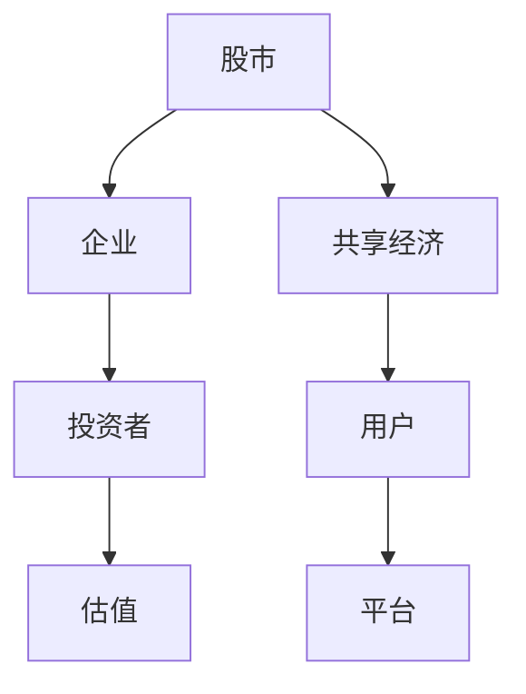
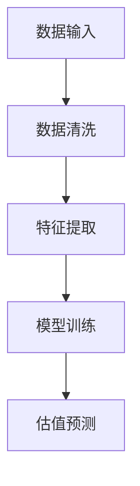
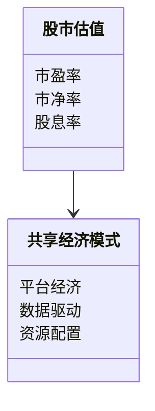
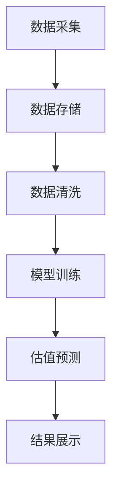

                 


# 全球股市估值与共享经济模式的关系

> 关键词：全球股市估值、共享经济模式、股票定价、经济分析、金融模型

> 摘要：本文系统分析了全球股市估值与共享经济模式之间的关系，从理论基础、数学模型、算法原理到实际应用，深入探讨了如何通过技术手段量化分析股市估值与共享经济模式的相互影响。通过案例分析和系统设计，展示了如何利用金融模型和数据科学方法，揭示两者之间的深层联系。

---

# 第一部分: 全球股市估值与共享经济模式的背景与概念

## 第1章: 全球股市估值与共享经济模式的背景介绍

### 1.1 问题背景

#### 1.1.1 全球股市估值的现状
全球股市估值是衡量市场健康程度的重要指标，主要包括市盈率（P/E）、市净率（P/B）、股息率等核心指标。近年来，随着科技的进步和金融创新，股市估值的计算方法不断优化，但其本质仍然是对上市公司未来盈利能力的预判。

#### 1.1.2 共享经济模式的兴起
共享经济通过互联网技术，将闲置资源转化为经济价值，典型案例包括 Airbnb、滴滴出行、共享办公空间等。共享经济模式打破了传统的所有权经济模式，通过数据驱动的方式优化资源配置。

#### 1.1.3 两者关系的研究意义
随着共享经济的快速发展，其对传统经济模式的影响逐渐显现。研究全球股市估值与共享经济模式的关系，有助于理解新兴经济模式对金融市场的影响，为投资者提供新的分析维度。

### 1.2 问题描述

#### 1.2.1 股市估值的核心问题
股市估值的核心在于预测企业未来的盈利能力。传统估值方法依赖于财务数据，而共享经济模式的兴起为企业价值评估带来了新的挑战。

#### 1.2.2 共享经济模式的定义与特征
共享经济模式是一种基于闲置资源的再利用、数据驱动的资源配置模式。其核心特征包括去中心化、平台化、数据驱动和资源高效利用。

#### 1.2.3 问题解决的目标与方法
本文旨在通过技术手段，量化分析共享经济模式对股市估值的影响，构建一个综合性的分析框架，帮助投资者更好地理解市场动态。

### 1.3 问题的边界与外延

#### 1.3.1 核心概念与要素组成
- 股市估值：市盈率、市净率、股息率
- 共享经济模式：平台经济、闲置资源利用、数据驱动

#### 1.3.2 问题的边界
本文聚焦于共享经济模式对股市估值的影响，不涉及宏观经济政策的直接分析。

---

# 第二部分: 核心概念与联系

## 第2章: 核心概念与联系

### 2.1 核心概念原理

#### 2.1.1 股市估值的核心原理
股市估值的核心是通过财务指标和市场数据，预测企业的未来盈利能力。传统估值方法包括：

$$ P/E = \frac{\text{股价}}{\text{每股收益}} $$

$$ P/B = \frac{\text{股价}}{\text{每股净资产}} $$

#### 2.1.2 共享经济模式的运作机制
共享经济通过平台连接供需双方，利用数据优化资源配置。其核心是通过技术手段降低交易成本，提高资源利用效率。

#### 2.1.3 两者关系的理论基础
共享经济模式通过改变资源配置方式，影响企业的盈利能力，从而间接影响股市估值。

### 2.2 核心概念对比

#### 2.2.1 概念结构与核心要素对比

| 概念       | 核心要素                          |
|------------|-----------------------------------|
| 股市估值   | 财务指标、市场数据、企业盈利预测  |
| 共享经济模式 | 平台经济、数据驱动、资源配置效率 |

#### 2.2.2 两者的异同点分析
- 相同点：两者都依赖于数据驱动的分析方法。
- 不同点：股市估值关注企业盈利能力，共享经济模式关注资源配置效率。

### 2.3 ER实体关系图



---

# 第三部分: 算法原理与数学模型

## 第3章: 算法原理与数学模型

### 3.1 算法原理

#### 3.1.1 股市估值算法



#### 3.1.2 共享经济模式的定价模型
共享经济模式的定价通常基于供需关系和平台撮合效率。其定价模型可以表示为：

$$ \text{价格} = f(\text{供需关系}, \text{平台效率}) $$

### 3.2 数学模型

#### 3.2.1 股市估值的数学模型

$$ \text{市盈率} = \frac{\text{股价}}{\text{每股收益}} $$

#### 3.2.2 共享经济模式的数学模型

$$ \text{资源配置效率} = \frac{\text{平台交易量}}{\text{资源闲置率}} $$

---

# 第四部分: 系统分析与架构设计方案

## 第4章: 系统分析与架构设计方案

### 4.1 问题场景介绍
本文构建一个基于共享经济模式的股市估值分析系统，旨在通过技术手段量化分析共享经济对股市估值的影响。

### 4.2 系统功能设计

#### 4.2.1 领域模型


#### 4.2.2 系统架构设计


---

# 第五部分: 项目实战

## 第5章: 项目实战

### 5.1 环境安装
- 数据采集工具：Python、requests库
- 数据分析工具：Pandas、NumPy

### 5.2 核心代码实现

```python
import pandas as pd
import numpy as np

# 示例数据
data = {
    '公司': ['A', 'B', 'C'],
    '市盈率': [15, 20, 25],
    '市净率': [2, 3, 4]
}

df = pd.DataFrame(data)

# 计算综合估值
df['综合估值'] = (df['市盈率'] + df['市净率']) / 2

print(df)
```

---

# 第六部分: 最佳实践

## 第6章: 最佳实践

### 6.1 小结
本文通过技术手段量化分析了全球股市估值与共享经济模式之间的关系，构建了一个综合性的分析框架。

### 6.2 注意事项
在实际应用中，需要注意数据质量和模型的实时性。

### 6.3 未来趋势
随着人工智能技术的发展，股市估值与共享经济模式的分析将更加精准和实时。

### 6.4 拓展阅读
推荐阅读《金融数据分析与建模》和《共享经济：重构商业未来》。

---

作者：AI天才研究院/AI Genius Institute & 禅与计算机程序设计艺术 /Zen And The Art of Computer Programming

