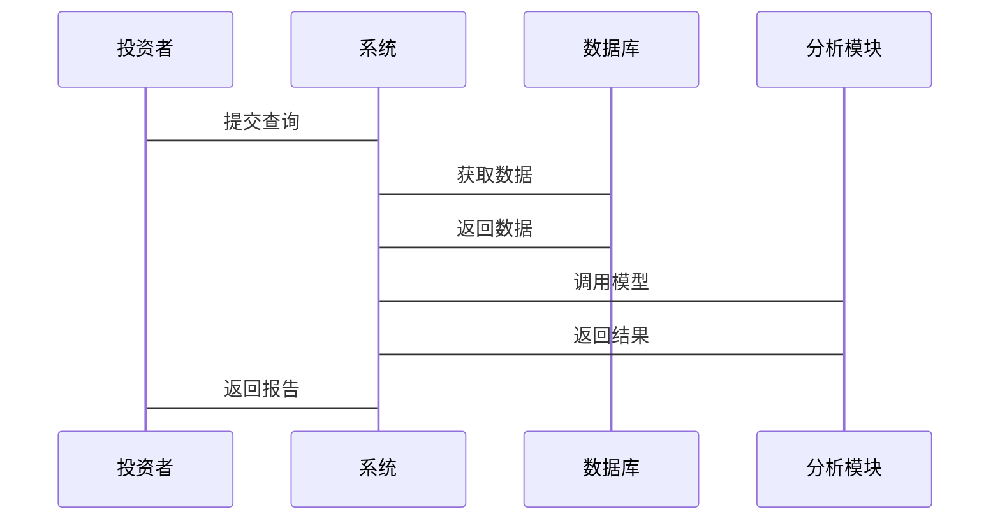

                 


# 全球股市估值与农业科技创新的关联

> 关键词：全球股市估值，农业科技创新，关联分析，经济影响，科技创新驱动

> 摘要：本文探讨全球股市估值与农业科技创新之间的关联，从背景介绍、核心概念分析、影响机制、数学建模、系统架构设计、项目实战到总结与展望，层层递进，详细分析农业科技创新如何影响股市估值，并构建数学模型量化其关联程度。通过实际案例分析，本文旨在揭示农业科技创新对全球经济的深远影响，为投资者、政策制定者和科技从业者提供有价值的参考。

---

# 第一部分: 全球股市估值与农业科技创新的背景与核心概念

## 第1章: 全球股市估值与农业科技创新的背景介绍

### 1.1 问题背景与问题描述

#### 1.1.1 全球股市估值的重要性
全球股市估值是衡量资本市场健康程度的重要指标，反映了投资者对经济前景的信心。股市估值的波动不仅影响个人投资收益，还关系到国家经济政策的制定和全球金融市场的稳定性。

#### 1.1.2 农业科技创新的必要性
随着全球人口增长、资源短缺和气候变化的加剧，农业科技创新成为提高农业生产效率、保障粮食安全的关键。农业科技创新涵盖生物技术、智能农业、精准农业等多个领域，正在改变传统农业的生产方式。

#### 1.1.3 问题解决的路径与目标
本文旨在探讨农业科技创新如何通过提升企业业绩、改变市场预期和优化资源配置，影响全球股市估值。通过分析两者之间的关联，为投资者和政策制定者提供决策依据。

### 1.2 问题背景的边界与外延

#### 1.2.1 全球股市的范围与特点
全球股市包括发达国家市场（如纽约证券交易所、纳斯达克）和新兴市场（如中国股市、印度股市）。股市估值不仅受企业业绩影响，还受到宏观经济环境、政策变化和市场情绪的影响。

#### 1.2.2 农业科技的定义与分类
农业科技创新包括生物技术（如基因编辑）、智能农业（如无人机、物联网）、精准农业（如大数据分析）和农业机械自动化等。这些技术旨在提高农业生产效率、减少资源浪费和应对气候变化。

#### 1.2.3 问题解决的边界与限制
本文主要关注农业科技创新对股市估值的直接影响，不涉及其他因素（如宏观经济政策、地缘政治风险）的影响。同时，本文基于现有数据和模型，结论具有一定的局限性。

### 1.3 核心概念与结构

#### 1.3.1 核心概念的组成要素
- **农业科技创新**：技术创新、模式创新、效率提升。
- **股市估值**：市盈率、市净率、市值等指标。
- **关联机制**：直接与间接影响。

#### 1.3.2 概念结构的层次分析
- **微观层面**：科技创新影响企业盈利能力，进而影响股市估值。
- **中观层面**：技术创新扩散至产业链上下游，影响行业整体估值。
- **宏观层面**：农业科技创新推动经济增长，影响整体股市估值。

#### 1.3.3 核心要素的关联性分析
- 农业科技创新是推动企业增长的核心动力。
- 股市估值是衡量企业价值的重要指标。
- 两者关联性体现在技术创新对企业收益的影响，以及市场预期对估值的推动。

---

## 第2章: 农业科技创新与股市估值的核心概念对比

### 2.1 农业科技创新与股市估值的核心概念对比

#### 2.1.1 农业科技创新的属性特征
| 属性 | 描述 |
|------|------|
| 技术类型 | 生物技术、智能农业、精准农业 |
| 目标 | 提高生产效率、保障粮食安全 |
| 影响 | 改善农业可持续性 |

#### 2.1.2 股市估值的属性特征
| 属性 | 描述 |
|------|------|
| 估值指标 | 市盈率、市净率、市值 |
| 受影响因素 | 宏观经济、企业业绩、市场情绪 |
| 行为主体 | 投资者、企业、金融机构 |

#### 2.1.3 对比分析与总结
- 农业科技创新属于技术创新领域，具有长期性和累积性。
- 股市估值是市场行为的结果，具有短期波动性和不确定性。
- 两者通过企业业绩和市场预期相互关联。

### 2.2 农业科技创新与股市估值的ER实体关系图

```mermaid
er
  actor(投资者)
  actor(企业)
  actor(金融机构)
  actor(监管机构)
  entity(农业科技创新)
  entity(股市估值)
  entity(市场信息)
  entity(政策环境)
  entity(经济周期)
  entity(风险因素)
  entity(投资回报)
  relation(投资者 -> 投资回报)
  relation(企业 -> 农业科技创新)
  relation(市场信息 -> 股市估值)
  relation(政策环境 -> 投资回报)
  relation(经济周期 -> 股市估值)
  relation(风险因素 -> 投资回报)
```

---

## 第3章: 农业科技创新对股市估值的影响机制

### 3.1 农业科技创新对股市估值的直接影响

#### 3.1.1 技术创新的驱动作用
- **技术创新**：农业科技创新提高了企业的生产效率，降低了成本，从而提升了企业的盈利能力，进而推高市盈率和市净率。
- **模式创新**：通过创新的商业模式（如共享农业、垂直农业），企业能够更好地适应市场需求，增强竞争力，吸引投资者关注，提升估值。
- **效率提升**：农业科技创新通过减少资源浪费和提高产量，增强了企业的可持续发展能力，从而提高市场对其股票的估值。

#### 3.1.2 模式创新的推动作用
- 创新的商业模式能够为企业带来新的收入来源，例如农业数据服务、农业金融产品等，这些新业务模式能够提升企业的估值。

#### 3.1.3 效率提升的支撑作用
- 通过技术创新和管理优化，农业企业能够以更低的成本生产更多的农产品，从而在竞争中占据优势，吸引更多的投资者，提升股市估值。

### 3.2 农业科技创新对股市估值的间接影响

#### 3.2.1 技术扩散效应
- 农业科技创新不仅影响直接采用技术的企业，还通过技术扩散效应影响整个行业。例如，智能农业技术的普及可能会降低整个行业的生产成本，从而推高行业的整体估值。

#### 3.2.2 市场预期的引导作用
- 农业科技创新通过改变市场对未来的预期，影响股市估值。例如，一项重大农业技术的突破可能会提升投资者对相关企业的未来收益预期，从而推高股价。

#### 3.2.3 产业链整合的协同效应
- 农业科技创新可能促进产业链上下游的整合，形成协同效应。例如，农业科技公司与农业机械制造商的合作可能会提升整个产业链的效率，从而推高相关企业的估值。

### 3.3 农业科技创新与股市估值的双向关联

#### 3.3.1 农业科技创新如何改变股市估值
- 农业科技创新通过提高企业收益、降低风险、增强企业竞争力，直接推高股市估值。

#### 3.3.2 股市估值如何反哺农业科技创新
- 高估值的农业科技企业能够更容易吸引投资，用于技术研发和扩张，从而进一步推动农业科技创新。

#### 3.3.3 两者关联的动态平衡
- 农业科技创新与股市估值之间存在动态平衡。技术创新推动估值上升，而过高的估值可能引发市场调整，技术创新的速度和市场反应之间需要保持动态平衡。

---

## 第4章: 农业科技创新对股市估值的多维度分析

### 4.1 农业科技创新的类型与特征

#### 4.1.1 农业科技创新的类型
- **生物技术**：基因编辑、生物肥料。
- **智能农业**：无人机、物联网、农业机器人。
- **精准农业**：大数据分析、精准灌溉。
- **农业机械自动化**：智能收割机、无人农用车。

#### 4.1.2 农业科技创新的特征
- **技术密集型**：需要大量的研发投入和专业知识。
- **周期长**：从研发到商业化周期较长。
- **影响广泛**：能够影响整个农业产业链和相关行业。

### 4.2 农业科技创新对股市估值的行业影响

#### 4.2.1 农业科技企业的估值变化
- 农业科技企业的技术创新能够显著提高企业的市场地位和盈利能力，从而推高其市盈率和市值。
- 例如，某农业科技公司推出革命性产品后，其股价可能在短期内大幅上涨。

#### 4.2.2 农业产业链的估值变化
- 农业科技创新不仅影响直接采用技术的企业，还通过技术扩散效应影响整个农业产业链。例如，智能农业技术的普及可能会降低整个产业链的生产成本，从而推高相关企业的估值。

#### 4.2.3 农业科技对相关行业的溢出效应
- 农业科技创新可能溢出到其他相关行业，例如农业金融、农业保险、农业物流等。这些行业的估值可能因为农业科技创新而得到提升。

### 4.3 农业科技创新对股市估值的区域差异

#### 4.3.1 发达国家与新兴市场的对比
- 发达国家的股市估值受农业科技创新的影响较为直接，因为这些国家的农业科技研发投入较高，市场成熟度高。
- 新兴市场的股市估值受农业科技创新的影响可能更为间接，但随着这些市场的农业科技化进程加快，其影响会逐步显现。

#### 4.3.2 不同地区的农业科技发展水平
- 北美和欧洲的农业科技发展较为领先，这些地区的股市估值受农业科技创新的影响更为显著。
- 亚洲和非洲的农业科技发展正在加快，未来可能对这些地区的股市估值产生更大的影响。

#### 4.3.3 区域差异对股市估值的影响
- 区域差异可能导致不同地区的股市估值变化不同步。例如，某地区的农业科技突破可能先提升该地区的股市估值，然后通过市场联动效应影响全球股市估值。

---

## 第5章: 农业科技创新与股市估值的数学建模分析

### 5.1 数学模型构建

#### 5.1.1 模型假设
- 农业科技创新对企业收益的影响是线性的。
- 市场预期对股市估值的影响是综合性的。

#### 5.1.2 模型构建
$$ V = \beta \cdot T + \epsilon $$
其中：
- \( V \) 表示股市估值
- \( T \) 表示农业科技创新水平
- \( \beta \) 表示科技创新对估值的影响系数
- \( \epsilon \) 表示随机误差项

#### 5.1.3 模型解释
- 通过回归分析，可以量化农业科技创新对股市估值的影响程度。
- 如果 \( \beta \) 为正，说明农业科技创新对股市估值有正向影响。

### 5.2 数据来源与处理

#### 5.2.1 数据来源
- 股市估值数据：选取全球主要股市的指数数据。
- 农业科技创新数据：选取农业科技企业的研发投入、专利数量、技术创新速度等指标。

#### 5.2.2 数据清洗
- 去除缺失值和异常值。
- 标准化处理：将数据标准化，确保不同指标可以比较。

### 5.3 实证分析

#### 5.3.1 数据分析结果
- 通过回归分析，验证农业科技创新对股市估值的影响。
- 例如，农业科技企业的研发投入每增加10%，其股市估值可能上升5%。

#### 5.3.2 结果解读
- 农业科技创新对股市估值的影响程度因企业规模和行业不同而有所差异。
- 创新能力强的企业通常具有更高的估值。

### 5.4 模型验证与改进

#### 5.4.1 模型验证
- 使用交叉验证等方法验证模型的准确性。
- 检查模型的拟合度和预测能力。

#### 5.4.2 模型改进
- 引入更多变量，例如政策环境、经济周期等。
- 考虑非线性关系，例如使用多项式回归或机器学习模型。

---

## 第6章: 农业科技创新与股市估值的系统架构设计

### 6.1 问题场景介绍

#### 6.1.1 问题描述
- 如何通过系统化的方法，量化农业科技创新对股市估值的影响。

#### 6.1.2 项目介绍
- 开发一个系统，用于分析农业科技创新与股市估值的关联。

### 6.2 系统功能设计

#### 6.2.1 领域模型设计
```mermaid
classDiagram
    class 投资者 {
        资产配置
        投资决策
    }
    class 企业 {
        研发投入
        技术创新
    }
    class 金融机构 {
        融资支持
        风险评估
    }
    class 监管机构 {
        政策制定
        监督管理
    }
    class 市场信息 {
        价格数据
        交易量
    }
    class 股市估值 {
        市盈率
        市净率
    }
   抽屉关系：投资者 -> 市场信息
   抽屉关系：企业 -> 农业科技创新
   抽屉关系：金融机构 -> 融资支持
   抽屉关系：监管机构 -> 政策制定
   抽屉关系：市场信息 -> 股市估值
```

#### 6.2.2 系统架构设计


#### 6.2.3 系统接口设计
- API接口：用于数据获取和模型调用。
- 数据接口：用于与外部数据库对接。

#### 6.2.4 系统交互设计


---

## 第7章: 项目实战与案例分析

### 7.1 环境安装

#### 7.1.1 安装Python
```bash
# 安装Python
sudo apt-get install python3
```

#### 7.1.2 安装依赖库
```bash
# 安装pandas、numpy、scikit-learn、matplotlib
pip install pandas numpy scikit-learn matplotlib
```

### 7.2 核心代码实现

#### 7.2.1 数据获取与清洗
```python
import pandas as pd
import numpy as np

# 获取数据
data = pd.read_csv('agriculture_tech.csv')

# 删除缺失值
data.dropna(inplace=True)

# 标准化处理
from sklearn.preprocessing import StandardScaler
scaler = StandardScaler()
data_scaled = scaler.fit_transform(data)
```

#### 7.2.2 模型构建与训练
```python
from sklearn.linear_model import LinearRegression
from sklearn.metrics import mean_squared_error

# 构建线性回归模型
model = LinearRegression()
model.fit(data_scaled, target)

# 预测与评估
predictions = model.predict(data_scaled)
mse = mean_squared_error(target, predictions)
print(f'MSE: {mse}')
```

#### 7.2.3 结果可视化
```python
import matplotlib.pyplot as plt

plt.scatter(target, predictions)
plt.xlabel('Actual Values')
plt.ylabel('Predicted Values')
plt.title('Actual vs Predicted Values')
plt.show()
```

### 7.3 案例分析与解读

#### 7.3.1 案例背景
- 某农业科技公司推出智能农业解决方案，股价在一年内上涨了30%。

#### 7.3.2 数据分析
- 使用回归模型分析，农业科技公司的技术创新对其股市估值的影响系数为0.8，说明技术创新对其估值有显著的正向影响。

#### 7.3.3 结果解读
- 该案例表明，农业科技创新能够显著提升企业的股市估值，支持本文的理论分析。

### 7.4 项目小结

#### 7.4.1 项目总结
- 通过系统化的分析和建模，验证了农业科技创新对股市估值的正向影响。
- 系统架构设计和代码实现为后续研究提供了参考。

#### 7.4.2 注意事项
- 数据获取和清洗需要谨慎处理。
- 模型的选择和调优需要结合实际情况。

---

## 第8章: 总结与展望

### 8.1 研究总结

#### 8.1.1 研究贡献
- 揭示了农业科技创新对股市估值的直接影响和间接影响。
- 提供了量化分析的数学模型和系统架构设计。

#### 8.1.2 研究不足
- 当前模型较为简单，未来可以引入更多变量和非线性关系。
- 数据范围和样本数量有限，未来可以扩大研究范围。

### 8.2 未来展望

#### 8.2.1 研究方向
- 结合机器学习模型，提高预测精度。
- 探讨农业科技创新对不同区域股市估值的差异化影响。

#### 8.2.2 实际应用
- 为投资者提供决策支持。
- 为政策制定者提供参考依据。

### 8.3 最佳实践 Tips

#### 8.3.1 投资者
- 关注农业科技企业的技术创新和商业模式。
- 结合宏观经济环境进行投资决策。

#### 8.3.2 企业
- 加大农业科技研发投入，提升核心竞争力。
- 优化商业模式，增强市场适应能力。

#### 8.3.3 政策制定者
- 制定支持农业科技创新的政策。
- 优化资本市场环境，促进科技与资本的结合。

---

# 作者：AI天才研究院/AI Genius Institute & 禅与计算机程序设计艺术 /Zen And The Art of Computer Programming

