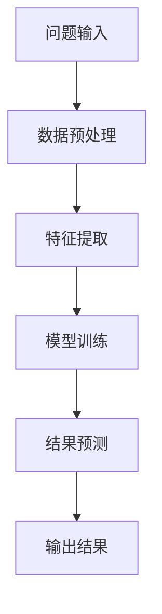
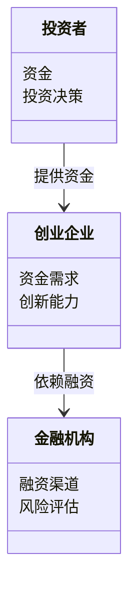
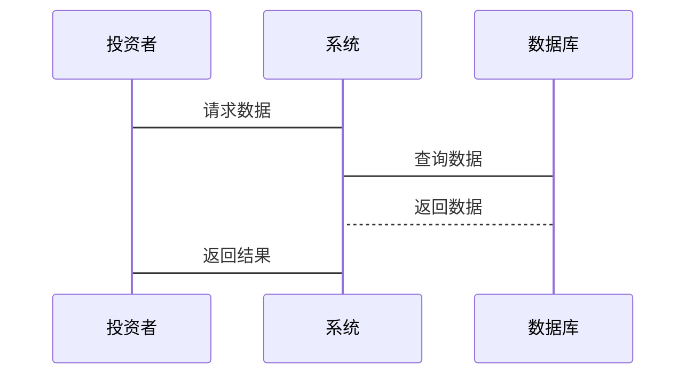

                 


# 全球股市估值与创业生态系统互动

## 关键词：
全球股市估值, 创业生态系统, 互动机制, 经济影响, 投资策略, 创业支持, 股市分析

## 摘要：
本文探讨全球股市估值与创业生态系统之间的互动关系，分析股市如何影响创业公司的融资，创业公司又如何反哺股市，揭示两者之间的相互作用机制。通过背景介绍、核心概念、算法原理、数学模型、系统架构、项目实战和最佳实践等部分，详细阐述互动机制，为投资者和创业者提供深度分析和实用指导。

---

## 第一部分：背景介绍

### 第1章：问题背景与核心概念

#### 1.1 问题背景
- 1.1.1 全球化经济与股市的重要性：股市作为经济晴雨表，反映整体经济状况，影响资源配置和投资决策。
- 1.1.2 创业生态系统的发展现状：创业生态系统包括创业企业、投资者、孵化器、政策支持等，是推动创新和经济增长的关键因素。

#### 1.2 问题描述
- 1.2.1 股市估值与创业生态的互动关系：股市估值影响创业企业的融资成本和资本流动，而创业企业的成功又影响股市的整体表现。
- 1.2.2 当前研究的空白与挑战：现有研究多关注股市或创业生态的单一维度，缺乏对其互动机制的系统性分析。

#### 1.3 问题解决
- 1.3.1 提出研究问题的方法：构建模型分析股市估值对创业生态的影响，以及创业生态对股市的反馈作用。
- 1.3.2 初步解决方案的框架：提出一个综合模型，结合股市数据和创业生态数据，分析其互动关系。

#### 1.4 边界与外延
- 1.4.1 研究的范围界定：限定在主要股市和创业企业，不涉及其他金融市场和非创业企业。
- 1.4.2 相关领域的扩展探讨：如宏观经济政策、技术创新对互动关系的影响。

#### 1.5 核心概念组成
- 1.5.1 股市估值的核心要素：市盈率、市净率、股息率等，用于衡量企业的投资价值。
- 1.5.2 创业生态系统的主要构成：创业企业、投资者、孵化器、政策支持、技术创新等。

---

## 第二部分：核心概念与联系

### 第2章：核心概念原理

#### 2.1 股市估值原理
- 2.1.1 市盈率与市净率的计算方法：市盈率=股价/每股收益，市净率=股价/每股净资产。
- 2.1.2 股东权益与企业价值评估：股东权益=资产-负债，企业价值=股权价值+债务价值。

#### 2.2 创业生态系统原理
- 2.2.1 创业企业的生命周期：种子期、发展期、成熟期，不同阶段需要不同的资金和资源支持。
- 2.2.2 创业支持体系的构成：政府政策、风险投资、孵化器、行业网络等。

#### 2.3 互动机制
- 2.3.1 资本市场对创业企业的影响：股市提供融资渠道，影响企业的资本结构和投资决策。
- 2.3.2 创业成功对股市的反馈效应：创业企业的成功上市或高增长推动股市整体表现。

### 2.4 对比分析
- 2.4.1 股市估值与创业生态的属性对比：
| 属性       | 股市估值       | 创业生态         |
|------------|---------------|-----------------|
| 主体       | 投资者、企业   | 创业者、投资者   |
| 目标       | 资产定价       | 促进创业         |
| 影响因素   | 财务指标、市场情绪 | 政策、资金、技术  |

- 2.4.2 互动机制的差异与共性：股市估值更关注短期收益，创业生态关注长期发展，但两者都依赖于资本流动和创新。

### 2.5 ER实体关系图
```mermaid
er
  actor 投资者
  actor 创业企业
  actor 金融机构
  entity 股票
  entity 创业支持政策
  entity 市场环境
  relationship 投资者 -> 股票：持有
  relationship 创业企业 -> 创业支持政策：依赖
  relationship 金融机构 -> 股票：发行与交易
  relationship 市场环境 -> 股票：影响价格
```

---

## 第三部分：算法原理与数学模型

### 第3章：互动机制的算法模型

#### 3.1 算法流程


#### 3.2 Python代码实现
```python
import pandas as pd
import numpy as np
from sklearn.linear_model import LinearRegression

# 示例数据加载
data = pd.DataFrame({
    '创业企业数量': [100, 200, 150, 250],
    '股市估值': [1.5, 2.0, 1.8, 2.5]
})

# 特征提取
X = data[['创业企业数量']]
y = data['股市估值']

# 模型训练
model = LinearRegression()
model.fit(X, y)

# 预测结果
predictions = model.predict(X)
print('预测值:', predictions)
```

#### 3.3 数学模型
- 线性回归模型：
  $$ y = \beta_0 + \beta_1 x + \epsilon $$
  其中，y为股市估值，x为创业企业数量，$\epsilon$为误差项。

- 网络模型：
  $$ y = f(Wx + b) $$
  其中，W为权重矩阵，x为输入特征，b为偏置，f为激活函数。

#### 3.4 举例说明
假设创业企业数量增加10%，根据模型预测，股市估值可能增加5%，具体取决于其他因素如市场情绪和政策影响。

---

## 第四部分：系统分析与架构设计

### 第4章：系统分析与架构设计

#### 4.1 问题场景介绍
- 系统需要分析全球股市数据和创业生态数据，构建互动模型，提供预测和优化建议。

#### 4.2 系统功能设计
- 数据采集：收集股市数据和创业生态数据。
- 数据处理：清洗和预处理数据。
- 模型构建：训练互动模型。
- 结果展示：可视化分析结果。

#### 4.3 领域模型


#### 4.4 系统架构设计


#### 4.5 接口设计
- RESTful API：提供数据接口和模型接口，支持JSON格式请求和响应。

#### 4.6 交互序列图


---

## 第五部分：项目实战

### 第5章：项目实战

#### 5.1 环境安装
- 安装Python、Pandas、NumPy、Scikit-learn等工具。

#### 5.2 核心代码实现
```python
import pandas as pd
import numpy as np
from sklearn.model_selection import train_test_split
from sklearn.metrics import r2_score

# 数据加载与处理
data = pd.read_csv('data.csv')
X = data[['创业企业数量', '政策支持']]
y = data['股市估值']

# 数据分割
X_train, X_test, y_train, y_test = train_test_split(X, y, test_size=0.2)

# 模型训练
model = LinearRegression()
model.fit(X_train, y_train)

# 模型评估
predictions = model.predict(X_test)
print('R²:', r2_score(y_test, predictions))
```

#### 5.3 代码应用解读与分析
- 数据预处理：处理缺失值和异常值，标准化处理。
- 模型选择：选择线性回归或随机森林，根据数据特征决定。
- 结果分析：评估模型的拟合优度和预测精度。

#### 5.4 实际案例分析
分析某地区创业企业数量与股市估值的关系，预测未来走势，并提出投资建议。

#### 5.5 项目小结
总结项目实施过程，指出成功之处和需要改进的地方，为后续研究提供参考。

---

## 第六部分：最佳实践

### 第6章：最佳实践

#### 6.1 小结
- 理解股市估值与创业生态的互动机制，有助于优化投资策略和创业决策。

#### 6.2 注意事项
- 数据质量：确保数据准确性和完整性。
- 模型选择：根据具体情况选择合适模型，避免过拟合。
- 风险管理：关注市场波动和政策变化，制定风险管理策略。

#### 6.3 拓展阅读
- 推荐阅读《股市分析与投资策略》和《创业生态系统研究》等书籍。

---

## 作者：
AI天才研究院/AI Genius Institute  
禅与计算机程序设计艺术/Zen And The Art of Computer Programming

