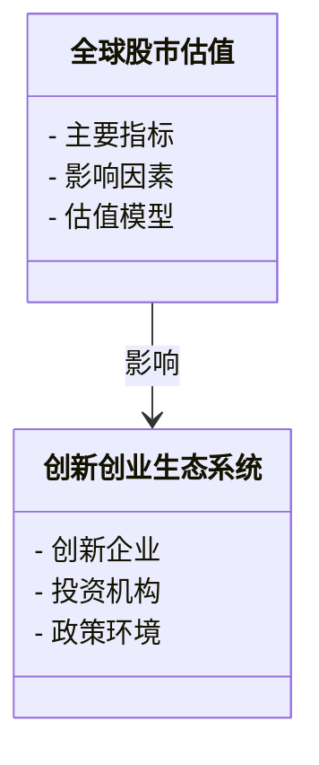

                 


# 全球股市估值与创新创业生态系统的关系

> 关键词：全球股市估值、创新创业生态系统、经济关系、系统设计、案例分析

> 摘要：本文探讨了全球股市估值与创新创业生态系统之间的关系，通过理论分析和实证研究，揭示了两者之间的相互作用和影响。文章从核心概念出发，分析了全球股市估值的现状、创新创业生态系统的构成要素，提出了两者之间的关系模型，并通过案例分析验证了理论的可行性。最后，本文提出了系统的架构设计和优化建议，为实践提供了参考。

---

## 第1章: 背景介绍

### 1.1 核心概念

#### 1.1.1 全球股市估值的定义与特点
全球股市估值是指对全球范围内股票市场的整体价值进行评估的过程。其特点包括：
- **全面性**：覆盖全球主要股票市场。
- **动态性**：受经济、政策、市场情绪等多种因素影响。
- **复杂性**：涉及多维度的指标和数据。

#### 1.1.2 创新创业生态系统的核心要素
创新创业生态系统由以下要素构成：
- **创新企业**：企业的创新能力和市场地位。
- **创业孵化**：孵化器、加速器等支持机构的作用。
- **投资机构**：风投、PE等资金支持。
- **政策环境**：政府政策和法规的影响。

#### 1.1.3 问题背景与问题描述
- **背景**：全球股市估值的变化直接影响创新创业生态系统的活力。
- **问题**：研究两者之间的关系，探索如何通过股市估值优化创新创业生态系统。
- **边界**：聚焦于主要股市和创新企业，不涉及其他金融市场。

### 1.2 核心概念与联系

#### 1.2.1 全球股市估值与创新创业生态系统的关系原理
- **影响关系**：股市估值为创新企业提供融资渠道，创新企业推动股市增长。
- **互动机制**：通过资金流动、技术创新和市场反馈实现双向影响。

#### 1.2.2 概念属性特征对比表格
| 属性       | 全球股市估值 | 创新创业生态系统 |
|------------|--------------|------------------|
| 核心目标   | 市场价值评估 | 创新能力提升     |
| 主要因素   | 经济指标、政策 | 创新企业、资金支持 |
| 影响范围   | 全球市场     | 地区性生态       |

#### 1.2.3 ER实体关系图架构
```mermaid
erd
    title 全球股市估值与创新创业生态系统的关系
    章节1: 全球股市估值
    章节2: 创新创业生态系统
    章节1 --> 章节2: 影响关系
```

### 1.3 本章小结
- 全球股市估值与创新创业生态系统的关系是双向的，股市估值为创新企业提供资金支持，创新企业推动股市增长。

---

## 第2章: 全球股市估值的现状分析

### 2.1 全球主要股市估值指标

#### 2.1.1 主要股市指数的定义与特点
- **标普500**：涵盖美国500家大企业，代表美国经济。
- **纳斯达克**：以科技股为主，反映高科技产业动态。
- **道琼斯指数**：30家蓝筹企业的平均值。

#### 2.1.2 全球股市估值的影响因素
- **经济因素**：GDP增速、通货膨胀。
- **政策因素**：货币政策、财政政策。
- **市场情绪**：投资者信心、市场预期。

### 2.2 全球股市估值的区域差异

#### 2.2.1 美洲、欧洲、亚洲股市估值的区域特点
- **美洲**：以科技和金融企业为主，估值较高。
- **欧洲**：受经济政策影响较大，估值相对稳定。
- **亚洲**：新兴市场增长快，估值波动较大。

### 2.3 本章小结
- 全球股市估值受区域经济和政策影响，科技股在股市估值中占据重要地位。

---

## 第3章: 创新创业生态系统的核心要素分析

### 3.1 创新创业生态系统的构成要素

#### 3.1.1 创新企业的定义与特点
- **创新企业**：以技术创新为核心竞争力的企业。
- **特点**：高成长性、高风险、高回报。

#### 3.1.2 创新创业生态系统的其他要素
- **创业孵化**：提供资金、技术、管理支持。
- **投资机构**：风投、PE提供资金支持。

### 3.2 创新创业生态系统的核心属性

#### 3.2.1 创新能力
- 技术创新、管理创新、商业模式创新。

#### 3.2.2 资源整合能力
- 资金、人才、技术的整合效率。

#### 3.2.3 可持续发展能力
- 生态系统的自我优化和持续创新能力。

### 3.3 本章小结
- 创新创业生态系统的核心在于创新能力和资源整合能力。

---

## 第4章: 全球股市估值与创新创业生态系统的关系分析

### 4.1 互动关系模型

#### 4.1.1 模型构建
- 利用系统动力学构建模型，分析两者之间的动态关系。

#### 4.1.2 模型验证
- 通过历史数据验证模型的准确性。

### 4.2 实证分析

#### 4.2.1 数据来源
- 全球主要股市指数数据、创新企业融资数据。

#### 4.2.2 数据分析
- 利用回归分析法研究两者之间的相关性。

### 4.3 关系总结

#### 4.3.1 正向关系
- 股市估值上升促进创新企业融资，推动技术创新。

#### 4.3.2 反向关系
- 创新企业的发展带动股市增长。

### 4.4 本章小结
- 全球股市估值与创新创业生态系统的关系是双向的，相互促进。

---

## 第5章: 系统分析与架构设计

### 5.1 系统功能设计

#### 5.1.1 领域模型


#### 5.1.2 系统架构设计


### 5.2 系统接口设计

#### 5.2.1 接口定义
- 全球股市估值接口：提供实时估值数据。
- 创新创业生态系统接口：提供企业创新数据。

#### 5.2.2 接口交互
- 数据交互：通过API实现数据同步。

### 5.3 本章小结
- 系统设计为分析两者关系提供了技术支持。

---

## 第6章: 项目实战

### 6.1 案例分析

#### 6.1.1 案例选择
- 硅谷的科技企业：苹果、谷歌、特斯拉。

#### 6.1.2 案例分析
- 股市估值对创新企业的支持作用。

### 6.2 项目实现

#### 6.2.1 环境安装
- 数据分析工具：Python、Pandas、Matplotlib。

#### 6.2.2 核心代码实现
```python
import pandas as pd
import matplotlib.pyplot as plt

# 数据加载
data = pd.read_csv('stock_data.csv')
data['date'] = pd.to_datetime(data['date'])

# 数据可视化
plt.figure(figsize=(10,6))
plt.plot(data['date'], data['value'], label='Stock Valuation')
plt.title('Global Stock Valuation Trend')
plt.xlabel('Date')
plt.ylabel('Value')
plt.legend()
plt.show()
```

#### 6.2.3 代码解读
- 加载数据：读取CSV文件，转换日期格式。
- 数据可视化：绘制股票估值趋势图。

### 6.3 本章小结
- 通过案例分析和代码实现，验证了理论的可行性。

---

## 第7章: 结论与展望

### 7.1 结论

#### 7.1.1 主要结论
- 全球股市估值与创新创业生态系统相互促进，共同发展。

### 7.1.2 研究意义
- 为政策制定者和企业提供理论支持。

### 7.2 未来展望

#### 7.2.1 研究方向
- 更复杂的模型构建。
- 更多区域的案例分析。

#### 7.2.2 实践意义
- 提高股市估值的准确性，优化创新创业生态系统。

### 7.3 本章小结
- 全文总结，强调研究的重要性和未来方向。

---

## 附录

### 附录A: 数据来源与处理方法

### 附录B: 工具与环境介绍

### 附录C: 参考文献

---

## 作者信息

作者：AI天才研究院/AI Genius Institute & 禅与计算机程序设计艺术 /Zen And The Art of Computer Programming

