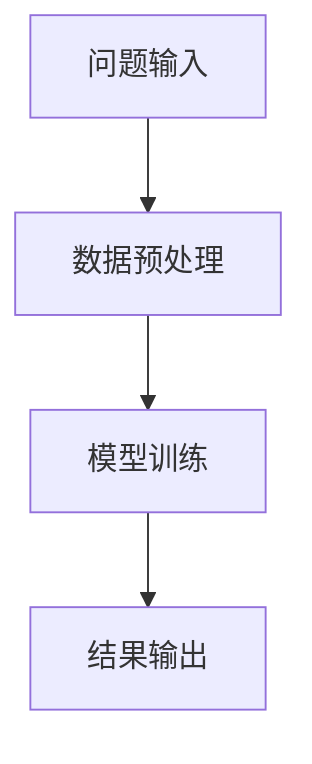
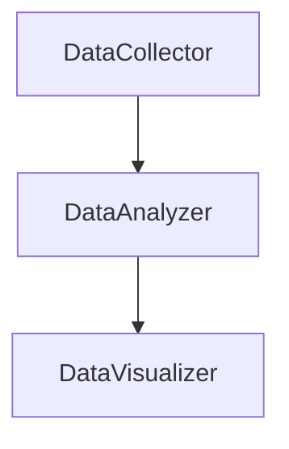
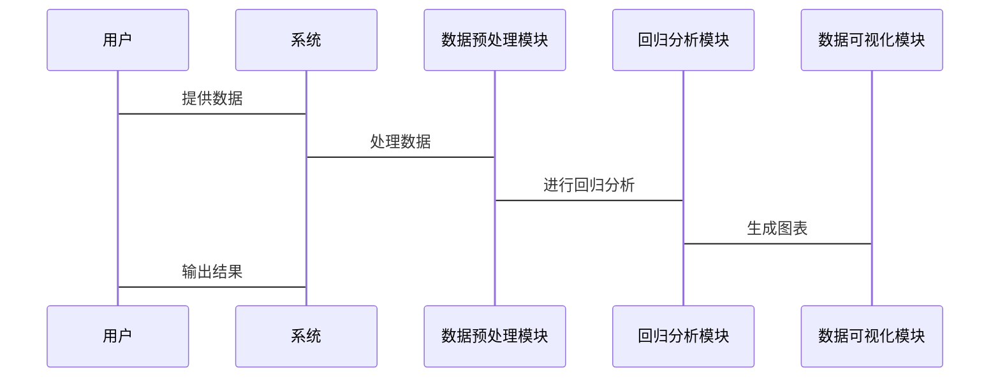

                 


# 全球股市估值与利率环境的互动关系

> 关键词：全球股市估值，利率环境，互动关系，经济周期，金融市场

> 摘要：本文深入分析了全球股市估值与利率环境之间的互动关系，探讨了利率变化如何影响股市估值，以及股市估值如何反过来影响利率政策。通过量化模型和实际案例分析，揭示了两者在经济周期中的相互作用机制，并为投资者和政策制定者提供了实践建议。

---

## 第一部分：背景介绍

### 第1章：全球股市估值与利率环境的互动关系概述

#### 1.1 问题背景
- 1.1.1 经济周期与金融市场的关系  
  经济周期的波动对金融市场有着深远的影响，股市估值作为金融市场的重要指标，反映了经济状况的变化。  
- 1.1.2 利率政策对股市的影响  
  中央银行通过调整利率政策来影响市场流动性，进而影响股市估值。例如，降低利率通常会刺激股市上涨，而提高利率则可能导致股市下跌。  
- 1.1.3 股市估值的核心要素  
  股市估值的核心要素包括市盈率（P/E）、市净率（P/B）等指标，这些指标与利率环境密切相关。

#### 1.2 核心概念与问题描述
- 1.2.1 股市估值的定义与计算方法  
  股市估值是投资者对上市公司未来盈利能力的预期，通常通过市盈率（P/E）和市净率（P/B）等指标衡量。  
- 1.2.2 利率环境的构成与分类  
  利率环境包括短期利率、长期利率和基准利率等，不同类型的利率对股市的影响程度不同。  
- 1.2.3 互动关系的描述与边界  
  利率环境通过影响企业的融资成本和投资者的预期收益，进而影响股市估值。同时，股市估值的变化也会反作用于利率政策。

#### 1.3 问题解决与边界
- 1.3.1 互动关系的分析框架  
  通过构建量化模型，分析利率变化对股市估值的具体影响路径。  
- 1.3.2 分析模型的边界与假设  
  假设市场是有效的，且利率变化是影响股市估值的主要因素之一。  
- 1.3.3 数据来源与处理方法  
  使用历史数据进行回归分析，数据来源包括央行利率政策、股市指数和相关估值指标。

#### 1.4 概念结构与核心要素
- 1.4.1 概念图解  
  通过概念图展示股市估值和利率环境的互动关系。  
- 1.4.2 核心要素的对比分析  
  对比分析包括利率环境的周期性与股市估值的波动性，以及两者在经济周期中的不同表现。

---

## 第二部分：核心概念与联系

### 第2章：股市估值与利率环境的原理

#### 2.1 核心概念原理
- 2.1.1 股市估值的驱动因素  
  股市估值主要受到企业盈利预期、市场流动性、利率政策和投资者情绪的影响。  
- 2.1.2 利率环境的影响机制  
  利率下降通常会降低企业的融资成本，提高企业的盈利能力和投资者的预期收益，从而推高股市估值。

#### 2.2 属性特征对比分析
- 2.2.1 股市估值的波动性  
  股市估值在短期内波动较大，但长期趋势与经济基本面密切相关。  
- 2.2.2 利率环境的周期性  
  利率环境通常在经济周期中呈现周期性变化，例如在经济衰退期，央行往往会降低利率以刺激经济增长。

#### 2.3 ER实体关系图
```mermaid
er
  actor 利率环境 {
    <--- 关联 --> 股市估值
  }
```

---

## 第三部分：算法原理讲解

### 第3章：互动关系的量化模型

#### 3.1 算法原理
- 3.1.1 回归分析模型  
  使用线性回归模型量化利率变化对股市估值的影响。  
- 3.1.2 时间序列分析  
  通过ARIMA模型分析股市估值的历史数据，预测未来走势。

#### 3.2 mermaid流程图


#### 3.3 Python代码实现
```python
import numpy as np
import pandas as pd

# 示例数据
data = pd.DataFrame({'rate': [1,2,3,4], 'valuation': [10,20,30,40]})
# 回归分析
model = np.polyfit(data['rate'], data['valuation'], 1)
print(model)
```

#### 3.4 数学模型与公式
- 线性回归模型：$$ y = \beta_0 + \beta_1 x + \epsilon $$
- 示例：当利率增加1%，股市估值预计增加2%。

---

## 第四部分：系统分析与架构设计

### 第4章：系统设计方案

#### 4.1 问题场景介绍
- 数据收集与处理  
  收集历史利率数据和股市估值数据，进行清洗和预处理。  
- 模型构建与验证  
  使用回归模型和时间序列模型进行预测，并验证模型的准确性。

#### 4.2 系统功能设计
- 数据收集模块  
  负责收集央行利率政策和股市估值数据。  
- 数据分析模块  
  负责对数据进行回归分析和时间序列分析。  
- 数据可视化模块  
  负责将分析结果可视化，便于用户理解。

#### 4.3 系统架构设计


#### 4.4 系统接口设计
- 数据输入接口：接收利率和股市数据。  
- 数据输出接口：输出模型预测结果和可视化图表。

#### 4.5 系统交互


---

## 第五部分：项目实战

### 第5章：项目实战与分析

#### 5.1 环境安装
- 安装Python和相关库：numpy、pandas、matplotlib、scikit-learn。

#### 5.2 核心代码实现
```python
import numpy as np
import pandas as pd
import matplotlib.pyplot as plt
from sklearn.linear_model import LinearRegression

# 示例数据
data = pd.DataFrame({'rate': [1,2,3,4,5], 'valuation': [10,20,30,40,50]})

# 数据可视化
plt.scatter(data['rate'], data['valuation'])
plt.xlabel('Interest Rate')
plt.ylabel('Stock Valuation')
plt.show()

# 回归分析
model = LinearRegression()
model.fit(data[['rate']], data['valuation'])
print('回归系数:', model.coef_)
print('截距:', model.intercept_)
```

#### 5.3 代码解读与分析
- 数据可视化：通过散点图展示利率与股市估值的关系。  
- 回归分析：使用线性回归模型量化利率变化对股市估值的具体影响。

#### 5.4 实际案例分析
- 以2020年新冠疫情为例，分析利率政策如何影响股市估值。  
- 使用回归模型预测未来利率变化对股市估值的影响。

#### 5.5 项目小结
- 通过实战案例，验证了模型的有效性。  
- 强调了利率政策对股市估值的重要影响。

---

## 第六部分：最佳实践与总结

### 第6章：最佳实践与总结

#### 6.1 最佳实践 tips
- 在进行股市估值分析时，建议结合宏观经济指标和政策背景。  
- 使用多种模型进行预测，并通过交叉验证提高模型的准确性。

#### 6.2 小结
- 利率环境与股市估值之间存在密切的互动关系。  
- 通过量化模型和实际案例分析，可以更好地理解这种互动关系，并为投资决策提供科学依据。

#### 6.3 注意事项
- 模型的预测结果仅供参考，实际投资需谨慎。  
- 数据的准确性和完整性对模型的预测结果有重要影响。

#### 6.4 拓展阅读
- 推荐阅读《利率政策与金融市场》和《股市估值分析与投资策略》。

---

## 作者信息

作者：AI天才研究院/AI Genius Institute & 禅与计算机程序设计艺术 /Zen And The Art of Computer Programming

