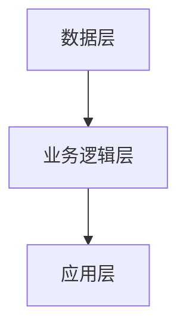
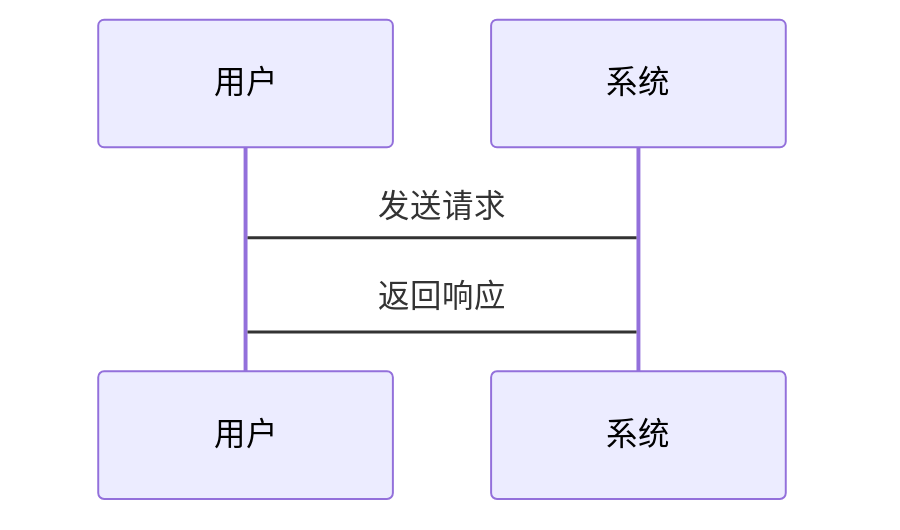
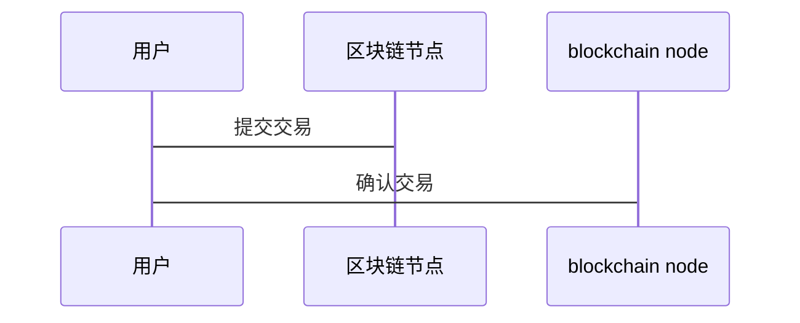

                 


# 全球股市估值与区块链在供应链金融中的应用

> **关键词**：全球股市估值、区块链、供应链金融、智能合约、去中心化、风险管理

> **摘要**：  
> 本文探讨了全球股市估值的基本概念、影响因素及其在金融领域的应用，重点分析了区块链技术如何 revolutionize 供应链金融。通过介绍智能合约、数据共享与隐私保护、风险管理等区块链技术的核心应用，本文详细阐述了区块链如何解决供应链金融中的痛点，并通过系统架构设计和项目实战展示了区块链技术的实际应用价值。

---

# 第一部分: 全球股市估值与区块链技术概述

## 第1章: 全球股市估值的基本概念

### 1.1 股市估值的定义与意义

#### 1.1.1 股市估值的定义
股市估值是指对一家公司股票的内在价值进行评估，以确定其市场价格是否合理。它通常基于公司财务数据、行业地位、市场前景等因素进行分析。

#### 1.1.2 股市估值的重要性
股市估值是投资者做出决策的重要依据，帮助他们在市场中识别低估或高估的投资机会。

#### 1.1.3 股市估值的基本方法
- 市盈率法（P/E ratio）
- 市净率法（P/B ratio）
- 现金流折现法（DCF）

### 1.2 全球股市的现状与趋势

#### 1.2.1 全球主要股市的分布与特点
全球主要股市包括纽约证券交易所（NYSE）、纳斯达克（NASDAQ）、伦敦金融时报指数（FTSE 100）等，每个市场都有其独特的特点和行业分布。

#### 1.2.2 全球股市的波动性与风险
股市波动性受宏观经济环境、政策变化、公司业绩等多种因素影响，投资者需关注系统性风险和非系统性风险。

#### 1.2.3 全球经济环境对股市的影响
全球经济环境直接影响股市表现，例如经济衰退可能导致股市下跌，而经济复苏则可能推动股市上涨。

### 1.3 区块链技术的基本概念

#### 1.3.1 区块链的定义与特点
区块链是一种分布式账本技术，具有去中心化、不可篡改、透明性和安全性等特点。

#### 1.3.2 区块链的核心技术原理
区块链通过分布式节点共识机制（如PoW、PoS）确保数据的安全性和一致性。

#### 1.3.3 区块链的应用领域与优势
区块链在金融、供应链、医疗等领域有广泛应用，尤其在提高透明度、降低信任成本方面具有显著优势。

### 1.4 区块链在金融领域的应用前景

#### 1.4.1 区块链在金融行业的潜力
区块链可以优化支付清算、证券交易结算等流程，提高效率并降低成本。

#### 1.4.2 区块链在供应链金融中的作用
区块链技术能够解决供应链金融中的信息不对称问题，提升融资效率。

#### 1.4.3 区块链技术的未来发展趋势
随着技术进步，区块链将在更多金融场景中得到应用，推动金融行业的数字化转型。

### 1.5 本章小结
本章介绍了全球股市估值的基本概念、影响因素及区块链技术的核心特点和应用前景，为后续分析奠定了基础。

---

## 第2章: 供应链金融的基本原理

### 2.1 供应链金融的定义与特点

#### 2.1.1 供应链金融的定义
供应链金融是指通过整合供应链上下游企业，为链上企业提供融资支持的一种金融模式。

#### 2.1.2 供应链金融的核心特点
- 以核心企业信用为依托
- 覆盖供应链上下游企业
- 金融产品多样化

### 2.2 供应链金融的传统模式与挑战

#### 2.2.1 传统供应链金融的运作模式
传统供应链金融通常依赖核心企业的信用，通过银行提供贷款或其他融资方式。

#### 2.2.2 传统供应链金融的主要问题
- 信息不对称
- 融资效率低
- 中小企业融资难

#### 2.2.3 传统供应链金融的优化方向
- 提高信息透明度
- 优化融资流程
- 扩大融资覆盖面

### 2.3 区块链技术如何解决供应链金融的痛点

#### 2.3.1 区块链在供应链金融中的应用价值
区块链技术可以实现供应链数据的透明共享，降低信息不对称。

#### 2.3.2 区块链如何提高供应链金融的透明度
通过区块链记录交易数据，确保数据的真实性和可追溯性。

#### 2.3.3 区块链如何降低供应链金融的风险
区块链通过智能合约自动执行合同条款，减少人为操作带来的风险。

### 2.4 本章小结
本章分析了供应链金融的传统模式及区块链技术如何解决其痛点，为后续应用提供了理论基础。

---

## 第3章: 区块链技术在供应链金融中的应用场景

### 3.1 智能合约在供应链金融中的应用

#### 3.1.1 智能合约的定义与特点
智能合约是基于区块链的自动执行合同，能够自动执行预设的条件。

#### 3.1.2 智能合约在供应链金融中的具体应用
- 自动触发支付
- 自动管理库存
- 自动执行合同条款

#### 3.1.3 智能合约的优势与挑战
优势：提高效率、降低成本；挑战：智能合约的复杂性和安全性问题。

### 3.2 区块链在供应链金融中的数据共享与隐私保护

#### 3.2.1 区块链数据共享的机制
通过区块链技术实现供应链上下游企业的数据共享，确保数据的安全性和一致性。

#### 3.2.2 区块链如何实现数据隐私保护
使用零知识证明、同态加密等技术在区块链上保护隐私数据。

#### 3.2.3 数据共享对供应链金融效率的提升
数据共享能够减少重复录入，提高整体效率。

### 3.3 区块链在供应链金融中的风险管理

#### 3.3.1 区块链如何实现风险监控
通过区块链实时监控供应链中的交易数据，及时发现异常情况。

#### 3.3.2 区块链如何提高信用评估的准确性
利用区块链记录的历史交易数据，提高信用评估的准确性。

#### 3.3.3 区块链在供应链金融中的风险管理案例
案例分析：某企业通过区块链技术实现供应链金融的信用风险控制。

### 3.4 本章小结
本章详细探讨了区块链技术在供应链金融中的具体应用，包括智能合约、数据共享与隐私保护、风险管理等方面。

---

## 第4章: 区块链技术在供应链金融中的系统架构设计

### 4.1 系统功能设计

#### 4.1.1 系统功能模块划分
- 智能合约模块
- 数据共享模块
- 风险管理模块

#### 4.1.2 每个功能模块的具体实现
- 智能合约模块：编写智能合约代码，实现自动执行功能。
- 数据共享模块：设计区块链数据结构，实现数据共享功能。
- 风险管理模块：开发风险监控算法，实现风险预警功能。

#### 4.1.3 系统功能设计的优缺点分析
优势：功能模块化设计提高系统的可维护性；挑战：智能合约的安全性问题。

### 4.2 系统架构设计

#### 4.2.1 系统架构设计概述
- 分层架构：包括数据层、业务逻辑层和应用层。
- 每层的功能划分：数据层负责数据存储，业务逻辑层负责智能合约执行，应用层负责用户交互。

#### 4.2.2 使用 Mermaid 绘制系统架构图


### 4.3 系统接口设计

#### 4.3.1 系统接口设计概述
- API接口设计：RESTful API
- 接口文档：详细描述每个接口的输入、输出和功能。

#### 4.3.2 使用 Mermaid 绘制系统接口图


### 4.4 系统交互设计

#### 4.4.1 系统交互设计概述
- 用户与系统之间的交互流程设计
- 交互流程中的关键节点：用户登录、发起交易、确认交易等。

#### 4.4.2 使用 Mermaid 绘制系统交互图


### 4.5 本章小结
本章通过系统架构设计和接口设计，详细阐述了区块链技术在供应链金融中的具体实现方案。

---

## 第5章: 项目实战

### 5.1 环境安装与配置

#### 5.1.1 开发环境配置
- 操作系统：Linux/Windows/MacOS
- 区块链框架：Hyperledger Fabric
- 开发工具：VS Code、Postman

#### 5.1.2 安装必要的软件
- 安装Hyperledger Fabric
- 安装Docker
- 安装Node.js

### 5.2 系统核心实现源代码

#### 5.2.1 智能合约实现
```javascript
// 供应链金融智能合约
contract SupplyChainFinance {
    // 记录订单信息
    mapping(address => uint256) private orders;

    // 提交订单
    function submitOrder(uint256 amount) public {
        orders[msg.sender] = amount;
    }

    // 支付订单
    function payOrder(uint256 amount) public {
        require(orders[msg.sender] == amount, "订单金额不匹配");
        // 执行支付逻辑
    }
}
```

#### 5.2.2 接口实现
```javascript
// 提供RESTful API接口
app.get('/submitOrder', async (req, res) => {
    const amount = req.query.amount;
    // 调用智能合约提交订单
});
```

### 5.3 代码应用解读与分析

#### 5.3.1 智能合约的实现细节
- 使用Solidity编写智能合约，部署到区块链网络。
- 通过调用智能合约API实现订单提交和支付功能。

#### 5.3.2 接口设计的优缺点
- 优点：接口设计简洁，易于维护。
- 缺点：需要处理跨链交互问题。

### 5.4 实际案例分析

#### 5.4.1 案例背景
某汽车制造企业希望通过区块链技术优化其供应链金融流程。

#### 5.4.2 案例实现
- 部署区块链网络，开发智能合约，实现供应商订单提交、支付和结算的自动化。

#### 5.4.3 案例分析
通过区块链技术，企业实现了供应链金融的透明化和自动化，显著降低了融资成本和时间。

### 5.5 本章小结
本章通过实际项目案例，详细讲解了区块链技术在供应链金融中的具体实现过程。

---

## 第6章: 总结与展望

### 6.1 总结
本文详细探讨了全球股市估值与区块链技术在供应链金融中的应用，分析了区块链技术如何解决供应链金融中的痛点。

### 6.2 展望
未来，随着区块链技术的不断发展，其在供应链金融中的应用将更加广泛，推动金融行业的数字化转型。

### 6.3 最佳实践 tips
- 在实施区块链技术前，需充分评估其适用性和成本。
- 选择合适的区块链框架和开发工具，确保系统的高效性和安全性。

### 6.4 注意事项
- 区块链技术的实施需要专业的技术支持。
- 数据隐私保护是区块链技术应用中的重要考虑因素。

### 6.5 拓展阅读
推荐阅读Hyperledger Fabric的官方文档，深入理解区块链技术的实现细节。

---

**作者：AI天才研究院/AI Genius Institute & 禅与计算机程序设计艺术 /Zen And The Art of Computer Programming**

---

通过以上目录和内容，您可以按照需要进一步扩展每个部分的具体内容，确保文章的完整性和深度。

