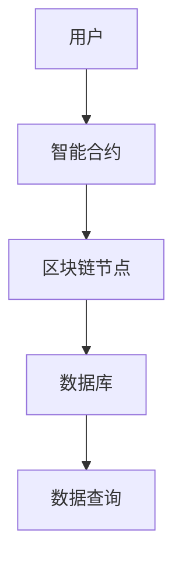

                 


# 全球股市估值与区块链在版权保护中的应用

> 关键词：全球股市估值，区块链技术，版权保护，智能合约，数据安全，去中心化

> 摘要：本文将探讨全球股市估值的基本原理及其在区块链技术中的应用，同时深入分析区块链技术在版权保护中的重要性。通过结合这两者的实际应用场景，我们将展示如何利用区块链技术提升股市估值的准确性和效率，同时确保版权保护的可靠性和安全性。

---

## 第一部分：全球股市估值的基础与挑战

### 第1章：全球股市估值的定义与核心要素

#### 1.1 股市估值的基本概念
- 股市估值是指对上市公司股票价值进行评估的过程，旨在确定其内在价值与市场价值之间的关系。
- 核心目标：帮助投资者做出理性决策，降低投资风险。

#### 1.2 股市估值的核心要素
| 要素 | 描述 |
|------|------|
| 财务数据 | 收入、利润、资产负债表等 |
| 市场环境 | 宏观经济、行业趋势 |
| 公司基本面 | 盈利能力、成长性、竞争优势 |
| 市场情绪 | 投资者心理、市场波动 |

### 第2章：全球股市估值的主要方法

#### 2.1 市盈率法（P/E Ratio）
- **定义**：市盈率 = 股价 / 每股净利润
- **应用场景**：适用于盈利稳定的公司。
- **案例**：假设公司A的股价为50元，每股净利润为5元，则市盈率为10倍。

#### 2.2 市净率法（P/B Ratio）
- **定义**：市净率 = 股价 / 每股净资产
- **优势**：适用于金融、房地产等资产密集型行业。
- **案例**：公司B的股价为30元，每股净资产为15元，则市净率为2倍。

#### 2.3 现金流折现法（DCF Model）
- **原理**：将未来现金流折现为当前价值。
- **步骤**：
  1. 预测未来现金流。
  2. 选择合适的折现率。
  3. 计算现值总和。
- **数学模型**：
  $$ PV = \frac{CF_1}{(1+r)^1} + \frac{CF_2}{(1+r)^2} + \dots + \frac{CF_n}{(1+r)^n} $$

---

## 第二部分：区块链技术的核心原理与应用

### 第3章：区块链技术的基本原理

#### 3.1 区块链的定义与特点
- **定义**：区块链是一种去中心化的分布式账本技术，通过加密算法和共识机制确保数据的安全性和不可篡改性。
- **特点**：
  - 去中心化：无须信任第三方机构。
  - 可追溯性：每笔交易均可追溯。
  - 高安全性：加密算法保护数据安全。

#### 3.2 区块链的核心组件
- **区块结构**：
  - 数据：交易记录。
  - 时间戳：记录区块生成时间。
  - 哈希值：确保数据完整性。
- **共识机制**：
  - 工作量证明（PoW）：比特币采用的方式。
  - 权益证明（PoS）：以太坊（Ethereum）采用的方式。

### 第4章：区块链在版权保护中的应用

#### 4.1 版权保护的核心问题
- **问题**：版权侵权、盗版传播、版权归属不清。
- **区块链解决方案**：
  - 数字内容上链：确保版权归属可追溯。
  - 智能合约：自动执行版权交易和分成。

#### 4.2 区块链在版权保护中的具体应用
- **数字内容登记**：
  - 使用区块链记录内容创作时间、作者信息。
  - 示例：音乐、视频、艺术品的版权登记。
- **版权交易透明化**：
  - 智能合约自动处理版权许可和费用分配。
  - 示例：数字内容分发平台。

---

## 第三部分：全球股市估值与区块链技术的结合

### 第5章：区块链技术在股市估值中的应用

#### 5.1 数据存储的去中心化
- **优势**：消除单点故障，提高数据可靠性。
- **案例**：利用区块链存储上市公司财报数据，确保数据真实性和透明性。

#### 5.2 数据共享的安全性
- **解决方案**：通过区块链实现数据加密共享，确保敏感数据的安全性。
- **应用场景**：机构投资者之间的数据共享。

#### 5.3 数据分析的高效性
- **优势**：利用区块链的大数据分析能力，提高估值效率。
- **技术实现**：结合大数据和机器学习算法，实时分析市场数据。

---

## 第四部分：系统架构与算法实现

### 第6章：系统架构设计方案

#### 6.1 系统功能设计
- **用户模块**：
  - 登录/注册。
  - 数据提交与查询。
- **数据存储模块**：
  - 区块链存储。
  - 数据索引。
- **智能合约模块**：
  - 版权交易自动执行。
  - 账单生成与结算。

#### 6.2 系统架构图



---

## 第五部分：项目实战与最佳实践

### 第7章：项目实战

#### 7.1 环境安装
- **区块链平台**：建议使用Ethereum或Hyperledger Fabric。
- **开发工具**：推荐使用Solidity（智能合约开发）、VS Code（代码编辑器）。

#### 7.2 核心实现源代码
- **智能合约示例**（Solidity）：
```solidity
// SPDX-License-Identifier: MIT
pragma solidity ^0.8.0;

contract CopyrightProtection {
    struct Content {
        uint timestamp;
        address author;
        string metadata;
    }

    mapping(uint => Content) private contents;

    function registerContent(uint id, string memory metadata) public {
        contents[id] = Content(block.timestamp, msg.sender, metadata);
    }

    function getContent(uint id) public view returns (Content memory) {
        return contents[id];
    }
}
```

#### 7.3 应用案例分析
- **案例**：数字音乐版权保护。
  - 创作者将音乐作品上链，确保版权归属。
  - 平台使用智能合约自动处理授权和分成。

---

## 第六部分：总结与展望

### 第8章：总结与展望

#### 8.1 全文总结
- 区块链技术为全球股市估值和版权保护提供了革命性的解决方案。
- 通过去中心化和智能化，区块链提高了数据的安全性和系统的透明性。

#### 8.2 未来展望
- 技术融合：进一步探索区块链与其他技术（如人工智能）的结合。
- 应用拓展：在更多领域（如医疗数据、供应链管理）中应用区块链技术。

---

## 作者信息

作者：AI天才研究院/AI Genius Institute & 禅与计算机程序设计艺术 /Zen And The Art of Computer Programming

