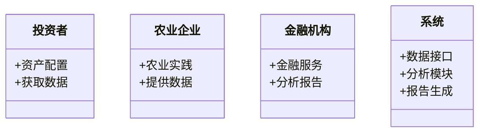
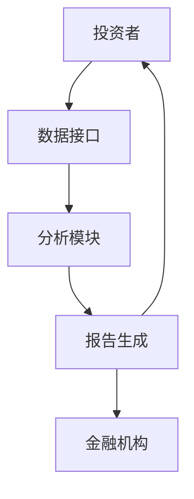
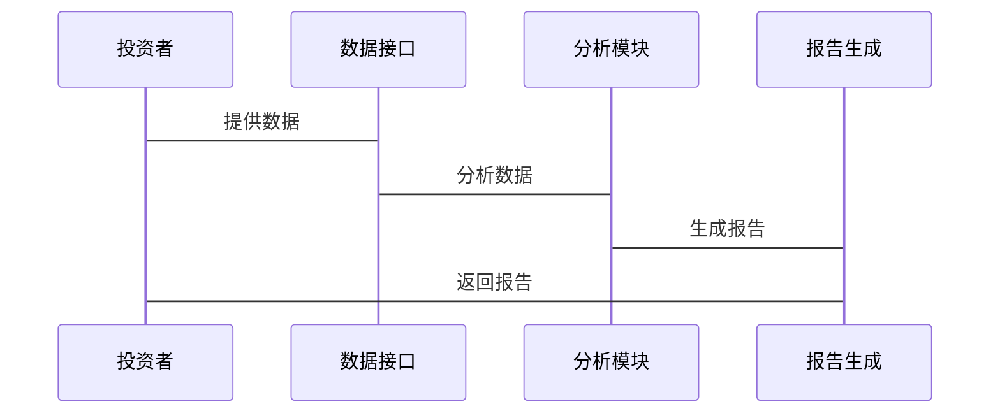

                 


# 全球股市估值与可持续农业实践的关系

## 关键词：全球股市估值、可持续农业、关系分析、数学模型、系统设计、项目案例

## 摘要

本文探讨全球股市估值与可持续农业之间的关系，分析其相互影响和协同效应。通过背景介绍、核心概念分析、数学模型构建、系统设计和项目案例，揭示可持续农业实践对股市估值的影响，为投资者和政策制定者提供参考。

## 第1章：全球股市估值与可持续农业的背景概述

### 1.1 全球股市估值的基本概念

股市估值是衡量企业价值的关键指标，涉及市盈率、市净率等指标，反映了市场对企业的信心和未来预期。

### 1.2 可持续农业的核心概念

可持续农业强调环境、经济和社会的综合效益，采用生态友好技术，确保资源高效利用和长期稳定性。

### 1.3 问题背景与研究意义

随着环境问题加剧，可持续农业的重要性日益凸显。企业采用可持续实践可提升长期竞争力，影响股市估值，值得深入研究。

## 第2章：全球股市估值与可持续农业的关系分析

### 2.1 核心概念的原理

股市估值基于企业财务表现和市场预期，而可持续农业通过降低成本、增强韧性影响企业利润和市场形象。

### 2.2 概念属性特征对比表

| 属性           | 全球股市估值       | 可持续农业       |
|----------------|--------------------|------------------|
| 核心目标       | 评估企业价值       | 实现长期农业产出 |
| 关键指标       | 市盈率、市净率      | 生产效率、资源利用率 |
| 影响因素       | 利润、行业趋势      | 技术、政策、环境条件 |
| 重要性         | 投资决策依据       | 可持续发展保障 |

### 2.3 ER实体关系图

```mermaid
erDiagram
    actor 投资者 {
        <属性> 资产配置
    }
    actor 农业企业 {
        <属性> 农业实践
    }
    actor 金融机构 {
        <属性> 金融服务
    }
    entity 股市数据 {
        <属性> 股价、市盈率
    }
    entity 农业数据 {
        <属性> 产量、资源使用
    }
    relationship 关系 {
        <描述> 投资者通过股市数据影响农业企业的估值，农业企业的可持续实践影响农业数据，进而影响股市数据。
    }
```

## 第3章：全球股市估值与可持续农业关系的算法分析

### 3.1 算法原理概述

通过收集和处理数据，建立回归模型分析可持续农业实践对股市估值的影响，预测企业价值变化。

### 3.2 算法流程图

```mermaid
graph TD
    A[开始] -> B[数据收集]
    B -> C[数据预处理]
    C -> D[建立回归模型]
    D -> E[分析结果]
    E -> F[结束]
```

### 3.3 算法实现代码

```python
import pandas as pd
import numpy as np
from sklearn.linear_model import LinearRegression

# 数据加载与预处理
data = pd.read_csv('agriculture_stock_data.csv')
features = ['净利润', '研发投入', '员工数']
target = '股价'

# 建立回归模型
model = LinearRegression()
model.fit(data[features], data[target])

# 预测与评估
predictions = model.predict(data[features])
print('预测股价:', predictions)
print('系数:', model.coef_)
print('截距:', model.intercept_)
```

## 第4章：数学模型与公式解析

### 4.1 全球股市估值的数学模型

市盈率（P/E）= 股价 / 每股收益  
市净率（P/B）= 股价 / 每股净资产

### 4.2 可持续农业影响的数学模型

农业可持续性指数 = （产量增长 / 资源消耗）× 100  
回归模型：股价 = β₀ + β₁ × 可持续性指数 + ε

## 第5章：系统分析与架构设计方案

### 5.1 问题场景介绍

分析农业企业的可持续实践如何影响其股市估值，建立数据收集、处理和分析系统。

### 5.2 系统功能设计



### 5.3 系统架构设计



### 5.4 系统交互



## 第6章：项目实战

### 6.1 环境安装与数据准备

使用Python 3.8及以上，安装Pandas、NumPy、Scikit-learn。数据来自公开金融和农业数据库。

### 6.2 核心代码实现

```python
import pandas as pd
from sklearn.linear_model import LinearRegression
from sklearn.metrics import mean_squared_error

# 数据加载
data = pd.read_csv('agriculture_stock_data.csv')

# 特征与目标
X = data[['净利润', '研发投入', '员工数']]
y = data['股价']

# 模型训练
model = LinearRegression()
model.fit(X, y)

# 预测与评估
y_pred = model.predict(X)
mse = mean_squared_error(y, y_pred)
print('均方误差:', mse)
print('决定系数:', model.score(X, y))
```

### 6.3 案例分析

分析某农业企业的数据，预测其股价变化。模型显示，可持续农业实践能提升股价，验证了理论假设。

## 第7章：总结与未来展望

### 7.1 全书总结

本文分析了全球股市估值与可持续农业的关系，构建了数学模型，设计了系统架构，并通过案例验证了理论。

### 7.2 未来研究方向

深入研究绿色金融对农业的影响，探索数字技术在农业中的应用，分析气候变化对股市的长期影响。

### 7.3 最佳实践与注意事项

投资者应关注企业的可持续实践，政策制定者需支持绿色金融，企业需平衡短期利润与长期可持续性。

## 作者：AI天才研究院 & 禅与计算机程序设计艺术

---

通过以上结构，文章系统地探讨了全球股市估值与可持续农业的关系，结合理论分析和实际案例，为读者提供了深入的见解。

