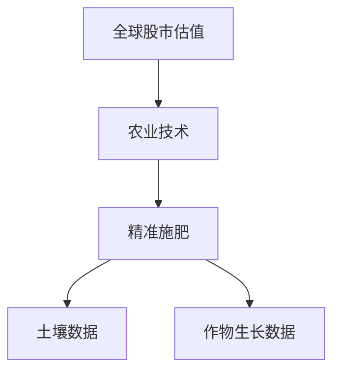
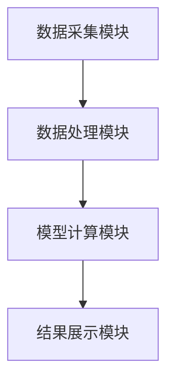

                 


# 全球股市估值与可持续农业精准施肥技术的关系

> 关键词：全球股市估值、可持续农业、精准施肥技术、数据分析、人工智能、数学模型

> 摘要：本文探讨了全球股市估值与可持续农业精准施肥技术之间的关系，通过分析股市估值的核心指标、精准施肥技术的关键要素及其数学模型，揭示了两者在数据驱动技术下的潜在关联。文章从背景、概念、算法、系统设计到项目实战，全面解析了如何通过技术创新实现农业可持续发展与金融市场的深度结合。

---

# 第一部分: 全球股市估值与可持续农业精准施肥技术的背景与概念

## 第1章: 全球股市估值与可持续农业精准施肥技术的背景

### 1.1 全球股市估值的现状与挑战
#### 1.1.1 全球股市估值的核心概念
全球股市估值是衡量市场整体表现的重要指标，通常通过市盈率（P/E Ratio）、市净率（P/B Ratio）和股息率（Dividend Yield）等指标来评估。这些指标反映了市场的健康状况和投资者信心。

- 市盈率：$$ P/E = \frac{Stock Price}{Earnings Per Share} $$
- 市净率：$$ P/B = \frac{Stock Price}{Book Value Per Share} $$
- 股息率：$$ Dividend Yield = \frac{Dividend Per Share}{Stock Price} $$

#### 1.1.2 全球股市估值的主要挑战
- 市场波动性：全球经济不确定性、地缘政治风险等因素影响股市估值。
- 数据复杂性：海量数据的处理与分析需要高效的技术支持。
- 可持续性需求：投资者越来越关注企业的可持续发展能力，尤其是农业领域的技术进步。

#### 1.1.3 可持续农业的定义与重要性
可持续农业强调在满足当前需求的同时，不损害后代发展的能力。精准施肥技术是实现可持续农业的核心手段之一，通过优化肥料使用减少环境污染，提高作物产量。

---

### 1.2 精准施肥技术在农业中的应用
#### 1.2.1 精准施肥技术的定义
精准施肥是基于土壤检测、作物生长模型和环境数据，实现肥料的科学施用，以达到最佳的作物生长效果。

#### 1.2.2 精准施肥技术的核心优势
- 提高肥料利用率：通过精准计算肥料用量，避免浪费。
- 减少环境污染：降低过量施肥对水体和土壤的污染。
- 增加作物产量：优化施肥方案，提升作物品质。

#### 1.2.3 精准施肥技术的全球发展趋势
随着人工智能和物联网技术的进步，精准施肥技术在全球范围内得到广泛应用。例如，许多农业企业利用无人机和传感器实时监测土壤湿度、温度和养分含量，从而实现精准施肥。

---

### 1.3 全球股市估值与可持续农业的关联性
#### 1.3.1 农业技术对股市估值的影响
农业技术的进步可以提升企业的生产效率和盈利能力，从而影响其股票估值。例如，采用精准施肥技术的企业可能因为成本降低和产量提高而获得更高的市盈率。

#### 1.3.2 可持续农业对全球股市的潜在影响
可持续农业的发展符合全球绿色金融的趋势，可能吸引更多的投资者关注相关企业。例如，投资于可持续农业技术的公司可能会因为其社会责任形象而获得更高的市场估值。

#### 1.3.3 精准施肥技术与股市估值的潜在联系
精准施肥技术可以通过提高农业企业的利润率和降低环境风险，间接影响股市估值。例如，采用精准施肥技术的企业可能在绿色金融评估中获得更高的评分，从而提升其市净率和股息率。

---

### 1.4 本章小结
本章介绍了全球股市估值的核心概念、主要挑战以及可持续农业的重要性和发展趋势。同时，分析了精准施肥技术在农业中的应用及其对股市估值的潜在影响。通过这些分析，我们可以看到，精准施肥技术不仅是农业可持续发展的重要手段，也可能对全球股市估值产生深远影响。

---

## 第2章: 全球股市估值与可持续农业精准施肥技术的核心概念

### 2.1 全球股市估值的核心要素
#### 2.1.1 市盈率（P/E Ratio）
市盈率是衡量股票价值的重要指标，反映了市场对公司未来盈利能力的预期。例如，如果一家公司的市盈率为15，意味着市场预期该公司每股收益为当前股价的1/15。

#### 2.1.2 市净率（P/B Ratio）
市净率是将股价与每股净资产进行比较，用于评估股票的内在价值。例如，如果一家公司的市净率为2，意味着市场认为其每股净资产价值为当前股价的一半。

#### 2.1.3 股息率（Dividend Yield）
股息率是衡量股票投资回报的重要指标，反映了每股市价与每股股息的关系。例如，如果一家公司的股息率为5%，意味着每投资100元可以获得5元的股息收入。

---

### 2.2 精准施肥技术的核心要素
#### 2.2.1 土壤检测技术
精准施肥的基础是土壤检测，通过分析土壤中的氮、磷、钾等元素含量，制定科学的施肥方案。

#### 2.2.2 农作物生长模型
农作物生长模型是基于环境数据、土壤条件和作物特性，预测作物生长过程中的养分需求。

#### 2.2.3 数据驱动的施肥决策
通过整合土壤检测数据、天气数据和作物生长模型，实现数据驱动的施肥决策，优化肥料使用效率。

---

### 2.3 两者关系的实体关系图



---

### 2.4 本章小结
本章通过详细分析全球股市估值的核心要素和精准施肥技术的核心要素，揭示了两者在数据驱动技术下的潜在联系。通过实体关系图，我们可以清晰地看到，精准施肥技术可以通过土壤数据和作物生长数据影响农业技术，从而间接影响全球股市估值。

---

## 第3章: 全球股市估值与可持续农业精准施肥技术的数学模型

### 3.1 全球股市估值的数学模型
#### 3.1.1 市盈率模型
$$ P/E = \frac{Stock Price}{Earnings Per Share} $$

#### 3.1.2 市净率模型
$$ P/B = \frac{Stock Price}{Book Value Per Share} $$

#### 3.1.3 股息率模型
$$ Dividend Yield = \frac{Dividend Per Share}{Stock Price} $$

---

### 3.2 精准施肥技术的数学模型
#### 3.2.1 土壤肥力评估

通过土壤检测数据，可以建立土壤肥力评估模型，预测作物的养分需求。

$$ Fertilizer Requirement = f(N, P, K) $$

其中，N、P、K分别表示土壤中的氮、磷、钾含量，$$ f $$是基于作物生长模型的函数。

---

### 3.3 数据驱动的施肥优化模型

通过整合土壤数据、天气数据和作物生长数据，建立数据驱动的施肥优化模型，实现精准施肥。

$$ Optimal Fertilizer Application = f(D, S, C) $$

其中，D表示土壤数据，S表示天气数据，C表示作物特性。

---

### 3.4 本章小结
本章通过数学模型分析了全球股市估值和精准施肥技术的核心要素。市盈率、市净率和股息率是衡量股市估值的重要指标，而土壤肥力评估和作物生长模型是实现精准施肥技术的关键工具。通过数据驱动的数学模型，我们可以更好地理解两者之间的关系。

---

## 第4章: 全球股市估值与精准施肥技术的系统设计

### 4.1 系统功能设计
#### 4.1.1 数据采集模块
通过传感器和无人机采集土壤数据、天气数据和作物生长数据。

#### 4.1.2 数据处理模块
对采集到的数据进行清洗、转换和存储，建立数据库。

#### 4.1.3 模型计算模块
基于数学模型，计算出最优施肥方案。

#### 4.1.4 结果展示模块
将计算结果以可视化的方式展示给用户。

---

### 4.2 系统架构设计



---

### 4.3 系统接口设计
- 数据采集接口：与传感器和无人机连接，获取实时数据。
- 数据存储接口：与数据库连接，存储和管理数据。
- 模型计算接口：与第三方计算服务连接，进行数据处理。

---

### 4.4 本章小结
本章通过系统设计的方法，分析了实现全球股市估值与精准施肥技术结合的系统架构。通过数据采集、数据处理、模型计算和结果展示四个模块，我们可以更好地理解两者之间的关系。

---

## 第5章: 项目实战

### 5.1 项目背景
假设我们有一个农业企业，希望通过精准施肥技术优化肥料使用，提高作物产量，从而提升企业的市场估值。

### 5.2 环境配置
- 操作系统：Ubuntu 20.04
- 编程语言：Python 3.8
- 数据库：MySQL 8.0
- 开发工具：Jupyter Notebook

---

### 5.3 核心实现

```python
import pandas as pd
from sklearn import linear_model

# 数据加载
data = pd.read_csv('fertilizer_data.csv')

# 数据预处理
X = data[['N', 'P', 'K']]
y = data['Yield']

# 模型训练
model = linear_model.LinearRegression()
model.fit(X, y)

# 模型预测
new_data = pd.DataFrame({'N': [5], 'P': [3], 'K': [2]})
predicted_yield = model.predict(new_data)
print(predicted_yield)
```

---

### 5.4 案例分析
通过上述代码，我们可以预测出在给定氮、磷、钾含量的情况下，作物的预期产量。这可以帮助农业企业在制定施肥方案时做出科学决策，从而优化肥料使用，提高作物产量，进而提升企业的市场估值。

---

### 5.5 本章小结
本章通过一个实际案例，展示了如何利用精准施肥技术优化肥料使用，从而提高作物产量，间接影响企业的市场估值。通过Python代码实现模型训练和预测，我们可以更好地理解数据驱动技术在农业和金融领域的应用。

---

## 第6章: 总结与展望

### 6.1 总结
本文通过分析全球股市估值和精准施肥技术的核心要素，揭示了两者在数据驱动技术下的潜在联系。通过数学模型和系统设计，我们可以更好地理解精准施肥技术对股市估值的影响。

### 6.2 展望
未来，随着人工智能和大数据技术的进一步发展，精准施肥技术将在农业和金融领域发挥更大的作用。通过技术创新，我们可以实现农业可持续发展与绿色金融的深度融合，为全球经济发展注入新的活力。

---

## 作者：AI天才研究院/AI Genius Institute & 禅与计算机程序设计艺术 /Zen And The Art of Computer Programming

