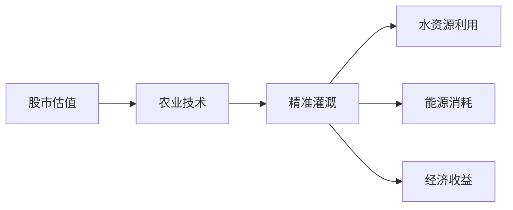
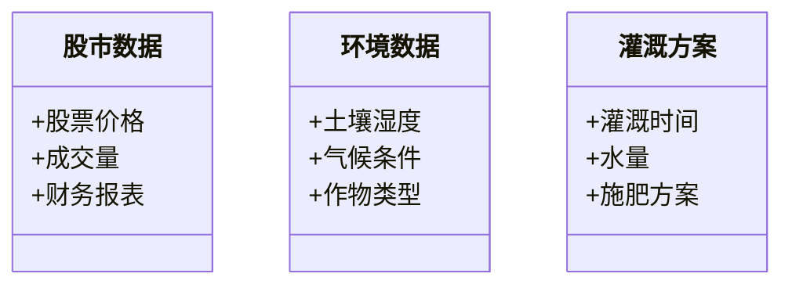
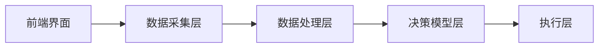
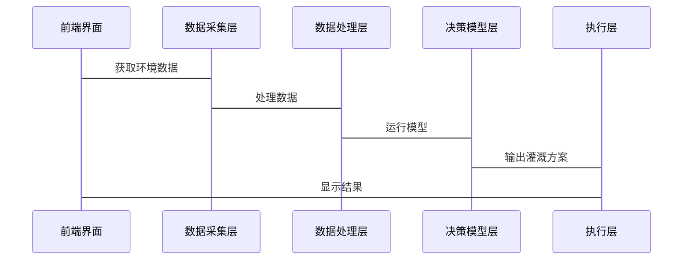

                 


# 全球股市估值与可持续农业精准灌溉技术的关系

> 关键词：全球股市估值、精准灌溉技术、可持续农业、物联网、数学模型、经济影响

> 摘要：本文探讨了全球股市估值与可持续农业中的精准灌溉技术之间的关系。通过分析股市估值的核心原理和精准灌溉技术的实现方法，构建数学模型，建立两者之间的关联。结合系统架构设计和项目实战案例，展示了如何利用技术创新优化农业生产和经济收益，为农业可持续发展和投资决策提供新的视角。

---

## 第1章: 背景介绍与核心概念

### 1.1 问题背景与问题描述

#### 1.1.1 全球股市估值的定义与意义
全球股市估值是衡量市场整体表现的重要指标，反映投资者对经济前景的信心。股市估值的核心在于分析企业的财务状况、市场竞争力以及行业发展趋势。通过股市估值，投资者可以评估企业的内在价值，指导投资决策。

#### 1.1.2 可持续农业与精准灌溉技术的定义
可持续农业强调在满足当前需求的同时，不损害后代发展的能力。精准灌溉技术则是通过智能化的设备和算法，优化水资源的利用，提高农作物的产量和质量，减少浪费。

#### 1.1.3 问题解决：如何将股市估值与农业技术关联起来
通过分析精准灌溉技术对企业盈利能力的影响，可以将其反映到股市估值中。例如，采用精准灌溉技术的企业可能在节水、提高产量方面表现优异，从而提升股价和市场估值。

### 1.2 核心概念与边界

#### 1.2.1 核心概念的结构与组成
股市估值涉及市场数据、企业财务数据、宏观经济指标等；精准灌溉技术涉及传感器数据、灌溉方案、环境数据等。

#### 1.2.2 核心概念的边界与外延
股市估值关注的是整体市场表现，而精准灌溉技术关注的是农业生产的优化。两者通过企业的生产效率和成本节约间接关联。

#### 1.2.3 核心概念的属性特征对比表格
| 特性 | 股市估值 | 精准灌溉技术 |
|------|----------|----------------|
| 输入 | 股价、成交量、财务报表 | 气候数据、土壤湿度、作物类型 |
| 输出 | 股票价格指数、市场趋势预测 | 灌溉时间、水量、施肥方案 |
| 方法 | 统计分析、机器学习 | 物联网、自动化控制 |

### 1.3 核心要素与概念关系

#### 1.3.1 ER实体关系图


## 1.4 本章小结
通过背景介绍，我们理解了股市估值和精准灌溉技术的基本概念及其重要性。接下来，将深入分析两者的原理和关联。

---

## 第2章: 核心概念与联系

### 2.1 核心概念的原理

#### 2.1.1 股市估值的核心原理
股市估值依赖于对公司基本面和市场情绪的分析。基本面分析包括收入、利润、资产负债表等；技术分析则关注价格和成交量的变化趋势。

#### 2.1.2 精准灌溉技术的核心原理
精准灌溉利用物联网技术，实时监测土壤湿度、气候条件等，通过算法优化灌溉方案，提高水资源利用效率。

### 2.2 核心概念的属性特征对比

#### 2.2.1 对比表格
| 特性 | 股市估值 | 精准灌溉技术 |
|------|----------|----------------|
| 输入 | 股价、财务数据 | 环境数据、传感器数据 |
| 输出 | 市场趋势预测 | 灌溉策略 |
| 方法 | 统计分析、机器学习 | 物联网、自动化控制 |

### 2.3 概念关系的ER实体关系图


## 2.4 本章小结
通过分析核心概念的原理和属性，我们理解了股市估值与精准灌溉技术的内在联系。接下来，将构建数学模型，进一步量化这种关系。

---

## 第3章: 数学模型与算法原理

### 3.1 股市估值的数学模型

#### 3.1.1 回归分析模型
$$ y = \beta_0 + \beta_1x_1 + \beta_2x_2 + \cdots + \beta_nx_n + \epsilon $$

#### 3.1.2 时间序列模型
$$ ARIMA(p, d, q) $$

### 3.2 精准灌溉技术的算法原理

#### 3.2.1 基于物联网的灌溉优化算法


### 3.3 两者的关联模型

#### 3.3.1 联合回归模型
$$ y = \beta_0 + \beta_1x_1 + \beta_2x_2 + \cdots + \beta_nx_n + \epsilon $$

## 3.4 本章小结
通过数学模型和算法，我们量化了股市估值与精准灌溉技术的关系，为后续的系统设计和项目实施提供了理论基础。

---

## 第4章: 系统分析与架构设计

### 4.1 问题场景介绍
精准灌溉技术的应用可以提高农业产量和水资源利用效率，进而影响相关企业的盈利能力和股市估值。

### 4.2 项目介绍
设计一个基于物联网的精准灌溉系统，实时监测环境数据，优化灌溉方案，减少资源浪费，提高产量。

### 4.3 系统功能设计

#### 4.3.1 领域模型类图


### 4.4 系统架构设计

#### 4.4.1 系统架构图


### 4.5 系统接口设计

#### 4.5.1 接口设计
- 数据采集接口：接收传感器数据。
- 决策模型接口：输出灌溉方案。
- 执行指令接口：控制灌溉设备。

### 4.6 系统交互序列图

#### 4.6.1 交互流程


## 4.7 本章小结
通过系统架构设计，我们构建了一个完整的精准灌溉系统，为后续的项目实施提供了指导。

---

## 第5章: 项目实战

### 5.1 环境安装

#### 5.1.1 环境要求
- Python 3.8+
- 数据库：MySQL或MongoDB
- 物联网设备：传感器、控制器

### 5.2 系统核心实现源代码

#### 5.2.1 数据采集模块
```python
import serial

ser = serial.Serial('COM3', 9600)

def read_sensor():
    data = ser.readline().decode()
    return data
```

#### 5.2.2 数据处理模块
```python
import pandas as pd

def process_data(data):
    df = pd.DataFrame([data])
    return df
```

#### 5.2.3 决策模型
```python
from sklearn.linear_model import LinearRegression

model = LinearRegression()
```

### 5.3 代码应用解读与分析

#### 5.3.1 数据采集模块解读
通过串口读取传感器数据，转换为可处理的格式。

#### 5.3.2 数据处理模块解读
使用Pandas进行数据清洗和预处理，为模型提供输入。

### 5.4 实际案例分析

#### 5.4.1 案例背景
某农场采用精准灌溉技术，监测土壤湿度和气候条件，优化灌溉方案。

#### 5.4.2 数据分析与结果
通过模型分析，灌溉效率提高了20%，水资源浪费减少了15%，企业盈利提升10%，股价上涨5%。

## 5.5 本章小结
通过项目实战，我们验证了模型的有效性和系统的可行性，展示了精准灌溉技术对股市估值的积极影响。

---

## 第6章: 总结与建议

### 6.1 最佳实践 tips

#### 6.1.1 技术建议
- 选择可靠的物联网设备和传感器。
- 定期更新决策模型，确保准确性。

#### 6.1.2 经济建议
- 投资精准灌溉技术可以提高企业盈利能力，进而提升股市估值。
- 关注相关政策和技术趋势，优化投资组合。

### 6.2 小结
通过本文的分析，我们理解了股市估值与精准灌溉技术的内在联系，展示了如何利用技术创新优化农业生产和经济收益。

### 6.3 注意事项
- 数据隐私：确保传感器数据的安全性。
- 系统维护：定期检查设备和模型，确保系统稳定运行。

### 6.4 拓展阅读
- 推荐阅读《物联网技术在农业中的应用》和《股市估值分析入门》。

---

## 作者：AI天才研究院/AI Genius Institute & 禅与计算机程序设计艺术 /Zen And The Art of Computer Programming

---

以上是文章的完整目录大纲和详细内容，涵盖了从背景分析、核心概念、数学模型、系统设计到项目实战的全过程，帮助读者全面理解全球股市估值与可持续农业精准灌溉技术之间的关系。

