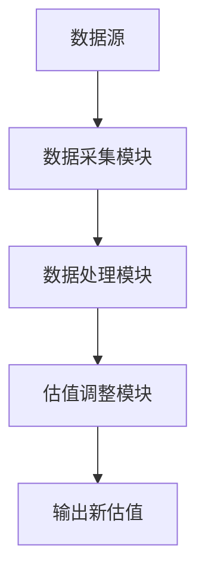
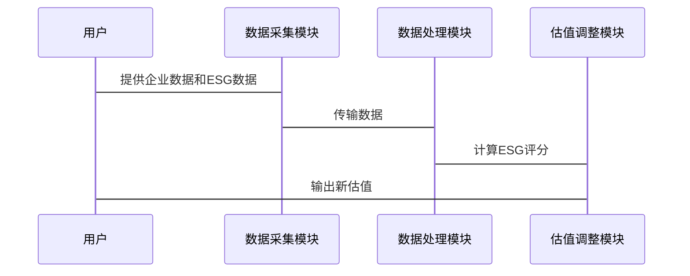

                 


# 全球股市估值与可持续发展目标的关联

## 关键词：
- 全球股市估值
- 可持续发展目标
- ESG评分模型
- 绿色金融
- 投资决策

## 摘要：
本文探讨了全球股市估值与可持续发展目标之间的关联，重点分析了如何通过引入ESG评分模型和绿色金融指标来改进传统的股市估值方法。文章从背景介绍、核心概念、算法原理、系统设计、项目实战等多维度展开，详细阐述了可持续发展目标对股市估值的影响路径，并通过实例分析展示了新的估值模型的应用效果。文章还提供了最佳实践建议，帮助读者更好地将可持续发展目标纳入投资决策中。

---

# 第一部分: 全球股市估值与可持续发展目标的关联概述

## 第1章: 全球股市估值与可持续发展目标的核心概念

### 1.1 问题背景与问题描述

#### 1.1.1 全球股市估值的现状与挑战
- **传统估值指标**：市盈率（P/E）、市净率（P/B）、股息率等。
- **现有估值模型的局限性**：忽视企业社会责任、环境影响和治理结构等非财务因素。

#### 1.1.2 可持续发展目标的核心要素
- **环境（E）**：减少碳排放、资源效率、环保合规。
- **社会（S）**：员工权益、社会责任、产品安全。
- **治理（G）**：董事会结构、高管薪酬、透明度。

#### 1.1.3 问题解决的必要性
- **传统估值与可持续发展目标脱节**：投资者忽视企业社会责任可能导致长期风险。
- **引入可持续发展目标的潜在价值**：提升企业长期价值，降低投资风险。

### 1.2 问题的边界与外延

#### 1.2.1 全球股市估值的范围界定
- **主要市场指数**：标普500、MSCI指数、沪深300等。
- **不同市场环境下的估值差异**：新兴市场与发达市场的估值差异。

#### 1.2.2 可持续发展目标的适用范围
- **行业间差异**：高碳行业（如能源）与低碳行业（如科技）的差异。
- **国家与地区差异**：发达国家与发展中国家的政策差异。

#### 1.2.3 问题解决的边界
- **本研究的局限性**：主要关注ESG评分对企业估值的影响，不考虑宏观经济因素。
- **研究方法的可行性**：采用量化方法，结合实际案例分析。

### 1.3 概念结构与核心要素

#### 1.3.1 全球股市估值的核心要素
| 传统估值指标 | 描述 |
|-------------|------|
| 市盈率（P/E） | 股价与每股收益的比率 |
| 市净率（P/B） | 股价与每股净资产的比率 |
| 股息率 | 每股股息与股价的比率 |

#### 1.3.2 可持续发展目标的核心要素
| ESG维度 | 描述 |
|--------|------|
| 环境（E） | 环境影响、资源效率、环保合规 |
| 社会（S） | 员工权益、社会责任、产品安全 |
| 治理（G） | 董事会结构、高管薪酬、透明度 |

#### 1.3.3 两者的关联机制
- **影响路径**：ESG表现→企业声誉→品牌价值→股价。
- **内在联系**：企业社会责任与投资回报的正相关关系。

---

## 第2章: ESG评分模型与估值方法的整合

### 2.1 ESG评分模型的构建

#### 2.1.1 ESG评分体系的设计
- **指标选择**：环境、社会、治理三维度。
- **权重分配**：E(40%)、S(30%)、G(30%)。
- **数据来源**：MSCI、Sustainalytics等第三方数据。

#### 2.1.2 ESG评分的计算流程
1. **数据采集**：获取企业ESG相关数据。
2. **数据清洗**：处理缺失值、异常值。
3. **评分计算**：根据权重计算综合ESG评分。

### 2.2 可持续发展目标与估值模型的结合

#### 2.2.1 传统估值模型的改进
- **改进方法**：引入ESG评分作为调整因子。
- **调整公式**：$$新估值 = 原估值 × ESG评分调整系数$$

#### 2.2.2 新估值模型的数学表达
- $$ESG评分调整系数 = ESG评分 / 最大可能ESG评分$$

### 2.3 案例分析

#### 2.3.1 某行业龙头企业的估值调整
- **企业ESG评分**：假设某企业ESG评分为80，最大可能评分为100。
- **调整系数**：0.8。
- **新估值**：假设原估值为100，新估值为80。

#### 2.3.2 不同行业的新估值模型表现
- **高碳行业**：ESG评分低，估值调整较大。
- **低碳行业**：ESG评分高，估值调整较小。

---

## 第3章: 基于ESG评分的估值模型实现

### 3.1 算法原理

#### 3.1.1 算法流程
1. **数据采集**：获取企业财务数据和ESG数据。
2. **数据预处理**：清洗数据，处理异常值。
3. **ESG评分计算**：根据权重计算综合ESG评分。
4. **估值调整**：计算新的估值。

#### 3.1.2 Python代码实现
```python
import pandas as pd

# 假设数据已清洗
def calculate_esg_score(esg_data):
    # 计算ESG评分
    e_weight = 0.4
    s_weight = 0.3
    g_weight = 0.3
    esg_score = (e_weight * esg_data['E'] + 
                 s_weight * esg_data['S'] + 
                 g_weight * esg_data['G'])
    return esg_score

# 应用新估值模型
def adjust_valuation(original_valuation, esg_score):
    max_score = 100  # 假设最大ESG评分为100
    adjustment_factor = esg_score / max_score
    new_valuation = original_valuation * adjustment_factor
    return new_valuation

# 示例
esg_data = {'E': 80, 'S': 75, 'G': 85}
original_valuation = 100
esg_score = calculate_esg_score(esg_data)
new_valuation = adjust_valuation(original_valuation, esg_score)
print("新估值:", new_valuation)
```

### 3.2 系统架构设计

#### 3.2.1 系统功能设计
- **数据采集模块**：获取企业数据和ESG数据。
- **数据处理模块**：清洗数据，计算ESG评分。
- **估值调整模块**：应用新估值模型，输出调整后的估值。

#### 3.2.2 系统架构图


### 3.3 系统交互流程

#### 3.3.1 系统交互图


---

## 第4章: 项目实战与案例分析

### 4.1 环境安装与代码实现

#### 4.1.1 环境安装
- 安装Python和相关库（pandas、numpy等）。

#### 4.1.2 核心代码实现
```python
import pandas as pd

def calculate_esg_score(esg_data):
    e_weight = 0.4
    s_weight = 0.3
    g_weight = 0.3
    esg_score = (e_weight * esg_data['E'] + 
                 s_weight * esg_data['S'] + 
                 g_weight * esg_data['G'])
    return esg_score

def adjust_valuation(original_valuation, esg_score):
    max_score = 100
    adjustment_factor = esg_score / max_score
    new_valuation = original_valuation * adjustment_factor
    return new_valuation

# 示例数据
esg_data = {'E': 80, 'S': 75, 'G': 85}
original_valuation = 100
esg_score = calculate_esg_score(esg_data)
new_valuation = adjust_valuation(original_valuation, esg_score)
print("新估值:", new_valuation)
```

### 4.2 案例分析与结果解读

#### 4.2.1 案例分析
- **案例背景**：某能源企业，ESG评分为70，传统估值为50。
- **调整后估值**：$$调整系数 = 70/100 = 0.7$$，$$新估值 = 50 × 0.7 = 35$$。

#### 4.2.2 结果解读
- **ESG表现对估值的影响**：ESG评分越高，调整后的估值越接近原估值。

---

## 第5章: 最佳实践与总结

### 5.1 最佳实践 tips
- **数据质量**：确保数据来源可靠，处理准确。
- **模型优化**：根据市场变化调整权重和指标。
- **长期投资**：关注企业的可持续发展能力，避免短期波动。

### 5.2 小结
本文通过引入ESG评分模型，改进了传统估值方法，为投资者提供了更全面的决策支持。

### 5.3 注意事项
- **模型局限性**：仅考虑ESG因素，忽略宏观经济影响。
- **数据获取**：需获取高质量的ESG数据。

### 5.4 拓展阅读
- **相关书籍**：《可持续投资：理论与实践》。
- **学术论文**：《ESG因子对股价影响的实证研究》。

---

作者：AI天才研究院/AI Genius Institute & 禅与计算机程序设计艺术/Zen And The Art of Computer Programming

---

**总结**：本文详细探讨了全球股市估值与可持续发展目标的关联，通过引入ESG评分模型，改进了传统估值方法，为投资者提供了更全面的决策支持。希望本文能为读者在可持续投资领域提供有价值的参考。

