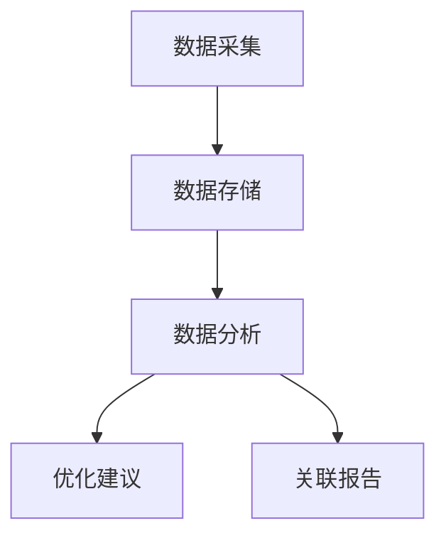

                 


```markdown
# 全球股市估值与可持续城市地下物流系统的关联

> 关键词：全球股市估值、可持续城市物流、地下物流系统、经济影响、系统设计

> 摘要：本文探讨了全球股市估值与可持续城市地下物流系统之间的关联，分析了两者在经济、技术和可持续发展层面的互动。通过建立数学模型和算法，本文展示了如何通过优化物流系统来影响股市估值，同时为城市可持续发展提供新思路。

---

## 第一部分: 全球股市估值与可持续城市地下物流系统的背景与概念

### 第1章: 全球股市估值的现状与挑战

#### 1.1 全球股市估值的背景与意义
##### 1.1.1 全球股市估值的定义与作用
- 股市估值是衡量企业价值的关键指标。
- 通过市盈率（P/E）、市净率（P/B）等指标评估企业投资价值。

##### 1.1.2 当前全球股市估值的主要挑战
- 经济波动、市场情绪对股市估值的影响。
- 可持续性因素逐渐成为影响股市估值的重要因素。

##### 1.1.3 可持续发展视角下的股市估值
- ESG（环境、社会、治理）投资理念的兴起。
- 可持续发展对企业价值和股价的影响。

#### 1.2 可持续城市地下物流系统的概述
##### 1.2.1 可持续城市地下物流系统的定义
- 以可持续发展为目标，利用地下空间优化城市物流。
- 减少交通拥堵和碳排放，提升物流效率。

##### 1.2.2 可持续城市地下物流系统的特征
- 系统集成化：结合智能交通、物联网技术。
- 经济性：降低物流成本，提高效率。
- 环保性：减少碳排放，符合可持续发展理念。

---

### 第2章: 全球股市估值与可持续城市地下物流系统的关联

#### 2.1 经济与物流的相互作用
##### 2.1.1 经济发展与物流系统的关系
- 物流效率影响企业的生产成本和利润。
- 物流成本占企业总成本的比例较高。

##### 2.1.2 全球股市与城市物流的互动机制
- 物流效率提升企业利润，间接影响股价。
- 物流系统优化降低企业成本，提升股价。

##### 2.1.3 可持续发展对股市估值的影响
- ESG投资理念推动企业优化物流系统。
- 可持续物流系统降低企业风险，提升股价稳定性。

#### 2.2 问题背景与研究意义
##### 2.2.1 当前全球经济与物流的矛盾
- 城市化进程加快，交通拥堵问题严重。
- 物流成本上升，企业利润空间被压缩。

##### 2.2.2 可持续城市地下物流系统的必要性
- 解决城市交通拥堵，降低物流成本。
- 提高物流效率，增强企业竞争力。

##### 2.2.3 研究这一关联的学术与实践价值
- 为投资者提供新的视角，优化投资决策。
- 为城市规划者提供可持续发展的新思路。

---

## 第二部分: 核心概念与关联机制

### 第3章: 全球股市估值的核心概念与模型

#### 3.1 股市估值的基本原理
##### 3.1.1 股票价值的评估方法
- 市盈率（P/E）：股价与每股收益的比率。
- 市净率（P/B）：股价与每股净资产的比率。
- 现金流折现模型：将未来现金流折现为当前价值。

#### 3.2 股市估值的数学模型
##### 3.2.1 市盈率模型
- 公式：P/E = 市场价 / 每股收益
- 应用：评估企业盈利能力与市场预期。

##### 3.2.2 市净率模型
- 公式：P/B = 市场价 / 每股净资产
- 应用：评估企业资产质量。

##### 3.2.3 现金流折现模型
- 公式：企业价值 = 现金流 / 折现率
- 应用：评估企业未来现金流的现值。

### 第4章: 可持续城市地下物流系统的原理与特征

#### 4.1 物流系统的核心原理
##### 4.1.1 货物运输的优化算法
- 路径优化：通过算法找到最优运输路径。
- 车辆调度：合理分配运输资源。

#### 4.2 物流系统优化的数学模型
##### 4.2.1 路径优化模型
- 公式：min ∑(距离) → 约束条件：满足货物运输需求。
- 应用：降低物流成本，提高效率。

##### 4.2.2 资源分配模型
- 公式：max ∑(资源利用效率) → 约束条件：资源限制。
- 应用：合理分配物流资源，提高整体效率。

---

## 第三部分: 系统分析与架构设计

### 第5章: 系统功能设计

#### 5.1 系统模块划分
- 数据采集模块：采集股市数据和物流数据。
- 数据分析模块：分析数据，生成关联报告。
- 优化建议模块：根据分析结果，提出优化建议。

#### 5.2 系统架构设计
##### 5.2.1 系统架构图


#### 5.3 系统交互设计
##### 5.3.1 用户交互流程
- 用户输入需求，系统返回优化建议。
- 用户查看关联报告，了解物流系统对股市估值的影响。

#### 5.4 系统接口设计
- 数据接口：与股市数据源和物流系统对接。
- API接口：提供优化建议和关联报告的接口。

---

## 第四部分: 项目实战与案例分析

### 第6章: 环境安装与系统实现

#### 6.1 环境安装
- Python 3.8及以上版本
- 安装依赖库：numpy、pandas、scikit-learn、mermaid、matplotlib

#### 6.2 核心代码实现
##### 数据采集模块
```python
import pandas as pd
import requests

# 采集股市数据
def fetch_stock_data(ticker):
    url = f"https://api.example.com/stock/{ticker}"
    response = requests.get(url)
    return pd.DataFrame(response.json())

# 采集物流数据
def fetch_logistics_data(city):
    url = f"https://api.example.com/logistics/{city}"
    response = requests.get(url)
    return pd.DataFrame(response.json())
```

##### 数据分析模块
```python
from sklearn.linear_model import LinearRegression

# 建立股市估值与物流效率的回归模型
def stock_logistics_regression(stock_data, logistics_data):
    model = LinearRegression()
    model.fit(stock_data[['物流效率']], stock_data['股价'])
    return model

# 预测股价
def predict_stock_price(model, logistics_efficiency):
    return model.predict([[logistics_efficiency]])
```

##### 优化建议模块
```python
import networkx as nx

# 路径优化算法
def optimize_path(start, end, nodes):
    graph = nx.DiGraph()
    for node in nodes:
        graph.add_edge(node['from'], node['to'], weight=node['cost'])
    return nx.shortest_path(graph, start, end, weight='weight')
```

#### 6.3 案例分析
##### 案例背景
- 假设某城市物流效率提升10%，如何影响股市估值？

##### 数据分析
- 采集该城市和相关企业的物流数据与股价数据。
- 建立回归模型，分析物流效率对股价的影响。

##### 结果展示
- 提供优化后的物流路径和股价预测。
- 展示物流效率提升对股价的具体影响。

---

## 第五部分: 最佳实践与总结

### 第7章: 最佳实践与经验分享

#### 7.1 小结
- 全球股市估值与可持续城市地下物流系统密切相关。
- 优化物流系统可以提升企业利润，进而影响股价。

#### 7.2 注意事项
- 数据采集的准确性和及时性。
- 模型的适用性和可解释性。
- 系统的实际操作性和可持续性。

#### 7.3 未来研究方向
- 深入研究物流系统优化的算法。
- 探索更多影响股市估值的因素。
- 推动可持续物流系统的实际应用。

---

## 第六部分: 拓展阅读与参考资料

### 第8章: 拓展阅读

#### 8.1 相关书籍
- 《物流系统优化算法》
- 《股市估值与投资分析》

#### 8.2 网络资源
- 开源项目：物流系统优化代码
- 学术论文：股市估值与物流系统的关联

---

## 作者信息

作者：AI天才研究院/AI Genius Institute & 禅与计算机程序设计艺术 /Zen And The Art of Computer Programming

---

### 感谢您的阅读！
```

