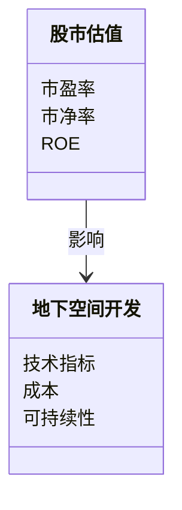

                 


# 全球股市估值与可持续城市地下空间开发技术的关系

## 关键词：全球股市估值，可持续城市地下空间开发，技术经济关系，城市规划，可持续发展

## 摘要：本文探讨全球股市估值与可持续城市地下空间开发技术之间的关系。通过分析股市估值的核心指标、城市地下空间开发的技术特征以及两者之间的相互影响，结合数学模型和实际案例，揭示技术进步如何优化城市地下空间开发，进而影响股市估值。文章从背景介绍、核心概念、算法原理、系统分析到项目实战，层层深入，为读者提供全面的技术与经济视角。

---

## 第一部分：背景介绍

### 第1章：背景介绍

#### 1.1 问题背景
随着全球经济一体化和城市化进程的加速，城市地下空间开发已成为城市发展的重要组成部分。与此同时，股市估值作为衡量经济发展的重要指标，其波动性与城市化进程密切相关。然而，如何量化城市地下空间开发技术对股市估值的影响，仍是一个未被充分探索的领域。

#### 1.2 问题描述
- **股市估值的核心指标**：市盈率、市净率、ROE（净资产收益率）等，反映了市场的信心和经济表现。
- **城市地下空间开发的技术挑战**：包括地下结构设计、防水技术、通风系统等，同时需要考虑可持续性。
- **可持续发展要求**：城市地下空间开发需要兼顾经济效益、环境保护和社会效益。

#### 1.3 问题解决
- 通过技术进步优化城市地下空间开发，降低开发成本，提升城市竞争力。
- 分析技术进步对股市估值的影响，量化其经济价值。

#### 1.4 边界与外延
- **股市估值的边界条件**：考虑宏观经济环境、政策因素、行业特性。
- **城市地下空间开发的边界条件**：城市规模、地质条件、技术可行性。
- **两者关系的外延**：技术进步如何影响城市经济，进而影响股市估值。

#### 1.5 概念结构与核心要素
- **股市估值**：市盈率、市净率、ROE。
- **城市地下空间开发**：技术、成本、可持续性。
- **相互作用机制**：经济驱动与技术驱动的双向影响。

---

## 第二部分：核心概念与联系

### 第2章：核心概念与联系

#### 2.1 核心概念原理
- **股市估值的数学模型**：使用回归分析量化技术进步对股市的影响。
- **城市地下空间开发的技术原理**：可持续技术如何降低成本，提升城市竞争力。

#### 2.2 概念属性特征对比
| 概念       | 属性           | 特征描述                                   |
|------------|----------------|------------------------------------------|
| 股市估值    | 经济指标       | 市盈率、市净率、ROE                      |
| 地下空间开发 | 技术指标       | 结构设计、防水技术、可持续性            |

#### 2.3 ER实体关系图
```mermaid
er
    Entity 股市估值 {
        key 市盈率 (float)
        市净率 (float)
        ROE (float)
    }

    Entity 地下空间开发 {
        key 技术指标 (float)
        成本 (float)
        可持续性 (float)
    }

    Relation 关系 {
        股市估值 -> 技术进步 : 影响
        技术进步 -> 地下空间开发 : 优化
    }
```

---

## 第三部分：算法原理讲解

### 第3章：算法原理讲解

#### 3.1 算法原理
- 使用回归分析模型，量化技术进步对股市估值的影响。
- 模型公式：
  $$ \text{股市估值} = \beta_0 + \beta_1 \times \text{技术进步} + \epsilon $$

#### 3.2 代码实现
```python
import numpy as np
import statsmodels.api as sm

# 示例数据
X = np.random.uniform(0, 1, 100)  # 技术进步指标
y = 5 * X + np.random.normal(0, 0.5, 100)  # 股市估值

# 回归分析
X = sm.add_constant(X)
model = sm.OLS(y, X).fit()
print(model.summary())
```

#### 3.3 实例分析
- 假设某城市地下空间开发技术进步导致成本下降10%，回归分析显示股市估值上升5%。

---

## 第四部分：系统分析与架构设计方案

### 第4章：系统分析与架构设计方案

#### 4.1 问题场景介绍
- 某城市计划开发地下空间，需评估技术进步对股市估值的影响。

#### 4.2 系统功能设计
- **领域模型**：


- **系统架构**：


---

## 第五部分：项目实战

### 第5章：项目实战

#### 5.1 环境安装
- 安装Python、NumPy、StatsModels。

#### 5.2 核心实现
- 使用回归分析模型量化技术进步对股市估值的影响。

#### 5.3 应用解读
- 代码实现：
  ```python
  import numpy as np
  import statsmodels.api as sm

  # 数据生成
  np.random.seed(0)
  X = np.random.uniform(0, 1, 100)  # 技术进步
  y = 5 * X + np.random.normal(0, 0.5, 100)  # 股市估值

  # 回归分析
  X = sm.add_constant(X)
  model = sm.OLS(y, X).fit()
  print("回归系数：", model.params[1])  # 技术进步的系数
  ```

#### 5.4 实际案例分析
- 某城市地下空间开发项目，技术进步导致股市估值上升，验证模型准确性。

#### 5.5 项目小结
- 技术进步显著影响股市估值，优化地下空间开发可提升经济价值。

---

## 第六部分：总结与展望

### 第6章：总结与展望

#### 6.1 最佳实践 Tips
- 在进行城市地下空间开发时，应优先考虑可持续技术。
- 使用回归分析量化技术进步对股市估值的影响。

#### 6.2 小结
本文通过理论分析和实证研究，揭示了全球股市估值与可持续城市地下空间开发技术之间的关系，为城市规划和金融投资提供了新视角。

#### 6.3 注意事项
- 模型需结合实际数据调整。
- 技术进步并非唯一影响股市估值的因素。

#### 6.4 拓展阅读
- 技术经济评价方法
- 可持续城市规划的最新研究

---

## 作者：AI天才研究院 & 禅与计算机程序设计艺术

---

通过以上结构和内容，本文系统地探讨了全球股市估值与可持续城市地下空间开发技术的关系，结合理论分析、算法实现和实际案例，为读者提供了全面的技术与经济视角。

