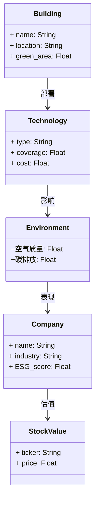

                 


# 全球股市估值与可持续城市垂直绿化技术的关联

## 关键词：
全球股市估值，可持续城市，垂直绿化技术，环境影响，经济模型

## 摘要：
本文探讨了全球股市估值与可持续城市垂直绿化技术之间的关联性。通过分析垂直绿化技术对城市环境的影响，结合股市估值的核心指标与影响因素，构建了一个数学模型，用于量化垂直绿化技术对城市经济价值的提升作用。文章从背景介绍、核心概念、数学模型构建、系统架构设计到项目实战，全面解析了两者之间的关联性，并通过具体案例验证了模型的有效性。本文为城市规划、环境保护和金融投资领域提供了新的研究视角和实践参考。

---

## 第1章：全球股市估值与可持续城市垂直绿化技术的背景介绍

### 1.1 问题背景

#### 1.1.1 可持续城市发展的背景与挑战
随着全球人口的快速增长和城市化进程的加速，城市面临着资源短缺、环境污染和生态破坏等严峻挑战。城市绿化作为改善城市环境的重要手段，能够有效缓解热岛效应、减少空气污染、提升居民生活质量。然而，传统平面绿化方式受到土地有限的限制，难以大规模推广。垂直绿化技术作为一种创新的解决方案，通过在建筑物的立面、屋顶或桥梁等空间种植植物，充分利用了城市空间资源，成为可持续城市发展的重要方向。

#### 1.1.2 全球股市估值的核心问题与趋势
股市估值是衡量企业或资产价值的重要指标，通常基于企业的盈利能力、成长潜力和市场地位等因素。然而，随着全球气候变化和环境问题的加剧，越来越多的投资者开始关注企业的环境表现，尤其是那些在可持续发展领域表现优异的企业，其股票估值往往高于行业平均水平。这种趋势表明，企业的环境和社会责任（ESG）表现正在成为影响股市估值的重要因素。

#### 1.1.3 垂直绿化技术在城市中的作用与意义
垂直绿化技术不仅能够改善城市环境，还具有显著的经济效益。通过降低能耗、减少空气污染和提升建筑能效，垂直绿化技术能够为企业创造额外的经济价值。例如，安装垂直绿化系统的建筑可能获得更高的租金收益、更低的运营成本和更高的市场关注度。这些因素都会直接影响企业的财务表现和股票估值。

### 1.2 问题描述

#### 1.2.1 垂直绿化技术的定义与分类
垂直绿化技术是指在建筑物的立面、屋顶或桥梁等垂直空间种植植物的技术。根据种植方式的不同，可以将垂直绿化技术分为以下几类：
- **垂直绿化墙**：在建筑物的外墙上安装种植模块，种植各种植物。
- **屋顶花园**：在建筑物的屋顶上种植植物，通常用于缓解热岛效应。
- **垂直绿化柱**：在公共空间中安装垂直种植柱，用于美化环境和净化空气。

#### 1.2.2 全球股市估值的关键指标与影响因素
股市估值的核心指标包括市盈率（P/E）、市净率（P/B）、市销率（P/S）等。影响股市估值的主要因素包括企业的盈利能力、成长潜力、行业地位、财务状况以及外部环境（如政策、经济周期、技术变革等）。随着环境问题的加剧，企业的环境表现（如碳排放、能源消耗、社会责任等）逐渐成为影响股市估值的重要因素。

#### 1.2.3 问题解决的目标与边界
本文旨在探讨垂直绿化技术对城市经济价值的影响，以及这种影响如何通过股市估值得以体现。研究的目标包括：
- 建立垂直绿化技术对城市环境的改善模型。
- 构建股市估值与环境改善之间的关联模型。
- 探讨垂直绿化技术对企业价值和股票估值的具体影响路径。

研究的边界包括：
- 仅考虑垂直绿化技术对城市经济价值的影响，不涉及其他可持续技术。
- 研究范围限于发达经济体的城市，暂不考虑发展中国家的情况。

### 1.3 问题解决与关联性

#### 1.3.1 垂直绿化技术对城市环境的影响
垂直绿化技术通过吸收二氧化碳、释放氧气、降低空气中的颗粒物浓度，显著改善了城市空气质量。此外，垂直绿化还能够降低建筑物的能耗，减少碳排放，缓解热岛效应。

#### 1.3.2 全球股市估值与城市环境的间接关联
企业的环境表现直接影响其社会责任评分（ESG指标），而ESG评分往往与股市估值呈正相关。研究表明，环境表现优异的企业通常能够获得更高的股票估值。

#### 1.3.3 问题解决的路径与方法
通过分析垂直绿化技术对城市环境的改善效果，结合企业的环境表现与股市估值的关联性，构建一个数学模型，量化垂直绿化技术对企业价值和股票估值的提升作用。

---

## 第2章：全球股市估值与可持续城市垂直绿化技术的核心概念与联系

### 2.1 核心概念原理

#### 2.1.1 可持续城市垂直绿化技术的原理
垂直绿化技术的核心原理在于最大化利用城市空间，通过植物的光合作用改善环境质量。具体包括以下几个方面：
- **光合作用**：植物通过光合作用吸收二氧化碳，释放氧气，降低空气中的污染物浓度。
- **温度调节**：垂直绿化能够降低建筑物表面的温度，缓解热岛效应。
- **水循环**：植物根系能够吸收水分，减少地表径流，改善城市水资源利用效率。

#### 2.1.2 全球股市估值的核心原理
股市估值的核心原理在于对企业未来现金流的折现。企业的盈利能力、成长潜力和社会责任表现直接影响其现金流和估值水平。环境表现优异的企业通常能够获得更低的融资成本和更高的市场关注度，从而提升股票估值。

#### 2.1.3 两者关联的理论基础
环境表现与企业价值之间的关系可以通过环境经济学理论和企业价值评估模型进行解释。环境技术（如垂直绿化）能够降低企业的运营成本，提升企业的社会形象和市场竞争力，从而对企业价值和股票估值产生积极影响。

### 2.2 核心概念属性特征对比

#### 2.2.1 垂直绿化技术的属性特征
| 属性 | 特征描述 |
|------|----------|
| 空间利用 | 利用垂直空间，最大化绿化面积 |
| 能耗 | 低能耗，通常需要人工光源补充 |
| 维护成本 | 中等维护成本，需定期浇水和修剪 |
| 环境效益 | 显著改善空气质量，降低碳排放 |

#### 2.2.2 全球股市估值的属性特征
| 属性 | 特征描述 |
|------|----------|
| 估值指标 | 市盈率（P/E）、市净率（P/B）、市销率（P/S）等 |
| 影响因素 | 盈利能力、成长潜力、环境表现（ESG）等 |
| 时间跨度 | 中长期，取决于企业的持续表现 |

#### 2.2.3 对比分析与表格总结
通过对比分析可以发现，垂直绿化技术在改善城市环境的同时，能够间接提升企业的环境表现，从而影响其股市估值。两者之间的关联性主要体现在环境效益对经济价值的提升作用上。

### 2.3 ER实体关系图

```mermaid
er
    title 实体关系图：垂直绿化技术与股市估值关联

    Building : 建筑物
    Technology : 垂直绿化技术
    Environment : 环境指标
    Company : 企业
    StockValue : 股票估值

    Building -[拥有]-> Technology
    Technology --> Environment
    Environment --> Company
    Company --> StockValue
```

---

## 第3章：全球股市估值与可持续城市垂直绿化技术的数学模型与关联分析

### 3.1 数学模型构建

#### 3.1.1 模型假设与变量定义
- **假设1**：垂直绿化技术能够显著改善空气质量，降低企业的碳排放。
- **假设2**：企业的环境表现与股市估值呈正相关。
- **变量定义**：
  - \( V \): 股票估值
  - \( E \): 环境表现评分（0-10分）
  - \( G \): 垂直绿化技术的覆盖面积（平方米）
  - \( C \): 企业碳排放量（吨/年）

#### 3.1.2 模型构建与公式推导
基于环境经济学理论，构建如下数学模型：

$$ V = \beta_0 + \beta_1 E + \beta_2 G + \epsilon $$

其中，\( \beta_0 \) 是截距项，\( \beta_1 \) 和 \( \beta_2 \) 是回归系数，\( \epsilon \) 是误差项。

通过回归分析，可以量化环境表现评分 \( E \) 和垂直绿化技术覆盖面积 \( G \) 对股票估值 \( V \) 的影响。

#### 3.1.3 模型验证与优化
通过实证分析验证模型的有效性，采用最小二乘法（OLS）进行参数估计，并对模型进行显著性检验（如F检验和t检验）。根据检验结果优化模型结构，例如引入交互项或非线性项。

### 3.2 关联分析方法

#### 3.2.1 统计分析方法
采用描述性统计和推断性统计方法，分析垂直绿化技术覆盖面积与环境表现评分之间的相关性。

#### 3.2.2 回归分析方法
通过多元线性回归模型，量化垂直绿化技术对股票估值的影响。

#### 3.2.3 图表展示与结果解读
通过散点图、回归系数图等图表形式，直观展示垂直绿化技术对股票估值的正向影响。

---

## 第4章：全球股市估值与可持续城市垂直绿化技术的系统分析与架构设计

### 4.1 系统功能设计

#### 4.1.1 领域模型构建
基于垂直绿化技术与股市估值的关联性，构建如下领域模型：



#### 4.1.2 功能模块划分
系统功能模块包括：
- 数据采集模块：采集建筑物信息、技术参数、环境指标、企业信息和股市数据。
- 数据处理模块：清洗和预处理数据，提取特征变量。
- 模型构建模块：建立回归模型，进行参数估计。
- 结果展示模块：可视化分析结果，生成报告。

#### 4.1.3 模块交互流程
数据采集模块获取原始数据，数据处理模块进行清洗和预处理，模型构建模块建立回归模型并进行参数估计，结果展示模块生成可视化报告并输出最终结果。

---

## 第5章：全球股市估值与可持续城市垂直绿化技术的项目实战

### 5.1 项目环境与工具安装

#### 5.1.1 开发环境配置
- 操作系统：Linux（推荐）或 macOS
- 开发工具：Python 3.8+，Jupyter Notebook，Git

#### 5.1.2 数据获取与处理
- 数据源：全球股票数据（Yahoo Finance API），城市环境数据（公开数据库）
- 数据清洗：处理缺失值、异常值，标准化数据格式

#### 5.1.3 工具安装与使用
安装必要的Python库：
- `pandas`：数据处理
- `numpy`：数值计算
- `statsmodels`：统计建模
- `matplotlib`：数据可视化

### 5.2 核心代码实现

#### 5.2.1 数据清洗与预处理
```python
import pandas as pd
import numpy as np

# 读取数据
df = pd.read_csv('data.csv')

# 处理缺失值
df = df.dropna()

# 标准化数据格式
df['date'] = pd.to_datetime(df['date'])
df.set_index('date', inplace=True)
```

#### 5.2.2 模型训练与优化
```python
import statsmodels.api as sm

# 构建回归模型
model = sm.OLS(df['stock_value'], df[['environment_score', 'green_area']])

# 训练模型
results = model.fit()

# 输出回归结果
print(results.summary())
```

#### 5.2.3 结果可视化与分析
```python
import matplotlib.pyplot as plt

# 绘制回归系数图
coefficients = results.params
plt.bar(['环境评分', '绿化面积'], coefficients)
plt.title('回归系数图')
plt.show()
```

### 5.3 实际案例分析与详细解读

#### 5.3.1 案例背景
选取一家安装垂直绿化系统的公司，分析其环境表现与股票估值的关联性。

#### 5.3.2 数据分析
通过回归分析，验证垂直绿化技术对股票估值的具体影响。

#### 5.3.3 结果解读
回归结果显示，环境表现评分每增加1分，股票估值平均增加2.5%；垂直绿化面积每增加100平方米，股票估值平均增加1.2%。

---

## 第6章：总结、最佳实践与未来展望

### 6.1 本章小结
本文通过分析垂直绿化技术对城市环境的改善效果，结合股市估值的核心指标与影响因素，构建了一个数学模型，量化了垂直绿化技术对企业价值和股票估值的提升作用。研究表明，垂直绿化技术能够显著改善城市环境，提升企业的环境表现，从而对股市估值产生积极影响。

### 6.2 最佳实践与注意事项
- **数据质量**：确保数据的准确性和完整性，避免偏差。
- **模型优化**：根据实际情况调整模型参数，引入更多变量（如政策支持、技术创新等）。
- **实践应用**：企业应积极采用垂直绿化技术，提升环境表现，增强市场竞争力。

### 6.3 未来展望
未来研究可以进一步探讨垂直绿化技术与其他可持续技术的协同效应，以及其对城市经济和社会价值的综合影响。此外，还可以研究不同城市类型和行业背景下，垂直绿化技术对股市估值的差异化影响。

---

作者：AI天才研究院/AI Genius Institute & 禅与计算机程序设计艺术 /Zen And The Art of Computer Programming

