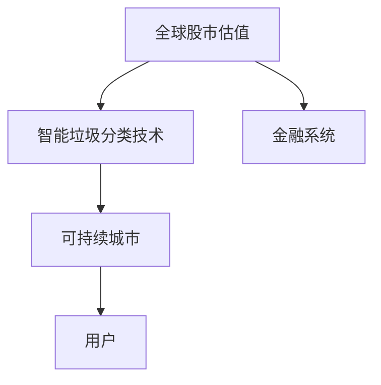
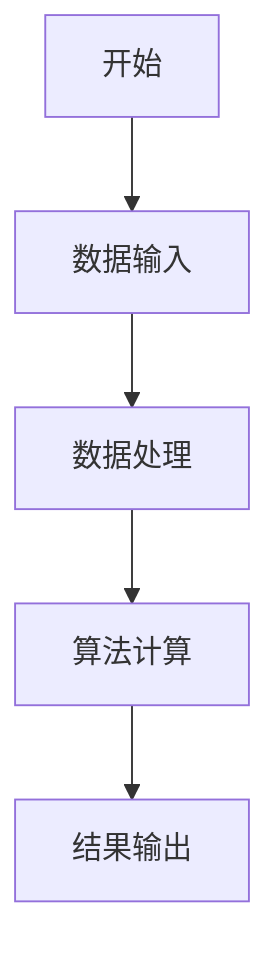
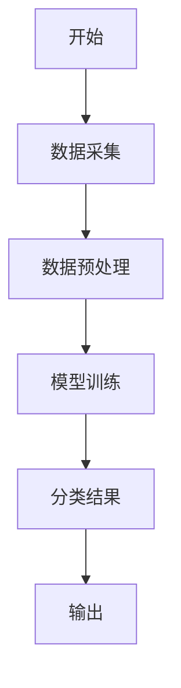
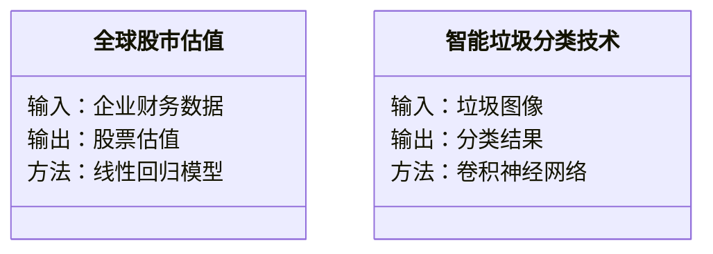
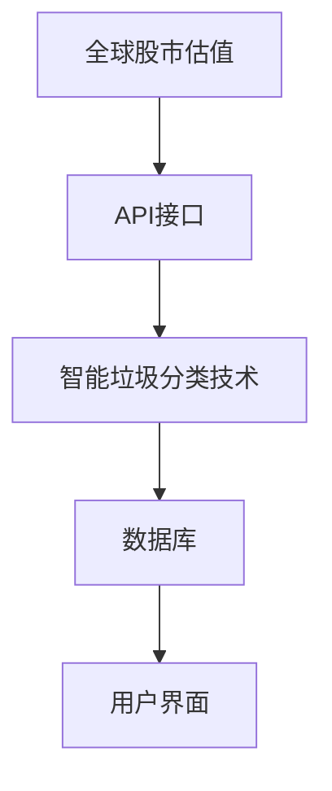
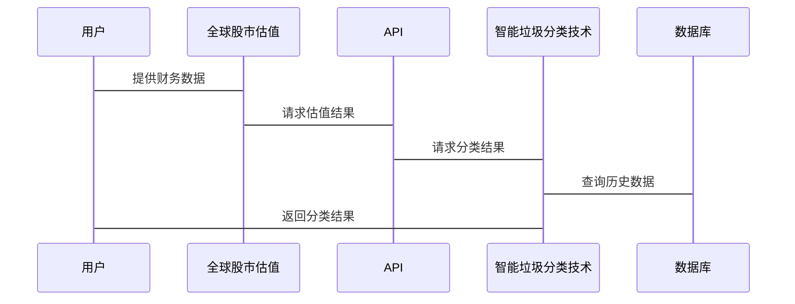

                 


# 全球股市估值与可持续城市智能垃圾分类技术的关系

> **关键词**：全球股市估值、智能垃圾分类、可持续城市、技术关系、经济影响

> **摘要**：本文探讨了全球股市估值与可持续城市智能垃圾分类技术之间的潜在联系。通过分析股市估值的核心概念与智能垃圾分类技术的关键要素，揭示两者在数据驱动、技术创新和系统优化方面的协同关系。文章从算法原理、系统架构到项目实战，详细阐述了如何将智能垃圾分类技术与股市估值相结合，为可持续城市发展提供新思路。

---

## 第1章: 全球股市估值与可持续城市智能垃圾分类技术的背景介绍

### 1.1 问题背景

#### 1.1.1 全球股市估值的重要性
全球股市估值是衡量市场健康状况的重要指标。通过分析企业的市盈率（PE）、市净率（PB）和现金流折现法，投资者可以评估企业的内在价值。股市估值不仅影响个人投资决策，还影响国家经济政策。

#### 1.1.2 可持续城市智能垃圾分类技术的必要性
随着城市化进程的加快，垃圾处理已成为可持续城市发展的重要挑战。智能垃圾分类技术通过物联网、AI和大数据，优化垃圾收集、分类和处理流程，减少环境污染，提高资源利用率。

#### 1.1.3 两者关系的研究意义
研究全球股市估值与智能垃圾分类技术的关系，有助于理解技术创新如何影响经济价值，以及经济波动如何反作用于技术创新。这种双向影响为可持续城市发展提供了新的视角。

### 1.2 问题描述

#### 1.2.1 全球股市估值的核心问题
如何通过数学模型准确评估企业价值？股市波动如何影响企业投资？

#### 1.2.2 智能垃圾分类技术的挑战
如何提高分类准确率？如何降低运营成本？

#### 1.2.3 两者的潜在联系
智能垃圾分类技术的投资可能影响企业估值，而股市波动可能影响技术推广速度。

### 1.3 问题解决

#### 1.3.1 全球股市估值的解决方案
采用动态资产定价模型，结合市场情绪和企业基本面进行估值。

#### 1.3.2 智能垃圾分类技术的创新
开发AI分类系统和物联网设备，优化垃圾处理流程。

#### 1.3.3 两者的协同优化
通过数据共享和模型优化，实现技术创新与经济价值的协同提升。

### 1.4 边界与外延

#### 1.4.1 全球股市估值的边界
限于公开市场数据，不考虑内部信息和非法操作。

#### 1.4.2 智能垃圾分类技术的边界
限于城市垃圾处理，不包括工业废物。

#### 1.4.3 两者关系的外延
关注技术创新对经济的影响，不涉及政策干预。

### 1.5 概念结构与核心要素组成

#### 1.5.1 全球股市估值的核心要素
- 企业基本面（收入、利润）
- 市场情绪（投资者心理）
- 宏观经济指标（GDP、利率）

#### 1.5.2 智能垃圾分类技术的核心要素
- 数据采集（传感器）
- AI算法（分类模型）
- 物联网（设备连接）

#### 1.5.3 两者的关联机制
- 数据共享：垃圾分类产生的数据可用于优化股市模型。
- 技术驱动：AI技术同时推动垃圾分类和股市预测。
- 经济反馈：技术创新提升企业估值。

---

## 第2章: 全球股市估值与可持续城市智能垃圾分类技术的核心概念与联系

### 2.1 核心概念原理

#### 2.1.1 全球股市估值的原理
通过分析企业财务数据和市场情绪，预测股票价格。常用模型包括CAPM和APT。

#### 2.1.2 智能垃圾分类技术的原理
利用传感器和AI算法，实现垃圾的自动分类和高效处理。

#### 2.1.3 两者的关联原理
两者都依赖数据驱动的优化，技术创新推动经济价值提升。

### 2.2 核心概念属性特征对比

| 属性 | 全球股市估值 | 智能垃圾分类技术 |
|------|--------------|------------------|
| 数据源 | 财务报表、市场情绪 | 物联网数据、图像数据 |
| 技术工具 | 金融模型、统计分析 | AI算法、传感器 |
| 目标 | 评估企业价值 | 提高垃圾分类效率 |
| 应用场景 | 金融投资 | 城市管理 |

### 2.3 ER实体关系图架构



---

## 第3章: 全球股市估值与可持续城市智能垃圾分类技术的算法原理

### 3.1 算法原理概述

#### 3.1.1 全球股市估值的算法
- 线性回归模型预测股价。
- 支持向量机（SVM）分析市场情绪。

#### 3.1.2 智能垃圾分类技术的算法
- 使用卷积神经网络（CNN）识别垃圾类型。
- 优化算法（如遗传算法）优化垃圾收集路径。

#### 3.1.3 两者的算法对比
股市估值算法注重数据拟合，垃圾分类算法注重分类准确率。

### 3.2 算法流程图

#### 3.2.1 全球股市估值算法流程图



#### 3.2.2 智能垃圾分类算法流程图



### 3.3 数学模型与公式

#### 3.3.1 全球股市估值模型
股票价格预测公式：
$$ P = \alpha + \beta \times (收入增长率) + \epsilon $$
其中，$\alpha$ 是截距，$\beta$ 是回归系数，$\epsilon$ 是误差项。

#### 3.3.2 智能垃圾分类模型
卷积神经网络分类公式：
$$ y = \text{softmax}(Wx + b) $$

---

## 第4章: 全球股市估值与可持续城市智能垃圾分类技术的系统分析与架构设计

### 4.1 系统功能设计

#### 4.1.1 领域模型设计


#### 4.1.2 系统架构设计


### 4.2 系统接口设计

#### 4.2.1 全球股市估值接口
- 输入：企业财务数据
- 输出：股票估值结果

#### 4.2.2 智能垃圾分类接口
- 输入：垃圾图像
- 输出：分类标签

### 4.3 系统交互设计



---

## 第5章: 全球股市估值与可持续城市智能垃圾分类技术的项目实战

### 5.1 环境安装

#### 5.1.1 全球股市估值环境
- Python 3.8+
- NumPy、Pandas、Scikit-learn

#### 5.1.2 智能垃圾分类技术环境
- TensorFlow、Keras、OpenCV

### 5.2 系统核心实现源代码

#### 5.2.1 全球股市估值代码

```python
import numpy as np
import pandas as pd
from sklearn.linear_model import LinearRegression

# 数据处理
data = pd.DataFrame({
    '收入增长率': [0.1, 0.15, 0.2, 0.08, 0.12],
    '股票价格': [100, 120, 150, 80, 130]
})

# 模型训练
model = LinearRegression()
model.fit(data[['收入增长率']], data['股票价格'])

# 预测
new_data = pd.DataFrame({'收入增长率': [0.1, 0.12, 0.15]})
predictions = model.predict(new_data)
print("预测股票价格:", predictions)
```

#### 5.2.2 智能垃圾分类代码

```python
import cv2
import numpy as np
from tensorflow.keras.models import Sequential
from tensorflow.keras.layers import Conv2D, MaxPooling2D, Flatten, Dense

# 数据预处理
def preprocess_image(image_path):
    image = cv2.imread(image_path)
    image = cv2.resize(image, (100, 100))
    image = image / 255.0
    return image

# 模型训练
model = Sequential([
    Conv2D(32, (3,3), activation='relu', input_shape=(100, 100, 3)),
    MaxPooling2D((2,2)),
    Conv2D(64, (3,3), activation='relu'),
    MaxPooling2D((2,2)),
    Flatten(),
    Dense(128, activation='relu'),
    Dense(5, activation='softmax')
])

model.compile(optimizer='adam', loss='sparse_categorical_crossentropy', metrics=['accuracy'])
model.fit(x_train, y_train, epochs=10, batch_size=32)
```

### 5.3 案例分析与项目总结

#### 5.3.1 应用场景分析
- 企业通过智能垃圾分类技术优化运营成本，提升股市估值。
- 投资者通过股市数据优化投资决策，推动技术创新。

#### 5.3.2 项目小结
本项目展示了如何将全球股市估值与智能垃圾分类技术结合，实现经济与环境的双重优化。

---

## 第6章: 总结与展望

### 6.1 总结
本文探讨了全球股市估值与智能垃圾分类技术的关系，分析了两者在数据驱动、技术创新和系统优化方面的协同作用。通过算法原理、系统设计和项目实战，展示了如何将技术应用于实际场景。

### 6.2 展望
未来，随着AI和大数据技术的进步，智能垃圾分类技术将进一步优化股市估值模型，推动可持续城市发展。同时，股市的波动也可能为技术创新提供更多的资金支持。

### 6.3 最佳实践 Tips
- 在实施智能垃圾分类技术前，需考虑数据隐私和系统兼容性问题。
- 投资者应关注技术创新对股市的长期影响，避免短期波动干扰决策。

---

## 作者：AI天才研究院/AI Genius Institute & 禅与计算机程序设计艺术 /Zen And The Art of Computer Programming

