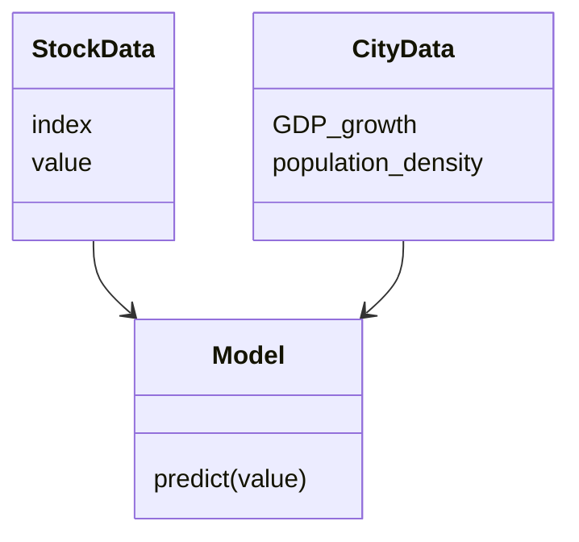

                 

# 全球股市估值与可持续城市规划的关联

## 关键词：全球股市估值、可持续城市规划、数据驱动、机器学习、数学模型

## 摘要

本文探讨了全球股市估值与可持续城市规划之间的关联性，通过数据驱动的方法，结合机器学习和数学模型，分析两者之间的相互作用。文章首先介绍了股市估值和可持续城市规划的核心概念，然后从数据收集、算法原理、数学模型等多个维度展开分析，最后通过项目实战和案例分析，验证了两者之间的关联性，并提出了相关的最佳实践建议。

---

# 第一部分: 全球股市估值与可持续城市规划的背景与关联

## 第1章: 全球股市估值与可持续城市规划的背景

### 1.1 问题背景与描述

#### 1.1.1 全球股市估值的现状与挑战

全球股市估值是衡量市场健康程度的重要指标。随着经济全球化和金融市场的复杂化，股市估值的波动性显著增加。投资者和政策制定者需要更精确的方法来预测股市走势，以应对全球经济的不确定性。

#### 1.1.2 可持续城市规划的核心概念

可持续城市规划旨在通过优化城市空间布局、资源利用和环境保护，实现经济、社会和环境的协调发展。它强调绿色建筑、公共交通、可再生能源等关键要素，以降低城市发展的环境代价。

#### 1.1.3 两者的关联性与研究意义

股市估值反映了经济活动的活跃程度，而城市规划则是经济发展的重要基础。通过研究两者的关联性，可以更好地理解城市化进程对金融市场的影响，为投资者和政策制定者提供科学依据。

---

## 第2章: 全球股市估值的核心概念与原理

### 2.1 股市估值的基本原理

#### 2.1.1 股票估值的定义与方法

股票估值是通过对公司财务状况、市场环境和行业趋势等多方面因素的分析，估算股票的内在价值。常用的方法包括DCF模型、市盈率法和市净率法。

#### 2.1.2 主要估值模型的介绍

- **DCF模型**：通过预测公司未来现金流，贴现至现值，估算公司股权价值。
- **市盈率法**：通过比较股票价格与每股收益的比率，评估股票的合理价格。

#### 2.1.3 影响股市估值的主要因素

- **宏观经济因素**：GDP增长率、利率水平、通货膨胀率等。
- **行业因素**：行业发展趋势、政策法规等。
- **公司因素**：盈利能力、财务状况、管理团队等。

---

## 第3章: 可持续城市规划的核心要素

### 3.1 城市规划的基本概念

城市规划是通过对土地使用、交通网络、公共设施等的合理布局，优化城市功能和空间结构。可持续城市规划强调资源的高效利用和环境的保护。

### 3.2 可持续发展的核心要素

- **绿色建筑**：采用节能技术，减少能源消耗。
- **公共交通**：发展地铁、公交等低碳交通方式。
- **可再生能源**：推广太阳能、风能等清洁能源的使用。

---

## 第4章: 可持续城市规划与股市估值的关联性分析

### 4.1 核心概念的联系与对比

#### 4.1.1 股市估值与城市经济的相互作用

城市经济的活跃程度直接影响股市估值。例如，一个城市的GDP增长可能带动当地企业的盈利水平，进而影响股市表现。

#### 4.1.2 可持续城市规划对股市的影响

可持续城市规划通过优化城市功能和环境，吸引投资，提升企业盈利能力，从而影响股市估值。

#### 4.1.3 经济、社会、环境三者的平衡关系

可持续城市规划强调经济、社会和环境的平衡发展，这有助于降低股市的波动性，提升市场的稳定性。

---

## 第5章: 数据驱动的关联性分析方法

### 5.1 数据收集与处理

#### 5.1.1 股市数据的获取与清洗

通过金融数据API获取全球主要股市的指数数据，清洗缺失值和异常值。

#### 5.1.2 城市规划相关数据的获取与处理

收集城市GDP、人口密度、绿色建筑比例等数据，进行标准化处理。

#### 5.1.3 数据融合与特征提取

将股市数据与城市规划数据进行融合，提取相关特征，如城市GDP增长率与股市指数的相关性。

---

## 第6章: 基于机器学习的关联性预测模型

### 6.1 算法原理与数学模型

#### 6.1.1 线性回归模型的数学公式

$$ y = \beta_0 + \beta_1x + \epsilon $$

其中，$y$ 是股市指数，$x$ 是城市GDP增长率，$\beta_0$ 和 $\beta_1$ 是回归系数，$\epsilon$ 是误差项。

#### 6.1.2 逻辑回归模型的数学公式

$$ P(Y=1|x) = \frac{1}{1 + e^{-\beta_0 - \beta_1x}} $$

---

## 第7章: 项目实战与案例分析

### 7.1 环境安装

#### 7.1.1 Python环境的安装与配置

安装Python 3.8及以上版本，安装Pandas、Scikit-learn等库。

### 7.2 系统功能设计

#### 7.2.1 领域模型类图

---

## 第8章: 最佳实践与总结

### 8.1 小结

通过数据驱动的方法，结合机器学习和数学模型，可以有效分析全球股市估值与可持续城市规划之间的关联性。

### 8.2 注意事项

- 数据质量对模型准确性有重要影响。
- 模型的可解释性需要进一步优化。

### 8.3 拓展阅读

建议读者进一步阅读《数据驱动的城市规划》和《金融数据分析与机器学习》等书籍。

---

作者：AI天才研究院/AI Genius Institute & 禅与计算机程序设计艺术 /Zen And The Art of Computer Programming

