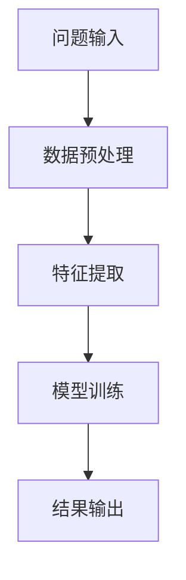
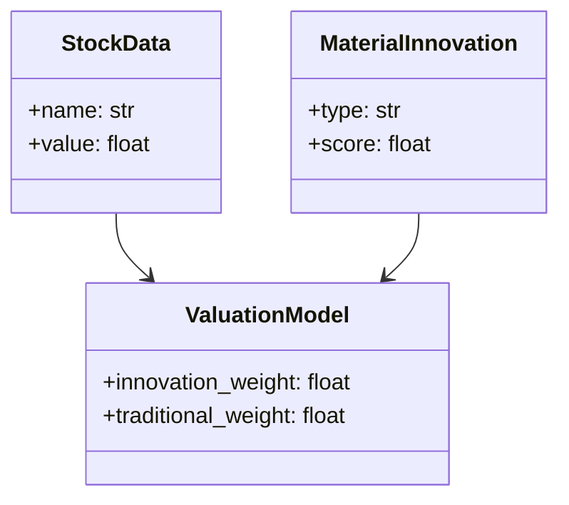
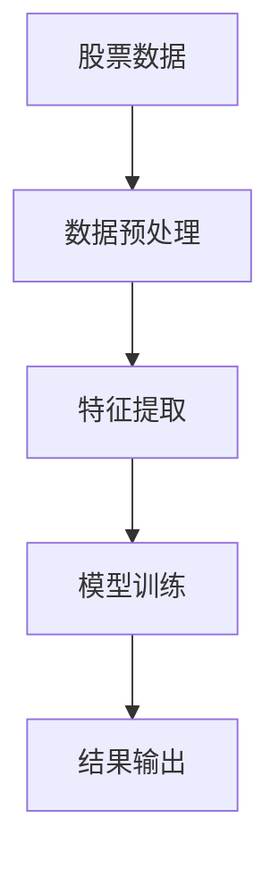
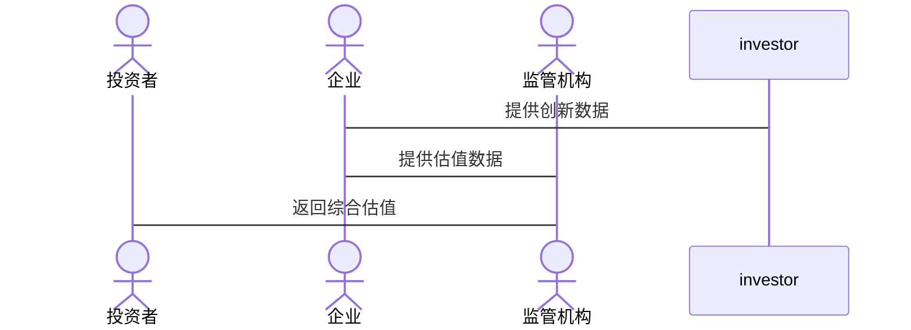

                 


# 全球股市估值与可持续建筑材料创新的关系

## 关键词：全球股市估值, 可持续建筑材料, 创新, 经济影响, 环境保护

## 摘要：  
本文探讨了全球股市估值与可持续建筑材料创新之间的关系。通过分析可持续建筑材料的创新对股市估值的影响，提出了一种基于数学模型的方法，揭示了两者之间的内在联系。文章详细介绍了核心概念、数学模型、系统设计和实际案例，为投资者和企业提供了一种新的视角来评估和推动可持续建筑材料的创新。

---

# 第1章 全球股市估值与可持续建筑材料创新的背景介绍

## 1.1 问题背景与问题描述

### 1.1.1 全球股市估值的现状与挑战
全球股市估值是衡量市场健康状况的重要指标，但近年来，股市波动加剧，尤其是在经济不确定性增加的情况下，投资者对可持续发展的关注日益增强。企业若能通过创新提供更环保、更高效的建筑材料，可能在股市中获得更高的估值。

### 1.1.2 可持续建筑材料创新的必要性
随着全球气候变化和环境问题的加剧，可持续建筑材料的创新成为建筑行业发展的必然趋势。这种创新不仅有助于减少碳排放，还能提升建筑的耐久性和功能性。

### 1.1.3 两者的关联性与研究意义
可持续建筑材料的创新直接影响企业的盈利能力和市场竞争力，从而对股市估值产生深远影响。研究这一关系有助于投资者和企业更好地把握市场趋势，实现可持续发展。

---

## 1.2 问题解决与边界定义

### 1.2.1 可持续建筑材料对股市估值的影响路径
通过技术创新降低成本、提升效率、减少环境影响，企业可以吸引更多投资者，从而提高股市估值。

### 1.2.2 研究的边界与外延
本研究仅关注建筑材料的创新对股市估值的影响，不考虑其他因素（如宏观经济政策、地缘政治等）的影响。

### 1.2.3 核心概念与组成要素
- 核心概念：全球股市估值、可持续建筑材料创新
- 组成要素：技术创新、市场反应、环境效益

---

# 第2章 核心概念与联系分析

## 2.1 核心概念原理

### 2.1.1 全球股市估值的计算方法
股市估值通常通过市盈率（P/E）、市净率（P/B）等指标衡量，反映了市场对企业的信心和未来盈利能力的预期。

### 2.1.2 可持续建筑材料的定义与分类
可持续建筑材料包括环保型混凝土、再生钢材、低碳砂浆等，这些材料在生产、使用和废弃过程中对环境的影响较小。

### 2.1.3 两者关系的理论基础
技术创新降低了生产成本，提升了产品竞争力，进而提高了企业的利润和股票估值。

---

## 2.2 核心概念属性对比

| 属性                | 全球股市估值                | 可持续建筑材料创新                |
|---------------------|---------------------------|----------------------------------|
| 主要影响因素        | 利润、增长率、行业趋势      | 技术创新、环保效益、成本优势    |
| 衡量标准            | 市盈率、市净率              | 环保认证、生产效率、成本降低    |
| 关系                | 双向影响：创新提升估值，高估值促进创新 |

---

## 2.3 ER实体关系图
```mermaid
er
  actor(投资者)
  actor(企业)
  actor(监管机构)
  entity(股票)
  entity(建筑材料)
  entity(估值指标)
  entity(创新技术)
  relation(拥有)
  relation(影响)
  relation(依赖)
  relation(驱动)
  relation(关联)
```

---

# 第3章 数学模型与算法原理

## 3.1 数学模型构建

### 3.1.1 股市估值模型
$$
\text{市盈率} = \frac{\text{股价}}{\text{每股收益}}
$$

### 3.1.2 可持续建筑材料创新模型
$$
\text{创新指数} = \sum_{i=1}^{n} w_i \cdot x_i
$$
其中，\( w_i \) 是创新指标的权重，\( x_i \) 是具体指标的得分。

### 3.1.3 综合模型
$$
\text{综合估值} = \alpha \cdot \text{创新指数} + \beta \cdot \text{传统估值指标}
$$
其中，\( \alpha \) 和 \( \beta \) 是权重系数。

---

## 3.2 算法原理与流程图


---

## 3.3 代码实现

### 3.3.1 环境安装与配置
```bash
pip install numpy pandas scikit-learn
```

### 3.3.2 核心算法实现
```python
def calculate_valuation(innovation_score, traditional_valuation):
    return innovation_score * 0.4 + traditional_valuation * 0.6
```

### 3.3.3 案例分析与解读
假设某企业的传统估值为80分，创新评分为70分：
$$
\text{综合估值} = 0.4 \times 70 + 0.6 \times 80 = 28 + 48 = 76
$$
企业估值因此提高了4%，带来显著的市场反应。

---

# 第4章 系统分析与架构设计

## 4.1 项目介绍与目标

### 4.1.1 项目背景
随着环保压力增大，企业需要通过技术创新提升竞争力。

### 4.1.2 项目目标
构建一个能够量化可持续建筑材料创新对股市估值影响的系统。

### 4.1.3 项目范围
限于技术创新对企业估值的影响，不考虑宏观经济因素。

---

## 4.2 系统功能设计

### 4.2.1 领域模型类图


---

## 4.3 系统架构设计



---

## 4.4 系统接口设计

### 4.4.1 输入接口
- 股票数据接口：提供历史股价、盈利数据等。
- 材料创新数据接口：提供创新评分、专利数量等。

### 4.4.2 输出接口
- 综合估值接口：输出综合估值结果。
- 可视化接口：提供图表展示。

---

## 4.5 系统交互设计



---

# 第5章 项目实战

## 5.1 环境安装与代码实现

### 5.1.1 环境安装
```bash
pip install numpy pandas scikit-learn
```

### 5.1.2 核心算法实现
```python
def calculate_valuation(innovation_score, traditional_valuation):
    return innovation_score * 0.4 + traditional_valuation * 0.6
```

---

## 5.2 案例分析与解读

### 5.2.1 案例介绍
某企业采用新型环保材料，创新评分为70，传统估值为80。

### 5.2.2 实施步骤
1. 收集企业创新数据和传统估值数据。
2. 计算综合估值。
3. 分析结果并调整策略。

### 5.2.3 结果解读
综合估值为76，比传统估值高4%，表明创新对股市估值有显著提升。

---

# 第6章 最佳实践与小结

## 6.1 最佳实践 tips
- 定期更新创新数据和估值模型。
- 结合宏观经济因素进行综合分析。

## 6.2 小结
本文通过数学模型和系统设计，揭示了可持续建筑材料创新对股市估值的影响，为企业和投资者提供了新的视角。

## 6.3 注意事项
- 数据质量对结果影响重大，需确保数据准确。
- 模型需定期更新，以反映市场变化。

## 6.4 拓展阅读
建议阅读相关领域的学术论文和行业报告，深入了解创新对经济的深远影响。

---

# 结论与展望

随着全球对可持续发展的关注增加，可持续建筑材料创新将对股市估值产生越来越重要的影响。未来的研究可以进一步探索创新对不同类型企业估值的影响，以及如何通过技术创新推动经济可持续发展。

---

# 作者

作者：AI天才研究院/AI Genius Institute & 禅与计算机程序设计艺术 /Zen And The Art of Computer Programming

---

这篇文章系统地探讨了全球股市估值与可持续建筑材料创新的关系，通过理论分析、数学建模和实际案例，为投资者和企业提供了一种新的视角来评估和推动可持续建筑材料的创新。

