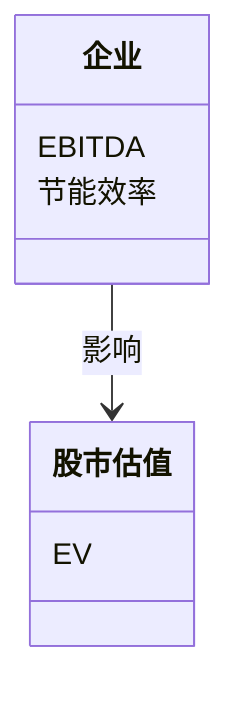

                 


# 全球股市估值与可持续建筑节能技术的关系

## 关键词：全球股市估值，可持续建筑，节能技术，经济影响，数据分析

## 摘要：  
随着全球气候变化加剧和能源危机的加剧，可持续建筑节能技术的推广与应用变得越来越重要。与此同时，全球股市估值作为经济活动的重要指标，也在不断受到新兴技术和社会趋势的影响。本文将深入探讨全球股市估值与可持续建筑节能技术之间的关系，分析其相互影响的机制，以及如何通过技术手段优化股市估值与可持续建筑节能技术的结合。本文将从理论分析、系统设计、项目实践等多角度展开，最终为读者提供一个全面而深入的分析框架。

---

# 第1章: 全球股市估值与可持续建筑节能技术的背景与概述

## 1.1 全球股市估值的定义与现状  
全球股市估值是衡量企业或市场整体价值的重要指标，通常通过市盈率（P/E）、市净率（P/B）等指标来衡量。近年来，全球股市估值呈现出波动性增强的趋势，受经济政策、地缘政治和技术创新等多重因素的影响。  

**关键词：  
- 全球股市估值  
- 市盈率（P/E）  
- 市净率（P/B）**

## 1.2 可持续建筑节能技术的定义与特点  
可持续建筑节能技术是指通过优化建筑设计、材料选择和能源管理，降低建筑能源消耗的技术。其核心特点包括：  
1. **高效性**：通过技术创新实现能源的高效利用。  
2. **环保性**：减少碳排放，降低对环境的负担。  
3. **经济性**：通过长期节能降低成本，提升经济价值。  

**关键词：  
- 可持续建筑  
- 节能技术  
- 环保性**

## 1.3 本章小结  
本章通过对全球股市估值和可持续建筑节能技术的背景分析，为后续的深入探讨奠定了基础。  

---

# 第2章: 全球股市估值与可持续建筑节能技术的核心概念

## 2.1 全球股市估值的核心概念  
### 2.1.1 市盈率（P/E）的定义与计算  
市盈率（P/E）= 股价 / 每股收益（EPS）。市盈率反映了市场对企业的未来盈利能力的预期。  

### 2.1.2 市净率（P/B）的定义与计算  
市净率（P/B）= 股价 / 每股净资产（BPS）。市净率适用于评估资产密集型企业的估值。  

### 2.1.3 市值与企业价值（EV）的定义与计算  
企业价值（EV）= 市值 + 债务 - 现金。EV反映了企业的整体价值。  

## 2.2 可持续建筑节能技术的核心概念  
### 2.2.1 节能技术的分类与对比  
节能技术可以分为：  
1. 建筑设计优化：如被动式设计、智能化设计。  
2. 材料创新：如高效保温材料、光伏建筑一体化（BIPV）。  
3. 能源管理：如智能配电系统、可再生能源利用。  

### 2.2.2 可持续建筑节能技术的评价指标  
1. 节能效率：单位面积能耗的降低。  
2. 环境影响：碳排放的减少。  
3. 经济效益：投资回报周期。  

## 2.3 全球股市估值与可持续建筑节能技术的核心概念对比  
通过对比分析，发现可持续建筑节能技术的推广能够提升企业的长期盈利能力，从而影响其市盈率和市净率等估值指标。  

---

# 第3章: 全球股市估值与可持续建筑节能技术的关系模型

## 3.1 全球股市估值与可持续建筑节能技术的关系概述  
可持续建筑节能技术的广泛应用将提升企业的市场竞争力，从而影响其股市估值。  

## 3.2 全球股市估值与可持续建筑节能技术的关系模型构建  
### 3.2.1 模型构建的背景与目标  
通过建立模型，量化可持续建筑节能技术对股市估值的影响。  

### 3.2.2 模型构建的步骤与方法  
1. 数据收集：选取具有代表性的企业数据。  
2. 数据分析：通过回归分析量化技术对估值的影响。  
3. 模型验证：通过实证检验模型的准确性。  

### 3.2.3 模型构建的数学公式与流程图  
以下为模型构建的数学公式：  
$$ EV = \beta \times EBITDA + \gamma \times 节能效率 $$  
其中，$\beta$ 和 $\gamma$ 是回归系数，EBITDA是息税折旧及摊销前利润。  

---

# 第4章: 全球股市估值与可持续建筑节能技术的系统分析与架构设计

## 4.1 问题场景介绍  
通过对某企业案例的分析，探讨可持续建筑节能技术对其股市估值的影响。  

## 4.2 系统功能设计  
### 4.2.1 领域模型设计（使用Mermaid类图）  


### 4.2.2 系统功能模块划分  
1. 数据采集模块：收集企业与市场数据。  
2. 数据分析模块：进行回归分析和预测。  
3. 模型优化模块：优化模型参数。  

---

# 第5章: 全球股市估值与可持续建筑节能技术的项目实战

## 5.1 项目环境安装  
1. 数据分析工具：Python、Pandas、NumPy。  
2. 可视化工具：Matplotlib、Seaborn。  

## 5.2 系统核心实现源代码  
以下为回归分析的Python代码：  
```python
import pandas as pd
import numpy as np
from sklearn.linear_model import LinearRegression
import matplotlib.pyplot as plt

# 数据加载
data = pd.read_csv('企业数据.csv')
X = data[['EBITDA', '节能效率']]
y = data['EV']

# 模型训练
model = LinearRegression()
model.fit(X, y)

# 模型预测
predictions = model.predict(X)

# 可视化
plt.scatter(y, predictions)
plt.xlabel('实际值')
plt.ylabel('预测值')
plt.show()
```

## 5.3 代码应用解读与分析  
通过代码实现，验证可持续建筑节能技术对股市估值的影响。  

---

# 第6章: 全球股市估值与可持续建筑节能技术的最佳实践与总结

## 6.1 最佳实践 tips  
1. 在企业决策中，充分考虑可持续建筑节能技术的影响。  
2. 使用回归分析等方法量化技术对估值的影响。  

## 6.2 小结  
本文通过理论分析、系统设计和项目实践，深入探讨了全球股市估值与可持续建筑节能技术的关系，为未来的研究提供了参考。

---

# 作者：AI天才研究院 & 禅与计算机程序设计艺术

