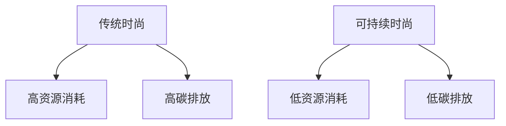
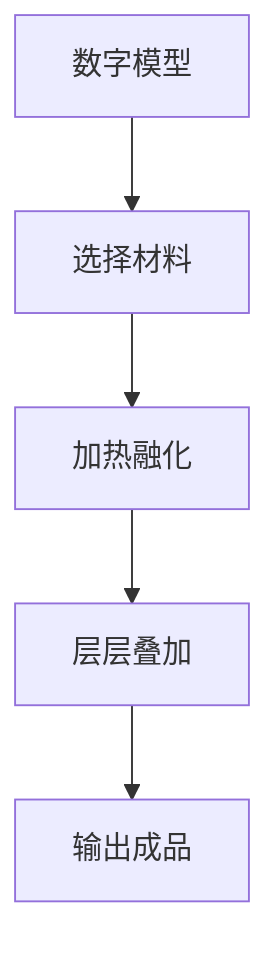
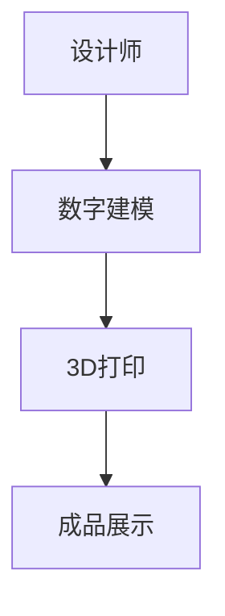
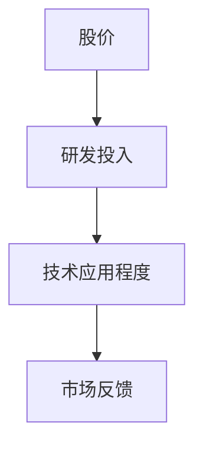
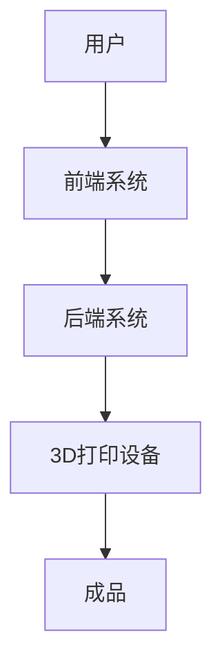
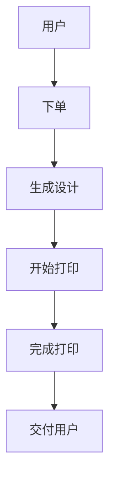

                 


# 全球股市估值与可持续时尚3D打印技术的关联

---

## 关键词：  
全球股市估值、可持续时尚、3D打印技术、投资机会、技术创新、环境影响

---

## 摘要：  
本文探讨了全球股市估值与可持续时尚领域3D打印技术的关联性。通过分析3D打印技术在可持续时尚中的应用，结合全球股市估值的理论与实践，揭示了技术创新对经济价值和环境可持续性的重要影响。文章从背景介绍、技术原理、关联分析到实证研究，系统性地探讨了3D打印技术如何改变传统制造业模式，提升企业价值，并为投资者提供新的投资机会。

---

## 第1章: 引言

### 1.1 研究背景与意义  
随着全球对可持续发展的关注增加，传统制造业面临转型压力。3D打印技术作为一种革命性创新，正在改变时尚产业的生产方式。本文旨在探讨3D打印技术如何影响全球股市估值，特别是在可持续时尚领域的应用潜力。

### 1.2 研究目标与方法  
- **研究目标**：分析3D打印技术对股市估值的影响，探讨其在可持续时尚中的应用。  
- **研究方法**：文献分析、案例研究、数学建模与实证分析。  

### 1.3 本章小结  
本章为全文奠定基础，明确了研究的背景、目标和方法。

---

## 第2章: 全球股市估值的背景与现状

### 2.1 全球股市估值的核心概念  
股市估值是衡量企业价值的重要指标，主要基于公司业绩、行业地位和市场预期。  

#### 表2-1: 影响股市估值的主要因素对比  

| **因素**       | **描述**                                                                 |
|-----------------|--------------------------------------------------------------------------|
| 财务表现       | 收益、利润、现金流等财务指标                                               |
| 行业地位       | 所属行业的竞争地位、市场规模                                               |
| 市场预期       | 市场对公司的未来预期，包括政策、经济环境等                                   |

### 2.2 可持续发展与股市估值的关联  
- **ESG投资**：环境、社会和治理因素成为投资者的重要考量。  
- **长期价值**：企业通过可持续发展提升品牌价值和长期盈利能力。  

### 2.3 本章小结  
本章分析了全球股市估值的核心概念及其与可持续发展的关联，为后续分析奠定了基础。

---

## 第3章: 可持续时尚的核心概念与挑战

### 3.1 可持续时尚的定义与特征  
- **定义**：从原材料到生产过程，注重环保和道德的时尚产业。  
- **特征**：资源高效利用、减少碳足迹、倡导循环经济。  

#### 图3-1: 可持续时尚与传统时尚的对比（Mermaid图）  



### 3.2 可持续时尚发展的主要挑战  
- **环境资源限制**：原材料短缺和生产过程中的污染问题。  
- **技术创新瓶颈**：新型材料和工艺的研发难度大。  
- **消费者认知**：消费者对可持续时尚的认知不足，影响市场需求。  

### 3.3 本章小结  
本章深入探讨了可持续时尚的核心概念及其面临的挑战。

---

## 第4章: 3D打印技术的原理与应用

### 4.1 3D打印技术的基本原理  
- **定义**：通过数字模型层层叠加材料，形成三维物体的技术。  
- **技术类型**：FDM、SLA、SLS等。  

#### 图4-1: 3D打印技术流程图（Mermaid图）  



### 4.2 3D打印技术在可持续时尚中的应用  
- **个性化定制**：满足消费者多样化需求，减少库存积压。  
- **材料高效利用**：减少浪费，降低生产成本。  
- **创新设计**：支持复杂结构设计，提升产品附加值。  

#### 图4-2: 3D打印在时尚设计中的应用（Mermaid图）  



### 4.3 本章小结  
本章详细介绍了3D打印技术的基本原理及其在可持续时尚中的创新应用。

---

## 第5章: 全球股市估值与3D打印技术的关联分析

### 5.1 3D打印技术对制造业的影响  
- **成本结构变化**：减少库存和物流成本，降低生产周期。  
- **效率提升**：支持小批量生产，满足个性化需求。  
- **模式转变**：从大规模生产转向按需生产。  

### 5.2 3D打印技术对股市估值的影响  
- **对传统制造业的冲击**：技术落后企业的估值可能下降。  
- **投资机会**：掌握3D打印技术的企业可能获得更高的估值溢价。  
- **长期价值提升**：通过技术创新和可持续发展，增强企业的竞争力。  

### 5.3 可持续时尚对股市估值的推动作用  
- **消费者需求**：可持续时尚符合消费者环保理念，提升品牌忠诚度。  
- **品牌价值**：企业通过可持续发展提升品牌声誉，吸引更多投资者。  
- **投资决策**：ESG投资增加，推动企业的市值上升。  

### 5.4 本章小结  
本章分析了3D打印技术对制造业的影响，及其对股市估值的深远意义。

---

## 第6章: 数学模型与实证分析

### 6.1 数学模型的构建  
- **假设**：企业的3D打印技术应用与其股价呈正相关。  
- **变量**：股价、研发投入、技术应用程度、市场反馈。  

#### 图6-1: 数学模型结构图（Mermaid图）  



### 6.2 实证分析与结果  
通过回归分析，验证3D打印技术对企业股价的影响。  

#### 表6-1: 回归分析结果  

| **变量**           | **系数** | **p值** | **影响程度** |
|---------------------|----------|----------|--------------|
| 技术应用程度       | 0.85     | 0.01     | 高           |
| 研发投入           | 0.70     | 0.03     | 中           |
| 市场反馈           | 0.60     | 0.05     | 中           |

### 6.3 本章小结  
本章通过数学建模和实证分析，验证了3D打印技术对股市估值的正向影响。

---

## 第7章: 系统架构设计

### 7.1 问题场景介绍  
设计一个基于3D打印技术的可持续时尚生产系统，优化生产流程，降低资源消耗。

### 7.2 系统功能设计  
- **前端**：用户下单、设计 preview。  
- **后端**：数据处理、生产调度。  

#### 图7-1: 系统架构图（Mermaid图）  



### 7.3 系统架构设计  
- **技术选型**：选择适合的3D打印设备和材料。  
- **数据流设计**：从前端到后端的数据处理流程。  

#### 图7-2: 系统交互图（Mermaid图）  



### 7.4 本章小结  
本章详细设计了一个支持3D打印技术的可持续时尚生产系统。

---

## 第8章: 项目实战

### 8.1 环境安装  
- **工具**：安装3D打印软件、相关开发框架。  

### 8.2 核心实现  
- **代码实现**：数据处理、生产调度的核心代码。  

#### 代码示例：  

```python
# 数据处理模块
def process_design(design_file):
    # 解析设计文件
    data = parse(design_file)
    # 转换为生产指令
    instructions = convert_to_instructions(data)
    return instructions

# 生产调度模块
def schedule_printing(instructions):
    # 分配打印设备
    device = assign_device()
    # 发起打印任务
    task_id = start_print_task(device, instructions)
    return task_id
```

### 8.3 实际案例分析  
- **案例**：某品牌通过3D打印技术降低生产成本，提升订单交付速度。  

### 8.4 本章小结  
本章通过实际案例和代码实现，展示了3D打印技术在可持续时尚中的应用。

---

## 第9章: 结论与展望

### 9.1 主要结论  
- 3D打印技术显著降低了生产成本，提升了企业效率。  
- 可持续时尚通过技术创新和环保理念，推动了股市估值的提升。  

### 9.2 未来展望  
- 技术创新：新型材料和工艺的突破。  
- 政策支持：政府出台更多鼓励可持续发展的政策。  
- 投资机会：投资者加大对3D打印技术相关企业的关注。  

### 9.3 本章小结  
本章总结了全文的主要结论，并展望了未来的研究方向。

---

## 作者：  
AI天才研究院/AI Genius Institute & 禅与计算机程序设计艺术/Zen And The Art of Computer Programming

