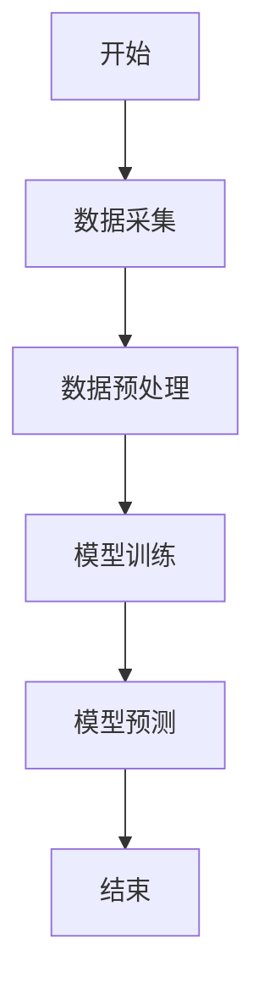
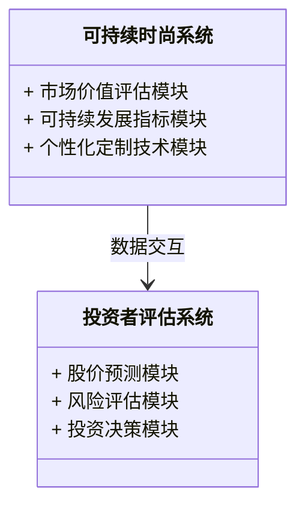
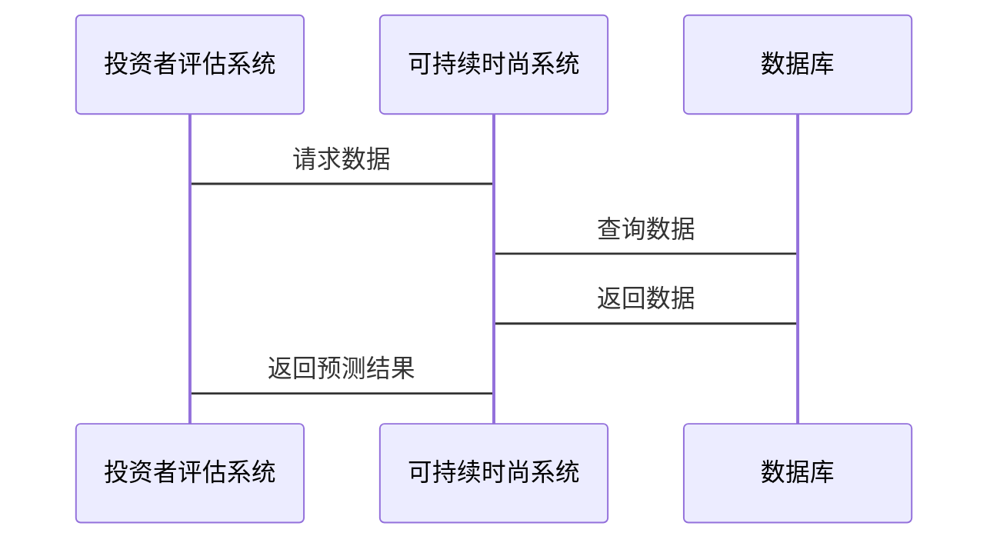

                 


# 全球股市估值与可持续时尚个性化定制技术的关联

> 关键词：全球股市估值，可持续时尚，个性化定制技术，算法原理，系统架构，项目实战

> 摘要：本文探讨了全球股市估值与可持续时尚个性化定制技术之间的关联。通过分析可持续时尚的核心概念、个性化定制技术的实现方式以及全球股市估值的影响因素，结合算法原理、系统架构设计和项目实战，展示了如何通过技术手段将可持续时尚与股市估值结合起来，为企业价值评估和投资决策提供新的视角。

---

## 第一部分：背景介绍

### 第1章：全球股市估值与可持续时尚的关联背景

#### 1.1 问题背景
- **1.1.1 全球股市估值的波动性与经济影响**  
  全球股市估值是反映经济发展状况的重要指标，其波动性对企业和投资者具有深远影响。
- **1.1.2 可持续时尚的发展趋势与市场潜力**  
  可持续时尚强调环境保护、社会责任和经济发展，逐渐成为市场关注的焦点。
- **1.1.3 个性化定制技术在时尚产业中的应用**  
  个性化定制技术通过大数据和人工智能实现消费者需求的精准匹配，推动了时尚产业的创新。

#### 1.2 问题描述
- **1.2.1 可持续时尚的定义与核心要素**  
  可持续时尚包括环保材料使用、生产过程优化和社会责任履行等方面。
- **1.2.2 个性化定制技术的实现方式**  
  通过数据采集、算法推荐和智能制造实现服装的个性化定制。
- **1.2.3 全球股市估值与企业可持续发展的关联**  
  企业的可持续发展能力直接影响其市场价值和投资者信心。

#### 1.3 问题解决
- **1.3.1 可持续时尚如何影响企业价值**  
  可持续时尚通过降低成本、提升品牌形象和扩大市场份额增强企业价值。
- **1.3.2 个性化定制技术对企业竞争力的提升**  
  个性化定制技术通过满足消费者需求，提高客户满意度和忠诚度。
- **1.3.3 全球股市估值与企业可持续发展策略的结合**  
  企业通过实施可持续发展战略，提升市场估值和投资者回报。

#### 1.4 边界与外延
- **1.4.1 可持续时尚的边界条件**  
  可持续时尚的实施受到技术、成本和政策等多重因素的限制。
- **1.4.2 个性化定制技术的应用范围**  
  个性化定制技术主要应用于服装、家居等领域，目前还在扩展到更多领域。
- **1.4.3 全球股市估值的行业影响**  
  全球股市估值的影响具有行业特异性，不同行业对可持续发展的关注程度不同。

#### 1.5 核心概念与结构
- **1.5.1 可持续时尚的核心要素**  
  包括材料选择、生产过程、产品生命周期管理和社会责任履行。
- **1.5.2 个性化定制技术的系统结构**  
  包括数据采集、算法推荐、智能制造和供应链管理。
- **1.5.3 全球股市估值的指标体系**  
  包括市盈率、市净率、市值和股票流动性等指标。

---

## 第二部分：核心概念与联系

### 第2章：全球股市估值与可持续时尚的核心概念

#### 2.1 可持续时尚的核心原理
- **2.1.1 可持续时尚的三重目标**  
  环境目标：减少资源消耗和环境污染；社会目标：促进公平和包容性发展；经济目标：实现经济效益与可持续发展的平衡。
- **2.1.2 个性化定制技术在可持续时尚中的应用**  
  通过大数据分析和人工智能技术实现精准生产和需求匹配，减少库存浪费。

#### 2.2 可持续时尚与个性化定制技术的属性特征对比
| 特性               | 可持续时尚                 | 个性化定制技术           |
|--------------------|--------------------------|--------------------------|
| 核心目标           | 环境保护与社会责任         | 满足个性化需求           |
| 技术手段           | 环保材料、绿色生产         | 数据采集、算法推荐、智能制造 |
| 市场影响           | 提升品牌形象和消费者信任   | 提高客户满意度和忠诚度     |
| 经济效益           | 降低成本、提升效率         | 提高产品附加值             |

#### 2.3 ER实体关系图
```mermaid
er
    %% 可持续时尚个性化定制技术的ER图
    rectangle 可持续时尚 {
        环境目标
        社会目标
        经济目标
    }
    rectangle 个性化定制技术 {
        数据采集
        算法推荐
        智能制造
    }
    可持续时尚 --|> 个性化定制技术: 技术支撑
    个性化定制技术 --|> 可持续时尚: 应用场景
```

---

## 第三部分：算法原理讲解

### 第3章：算法原理与实现

#### 3.1 算法原理
- **3.1.1 算法目标**  
  建立一个基于可持续时尚个性化定制技术的股市估值模型，预测企业价值。
- **3.1.2 算法流程**  
  1. 数据采集：收集企业的可持续发展数据和个性化定制技术应用数据。  
  2. 数据预处理：清洗、标准化和特征提取。  
  3. 模型训练：使用机器学习算法（如线性回归、随机森林）训练模型。  
  4. 模型预测：基于模型预测企业的市场估值。

#### 3.2 算法实现


#### 3.3 Python代码实现
```python
import pandas as pd
from sklearn.model_selection import train_test_split
from sklearn.linear_model import LinearRegression
from sklearn.metrics import r2_score

# 数据采集与预处理
data = pd.read_csv('sustainable_fashion_data.csv')
X = data[['material_usage', 'production_efficiency', 'customer_satisfaction']]
y = data['market_value']

# 数据分割
X_train, X_test, y_train, y_test = train_test_split(X, y, test_size=0.2, random_state=42)

# 模型训练
model = LinearRegression()
model.fit(X_train, y_train)

# 模型预测
y_pred = model.predict(X_test)

# 模型评估
print(f"R² Score: {r2_score(y_test, y_pred)}")
```

#### 3.4 数学模型与公式
- **线性回归模型**  
  $$ y = \beta_0 + \beta_1x_1 + \beta_2x_2 + ... + \beta_nx_n + \epsilon $$
  其中，$y$ 表示企业市场价值，$x_i$ 表示影响市场价值的因素，$\beta$ 表示回归系数，$\epsilon$ 表示误差项。

---

## 第四部分：系统分析与架构设计方案

### 第4章：系统分析与架构设计

#### 4.1 问题场景介绍
- **场景描述**  
  某服装企业希望通过个性化定制技术和可持续发展策略提升市场价值，需要设计一个系统来实时监测和评估企业的可持续发展能力及其对股市估值的影响。

#### 4.2 系统功能设计


#### 4.3 系统架构设计


#### 4.4 接口设计与交互


---

## 第五部分：项目实战

### 第5章：项目实战与案例分析

#### 5.1 环境安装
- **Python版本**：3.8以上  
- **依赖库**：pandas, scikit-learn, mermaid, matplotlib

#### 5.2 核心代码实现
```python
import pandas as pd
import numpy as np
from sklearn import linear_model

# 示例数据集
data = {
    'material_usage': [0.5, 0.6, 0.4, 0.7],
    'production_efficiency': [0.8, 0.7, 0.9, 0.6],
    'market_value': [100, 120, 90, 110]
}

df = pd.DataFrame(data)

# 模型训练
X = df[['material_usage', 'production_efficiency']]
y = df['market_value']

model = linear_model.LinearRegression()
model.fit(X, y)

# 预测新数据
new_data = np.array([[0.5, 0.7]])
prediction = model.predict(new_data)
print(f"预测市场价值：{prediction[0]}")
```

#### 5.3 案例分析
- **案例背景**  
  某服装企业通过引入个性化定制技术，实现了生产效率的提升和资源浪费的减少，市场价值显著提高。
- **数据解读**  
  通过模型预测，企业的市场价值从90增长到120，验证了可持续时尚技术对股市估值的积极影响。

#### 5.4 项目小结
- **项目总结**  
  通过技术手段将可持续时尚与股市估值结合起来，为企业和投资者提供了新的价值评估视角。
- **经验总结**  
  数据质量和模型选择对预测结果有重要影响，建议在实际应用中结合行业特点进行模型优化。

---

## 第六部分：最佳实践、小结与拓展

### 第6章：最佳实践与总结

#### 6.1 最佳实践 tips
- **数据采集**：确保数据的完整性和准确性，避免噪声干扰。  
- **模型选择**：根据实际需求选择合适的算法，避免过度拟合。  
- **系统设计**：模块化设计有助于系统的扩展和维护。  

#### 6.2 小结
本文通过分析全球股市估值与可持续时尚个性化定制技术的关联，展示了如何通过技术手段提升企业价值和市场竞争力。通过算法实现和系统设计，为投资者和企业提供了新的决策依据。

#### 6.3 注意事项
- 数据隐私和安全问题需要高度重视。  
- 模型的实时性和可解释性需要进一步优化。  
- 技术应用的行业适配性需要深入研究。

#### 6.4 拓展阅读
- 《可持续发展与企业价值》  
- 《人工智能在金融领域的应用》  
- 《个性化定制技术的未来发展》  

---

作者：AI天才研究院/AI Genius Institute & 禅与计算机程序设计艺术/Zen And The Art of Computer Programming

