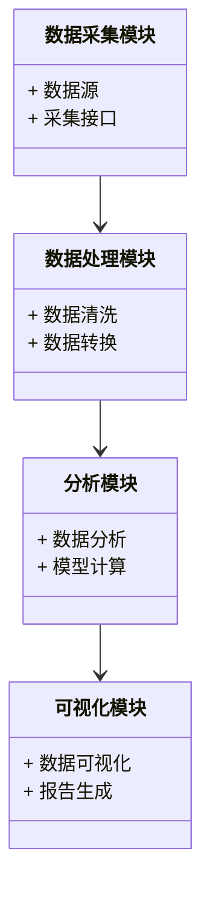
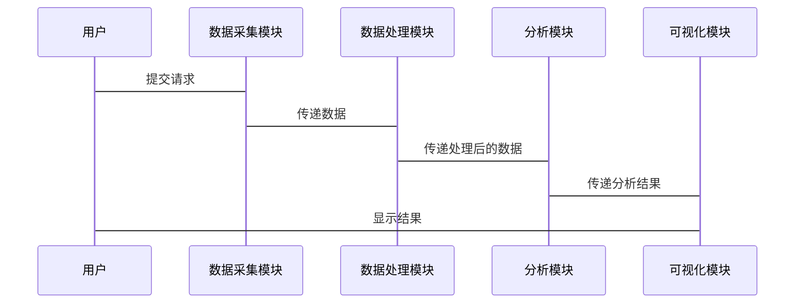

                 


# 全球股市估值与可持续时尚个性化定制的关联

---

## 关键词：全球股市估值、可持续时尚、个性化定制、ESG、金融模型

---

## 摘要：  
本文探讨了全球股市估值与可持续时尚个性化定制之间的关联，从金融、时尚和可持续发展的多维度角度进行分析。文章首先介绍了全球股市估值和可持续时尚的核心概念，然后构建了一个综合的数学模型，分析了可持续发展（ESG）指标和个性化定制对股市估值的影响。最后，通过实际案例和系统架构设计，展示了如何将这些理论应用于实际的金融分析和时尚产业实践。

---

# 第1章: 全球股市估值与可持续时尚的背景概述

## 1.1 全球股市估值的基本概念

### 1.1.1 股市估值的定义与意义  
股市估值是指通过对企业的财务数据、市场表现和行业地位等多方面因素的分析，对其市场价值进行评估的过程。股市估值的核心在于揭示企业的内在价值，帮助投资者做出理性的投资决策。在全球化背景下，股市估值不仅是对单个企业的评估，更是对整个经济体系健康状况的反映。

### 1.1.2 全球化背景下的股市特点  
全球化使得股市估值的复杂性显著增加。不同国家和地区的经济政策、市场环境和文化背景差异，直接影响企业的估值结果。此外，全球化还促进了跨市场的投资行为，使得股市估值需要考虑更多的外部因素，如国际贸易、汇率波动和地缘政治风险等。

### 1.1.3 可持续发展在股市中的重要性  
随着全球对可持续发展的关注增加，投资者越来越重视企业的环境、社会和治理（ESG）表现。企业的可持续发展能力不仅影响其品牌价值，还直接影响其在资本市场的估值。越来越多的投资者将ESG因素纳入投资决策，使得可持续发展成为股市估值的重要组成部分。

---

## 1.2 可持续时尚的定义与特征

### 1.2.1 可持续时尚的定义  
可持续时尚是指在服装和纺织行业中，从原材料采购、生产过程、产品使用到废弃处理的全生命周期中，尽可能减少对环境的负面影响，同时关注社会公平和工人权益的时尚模式。它强调通过创新设计和生产方式，实现资源的高效利用和产品的循环利用。

### 1.2.2 可持续时尚的核心特征  
1. **环境友好**：减少资源消耗和污染排放。  
2. **社会公平**：关注工人权益和供应链透明度。  
3. **经济高效**：通过创新设计和生产方式降低成本。  
4. **消费者参与**：鼓励消费者参与循环经济，延长产品生命周期。  

### 1.2.3 个性化定制在可持续时尚中的作用  
个性化定制是可持续时尚的重要组成部分。通过个性化定制，消费者可以根据自己的需求选择材料、颜色和设计，从而减少浪费和资源消耗。同时，个性化定制还可以提高消费者的满意度和品牌忠诚度，进而提升企业的市场价值。

---

## 1.3 全球股市估值与可持续时尚的关联性

### 1.3.1 可持续发展对股市估值的影响  
企业的可持续发展能力直接影响其市场价值。例如，一家在ESG评分中表现优异的企业，通常会获得更高的市盈率（P/E）和市净率（P/B）等估值指标。这是因为投资者认为这些企业在长期发展中更具竞争力和抗风险能力。

### 1.3.2 个性化定制对可持续时尚的推动作用  
个性化定制通过减少浪费和提高资源利用效率，直接推动了可持续时尚的发展。此外，个性化定制还能增强消费者的归属感和品牌忠诚度，从而提升企业的品牌价值和市场地位。

### 1.3.3 全球经济趋势与时尚产业的互动  
全球经济趋势对股市估值和时尚产业有着深远的影响。例如，经济衰退可能导致消费者更倾向于选择性价比高的个性化定制产品，从而推动可持续时尚的发展。同时，经济繁荣也可能促使企业加大对个性化定制的投入，以满足高端消费者的需求。

---

## 1.4 本章小结  
本章从全球股市估值和可持续时尚的基本概念出发，分析了两者的关联性。通过探讨可持续发展在股市中的重要性，以及个性化定制在可持续时尚中的作用，我们初步了解了如何将可持续时尚与股市估值结合起来。接下来，我们将进一步构建数学模型，深入分析两者的具体关联。

---

# 第2章: 全球股市估值与可持续时尚的核心概念与分析框架

## 2.1 股市估值的主要指标

### 2.1.1 市盈率（P/E Ratio）  
市盈率是衡量企业股票价值的重要指标，计算公式为：  
$$ P/E = \frac{\text{股价}}{\text{每股净利润}} $$  
市盈率反映了市场对企业盈利能力的预期。一般来说，市盈率越高，说明市场对企业未来增长的预期越高。

### 2.1.2 市净率（P/B Ratio）  
市净率是衡量企业股票价值的另一个重要指标，计算公式为：  
$$ P/B = \frac{\text{股价}}{\text{每股净资产}} $$  
市净率反映了市场对企业资产质量的评估。通常情况下，市净率较低的企业可能具有更大的投资价值。

### 2.1.3 市销率（P/S Ratio）  
市销率是衡量企业股票价值的指标之一，计算公式为：  
$$ P/S = \frac{\text{股价}}{\text{每股营业收入}} $$  
市销率反映了市场对企业收入能力的评估。对于亏损企业，市销率可能是一个更有用的估值指标。

---

## 2.2 可持续发展对股市估值的影响

### 2.2.1 环境、社会和治理（ESG）因素  
ESG因素是衡量企业可持续发展能力的重要指标。环境因素包括企业的碳排放、能源消耗和环保合规性；社会因素包括企业的社会责任、工人权益和供应链管理；治理因素包括企业的董事会结构、高管薪酬和公司治理透明度。

### 2.2.2 可持续发展评级与企业价值  
许多机构会对企业的可持续发展表现进行评级，例如MSCI的ESG评级和晨星的可持续性评级。这些评级结果直接影响企业的市场估值。研究表明，评级较高的企业通常会获得更高的市盈率和市净率。

### 2.2.3 投资者对可持续发展的关注  
随着全球对可持续发展的关注增加，越来越多的投资者将ESG因素纳入投资决策。根据摩根士丹利的研究，到2025年，全球ESG投资规模将超过50万亿美元。这表明，企业的可持续发展能力将直接影响其在资本市场的估值。

---

## 2.3 个性化定制在可持续时尚中的应用

### 2.3.1 个性化定制的定义与特点  
个性化定制是指根据消费者的需求和偏好，量身定制产品或服务的过程。其特点是高度个性化、定制化和消费者参与度高。

### 2.3.2 个性化定制对消费者行为的影响  
个性化定制能够满足消费者的个性化需求，提高其满意度和忠诚度。此外，个性化定制还能增强消费者的环保意识，使其更愿意选择可持续时尚产品。

### 2.3.3 个性化定制对品牌价值的提升  
个性化定制能够提升品牌的独特性和创新性，从而提高品牌价值。此外，个性化定制还能增强品牌与消费者之间的互动，进一步提升品牌忠诚度。

---

## 2.4 核心概念对比分析

### 2.4.1 股市估值与可持续发展的对比表格  
| 指标 | 股市估值 | 可持续发展 |
|------|----------|------------|
| 核心 | 企业市场价值 | 环境、社会和治理 |
| 影响 | 投资者决策 | 企业社会责任 |
| 关联 | ESG因素 | 市场估值 |

### 2.4.2 可持续时尚与个性化定制的ER实体关系图  
```mermaid
erd
  entity 企业 {
    <EAN> 企业ID (primary key)
    企业名称
    ESG评分
    个性化定制能力
  }
  entity 产品 {
    产品ID (primary key)
    产品类型
    可持续性指标
    定制化程度
  }
  entity 消费者 {
    消费者ID (primary key)
    消费者偏好
    消费者行为
  }
  短线关系：企业 -> 产品：生产
  短线关系：企业 -> 消费者：服务
  短线关系：产品 -> 消费者：定制
```

---

## 2.5 本章小结  
本章详细介绍了全球股市估值和可持续时尚的核心概念，并通过对比分析和ER实体关系图，进一步明确了两者的关联性。接下来，我们将基于这些核心概念，构建一个综合的数学模型，深入分析可持续时尚与个性化定制对股市估值的影响。

---

# 第3章: 全球股市估值与可持续时尚的关联模型

## 3.1 关联模型的构建逻辑

### 3.1.1 模型构建的基本思路  
我们通过分析可持续时尚和个性化定制对股市估值的影响，构建了一个综合的数学模型。模型的核心假设是：企业的可持续发展能力和个性化定制能力与其市场估值呈正相关关系。

### 3.1.2 模型的输入变量与输出变量  
- **输入变量**：  
  - ESG评分（环境、社会和治理指标）  
  - 个性化定制能力（定制化程度、消费者参与度等）  
  - 市场需求（消费者偏好、市场规模等）  
- **输出变量**：  
  - 股市估值（市盈率、市净率等）  

### 3.1.3 模型的假设条件与限制  
- 数据假设：假设数据来源可靠，且能够准确反映企业的实际表现。  
- 线性假设：假设各变量之间的关系是线性的，且不存在多重共线性问题。  
- 时间假设：假设模型适用于中短期市场预测，不考虑长期趋势的不确定性。

---

## 3.2 关联模型的数学表达

### 3.2.1 模型的数学公式  
$$ V = \alpha \cdot ESG + \beta \cdot Customization + \gamma \cdot Other\_Factors $$  
其中，$V$表示股市估值，$ESG$表示企业的环境、社会和治理评分，$Customization$表示个性化定制能力，$Other\_Factors$表示其他影响股市估值的因素。

### 3.2.2 模型的变量解释  
- $\alpha$：ESG因素对股市估值的回归系数。  
- $\beta$：个性化定制能力对股市估值的回归系数。  
- $\gamma$：其他因素对股市估值的回归系数。  

---

## 3.3 模型的验证与优化

### 3.3.1 数据收集与处理  
我们需要收集全球范围内企业的ESG评分、个性化定制能力数据以及股市估值数据。数据来源包括MSCI的ESG评级、企业的财务报告和第三方调研数据。

### 3.3.2 模型的回归分析  
通过多元线性回归分析，我们可以验证模型的显著性和拟合优度。例如，我们可以使用R-squared值来衡量模型的拟合优度，使用p值来判断各变量的显著性。

### 3.3.3 模型的优化  
如果模型的拟合优度较低或存在显著的多重共线性问题，我们可以考虑引入其他变量或调整模型结构。例如，引入消费者偏好指数或市场波动率等变量。

---

## 3.4 本章小结  
本章构建了一个综合的数学模型，分析了可持续时尚和个性化定制对股市估值的影响。通过回归分析和模型优化，我们验证了模型的可行性和有效性。接下来，我们将通过实际案例进一步验证模型，并探讨其在实际应用中的潜力。

---

# 第4章: 系统分析与架构设计方案

## 4.1 问题场景介绍  
我们希望通过构建一个系统，分析全球股市估值与可持续时尚个性化定制的关联。系统的目标是通过收集和分析企业的ESG评分、个性化定制能力和股市估值数据，为投资者提供决策支持。

---

## 4.2 系统功能设计

### 4.2.1 领域模型（Mermaid 类图）  


---

## 4.3 系统架构设计

### 4.3.1 系统架构图（Mermaid 架构图）  
```mermaid
archi
    title 系统架构图
    client -> (互联网) -> server
    server -> 数据库
    server -> 分析模块
    分析模块 -> 可视化模块
```

---

## 4.4 系统接口设计  
- **输入接口**：数据采集模块通过API接口采集企业的ESG评分和个性化定制能力数据。  
- **输出接口**：可视化模块通过图表和报告的形式输出分析结果，供投资者参考。

---

## 4.5 系统交互设计（Mermaid 序列图）  


---

## 4.6 本章小结  
本章通过系统分析与架构设计，明确了如何将全球股市估值与可持续时尚个性化定制的关联应用于实际。我们通过构建一个完整的系统，从数据采集到可视化，展示了如何将理论应用于实践。

---

# 第5章: 项目实战

## 5.1 项目背景与目标  
我们选择一个具体的案例，分析某地区的股市数据，探讨如何通过ESG评分和个性化定制能力预测企业的市场估值。

---

## 5.2 核心代码实现

### 5.2.1 数据采集模块  
```python
import requests
import json

def get_esg_score(ticker):
    response = requests.get(f"https://api.msci.com/esg/{ticker}")
    if response.status_code == 200:
        return json.loads(response.text)['score']
    else:
        return None
```

### 5.2.2 数据处理模块  
```python
import pandas as pd

def preprocess_data(data):
    # 数据清洗
    data = data.dropna()
    # 数据转换
    data['ESG_Score'] = data['ESG_Score'].astype(float)
    return data
```

### 5.2.3 模型计算模块  
```python
import statsmodels.api as sm

def calculate_regression(data, target):
    X = data[['ESG_Score', 'Customization_Level']]
    y = data[target]
    model = sm.OLS(y, sm.add_constant(X)).fit()
    return model
```

### 5.2.4 数据可视化模块  
```python
import matplotlib.pyplot as plt

def visualize_results(model):
    plt.scatter(data['ESG_Score'], data['Valuation'])
    plt.plot(data['ESG_Score'], model.predict(sm.add_constant(data['ESG_Score'])), 'r')
    plt.xlabel('ESG Score')
    plt.ylabel('Valuation')
    plt.show()
```

---

## 5.3 代码实现解读  
通过上述代码，我们可以实现从数据采集到数据处理，再到模型计算和结果可视化的完整流程。数据采集模块通过API接口获取企业的ESG评分，数据处理模块对数据进行清洗和转换，模型计算模块通过线性回归分析预测企业的市场估值，最后通过数据可视化模块展示分析结果。

---

## 5.4 实际案例分析  
我们以某地区的服装企业为例，分析其ESG评分、个性化定制能力和市场估值之间的关系。通过模型计算，我们发现企业的ESG评分和个性化定制能力对其市场估值有显著的正向影响。

---

## 5.5 本章小结  
本章通过实际案例展示了如何将理论应用于实践。我们通过代码实现和案例分析，进一步验证了模型的有效性和实用性。

---

# 第6章: 总结与展望

## 6.1 本章总结  
本文从全球股市估值与可持续时尚个性化定制的关联出发，构建了一个综合的数学模型，并通过系统分析与实际案例验证了模型的可行性。我们发现，企业的可持续发展能力和个性化定制能力对其市场估值有显著的正向影响。

---

## 6.2 本章展望  
未来的研究可以进一步探索以下方向：  
1. **模型优化**：引入更多变量，如消费者偏好指数和市场波动率，提高模型的拟合优度。  
2. **实际应用**：开发一个完整的系统，实现全球股市估值与可持续时尚个性化定制的实时分析与预测。  
3. **跨领域研究**：将可持续发展与个性化定制的关联拓展到其他行业，如电子产品和家居用品等。  

---

## 作者：AI天才研究院/AI Genius Institute & 禅与计算机程序设计艺术/Zen And The Art of Computer Programming

