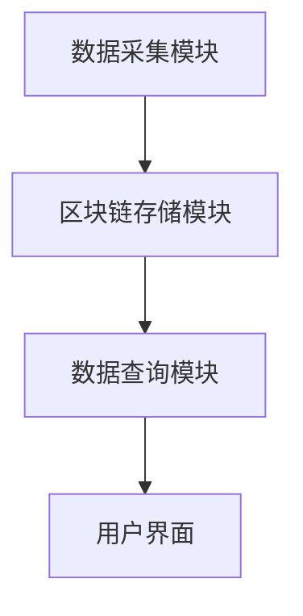

                 


# 全球股市估值与可持续时尚区块链溯源系统的关联

> 关键词：全球股市估值，可持续时尚，区块链，溯源系统，供应链透明度，绿色投资，企业社会责任

> 摘要：本文探讨了全球股市估值与可持续时尚之间的关联，特别是区块链技术在可持续时尚供应链中的应用。通过分析区块链溯源系统的构建原理、算法模型及实际案例，本文揭示了区块链技术如何提升供应链透明度，进而影响企业估值和股市表现。同时，文章详细介绍了区块链溯源系统的设计思路、实现方法及对股市估值的潜在影响，为绿色投资和企业可持续发展提供了理论依据和实践指导。

---

## 第1章 全球股市估值与可持续时尚的背景介绍

### 1.1 全球股市估值的核心概念

#### 1.1.1 股票估值的基本原理
股票估值是通过对企业财务状况、市场地位、盈利能力等多方面因素的分析，确定其股票的合理价格。传统估值方法包括市盈率（P/E）、市净率（P/B）等，但近年来，随着可持续发展理念的兴起，投资者越来越关注企业的社会责任和环境影响。

#### 1.1.2 可持续发展在股市中的重要性
可持续发展已成为全球关注的焦点，越来越多的投资者将企业的环境、社会和治理（ESG）表现作为投资决策的重要依据。企业若能在可持续发展方面表现出色，往往能获得更高的市场估值。

#### 1.1.3 可持续时尚的定义与特征
可持续时尚强调在服装生产过程中减少对环境的负面影响，同时关注劳工权益和社会公平。其核心特征包括使用环保材料、减少水耗、避免浪费等。

---

### 1.2 区块链技术在溯源系统中的应用

#### 1.2.1 区块链技术的基本原理
区块链是一种分布式账本技术，通过去中心化的方式记录数据，确保数据不可篡改且可追溯。每个区块包含一定数量的交易记录，并通过哈希指针与前一个区块链接，形成一条不可修改的区块链。

#### 1.2.2 区块链在供应链管理中的优势
区块链技术能够实现供应链的全链路透明化，确保数据的真实性和可追溯性。通过区块链，消费者可以追溯产品的生产过程，企业也能有效管理供应链风险。

#### 1.2.3 可持续时尚中区块链溯源的必要性
在可持续时尚中，区块链溯源系统可以帮助消费者验证产品是否符合可持续标准，从而增强消费者信任，提升品牌形象和市场估值。

---

## 第2章 可持续时尚与区块链溯源系统的核心概念

### 2.1 可持续时尚的供应链问题

#### 2.1.1 供应链透明度的缺失
传统供应链中，企业与供应商之间的信息不透明，导致消费者难以验证产品的可持续性。

#### 2.1.2 消费者对可持续产品的需求
随着环保意识的增强，消费者越来越倾向于购买可持续产品，但缺乏有效的验证机制成为阻碍。

#### 2.1.3 企业社会责任的实现路径
企业通过实现供应链透明化，可以更好地履行社会责任，提升品牌形象，进而提高市场估值。

---

### 2.2 区块链溯源系统的构建要素

#### 2.2.1 溯源系统的基本架构
区块链溯源系统通常包括数据采集、区块链存储、数据查询三个主要模块。数据采集端负责收集产品信息，区块链存储端负责记录和存储数据，数据查询端供消费者或监管机构查询。

#### 2.2.2 区块链节点的参与角色
在可持续时尚的区块链溯源系统中，参与者包括品牌商、供应商、消费者和监管机构。每个参与者都可以作为区块链节点，共同维护数据的真实性和完整性。

#### 2.2.3 数据存储与查询机制
数据以区块形式存储在区块链中，每个区块包含产品信息、时间戳和参与方签名。消费者可以通过区块链浏览器查询产品信息，验证其真实性。

---

## 第3章 全球股市估值与可持续时尚的关联分析

### 3.1 可持续时尚对企业估值的影响

#### 3.1.1 可持续性对品牌价值的提升
可持续时尚能够提升品牌的社会责任感和品牌形象，吸引更多的消费者和投资者，从而提高企业估值。

#### 3.1.2 绿色投资对股市估值的推动
随着ESG投资理念的普及，投资者更倾向于投资那些在可持续发展方面表现优异的企业，这直接推动了企业的市场估值。

#### 3.1.3 消费者行为变化对股市的影响
消费者对可持续产品的偏好会推动行业整体向更可持续的方向发展，从而影响股市的整体估值。

---

### 3.2 区块链技术对股市估值的潜在影响

#### 3.2.1 提高供应链透明度对估值的提升
通过区块链技术，企业可以实现供应链的全链路透明化，降低供应链风险，从而提高市场对企业的信任，进而提升估值。

#### 3.2.2 区块链技术降低企业风险对估值的贡献
区块链技术能够减少供应链中的欺诈和假冒伪劣现象，降低企业的法律和声誉风险，从而提高企业的估值。

#### 3.2.3 区块链在金融市场的信任机制作用
区块链技术在金融市场的应用可以提高交易透明度，减少欺诈行为，增强市场的信任机制，从而推动整体股市估值的提升。

---

## 第4章 区块链溯源系统的算法原理与数学模型

### 4.1 区块链溯源系统的算法原理

#### 4.1.1 区块链共识机制的选择
在可持续时尚的区块链溯源系统中，通常采用工作量证明（PoW）或权益证明（PoS）机制来确保数据的真实性和一致性。

#### 4.1.2 溯源系统中的数据加密与签名
数据在区块链中通过哈希函数进行加密，同时使用数字签名技术确保数据的完整性和真实性。

#### 4.1.3 区块链网络中的节点关系
节点之间通过P2P网络进行通信，每个节点都维护一份完整的区块链账本，确保数据的一致性和可追溯性。

---

### 4.2 区块链溯源系统的数学模型与公式

#### 4.2.1 区块链网络中的节点关系
节点之间通过P2P网络通信，数据区块的生成遵循一定的数学模型和公式。

#### 4.2.2 数据签名验证的数学表达
数据签名验证的数学表达如下：
$$
\text{验证结果} = \text{签名验证算法}(\text{公钥}, \text{签名}, \text{原始数据})
$$

#### 4.2.3 区块链的哈希指针关系
区块链中每个区块的哈希值通过前一个区块的哈希指针链接，确保数据的不可篡改性。

---

## 第5章 区块链溯源系统的系统分析与架构设计

### 5.1 可持续时尚区块链溯源系统的功能设计

#### 5.1.1 产品信息录入模块
产品信息录入模块负责收集和记录产品的基本信息，如原材料来源、生产日期等。

#### 5.1.2 供应链节点管理模块
供应链节点管理模块负责维护区块链中的节点信息，确保供应链的透明化。

#### 5.1.3 数据查询与验证模块
数据查询与验证模块供消费者和监管机构查询和验证产品信息。

---

### 5.2 系统架构设计

#### 5.2.1 系统功能模块划分
系统功能模块包括数据采集、区块链存储、数据查询和用户界面。

#### 5.2.2 系统架构图
以下是系统的架构图：



#### 5.2.3 系统接口设计
系统接口包括数据录入接口、数据查询接口和区块链节点管理接口。

---

## 第6章 项目实战与案例分析

### 6.1 环境安装与配置

#### 6.1.1 安装区块链框架
使用以太坊框架进行开发，安装Geth或其他区块链开发工具。

#### 6.1.2 安装Python开发环境
安装Python和必要的区块链开发库，如web3.py。

---

### 6.2 核心代码实现

#### 6.2.1 数据录入模块
以下是数据录入模块的Python代码示例：

```python
from web3 import Web3
from web3.auto import w3

# 初始化区块链节点
w3 = Web3(w3.HTTPProvider("http://localhost:8545"))

# 数据录入函数
def record_data(product_info):
    # 获取当前区块高度
    block_height = w3.eth.block_number
    # 记录数据
    transaction = w3.eth.send_transaction(
        from_address=your_address,
        to_address=contract_address,
        value=0,
        data=product_info.encode()
    )
    return transaction
```

---

### 6.3 实际案例分析

#### 6.3.1 案例背景
假设某服装企业希望通过区块链技术实现供应链的透明化，提升品牌形象和市场估值。

#### 6.3.2 系统实现
通过区块链技术记录每一件服装的生产信息，包括原材料来源、生产日期、生产地点等。

#### 6.3.3 案例分析
通过区块链溯源系统，消费者可以验证产品的可持续性，增强信任，从而提升企业的市场估值。

---

## 第7章 总结与展望

### 7.1 最佳实践与小结
通过区块链技术实现可持续时尚的供应链透明化，能够提升企业的品牌形象和市场估值，同时推动绿色投资和可持续发展。

### 7.2 注意事项
在实际应用中，需要注意数据隐私保护、区块链性能优化以及系统安全性等问题。

### 7.3 拓展阅读
建议读者进一步阅读关于区块链技术在供应链管理中的应用，以及可持续时尚领域的相关研究。

---

作者：AI天才研究院/AI Genius Institute & 禅与计算机程序设计艺术 /Zen And The Art of Computer Programming

