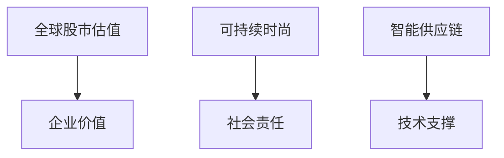
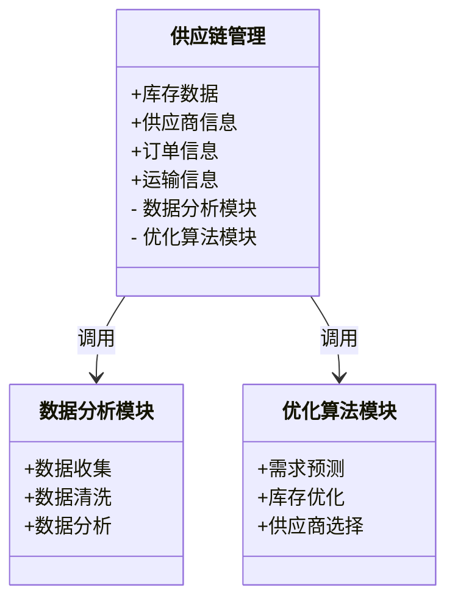
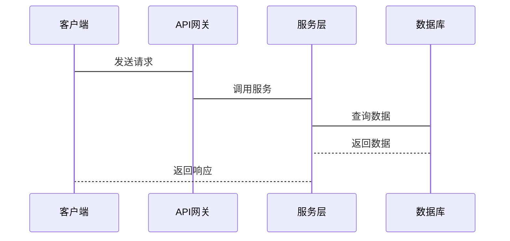

                 


# 全球股市估值与可持续时尚智能供应链的关联

> 关键词：全球股市估值、可持续时尚、智能供应链、数据分析、人工智能

> 摘要：本文探讨了全球股市估值与可持续时尚智能供应链之间的关联。通过分析智能供应链在时尚产业中的运作机制，结合数据驱动和人工智能技术，揭示其对股市估值的影响。同时，本文提供了一个系统架构设计和实际案例分析，展示了如何通过智能供应链技术优化企业运营，进而影响股市估值。本文还提出了最佳实践建议，为相关领域的研究和实践提供了参考。

---

# 目录

1. **背景介绍**
   - 1.1 问题背景
   - 1.2 问题描述
   - 1.3 问题解决
   - 1.4 边界与外延
   - 1.5 概念结构与核心要素

2. **核心概念与联系**
   - 2.1 核心概念原理
   - 2.2 核心概念属性特征对比
   - 2.3 ER实体关系图

3. **智能供应链的运作机制**
   - 3.1 核心技术
   - 3.2 流程优化
   - 3.3 数据驱动决策

4. **可持续时尚的内涵与影响**
   - 4.1 可持续时尚的定义与标准
   - 4.2 可持续时尚的产业影响
   - 4.3 绿色供应链的构建
   - 4.4 消费者行为与可持续时尚

5. **系统分析与架构设计**
   - 5.1 问题场景介绍
   - 5.2 系统功能设计
   - 5.3 系统架构设计
   - 5.4 系统接口设计
   - 5.5 系统交互设计

6. **项目实战：智能供应链优化案例**
   - 6.1 项目背景与目标
   - 6.2 核心代码实现
   - 6.3 案例分析与解读
   - 6.4 项目总结与经验分享

7. **最佳实践与小结**
   - 7.1 最佳实践 tips
   - 7.2 问题小结
   - 7.3 注意事项
   - 7.4 拓展阅读推荐

---

## 1. 背景介绍

### 1.1 问题背景

随着全球经济的快速发展，全球股市估值成为衡量企业价值的重要指标。然而，近年来，可持续发展成为企业和社会关注的焦点。在时尚产业中，供应链的智能化和可持续性对企业估值的影响日益显著。

#### 1.1.1 全球股市估值的重要性
全球股市估值是衡量企业市值的重要指标，反映了企业的盈利能力、成长潜力和市场地位。通过分析股市估值的变化，可以揭示企业的经营状况和市场表现。

#### 1.1.2 可持续时尚的兴起
可持续时尚是指在设计、生产、销售和废弃处理等全生命周期中，尽量减少对环境和资源的消耗，同时关注社会责任和公平贸易的时尚产业模式。随着消费者环保意识的增强，可持续时尚成为行业趋势。

#### 1.1.3 智能供应链的定义与特点
智能供应链通过大数据分析、人工智能和物联网等技术，实现供应链的智能化管理，优化资源配置、降低成本、提高效率。

### 1.2 问题描述

全球股市估值与可持续时尚智能供应链之间的关联是一个复杂的系统问题。企业如何通过智能供应链技术实现可持续发展，进而影响股市估值，是本文的核心问题。

#### 1.2.1 全球股市估值波动的复杂性
股市估值受到多种因素的影响，包括宏观经济环境、行业竞争、企业业绩等。然而，随着可持续发展理念的普及，企业的社会责任和绿色供应链管理也成为影响股市估值的重要因素。

#### 1.2.2 可持续时尚产业的供应链挑战
传统供应链存在资源浪费、环境污染和生产效率低等问题。智能供应链技术的应用可以有效解决这些问题，提升企业的竞争力。

#### 1.2.3 智能供应链在时尚产业中的应用现状
目前，许多时尚企业已经开始采用智能供应链技术，通过数据分析优化库存管理、预测市场需求、提高生产效率等。

### 1.3 问题解决

通过引入智能供应链技术，企业可以实现供应链的智能化管理，提升运营效率，降低环境影响，从而增强企业的市场竞争力和品牌价值，进而影响股市估值。

#### 1.3.1 数据驱动的解决方案
通过大数据分析和机器学习技术，企业可以实时监控供应链的各个环节，预测市场需求，优化库存管理。

#### 1.3.2 智能供应链的技术支撑
智能供应链依赖于物联网、大数据和人工智能等技术，实现供应链的智能化管理。

#### 1.3.3 可持续发展与股市估值的关联
企业的可持续发展能力直接影响其市场形象和品牌价值，进而影响股市估值。

### 1.4 边界与外延

#### 1.4.1 全球股市估值的边界
股市估值的计算范围通常包括企业的资产、负债、收入和利润等财务指标。

#### 1.4.2 可持续时尚的边界
可持续时尚关注的是整个生命周期中的环境和社会影响，包括材料选择、生产过程和废弃处理等。

#### 1.4.3 智能供应链的边界
智能供应链的范围包括从原材料采购到产品交付的全过程，涉及供应商、制造商、分销商和消费者等多个环节。

### 1.5 概念结构与核心要素

#### 1.5.1 核心概念组成
- 全球股市估值
- 可持续时尚
- 智能供应链

#### 1.5.2 关键要素分析
- 数据驱动的决策
- 技术驱动的优化
- 模型驱动的关联

#### 1.5.3 概念结构图


---

## 2. 核心概念与联系

### 2.1 核心概念原理

#### 2.1.1 全球股市估值的计算方法
股市估值通常通过市盈率、市净率等指标进行计算。公式如下：

$$ 市盈率 = \frac{\text{股价}}{\text{每股收益}} $$

#### 2.1.2 可持续时尚的定义与标准
可持续时尚强调生产过程的环保和社会责任。国际标准如GOTS（全球有机纺织品标准）被广泛采用。

#### 2.1.3 智能供应链的运作机制
智能供应链通过物联网、大数据和人工智能技术，实现供应链的实时监控和优化。

### 2.2 核心概念属性特征对比

| 概念         | 属性特征               |
|--------------|------------------------|
| 全球股市估值  | 数据驱动、实时性       |
| 可持续时尚    | 环保性、社会责任       |
| 智能供应链    | 技术驱动、高效性       |

### 2.3 ER实体关系图

```mermaid
erDiagram
    customer[顾客] {
        code : string
        name : string
        purchaseHistory : date
    }
    supplier[供应商] {
        id : integer
        name : string
        product : string
    }
    product[产品] {
        id : integer
        name : string
        price : integer
    }
    order[订单] {
        id : integer
        customerCode : string
        supplierId : integer
        productId : integer
        date : date
    }
    customer --> order : 下单
    supplier --> order : 提供
    product --> order : 购买
```

---

## 3. 智能供应链的运作机制

### 3.1 核心技术

- **大数据分析**：通过分析销售数据、库存数据和市场趋势，优化供应链管理。
- **人工智能**：利用机器学习算法预测市场需求和优化库存。
- **区块链技术**：实现供应链的透明化和可追溯性。

### 3.2 流程优化

- **需求预测**：通过历史销售数据和市场趋势，预测未来的需求。
- **库存管理**：根据需求预测和供应商交货时间，优化库存水平。
- **供应商管理**：通过数据分析，选择可靠的供应商，降低供应链风险。

### 3.3 数据驱动决策

- **数据分析**：实时监控供应链的各个环节，发现问题并及时解决。
- **决策支持系统**：通过数据可视化和预测模型，支持管理层的决策。

---

## 4. 可持续时尚的内涵与影响

### 4.1 可持续时尚的定义与标准

- **定义**：从原材料选择到生产过程，注重环境保护和社会责任。
- **标准**：如GOTS、OEKO-TEX等，确保产品的环保性和可持续性。

### 4.2 可持续时尚的产业影响

- **环保效益**：减少资源消耗和环境污染。
- **社会效益**：促进公平贸易和劳动者权益保护。
- **经济效益**：通过提高品牌价值和市场竞争力，间接影响股市估值。

### 4.3 绿色供应链的构建

- **绿色采购**：选择环保材料和供应商。
- **绿色生产**：采用节能技术和环保工艺。
- **绿色物流**：优化运输路线，减少碳排放。

### 4.4 消费者行为与可持续时尚

- **消费者偏好**：越来越多的消费者倾向于购买环保产品。
- **品牌忠诚度**：可持续时尚品牌更容易赢得消费者的信任和忠诚。

---

## 5. 系统分析与架构设计

### 5.1 问题场景介绍

本文将设计一个智能供应链系统，用于优化时尚企业的供应链管理，提升企业的可持续发展能力，进而影响股市估值。

### 5.2 系统功能设计

#### 5.2.1 领域模型


### 5.3 系统架构设计


### 5.4 系统接口设计

- **API接口**：提供RESTful API，用于前端和后端的数据交互。
- **数据接口**：与供应商和制造商的数据系统对接，实现数据共享。

### 5.5 系统交互设计



---

## 6. 项目实战：智能供应链优化案例

### 6.1 项目背景与目标

某时尚企业希望通过智能供应链技术优化库存管理，降低运营成本，提升市场竞争力。

### 6.2 核心代码实现

```python
import pandas as pd
from sklearn.linear_model import LinearRegression

# 数据加载
data = pd.read_csv('supply_chain_data.csv')

# 特征选择
X = data[['demand', 'lead_time', 'inventory']]
y = data['cost']

# 模型训练
model = LinearRegression()
model.fit(X, y)

# 预测成本
predicted_cost = model.predict(X)
print(predicted_cost)
```

### 6.3 案例分析与解读

通过数据分析和机器学习模型，企业可以预测库存需求，优化采购计划，降低库存成本，提高供应链效率。

### 6.4 项目总结与经验分享

- **总结**：智能供应链技术能够有效优化企业的供应链管理，提升运营效率，降低成本。
- **经验**：数据质量和模型选择是影响预测准确性的关键因素。

---

## 7. 最佳实践与小结

### 7.1 最佳实践 tips

- **数据驱动决策**：充分利用数据进行分析和预测，优化供应链管理。
- **技术驱动创新**：引入人工智能和大数据技术，提升供应链的智能化水平。
- **绿色供应链**：注重环保和社会责任，构建绿色供应链。

### 7.2 问题小结

通过智能供应链技术，企业可以实现供应链的智能化管理，提升企业的市场竞争力和品牌价值，进而影响股市估值。

### 7.3 注意事项

- **数据隐私**：在数据分析过程中，需注意保护数据隐私和企业机密。
- **技术选型**：根据企业的实际需求和预算，合理选择技术方案。
- **持续优化**：定期评估和优化供应链管理策略，适应市场变化。

### 7.4 拓展阅读推荐

- **《智能供应链管理》**：深入探讨智能供应链的管理策略和最佳实践。
- **《可持续时尚：从理念到实践》**：详细讲解可持续时尚的实施方法和案例。

---

## 作者

**作者：AI天才研究院/AI Genius Institute & 禅与计算机程序设计艺术/Zen And The Art of Computer Programming**

---

本文通过分析全球股市估值与可持续时尚智能供应链的关联，揭示了智能供应链技术对企业价值和市场竞争力的重要影响。通过系统架构设计和实际案例分析，展示了如何通过技术创新实现可持续发展，进而提升企业的股市估值。希望本文能够为相关领域的研究和实践提供有价值的参考。

