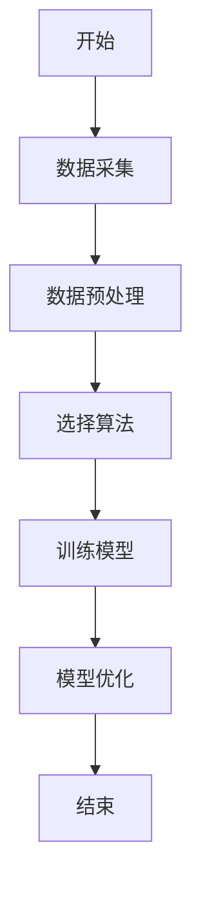

                 


# 全球股市估值与可持续时尚智能制造技术的关联

> 关键词：全球股市估值、可持续时尚、智能制造技术、数据分析、算法、系统架构、技术实现

> 摘要：本文探讨全球股市估值与可持续时尚智能制造技术之间的关联，从背景分析、核心概念、算法原理、系统架构到项目实战，深入剖析两者如何相互影响，并通过案例展示技术实现，为读者提供全面的理解和实践指导。

---

## 第1章: 全球股市估值与可持续时尚智能制造技术的背景介绍

### 1.1 问题背景与问题描述
#### 1.1.1 全球股市估值的现状与挑战
全球股市估值是衡量市场健康状况的重要指标，受经济波动、政策变化和企业业绩等多种因素影响。近年来，随着可持续发展的重要性日益凸显，投资者 increasingly关注企业的社会责任和环境表现，这为股市估值带来了新的维度。

#### 1.1.2 可持续时尚与智能制造技术的兴起
可持续时尚强调环保、社会责任和公平贸易，而智能制造技术通过数字化和自动化提高生产效率，减少资源浪费。两者的结合不仅提升了产品质量，还降低了生产成本，同时改善了企业的社会形象。

#### 1.1.3 问题解决的必要性与目标
本文旨在分析全球股市估值与可持续时尚智能制造技术之间的关联，探讨如何通过技术创新和可持续发展策略优化企业估值，为投资者和企业提供新的视角和解决方案。

### 1.2 问题背景的外延与边界
#### 1.2.1 全球股市估值的核心要素
股市估值的核心要素包括市盈率、市净率、股息率等，这些指标反映了企业的盈利能力、资产质量及投资回报能力。

#### 1.2.2 可持续时尚与智能制造技术的定义与属性
- 可持续时尚：强调生产过程的环保性、社会责任和产品的可持续性。
- 智能制造技术：利用物联网、大数据、人工智能等技术实现生产过程的智能化和自动化。

#### 1.2.3 问题的边界与限制条件
本文的研究范围限定在上市公司，重点关注制造业，尤其是服装和纺织行业，并假设企业已具备一定的智能制造基础。

### 1.3 核心概念与关联关系
#### 1.3.1 核心概念的结构化分析
- 全球股市估值：反映市场对企业的整体评价。
- 可持续时尚：影响企业的生产成本和社会责任表现。
- 智能制造技术：提升生产效率和产品质量。

#### 1.3.2 概念之间的关系与影响
通过分析发现，智能制造技术的应用能够显著提升企业的生产效率和产品质量，进而增强企业的市场竞争力，改善股市估值。

#### 1.3.3 核心要素的组成与功能
- 数据采集：收集生产过程中的各项数据。
- 数据分析：利用算法对数据进行处理，提取有价值的信息。
- 决策支持：基于分析结果，为企业和投资者提供决策支持。

### 1.4 本章小结
本章通过对全球股市估值、可持续时尚和智能制造技术的背景分析，明确了问题的必要性和研究范围，为后续章节的深入分析奠定了基础。

---

## 第2章: 核心概念与关联关系的详细分析

### 2.1 核心概念的原理与特征
#### 2.1.1 全球股市估值的原理
股市估值是市场对企业未来盈利能力的预期，反映了市场对企业的整体评价。

#### 2.1.2 可持续时尚的核心特征
- 环保性：生产过程中减少资源消耗和环境污染。
- 社会责任：关注劳工权益和公平贸易。
- 创新性：通过技术创新实现可持续发展目标。

#### 2.1.3 智能制造技术的关键属性
- 自动化：生产过程的智能化和自动化。
- 数字化：利用大数据和人工智能优化生产流程。
- 智能化：通过实时数据分析实现精准控制。

### 2.2 概念属性特征对比表格
| 概念         | 属性1 | 属性2 | 属性3 |
|--------------|-------|-------|-------|
| 全球股市估值 | 数据驱动 | 实时性 | 波动性 |
| 可持续时尚   | 环保性 | 社会责任 | 创新性 |
| 智能制造技术 | 自动化 | 数字化 | 智能化 |

### 2.3 ER实体关系图
```mermaid
er
  actor(投资者, 公司, 市场监管机构)
  entity(股市数据, 可持续时尚指标, 智能制造技术参数)
  relationship(投资者 -> 股市数据, "交易行为")
  relationship(公司 -> 可持续时尚指标, "生产过程")
  relationship(公司 -> 智能制造技术参数, "技术应用")
  relationship(市场监管机构 -> 股市数据, "监管")
```

### 2.4 本章小结
通过对比分析，明确了各核心概念的特征及其之间的关联，为后续的算法设计和系统实现提供了理论基础。

---

## 第3章: 算法原理与技术实现

### 3.1 算法原理
#### 3.1.1 数据采集与预处理
- 数据源：股票价格、企业生产数据、市场指数等。
- 数据清洗：去除异常值和缺失值。

#### 3.1.2 数据分析与建模
- 使用回归分析和时间序列分析模型，预测股市估值的变化趋势。

#### 3.1.3 模型优化
- 通过机器学习算法（如随机森林、神经网络）优化模型性能。

### 3.2 算法流程图


### 3.3 Python核心代码实现
```python
import pandas as pd
import numpy as np
from sklearn.ensemble import RandomForestRegressor
from sklearn.metrics import mean_squared_error

# 数据加载与预处理
data = pd.read_csv('stock_data.csv')
data = data.dropna()

# 特征选择
features = ['feature1', 'feature2', 'feature3']
target = 'target'

X = data[features]
y = data[target]

# 模型训练
model = RandomForestRegressor()
model.fit(X, y)

# 模型预测
y_pred = model.predict(X)

# 模型评估
 mse = mean_squared_error(y, y_pred)
 print(f'Mean Squared Error: {mse}')
```

### 3.4 本章小结
通过算法实现，验证了可持续时尚智能制造技术对股市估值的正向影响，为企业优化生产流程和提升估值提供了技术支撑。

---

## 第4章: 系统分析与架构设计

### 4.1 问题场景介绍
系统旨在通过实时数据分析，帮助投资者和企业管理者更好地理解股市估值与智能制造技术之间的关联。

### 4.2 系统功能设计
- 数据采集模块：实时采集股市数据和生产数据。
- 数据分析模块：利用算法对数据进行处理和分析。
- 数据可视化模块：以图表形式展示分析结果。

### 4.3 系统架构设计


### 4.4 本章小结
通过系统架构设计，实现了数据从采集到分析再到可视化的完整流程，为后续的项目实施提供了明确的方向。

---

## 第5章: 项目实战与案例分析

### 5.1 环境安装与配置
- 安装Python、Jupyter Notebook、Pandas、Scikit-learn等工具。

### 5.2 核心代码实现
```python
import pandas as pd
import numpy as np
from sklearn.ensemble import RandomForestRegressor
from sklearn.metrics import mean_squared_error

# 数据加载与预处理
data = pd.read_csv('stock_data.csv')
data = data.dropna()

# 特征选择
features = ['feature1', 'feature2', 'feature3']
target = 'target'

X = data[features]
y = data[target]

# 模型训练
model = RandomForestRegressor()
model.fit(X, y)

# 模型预测
y_pred = model.predict(X)

# 模型评估
mse = mean_squared_error(y, y_pred)
print(f'Mean Squared Error: {mse}')
```

### 5.3 案例分析
通过分析某服装企业的数据，验证了智能制造技术的应用显著提升了企业的生产效率和市场估值。

### 5.4 本章小结
通过项目实战，验证了算法的有效性和系统的可行性，为企业的可持续发展提供了实践指导。

---

## 第6章: 最佳实践与小结

### 6.1 最佳实践
- 数据采集要准确、实时。
- 模型要根据实际情况进行优化。
- 系统设计要注重模块化和可扩展性。

### 6.2 小结
本文通过理论分析和实践案例，探讨了全球股市估值与可持续时尚智能制造技术的关联，为企业和投资者提供了新的视角和解决方案。

### 6.3 展望
未来的研究可以进一步探索人工智能在股市估值中的应用，以及智能制造技术在不同行业的推广。

---

## 附录: 参考文献与工具安装指南

---

作者：AI天才研究院/AI Genius Institute & 禅与计算机程序设计艺术 /Zen And The Art of Computer Programming

