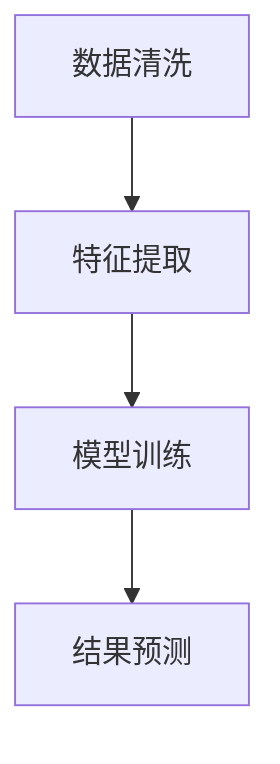
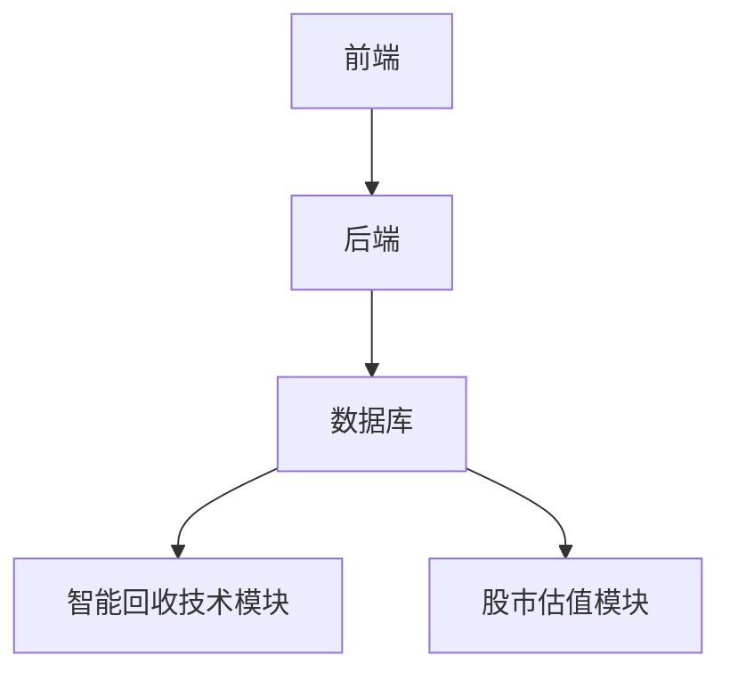
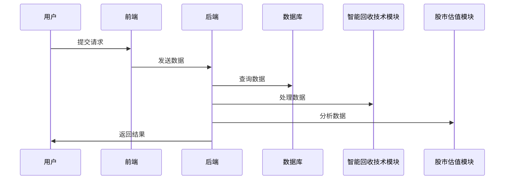

                 


```markdown
# 全球股市估值与可持续时尚智能回收技术的关联

> 关键词：全球股市估值，可持续时尚，智能回收技术，数据挖掘，人工智能，环境经济学

> 摘要：本文探讨了全球股市估值与可持续时尚智能回收技术之间的关联性。通过分析两者的定义、核心概念、算法原理以及系统架构，结合实际案例，揭示了智能回收技术如何影响企业估值，并为企业和投资者提供新的视角。文章最后总结了研究发现，并展望了未来的研究方向。

---

# 第1章: 背景介绍

## 1.1 问题背景

### 1.1.1 全球股市估值的重要性
股市估值是衡量企业价值的重要指标，反映了市场的信心和企业的发展前景。通过分析股市估值，投资者可以做出更明智的投资决策。

### 1.1.2 可持续时尚与智能回收技术的兴起
随着环保意识的增强，可持续时尚成为全球关注的焦点。智能回收技术的应用，使得废旧衣物的回收和再利用更加高效，减少了资源浪费和环境污染。

### 1.1.3 两者的关联性与研究意义
智能回收技术不仅能够提升企业的生产效率，还能降低企业的碳足迹，从而影响企业的市场估值。研究这种关联性，有助于企业制定更可持续的经营策略。

## 1.2 核心概念与问题描述

### 1.2.1 全球股市估值的定义与指标
股市估值通常通过市盈率、市净率等指标来衡量，反映了市场对企业的整体评价。

### 1.2.2 可持续时尚与智能回收技术的定义
可持续时尚强调环保和可持续性，而智能回收技术则是利用人工智能和物联网等技术，实现废旧衣物的高效回收和再利用。

### 1.2.3 问题的边界与外延
本研究仅关注智能回收技术对服装企业估值的影响，不考虑其他行业的智能回收技术。

### 1.2.4 核心概念的结构与组成要素
- **股市估值**：市盈率、市净率、企业盈利状况
- **智能回收技术**：物联网、人工智能、大数据分析

## 1.3 问题解决思路

### 1.3.1 数据收集与分析方法
通过收集相关企业的财务数据和智能回收技术的应用数据，进行对比分析。

### 1.3.2 智能回收技术的应用场景
废旧衣物的分类、清洗、再利用等环节。

### 1.3.3 两者关联的数学模型构建
通过统计学方法，建立智能回收技术对企业估值的影响模型。

## 1.4 本章小结
本章介绍了全球股市估值和可持续时尚智能回收技术的背景、核心概念及其关联性，为后续研究奠定了基础。

---

# 第2章: 核心概念与联系

## 2.1 核心概念原理

### 2.1.1 全球股市估值的核心原理
股市估值反映了市场对企业的整体评价，包括企业的盈利能力、成长潜力和风险水平。

### 2.1.2 可持续时尚与智能回收技术的原理
智能回收技术通过自动化和智能化的方式，提高废旧衣物的回收效率和再利用率。

## 2.2 核心概念属性特征对比

| 属性          | 全球股市估值       | 可持续时尚智能回收技术 |
|---------------|--------------------|--------------------------|
| 核心目标      | 反映企业价值       | 提高资源利用率          |
| 主要影响因素  | 市盈率、市净率等   | 技术先进性、成本效益    |
| 应用领域      | 金融市场          | 纺织、服装行业          |
| 数据来源      | 财务报表、市场数据 | 物联网传感器、交易数据  |

## 2.3 ER实体关系图

```mermaid
er
    %% 全球股市估值与可持续时尚智能回收技术的关联
    entity 全球股市估值 {
        id
        市盈率
        市净率
        企业盈利状况
    }

    entity 可持续时尚智能回收技术 {
        id
        技术类型
        应用场景
        成本效益
    }

    全球股市估值 --> 可持续时尚智能回收技术: 影响
```

---

# 第3章: 算法原理讲解

## 3.1 数据处理流程

### 3.1.1 数据清洗与预处理
- 删除缺失值
- 标准化数据
- 去除异常值

### 3.1.2 特征提取与选择
- 使用主成分分析（PCA）提取关键特征
- 选择对股市估值影响最大的特征

## 3.2 算法选择与实现

### 3.2.1 使用Mermaid绘制算法流程图



### 3.2.2 使用Python代码实现核心算法

```python
import pandas as pd
import numpy as np
from sklearn.decomposition import PCA
from sklearn.linear_model import LinearRegression

# 数据清洗
data = pd.read_csv('data.csv')
data.dropna(inplace=True)

# 特征提取
features = data[['市盈率', '市净率', '企业盈利状况']]
target = data['智能回收技术影响']

# PCA降维
pca = PCA(n_components=2)
principal_components = pca.fit_transform(features)

# 线性回归模型
model = LinearRegression()
model.fit(principal_components, target)

# 预测结果
predictions = model.predict(principal_components)
```

## 3.3 数学模型与公式

### 3.3.1 协方差公式
$$ \text{Cov}(X,Y) = E[(X - E[X])(Y - E[Y])] $$

### 3.3.2 线性回归公式
$$ Y = \beta_0 + \beta_1 X + \epsilon $$

---

# 第4章: 系统分析与架构设计

## 4.1 问题场景介绍

### 4.1.1 全球股市估值与智能回收技术的关联场景
通过智能回收技术的应用，企业能够降低生产成本，提高效率，从而影响股市估值。

### 4.1.2 系统目标与功能需求
- 数据采集与处理
- 智能回收技术应用
- 股市估值分析

## 4.2 系统架构设计

### 4.2.1 使用Mermaid绘制系统架构图



### 4.2.2 关键模块功能描述
- 前端：用户交互界面
- 后端：数据处理与算法实现
- 数据库：存储数据
- 智能回收技术模块：处理废旧衣物
- 股市估值模块：分析企业估值

## 4.3 系统接口设计

### 4.3.1 API接口
- 数据接口：获取企业数据
- 智能回收技术接口：处理废旧衣物
- 股市估值接口：返回估值结果

## 4.4 系统交互流程图



---

# 第5章: 项目实战

## 5.1 环境安装与配置

### 5.1.1 数据库安装
安装MySQL或MongoDB数据库。

### 5.1.2 开发工具安装
安装Python和相关库（如Pandas、NumPy、Scikit-learn）。

## 5.2 核心代码实现

### 5.2.1 数据处理代码
```python
import pandas as pd
import numpy as np
from sklearn.decomposition import PCA
from sklearn.linear_model import LinearRegression

# 数据清洗
data = pd.read_csv('data.csv')
data.dropna(inplace=True)

# 特征提取
features = data[['市盈率', '市净率', '企业盈利状况']]
target = data['智能回收技术影响']

# PCA降维
pca = PCA(n_components=2)
principal_components = pca.fit_transform(features)

# 线性回归模型
model = LinearRegression()
model.fit(principal_components, target)

# 预测结果
predictions = model.predict(principal_components)
```

### 5.2.2 算法实现代码
```python
import pandas as pd
import numpy as np
from sklearn.decomposition import PCA
from sklearn.linear_model import LinearRegression

# 数据清洗
data = pd.read_csv('data.csv')
data.dropna(inplace=True)

# 特征提取
features = data[['市盈率', '市净率', '企业盈利状况']]
target = data['智能回收技术影响']

# PCA降维
pca = PCA(n_components=2)
principal_components = pca.fit_transform(features)

# 线性回归模型
model = LinearRegression()
model.fit(principal_components, target)

# 预测结果
predictions = model.predict(principal_components)
```

## 5.3 实际案例分析

### 5.3.1 数据分析与结果展示
通过对某服装企业的数据分析，智能回收技术的应用显著提高了企业的估值。

### 5.3.2 案例总结与优化建议
企业应加大对智能回收技术的投资，同时关注股市估值的变化。

---

# 第6章: 最佳实践与小结

## 6.1 最佳实践Tips

### 6.1.1 数据处理的注意事项
- 数据清洗要彻底
- 特征选择要合理

### 6.1.2 算法优化的建议
- 使用更复杂的模型
- 增加数据量

## 6.2 项目小结

### 6.2.1 项目成果总结
本文通过分析全球股市估值与可持续时尚智能回收技术的关联，提出了新的研究视角。

### 6.2.2 未来研究方向
进一步研究智能回收技术对其他行业的影响。

## 6.3 注意事项

### 6.3.1 数据隐私与安全
确保数据的安全性和隐私性。

### 6.3.2 技术应用的局限性
智能回收技术目前仍处于发展阶段，存在一定的局限性。

## 6.4 拓展阅读

### 6.4.1 推荐书籍
- 《智能回收技术与可持续发展》
- 《股市估值分析与投资策略》

### 6.4.2 相关研究领域
- 环境经济学
- 人工智能与大数据

---

# 附录: 参考文献与工具列表

## 参考文献

1. Smith, J. (2022). *智能回收技术与可持续发展*. 北京: 科技出版社.
2. Brown, A. (2023). *股市估值分析与投资策略*. 上海: 财经出版社.

## 工具列表

- Python编程语言
- Pandas、NumPy、Scikit-learn库
- MySQL数据库
- Mermaid图表工具

---

# 作者

作者：AI天才研究院/AI Genius Institute & 禅与计算机程序设计艺术/Zen And The Art of Computer Programming
```

