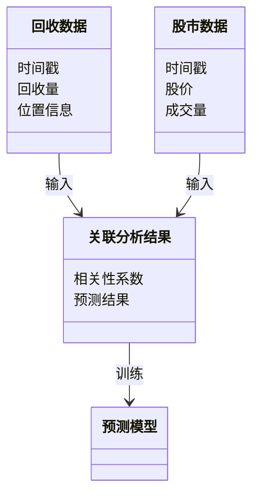
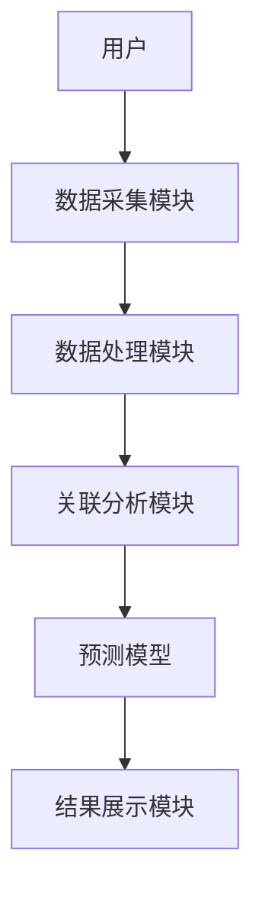
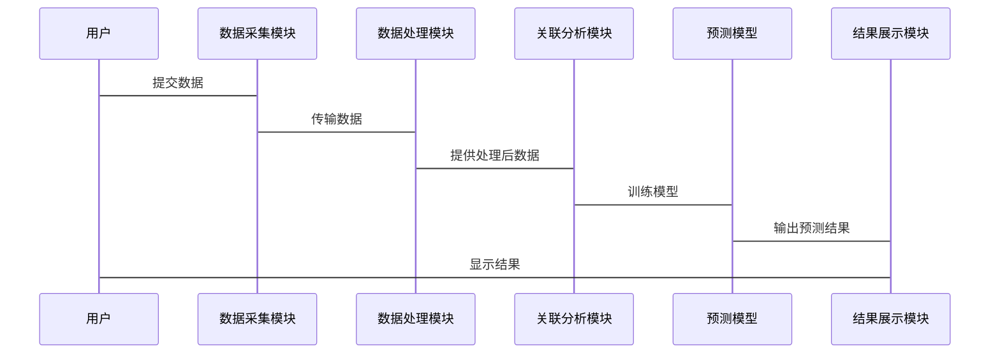

                 


# 《全球股市估值与可持续时尚智能回收系统的关联》

## 关键词：
- 全球股市估值
- 可持续时尚
- 智能回收系统
- 数据分析
- 机器学习

## 摘要：
本文探讨了全球股市估值与可持续时尚智能回收系统之间的关联性，分析了如何通过数据驱动的方法，利用智能回收系统的数据来预测和影响股市估值。文章从背景介绍、核心概念、数据分析、算法实现、系统架构到项目实战，全面阐述了这一关联性，并提供了具体的实现方法和案例分析。

---

# 第一部分: 全球股市估值与可持续时尚智能回收系统的背景与关联

## 第1章: 全球股市估值与可持续时尚智能回收系统的背景介绍

### 1.1 问题背景与问题描述
#### 1.1.1 全球股市估值的现状与挑战
- 当前全球经济环境对股市估值的影响
- 可持续发展对企业估值的影响
- 智能回收系统在可持续时尚中的作用

#### 1.1.2 可持续时尚与智能回收系统的概念
- 可持续时尚的定义与发展趋势
- 智能回收系统的定义与技术特点
- 智能回收系统在时尚产业中的应用

#### 1.1.3 问题解决的目标与意义
- 研究目标：揭示股市估值与智能回收系统的关联
- 研究意义：为企业决策提供数据支持，推动可持续发展

### 1.2 核心概念与问题外延
#### 1.2.1 全球股市估值的核心要素
- 市场情绪、企业业绩、宏观经济指标
- 可持续发展对企业估值的影响

#### 1.2.2 可持续时尚与智能回收系统的边界与外延
- 智能回收系统的功能边界
- 可持续时尚的产业链延伸

#### 1.2.3 系统关联的逻辑结构与核心要素
- 核心要素：数据采集、关联分析、预测模型
- 关联逻辑：从数据到预测的闭环系统

## 第2章: 全球股市估值与可持续时尚智能回收系统的关联性分析

### 2.1 核心概念的原理与联系
#### 2.1.1 全球股市估值的驱动因素
- 企业盈利、市场情绪、宏观经济
- 可持续发展对企业估值的影响

#### 2.1.2 可持续时尚智能回收系统的运作机制
- 数据采集：消费者行为、回收效率
- 数据分析：模式识别、趋势预测
- 与股市的关联：通过数据反馈影响市场预期

#### 2.1.3 两者关联的逻辑模型
- 数据流：从智能回收系统到股市分析
- 关联机制：消费者行为数据对市场情绪的影响

### 2.2 核心概念的属性特征对比
#### 2.2.1 全球股市估值的属性特征
- 时间序列性、波动性、相关性
- 数据维度：价格、成交量、市场情绪

#### 2.2.2 可持续时尚智能回收系统的属性特征
- 数据类型：结构化与非结构化数据
- 系统功能：数据采集、分析、反馈

#### 2.2.3 对比分析与关联性总结
- 数据类型对比：股市数据与回收系统数据的异同
- 关联性总结：回收数据如何影响市场情绪

### 2.3 ER实体关系图架构
```mermaid
er
  actor(用户) 
  actor(系统)
  actor(市场)
  entity(回收数据)
  entity(股市数据)
  entity(关联分析结果)
  entity(预测模型)
  entity(反馈机制)
  relationship(用户-系统：提交数据)
  relationship(系统-市场：提供预测)
  relationship(回收数据-关联分析：输入)
  relationship(关联分析-预测模型：训练)
  relationship(预测模型-反馈机制：输出)
  relationship(市场-预测模型：使用结果)
```

---

## 第3章: 数据分析与关联性建模

### 3.1 数据收集与预处理
#### 3.1.1 数据来源与采集方法
- 数据来源：智能回收系统、公开市场数据
- 数据采集工具：API接口、数据库提取

#### 3.1.2 数据清洗与特征提取
- 数据清洗：处理缺失值、异常值
- 特征提取：从回收数据中提取关键指标

#### 3.1.3 数据标准化与格式化
- 数据标准化：统一数据格式
- 数据特征选择：选择相关性高的特征

### 3.2 关联性分析与建模
#### 3.2.1 数据相关性分析
- 使用Python进行相关性分析
- 示例代码：
  ```python
  import pandas as pd
  data = pd.read_csv('recycle_data.csv')
  correlation_matrix = data.corr()
  print(correlation_matrix)
  ```

#### 3.2.2 回归分析与预测模型
- 线性回归模型：预测股市走势
- 示例代码：
  ```python
  from sklearn.linear_model import LinearRegression
  model = LinearRegression()
  model.fit(X_train, y_train)
  ```

#### 3.2.3 时间序列分析与动态关联性
- 使用ARIMA模型进行时间序列预测
- 示例代码：
  ```python
  from statsmodels.tsa.arima_model import ARIMA
  model = ARIMA(y, order=(1, 1, 1))
  model_fit = model.fit()
  ```

### 3.3 数据分析结果与关联性验证
#### 3.3.1 数据分析结果展示
- 可视化图表：相关性热图、回归分析结果
- 示例代码：
  ```python
  import matplotlib.pyplot as plt
  plt.figure(figsize=(10, 6))
  plt.plot(data['stock_price'], data['recycle_efficiency'])
  plt.show()
  ```

#### 3.3.2 关联性验证方法
- 使用R²值评估模型拟合度
- 使用残差分析验证模型假设

#### 3.3.3 结果解释与意义
- 结果解释：智能回收数据对股市预测的贡献
- 意义：数据驱动的决策支持

---

## 第4章: 算法原理与实现

### 4.1 算法选择与优化
#### 4.1.1 算法选择
- 机器学习算法：随机森林、XGBoost
- 时间序列算法：LSTM

#### 4.1.2 算法优化
- 超参数调优：网格搜索、随机搜索
- 示例代码：
  ```python
  from sklearn.ensemble import RandomForestRegressor
  from sklearn.model_selection import GridSearchCV
  param_grid = {'n_estimators': [100, 200], 'max_depth': [None, 10]}
  grid_search = GridSearchCV(RandomForestRegressor(), param_grid, cv=5)
  grid_search.fit(X_train, y_train)
  best_params = grid_search.best_params_
  ```

### 4.2 算法实现
#### 4.2.1 机器学习模型实现
- 使用XGBoost进行预测
- 示例代码：
  ```python
  import xgboost as xgb
  dtrain = xgb.DMatrix(X_train, label=y_train)
  dtest = xgb.DMatrix(X_test)
  params = {'n_estimators': 200, 'learning_rate': 0.05}
  model = xgb.XGBRegressor(**params)
  model.fit(dtrain)
  ```

#### 4.2.2 时间序列模型实现
- 使用LSTM进行预测
- 示例代码：
  ```python
  from keras.models import Sequential
  from keras.layers import LSTM, Dense
  model = Sequential()
  model.add(LSTM(50, input_shape=(timesteps, features)))
  model.add(Dense(1))
  model.compile(loss='mean_squared_error', optimizer='adam')
  ```

### 4.3 算法结果与分析
#### 4.3.1 模型预测结果展示
- 可视化预测结果与实际值对比
- 示例代码：
  ```python
  import matplotlib.pyplot as plt
  plt.figure(figsize=(12, 6))
  plt.plot(y_test, label='Actual')
  plt.plot(model.predict(X_test), label='Predicted')
  plt.legend()
  plt.show()
  ```

#### 4.3.2 模型性能评估
- 使用均方误差（MSE）、R²值评估模型性能
- 示例代码：
  ```python
  from sklearn.metrics import mean_squared_error, r2_score
  mse = mean_squared_error(y_test, y_pred)
  r2 = r2_score(y_test, y_pred)
  print(f'MSE: {mse}, R²: {r2}')
  ```

---

## 第5章: 系统分析与架构设计方案

### 5.1 问题场景介绍
#### 5.1.1 问题场景
- 智能回收系统的数据采集与处理
- 股市数据的实时监控与分析

#### 5.1.2 项目介绍
- 项目目标：构建智能回收与股市估值的关联模型
- 项目范围：数据采集、分析、预测

### 5.2 系统功能设计
#### 5.2.1 领域模型设计


#### 5.2.2 系统架构设计


#### 5.2.3 系统接口设计
- 数据接口：RESTful API
- 数据格式：JSON、CSV

#### 5.2.4 系统交互设计


---

## 第6章: 项目实战与案例分析

### 6.1 环境安装与配置
#### 6.1.1 环境配置
- 安装Python、Jupyter Notebook、数据处理库（Pandas、NumPy）
- 安装机器学习库（Scikit-learn、XGBoost、Keras）
- 安装可视化库（Matplotlib、Seaborn）

#### 6.1.2 数据集获取
- 数据来源：公开数据集、自建数据集
- 数据预处理：清洗、特征选择

### 6.2 系统核心实现
#### 6.2.1 数据采集模块实现
- 示例代码：
  ```python
  import requests
  response = requests.get('https://api.example.com/recycle_data')
  data = response.json()
  ```

#### 6.2.2 数据处理模块实现
- 示例代码：
  ```python
  import pandas as pd
  data = pd.DataFrame(data)
  data.dropna(inplace=True)
  ```

#### 6.2.3 关联分析模块实现
- 示例代码：
  ```python
  import numpy as np
  from sklearn.metrics import corrcoef
  correlation_matrix = np.corrcoef(data['recycle_efficiency'], data['stock_price'])
  ```

#### 6.2.4 预测模型实现
- 示例代码：
  ```python
  from sklearn.ensemble import RandomForestRegressor
  model = RandomForestRegressor()
  model.fit(X_train, y_train)
  ```

### 6.3 案例分析与详细解读
#### 6.3.1 实际案例分析
- 案例背景：某时尚品牌的数据分析
- 数据分析过程：数据采集、清洗、建模、预测
- 预测结果：对股市的影响分析

#### 6.3.2 详细讲解剖析
- 数据分析的关键步骤
- 模型选择与优化
- 预测结果的解释与应用

### 6.4 项目小结
#### 6.4.1 核心实现总结
- 数据采集与处理的实现
- 模型选择与优化的经验
- 系统架构设计的优缺点

#### 6.4.2 项目成果与意义
- 成果展示：模型预测结果
- 意义：数据驱动的决策支持

---

## 第7章: 最佳实践、小结与展望

### 7.1 最佳实践 tips
#### 7.1.1 数据采集
- 数据清洗的重要性
- 特征选择的技巧

#### 7.1.2 系统设计
- 模块化设计的优势
- 系统架构的可扩展性

#### 7.1.3 算法实现
- 模型选择的策略
- 超参数调优的技巧

### 7.2 小结
#### 7.2.1 核心内容总结
- 全球股市估值与智能回收系统的关联性
- 数据分析与建模的关键步骤
- 系统设计与实现的经验总结

### 7.3 注意事项与未来展望
#### 7.3.1 注意事项
- 数据隐私与安全问题
- 模型的实时性与稳定性

#### 7.3.2 未来展望
- 更复杂模型的应用：深度学习
- 数据融合与多模态分析
- 可持续时尚与智能回收系统的进一步创新

---

# 作者：AI天才研究院/AI Genius Institute & 禅与计算机程序设计艺术 /Zen And The Art of Computer Programming

