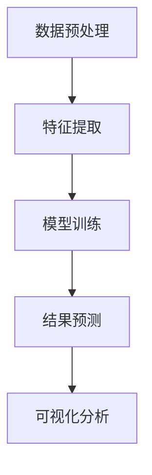
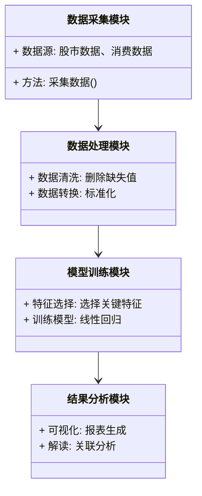

                 


# 全球股市估值与可持续时尚消费趋势的关联

## 关键词：
全球股市估值、可持续时尚、消费趋势、关联分析、算法模型

## 摘要：
本文探讨全球股市估值与可持续时尚消费趋势之间的关联，通过分析两者的核心概念、属性特征和关联机制，构建数学模型和算法，揭示可持续时尚对股市估值的影响。文章结合实际案例和项目实战，提出系统设计方案和最佳实践建议。

## 第一部分: 全球股市估值与可持续时尚消费趋势的关联概述

### 第1章: 背景介绍

#### 1.1 问题背景
- **全球股市估值的现状与挑战**：全球经济波动、政策变化等因素影响股市估值。
- **可持续时尚消费趋势的兴起**：消费者对环保、社会责任的关注推动可持续时尚发展。
- **关联性与研究意义**：研究两者关联有助于优化投资策略和推动可持续发展。

#### 1.2 核心概念与定义
- **股市估值**：通过市盈率、市净率等指标评估企业价值。
- **可持续时尚消费趋势**：消费者选择环保、可持续的品牌和产品。

#### 1.3 问题描述
- **脱节现象**：股市估值未能反映可持续时尚的价值。
- **影响分析**：可持续时尚如何影响股市估值。
- **研究边界**：关注消费趋势和投资决策的关联。

#### 1.4 核心要素组成
- **股市估值指标**：市盈率、市净率。
- **消费趋势要素**：环保认证、可持续材料使用率。

### 第2章: 核心概念与联系

#### 2.1 核心概念原理
- **股市估值**：反映市场对企业的信心和价值判断。
- **可持续时尚**：消费者选择环保产品，影响企业盈利和股价。

#### 2.2 属性特征对比
- **股市估值**：数据驱动、实时波动。
- **可持续时尚消费**：消费者行为驱动、长期趋势。

#### 2.3 ER实体关系图

```mermaid
er
    entity 股市估值 {
        key 股票代码
        属性 股价, 市盈率, 市净率
    }
    entity 可持续时尚消费趋势 {
        key 消费指标
        属性 消费增长率, 环保认证比例, 可持续材料使用率
    }
    关系 关联关系 {
        股市估值 -->> 可持续时尚消费趋势: 影响
    }
```

### 第3章: 算法原理讲解

#### 3.1 关联分析算法
- **协方差与相关系数**：衡量两者波动的相关性。
  $$\text{协方差}(X,Y) = E[(X - E[X])(Y - E[Y])]$$
  $$\text{相关系数} = \frac{\text{协方差}(X,Y)}{\sigma_X \sigma_Y}$$

#### 3.2 时间序列分析
- **ARIMA模型**：预测股市估值与消费趋势的未来走势。

#### 3.3 机器学习模型
- **线性回归**：预测股市估值与消费趋势的关系。
  $$y = \beta_0 + \beta_1 x + \epsilon$$

#### 3.4 算法流程图



#### 3.5 Python代码实现

```python
import pandas as pd
import numpy as np
from sklearn.linear_model import LinearRegression

# 数据加载
data = pd.read_csv('data.csv')

# 特征与目标变量
X = data[['消费增长率', '环保认证比例']]
y = data['股价']

# 模型训练
model = LinearRegression()
model.fit(X, y)

# 预测与评估
predictions = model.predict(X)
print('回归系数:', model.coef_)
print('回归截距:', model.intercept_)
```

### 第4章: 系统分析与架构设计方案

#### 4.1 问题场景
- 数据采集：收集股市数据和消费趋势数据。
- 数据处理：清洗和转换数据。
- 模型训练：建立关联模型。
- 结果分析：解读模型结果。

#### 4.2 系统功能设计



#### 4.3 系统架构设计


### 第5章: 项目实战

#### 5.1 环境安装
- Python 3.8+
- 数据处理库：pandas, numpy
- 可视化库：matplotlib, seaborn
- 机器学习库：scikit-learn

#### 5.2 核心代码实现
```python
import pandas as pd
from sklearn.linear_model import LinearRegression
from sklearn.metrics import r2_score

# 加载数据
data = pd.read_csv('sustainable_fashion.csv')

# 特征与目标
X = data[['消费增长率', '环保认证比例']]
y = data['股价']

# 训练模型
model = LinearRegression()
model.fit(X, y)

# 评估模型
y_pred = model.predict(X)
print('R²:', r2_score(y, y_pred))
```

#### 5.3 实际案例分析
- 数据来源：假设数据来自2020-2023年全球股市和消费趋势数据。
- 案例分析：假设某品牌环保认证比例增加，股价上升。

#### 5.4 项目小结
- 项目目标：建立关联模型。
- 成果展示：模型准确率和可视化结果。

### 第6章: 最佳实践

#### 6.1 小结
- 关联分析的重要性：理解可持续时尚对股市的影响。
- 数据质量：确保数据准确性和完整性。

#### 6.2 注意事项
- 数据来源的可靠性：选择可靠的数据库。
- 模型选择：根据数据特点选择合适的算法。
- 结果解释：避免过度解读模型结果。

#### 6.3 拓展阅读
- 推荐书籍：《可持续发展经济学》。
- 推荐文章：《数据科学与可持续时尚》。

---

## 作者：
作者：AI天才研究院 & 禅与计算机程序设计艺术

