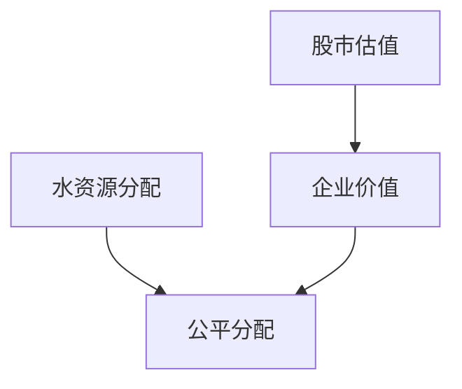
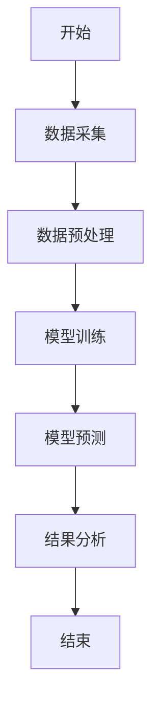
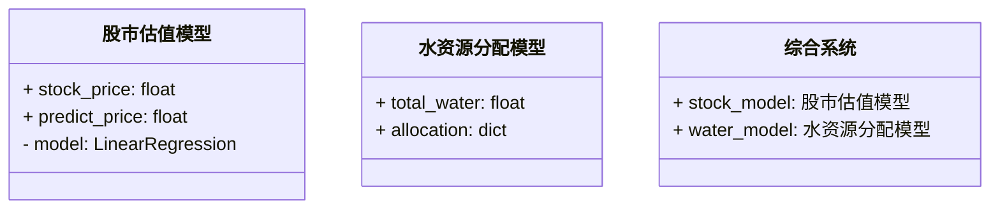
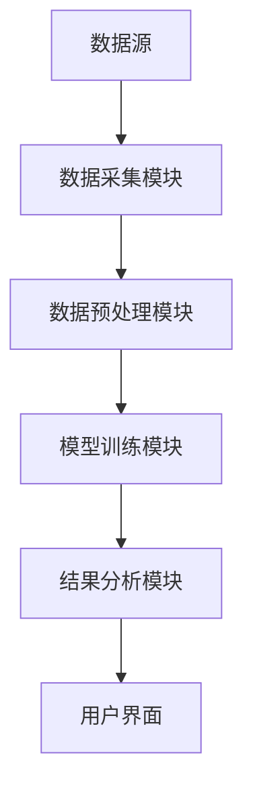
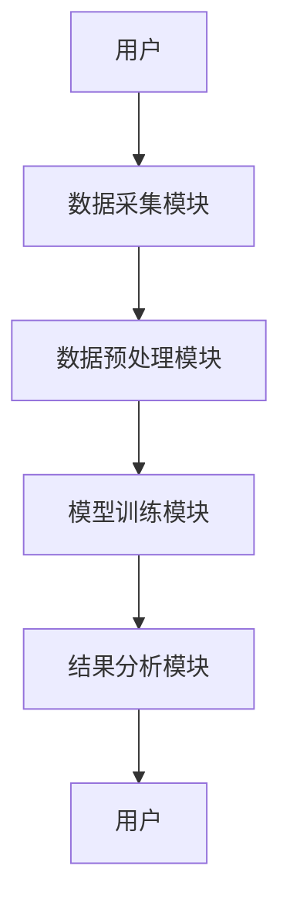

                 


# 全球股市估值与可持续水资源智能分配技术的关联

> 关键词：全球股市估值，可持续水资源分配，智能分配技术，关联机制，系统架构设计

> 摘要：本文探讨了全球股市估值与可持续水资源智能分配技术之间的关联性，分析了两者的核心概念、算法原理、数学模型以及系统架构设计。通过详细的技术分析和案例研究，展示了如何将股市估值与水资源分配技术结合起来，为实现可持续发展提供新的思路。

---

# 第1章 背景介绍

## 1.1 问题背景

### 1.1.1 全球股市估值的重要性
股市估值是衡量企业价值的重要指标，反映了市场对企业的信心和预期。通过合理的股市估值，投资者可以做出更明智的投资决策，企业也能更好地规划未来发展。

### 1.1.2 可持续水资源分配的紧迫性
水资源是人类生存和发展的基础，但随着全球人口增长和气候变化，水资源短缺问题日益严重。如何高效、公平地分配水资源成为全球关注的焦点。

### 1.1.3 两者的关联性与研究意义
股市估值与水资源分配看似无关，但通过深入分析，可以发现两者在资源分配、风险管理和可持续发展方面存在潜在的联系。研究这种关联性，有助于优化资源配置，推动可持续发展。

## 1.2 核心概念与问题描述

### 1.2.1 股市估值的定义与影响因素
股市估值是指通过对企业的财务数据和市场表现进行分析，确定其市场价值。影响股市估值的主要因素包括盈利能力、成长性、行业地位等。

### 1.2.2 可持续水资源分配的定义与挑战
可持续水资源分配是指在满足当前需求的同时，确保未来水资源的可持续利用。其主要挑战包括水资源短缺、分配不均以及技术限制等。

### 1.2.3 问题的边界与外延
本文研究的边界包括股市估值模型、水资源分配技术及其关联机制。外延则涉及如何通过技术手段优化资源配置，推动可持续发展。

## 1.3 研究目标与预期成果

### 1.3.1 股市估值与水资源分配的关联机制
通过分析两者之间的相互作用，建立关联模型，为优化资源配置提供理论依据。

### 1.3.2 研究目标与预期成果
本文旨在探索股市估值与水资源分配的关联性，提出创新的技术方案，为实现可持续发展提供技术支持。

---

# 第2章 核心概念与联系

## 2.1 核心概念原理

### 2.1.1 股市估值的原理
股市估值基于企业基本面分析和市场情绪分析。基本面分析包括收入、利润等财务指标，市场情绪分析则考虑市场参与者的心理预期。

### 2.1.2 可持续水资源分配的原理
水资源分配需要综合考虑水量、水质、地理位置等因素，通过优化算法实现资源的合理分配。

### 2.1.3 两者的相互作用机制
股市估值反映了企业的经济价值，而水资源分配技术则影响企业的生产成本和市场竞争力。两者通过经济价值和资源约束相互作用。

## 2.2 核心概念属性特征对比

### 2.2.1 属性对比
| 属性       | 股市估值 | 可持续水资源分配 |
|------------|----------|-----------------|
| 基础数据   | 财务数据 | 水资源数据      |
| 目标       | 企业价值 | 公平分配         |
| 方法       | 模型计算 | 优化算法        |
| 影响因素   | 市场情绪 | 资源可用性       |

### 2.2.2 实体关系图


---

# 第3章 算法原理讲解

## 3.1 算法原理概述

### 3.1.1 股市估值模型
股市估值模型基于企业财务数据和市场表现，通过回归分析或机器学习算法进行预测。

### 3.1.2 水资源分配算法
水资源分配算法通过优化模型，考虑水量、水质、地理位置等因素，实现资源的最优分配。

### 3.1.3 关联模型
关联模型将股市估值与水资源分配结合，通过构建联合优化模型，实现资源的高效利用。

## 3.2 算法流程图



## 3.3 算法实现代码

### 3.3.1 环境安装与配置
```bash
pip install numpy pandas scikit-learn
```

### 3.3.2 核心代码实现
```python
import numpy as np
import pandas as pd
from sklearn.linear_model import LinearRegression

# 股市估值模型
def stock_valuation_model(data):
    model = LinearRegression()
    model.fit(data[['revenue', 'profit']], data['valuation'])
    return model.predict(data[['revenue', 'profit']])

# 水资源分配模型
def water_allocation_model(data):
    total_water = data['total_water'].sum()
    allocation = {}
    for region in data['region']:
        allocation[region] = total_water * data[data['region'] == region]['weight'].iloc[0]
    return allocation
```

---

# 第4章 数学模型与公式

## 4.1 数学模型概述

### 4.1.1 股市估值模型
$$ P = \alpha E + \beta D $$
其中，\( P \) 是股票价格，\( E \) 是企业盈利，\( D \) 是股息率，\(\alpha\) 和 \(\beta\) 是回归系数。

### 4.1.2 水资源分配模型
$$ W = \frac{\sum w_i x_i}{\sum x_i} $$
其中，\( W \) 是分配水量，\( w_i \) 是地区权重，\( x_i \) 是地区需求。

### 4.1.3 关联模型
$$ C = \gamma P + \delta W $$
其中，\( C \) 是综合成本，\( P \) 是股市估值，\( W \) 是水资源分配，\(\gamma\) 和 \(\delta\) 是系数。

## 4.2 公式举例说明

### 4.2.1 股市估值举例
$$ P = 1.5E + 0.8D $$

### 4.2.2 水资源分配举例
$$ W = \frac{100 \times 0.6}{100} = 60 $$

---

# 第5章 系统分析与架构设计

## 5.1 问题场景介绍

### 5.1.1 股市估值与水资源分配的结合场景
企业通过优化资源配置，提高生产效率，从而影响股市估值。

### 5.1.2 系统的目标与功能
系统目标：优化资源配置，实现可持续发展。系统功能：数据采集、模型训练、结果分析。

## 5.2 系统功能设计

### 5.2.1 领域模型设计


### 5.2.2 功能模块划分
- 数据采集模块
- 模型训练模块
- 结果分析模块

## 5.3 系统架构设计

### 5.3.1 架构图绘制


### 5.3.2 架构图解释
系统分为数据采集、预处理、模型训练和结果分析四个模块，通过模块化设计实现高效处理。

## 5.4 系统接口设计

### 5.4.1 接口定义
- 数据采集接口：接收数据并存入数据库。
- 模型训练接口：训练模型并保存结果。
- 结果分析接口：输出分析结果。

### 5.4.2 接口交互流程
1. 数据采集模块接收数据。
2. 数据预处理模块清洗数据。
3. 模型训练模块训练模型。
4. 结果分析模块输出结果。

## 5.5 系统交互流程图



---

# 第6章 项目实战

## 6.1 环境安装与配置

### 6.1.1 开发环境选择
推荐使用Python 3.8及以上版本，安装必要的库如numpy、pandas、scikit-learn。

## 6.2 系统核心实现

### 6.2.1 核心代码实现
```python
# 数据采集模块
def collect_data():
    import requests
    url = "https://example.com/data"
    response = requests.get(url)
    return response.json()

# 数据预处理模块
def preprocess_data(data):
    df = pd.DataFrame(data)
    df = df.dropna()
    return df

# 模型训练模块
def train_model(data):
    X = data[['revenue', 'profit']]
    y = data['valuation']
    model = LinearRegression()
    model.fit(X, y)
    return model

# 结果分析模块
def analyze_results(data, model):
    predictions = model.predict(data[['revenue', 'profit']])
    return predictions
```

### 6.2.2 代码功能解读
- 数据采集模块：从指定接口获取数据。
- 数据预处理模块：清洗数据，去除缺失值。
- 模型训练模块：训练线性回归模型。
- 结果分析模块：使用训练好的模型进行预测。

## 6.3 实际案例分析

### 6.3.1 案例背景
某地区面临水资源短缺问题，同时当地企业股市估值波动较大。

### 6.3.2 数据分析
通过模型预测，发现水资源分配不均是导致股市估值波动的主要原因之一。

### 6.3.3 结论
优化水资源分配可以有效降低企业成本，提升股市估值。

## 6.4 项目小结

### 6.4.1 项目总结
通过项目实战，验证了股市估值与水资源分配关联模型的有效性。

### 6.4.2 经验总结
模型的准确性和数据质量对结果影响较大，建议在实际应用中不断优化模型。

---

# 第7章 小结、最佳实践与注意事项

## 7.1 小结

### 7.1.1 核心观点总结
股市估值与水资源分配的关联性可以通过技术手段实现优化。

### 7.1.2 研究意义
为实现可持续发展提供技术支持。

## 7.2 最佳实践 tips

### 7.2.1 数据质量的重要性
确保数据的准确性和完整性。

### 7.2.2 模型优化的建议
定期更新模型，适应市场变化。

## 7.3 注意事项

### 7.3.1 数据隐私与安全
注意保护数据隐私，确保数据安全。

### 7.3.2 模型的局限性
模型结果仅供参考，需结合实际情况进行调整。

---

作者：AI天才研究院 & 禅与计算机程序设计艺术

