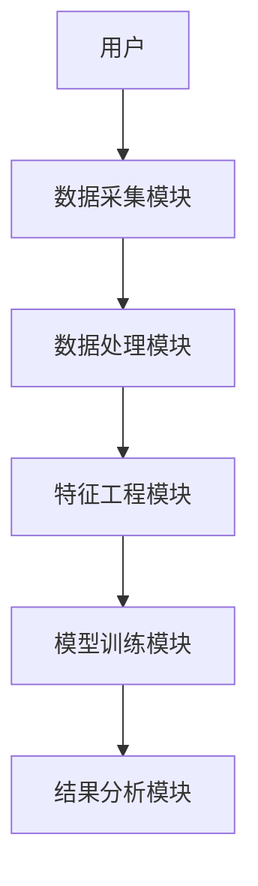
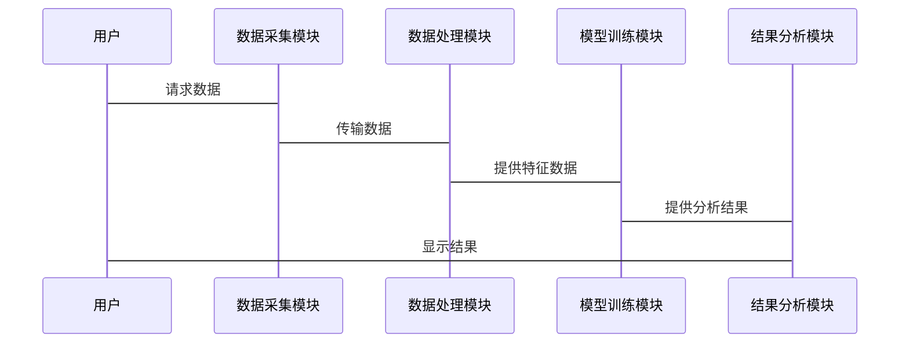

                 


# 全球股市估值与可持续水资源管理AI技术的关联

## 关键词：全球股市估值，可持续水资源管理，AI技术，金融与环境关联，机器学习

## 摘要：本文探讨了全球股市估值与可持续水资源管理之间的关联性，并分析了人工智能技术在其中的作用。文章从背景与概述出发，详细阐述了核心概念与关联机制，介绍了AI技术在两者中的应用原理，展示了系统的架构设计，并通过实际案例分析了AI技术在项目中的应用。最后，本文总结了最佳实践，并展望了未来的研究方向。

---

# 第一部分：全球股市估值与可持续水资源管理的背景与概述

## 第1章：全球股市估值与水资源管理的背景

### 1.1 全球股市估值的基本概念

#### 1.1.1 股票估值的定义与方法
股票估值是指通过对公司基本面、市场环境、行业地位等因素进行分析，确定股票合理价格的过程。常用的方法包括市盈率（P/E Ratio）、市净率（P/B Ratio）、股息率（Dividend Yield）等。

#### 1.1.2 全球股市的现状与趋势
全球股市经历了多次波动，但整体呈现增长趋势。近年来，可持续发展成为影响股市的重要因素，投资者越来越关注企业的社会责任和环境表现。

#### 1.1.3 股票市场与经济发展的关联
股票市场是经济的晴雨表，股市的波动反映了整体经济的健康状况。企业通过股市融资，推动经济发展，而经济的稳定又反过来影响股市表现。

---

### 1.2 可持续水资源管理的核心概念

#### 1.2.1 水资源管理的基本原理
水资源管理涉及水的收集、分配、利用和保护。可持续水资源管理强调在满足当前需求的同时，不损害后代的用水权益。

#### 1.2.2 可持续水资源管理的目标与挑战
目标包括确保水资源的合理分配、防止水资源污染、提高水资源利用效率等。挑战包括气候变化、人口增长、技术限制等。

#### 1.2.3 水资源管理与环境保护的关系
水资源管理是环境保护的重要组成部分，良好的水资源管理可以减少水污染、保护生态系统，从而促进可持续发展。

---

## 第2章：AI技术在金融与水资源管理中的应用前景

### 2.1 AI技术在金融领域的应用

#### 2.1.1 AI在股票预测中的作用
AI技术可以通过分析历史数据、市场情绪、新闻事件等，预测股票价格走势，帮助投资者做出更明智的投资决策。

#### 2.1.2 机器学习算法在金融分析中的应用
常用算法包括线性回归、支持向量机（SVM）、随机森林（Random Forest）等。这些算法可以帮助识别市场趋势、评估风险。

#### 2.1.3 AI在风险评估与投资组合优化中的价值
AI可以通过大数据分析，识别潜在风险，优化投资组合，降低风险敞口。

---

### 2.2 AI技术在水资源管理中的应用

#### 2.2.1 AI在水资源监测与分配中的作用
AI可以通过传感器数据、卫星图像等，实时监测水资源分布，优化水资源分配。

#### 2.2.2 数据挖掘在水资源管理中的应用
数据挖掘技术可以帮助识别水资源浪费、污染等问题，制定有效的管理策略。

#### 2.2.3 AI在水资源保护与可持续利用中的潜力
AI可以通过模拟和预测，帮助制定可持续的水资源利用计划，减少水资源浪费。

---

## 第3章：全球股市估值与可持续水资源管理的关联性分析

### 3.1 股市估值与水资源管理的间接联系

#### 3.1.1 水资源短缺对经济的影响
水资源短缺可能导致企业生产成本增加，影响企业盈利，进而影响股票估值。

#### 3.1.2 水资源管理对企业成本的影响
有效的水资源管理可以降低企业的用水成本，提高企业的盈利能力，从而影响股票估值。

#### 3.1.3 水资源风险对企业估值的影响
水资源风险（如水污染、水资源短缺）可能影响企业的长期发展潜力，进而影响股票估值。

---

### 3.2 AI技术在两者关联中的桥梁作用

#### 3.2.1 数据分析在关联性研究中的作用
通过AI技术分析股市数据和水资源管理数据，可以发现两者之间的潜在关联。

#### 3.2.2 AI算法在跨领域关联性分析中的应用
AI算法可以帮助识别股市估值与水资源管理之间的相关性，提供数据支持。

#### 3.2.3 可持续水资源管理对股市估值的长期影响
通过AI技术，可以预测可持续水资源管理对股市的长期影响，为投资者提供决策依据。

---

# 第二部分：AI技术在股市估值与水资源管理中的核心概念与关联机制

## 第4章：核心概念与关联机制的理论基础

### 4.1 股市估值的核心指标与模型

#### 4.1.1 市盈率（P/E Ratio）的定义与计算
市盈率是股票价格与每股收益的比值，用于衡量股票的估值水平。

$$ P/E = \frac{\text{股价}}{\text{每股收益}} $$

#### 4.1.2 市净率（P/B Ratio）的应用
市净率是股票价格与每股净资产的比值，用于衡量股票的估值水平。

$$ P/B = \frac{\text{股价}}{\text{每股净资产}} $$

#### 4.1.3 股息率（Dividend Yield）的意义
股息率是每股股息与股票价格的比值，用于衡量股票的投资回报率。

$$ \text{股息率} = \frac{\text{每股股息}}{\text{股价}} \times 100\% $$

---

### 4.2 可持续水资源管理的核心指标与模型

#### 4.2.1 水资源利用效率的衡量标准
水资源利用效率可以通过单位用水量的产出率来衡量。

$$ \text{水资源利用效率} = \frac{\text{产出量}}{\text{用水量}} $$

#### 4.2.2 水资源风险评估模型
水资源风险评估模型可以通过综合考虑水资源短缺、污染等因素，评估水资源的风险等级。

#### 4.2.3 可持续水资源管理的KPI分析
关键绩效指标（KPI）包括水资源使用量、水质改善率、节水效率等。

---

## 第5章：AI技术在股市估值与水资源管理中的应用原理

### 5.1 数据采集与特征工程

#### 5.1.1 股市数据的来源与处理
股市数据包括历史价格、成交量、财务数据等。数据需要清洗、转换和标准化处理。

#### 5.1.2 水资源数据的采集与预处理
水资源数据包括水质、水量、地理位置等。数据需要进行清洗、归一化和特征提取。

#### 5.1.3 特征选择与数据清洗方法
特征选择可以通过相关性分析、主成分分析（PCA）等方法进行。数据清洗包括处理缺失值、异常值等。

---

### 5.2 机器学习模型的选择与优化

#### 5.2.1 监督学习与无监督学习的应用场景
监督学习适用于有标签的数据，如股票价格预测。无监督学习适用于无标签的数据，如水资源分布分析。

#### 5.2.2 AI算法在跨领域关联性分析中的应用
常用的算法包括线性回归、支持向量机（SVM）、随机森林（Random Forest）等。

#### 5.2.3 模型训练与优化
模型训练可以通过交叉验证、网格搜索等方法进行优化，选择最佳参数组合。

---

## 第6章：系统架构与设计

### 6.1 问题场景介绍
本文设计了一个AI系统，用于分析全球股市估值与可持续水资源管理的关联性。

### 6.2 系统功能设计

#### 6.2.1 领域模型
```mermaid
classDiagram
    class 股票估值模型 {
        输入: 股票价格、财务数据
        输出: 预测股价
    }
    class 水资源管理模型 {
        输入: 水资源数据
        输出: 水资源风险评估
    }
    股票估值模型 --> 水资源管理模型
    股票估值模型 <---> AI算法
```

#### 6.2.2 系统架构


#### 6.2.3 系统接口设计
系统接口包括数据输入接口、模型调用接口、结果输出接口。

#### 6.2.4 系统交互


---

## 第7章：项目实战

### 7.1 环境安装

#### 7.1.1 安装Python
```bash
pip install python
```

#### 7.1.2 安装机器学习库
```bash
pip install scikit-learn numpy pandas
```

### 7.2 核心代码实现

#### 7.2.1 数据预处理
```python
import pandas as pd
import numpy as np

# 加载数据
data = pd.read_csv('stock_water.csv')

# 数据清洗
data.dropna()
data = data[~data.duplicated()]
```

#### 7.2.2 模型训练
```python
from sklearn.model import LinearRegression

# 训练模型
model = LinearRegression()
model.fit(X_train, y_train)

# 预测结果
y_pred = model.predict(X_test)
```

---

## 第8章：最佳实践与未来展望

### 8.1 最佳实践

#### 8.1.1 数据质量管理
确保数据的准确性和完整性，避免数据偏差。

#### 8.1.2 模型优化
定期更新模型，结合新的数据和市场变化，优化模型性能。

#### 8.1.3 结果解释
通过可视化工具，帮助用户理解模型结果，提供可操作的建议。

---

### 8.2 小结

本文通过AI技术分析了全球股市估值与可持续水资源管理的关联性，展示了AI技术在金融与环境领域的应用潜力。

---

### 8.3 注意事项

在实际应用中，需注意数据隐私、模型泛化能力等问题，确保系统的稳定性和可靠性。

---

### 8.4 拓展阅读

推荐阅读《机器学习实战》、《可持续发展报告》等书籍，深入了解AI技术与可持续发展的结合。

---

作者：AI天才研究院/AI Genius Institute & 禅与计算机程序设计艺术 /Zen And The Art of Computer Programming

