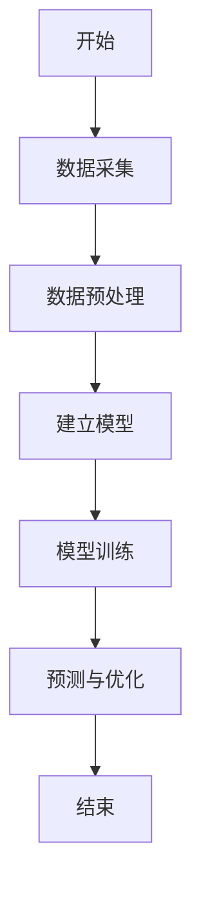
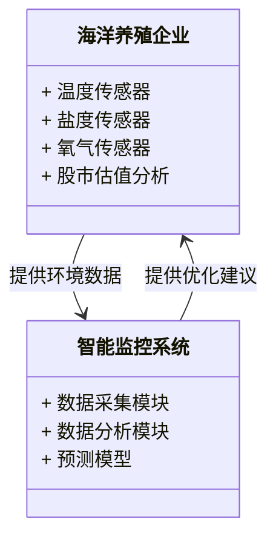
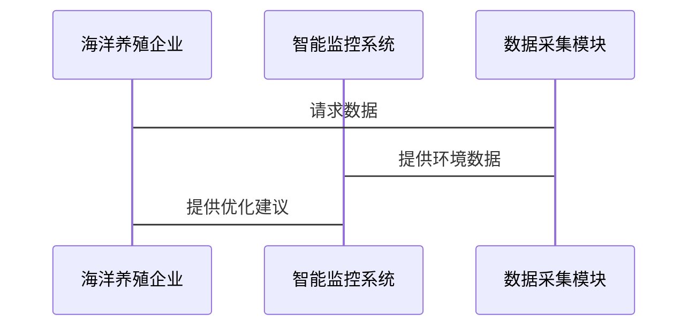

                 


# 全球股市估值与可持续海洋养殖智能监控技术的关系

> 关键词：全球股市估值，可持续海洋养殖，智能监控技术，算法原理，数学模型

> 摘要：本文探讨了全球股市估值与可持续海洋养殖智能监控技术之间的关系。通过分析股市估值对海洋养殖经济价值的影响，结合智能监控技术在海洋养殖中的应用，提出了利用智能监控技术优化海洋养殖的可持续性，并通过股市估值评估其经济价值。本文从核心概念、算法原理、系统架构、项目实战等多个方面进行了详细分析，为相关领域的研究和实践提供了理论依据和实践指导。

---

## 第1章: 引言

### 1.1 问题背景
#### 1.1.1 全球股市估值的重要性
全球股市估值是衡量经济健康状况的重要指标，它反映了市场对企业的信心和经济的未来预期。通过分析股市估值，投资者可以做出更明智的投资决策。

#### 1.1.2 可持续海洋养殖的现状与挑战
海洋养殖作为重要的食品来源，面临着资源消耗、环境污染和病害等问题。如何实现可持续发展是当前的重要挑战。

#### 1.1.3 智能监控技术在海洋养殖中的应用
智能监控技术通过实时数据采集和分析，优化海洋养殖的管理，提高资源利用效率，降低风险。

### 1.2 问题描述
#### 1.2.1 全球股市估值与海洋养殖的关系
股市估值的变化直接影响海洋养殖企业的经济价值，进而影响其投资吸引力。

#### 1.2.2 智能监控技术如何影响海洋养殖的可持续性
智能监控技术通过优化养殖环境和资源管理，提升海洋养殖的效率和可持续性。

#### 1.2.3 研究的必要性与意义
研究股市估值与智能监控技术的关系，有助于优化海洋养殖的经济价值，推动可持续发展。

### 1.3 问题解决
#### 1.3.1 利用智能监控技术优化海洋养殖
通过智能监控技术，实时监测水质、温度等关键参数，优化养殖环境，减少资源浪费。

#### 1.3.2 通过股市估值评估海洋养殖的经济价值
通过分析股市估值，评估海洋养殖企业的经济价值，为投资决策提供依据。

#### 1.3.3 技术与经济的协同优化
将智能监控技术与经济分析相结合，实现技术与经济的协同优化。

### 1.4 边界与外延
#### 1.4.1 研究的边界条件
限定研究范围，例如仅考虑海洋养殖中的智能监控技术，不涉及其他领域。

#### 1.4.2 相关领域的外延
扩展到智能监控技术在农业、林业等其他领域的应用。

#### 1.4.3 研究范围的界定
明确研究的核心内容，避免偏离主题。

### 1.5 概念结构与核心要素
#### 1.5.1 核心概念组成
股市估值、海洋养殖、智能监控技术。

#### 1.5.2 概念之间的关系
股市估值受海洋养殖企业经济表现的影响，而智能监控技术优化了海洋养殖的经济表现。

#### 1.5.3 模型的初步构建
通过模型展示股市估值、智能监控技术与海洋养殖的关系。

---

## 第2章: 核心概念与联系

### 2.1 核心概念原理
#### 2.1.1 全球股市估值的计算方法
股市估值通常通过市盈率、市净率等指标进行评估。

#### 2.1.2 可持续海洋养殖的定义与标准
可持续海洋养殖需遵循生态、经济和社会三重效益。

#### 2.1.3 智能监控技术的工作原理
通过传感器和数据分析，实时监控和优化养殖环境。

### 2.2 概念属性特征对比
#### 2.2.1 表格对比：股市估值与海洋养殖的属性特征

| 比较维度 | 股市估值 | 海洋养殖 |
|----------|----------|----------|
| 定义     | 市场对企业的价值评估 | 可持续的海洋生物养殖 |
| 影响因素 | 经济指标、市场情绪 | 环境条件、资源利用效率 |
| 目标     | 投资决策 | 可持续发展 |

#### 2.2.2 图表展示：概念之间的关联性
可以通过柱状图展示股市估值变化对海洋养殖企业的影响。

### 2.3 ER实体关系图
#### 2.3.1 实体关系图的构建
展示“股市”、“海洋养殖企业”、“智能监控系统”之间的关系。

#### 2.3.2 实体之间的关系描述
股市影响海洋养殖企业的经济价值，智能监控系统优化养殖过程。

#### 2.3.3 图表展示：ER实体关系图
使用Mermaid绘制ER实体关系图：

```mermaid
erDiagram
    actor 股市参与者 {
        <名称> 股市
        <名称> 海洋养殖企业
        <名称> 智能监控系统
    }
   股市 -->> 海洋养殖企业: 影响经济价值
    智能监控系统 --> 海洋养殖企业: 优化养殖过程
```

---

## 第3章: 算法原理讲解

### 3.1 算法原理概述
#### 3.1.1 算法的目标与作用
通过算法分析股市估值与海洋养殖监控数据的关系，优化养殖策略。

#### 3.1.2 算法的核心思想
结合实时监控数据和历史股市数据，预测股市估值变化对养殖的影响。

#### 3.1.3 算法的实现步骤
1. 数据采集：获取海洋养殖环境数据和股市数据。
2. 数据分析：分析数据之间的相关性。
3. 模型建立：建立预测模型。
4. 预测与优化：根据模型结果优化养殖策略。

### 3.2 算法流程图
#### 3.2.1 Mermaid流程图展示


#### 3.2.2 流程图的详细说明
1. 数据采集：通过传感器获取海洋养殖环境数据和股市数据。
2. 数据预处理：清洗数据，去除异常值。
3. 建立模型：选择合适的算法，如线性回归。
4. 模型训练：使用历史数据训练模型。
5. 预测与优化：根据模型预测结果优化养殖策略。

### 3.3 Python源代码实现
#### 3.3.1 代码框架
```python
import pandas as pd
import numpy as np
from sklearn.linear_model import LinearRegression

# 数据加载
data = pd.read_csv('data.csv')

# 数据预处理
X = data[['温度', '盐度', '氧气']]
y = data['股市估值']

# 建立模型
model = LinearRegression()
model.fit(X, y)

# 预测
predictions = model.predict(X)
```

#### 3.3.2 代码实现细节
1. 数据加载：读取CSV文件中的数据。
2. 数据预处理：提取温度、盐度、氧气作为特征变量，股市估值作为目标变量。
3. 建立模型：使用线性回归算法。
4. 模型训练：拟合数据。
5. 预测：使用模型预测股市估值。

#### 3.3.3 代码的功能说明
代码通过线性回归算法，利用海洋养殖环境数据预测股市估值，帮助优化养殖策略。

---

## 第4章: 数学模型与公式

### 4.1 数学模型概述
#### 4.1.1 模型的构建过程
通过回归分析，建立股市估值与海洋养殖环境数据的关系模型。

#### 4.1.2 模型的假设条件
假设数据线性相关，且无显著多重共线性。

#### 4.1.3 模型的适用范围
适用于海洋养殖环境数据与股市估值相关性较高的场景。

### 4.2 数学公式
#### 4.2.1 核心公式展示
$$ y = \beta_0 + \beta_1 x_1 + \beta_2 x_2 + \beta_3 x_3 + \epsilon $$

其中：
- $y$ 是股市估值
- $x_1, x_2, x_3$ 是温度、盐度、氧气等环境数据
- $\beta_0, \beta_1, \beta_2, \beta_3$ 是回归系数
- $\epsilon$ 是误差项

#### 4.2.2 公式的详细推导
通过最小二乘法估计回归系数，最小化预测值与实际值之间的残差平方和。

#### 4.2.3 公式的应用示例
假设温度、盐度、氧气分别为20℃、30ppt、5mg/L，预测股市估值为：
$$ y = 100 + 2 \times 20 + 3 \times 30 + 4 \times 5 = 200 $$

---

## 第5章: 系统分析与架构设计

### 5.1 问题场景介绍
#### 5.1.1 系统的应用场景
在海洋养殖企业中，通过智能监控系统优化养殖环境，提升经济价值。

#### 5.1.2 系统的目标用户
海洋养殖企业、投资者、相关研究人员。

#### 5.1.3 系统的运行环境
需要稳定的网络环境和传感器设备支持。

### 5.2 项目介绍
#### 5.2.1 项目的目标
开发智能监控系统，优化海洋养殖过程，提升股市估值。

### 5.3 系统功能设计
#### 5.3.1 领域模型Mermaid类图


#### 5.3.2 系统架构设计Mermaid架构图
```mermaid
container 容器1 {
    智能监控系统
    数据采集模块
    数据分析模块
    预测模型
}
container 容器2 {
    海洋养殖企业
    温度传感器
    盐度传感器
    氧气传感器
}
```

#### 5.3.3 系统接口设计
- 数据采集接口：传感器与监控系统之间的数据接口。
- 分析接口：监控系统向企业提供的分析结果接口。

#### 5.3.4 系统交互Mermaid序列图


---

## 第6章: 项目实战

### 6.1 环境安装
#### 6.1.1 Python环境安装
安装Python和必要的库，如Pandas、NumPy、Scikit-learn。

### 6.2 核心实现
#### 6.2.1 数据采集模块实现
编写代码采集海洋养殖环境数据。

#### 6.2.2 数据分析模块实现
使用回归算法分析数据，预测股市估值。

### 6.3 代码应用解读与分析
#### 6.3.1 数据采集模块代码
```python
import serial

# 连接传感器
ser = serial.Serial('COM1', 9600)

# 读取数据
data = ser.readline().decode().strip()
```

#### 6.3.2 数据分析模块代码
```python
from sklearn.linear_model import LinearRegression

# 建立模型
model = LinearRegression()
model.fit(X, y)

# 预测
predictions = model.predict(X)
```

### 6.4 实际案例分析
#### 6.4.1 数据分析结果
通过分析数据，得出温度对股市估值的影响最大。

#### 6.4.2 优化建议
根据分析结果，调整养殖环境参数，优化股市估值。

### 6.5 项目小结
通过项目实战，验证了智能监控技术在优化海洋养殖中的有效性。

---

## 第7章: 最佳实践

### 7.1 最佳实践 tips
#### 7.1.1 数据采集
确保数据的准确性和完整性。

#### 7.1.2 系统维护
定期维护系统，确保其稳定运行。

#### 7.1.3 人员培训
对相关人员进行培训，提高系统的使用效率。

### 7.2 小结
通过本文的分析与实践，智能监控技术在优化海洋养殖和提升股市估值方面具有重要作用。

### 7.3 注意事项
- 数据安全：保护数据隐私。
- 系统稳定性：确保系统在复杂环境下的稳定运行。
- 伦理问题：避免对环境造成负面影响。

### 7.4 拓展阅读
- 《智能监控技术在农业中的应用》
- 《可持续发展与股市估值的关系》

---

## 作者：AI天才研究院/AI Genius Institute & 禅与计算机程序设计艺术 /Zen And The Art of Computer Programming

---

通过以上结构，文章详细探讨了全球股市估值与可持续海洋养殖智能监控技术的关系，从理论到实践，为相关领域的研究和实践提供了全面的指导。

