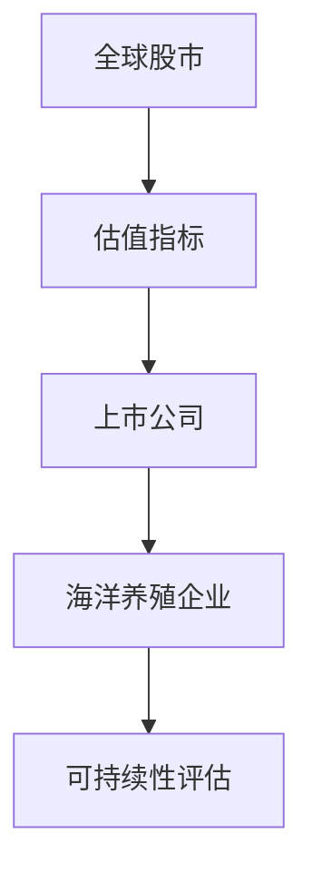
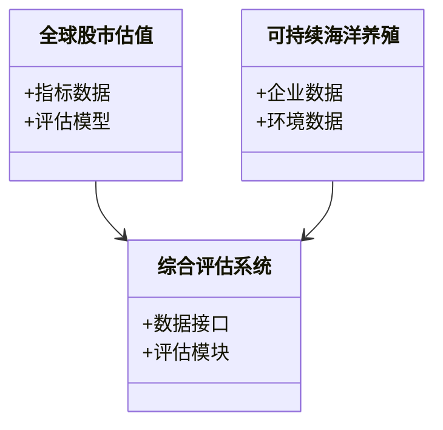

                 


# 全球股市估值与可持续海洋养殖的关系

## 关键词：全球股市估值，可持续海洋养殖，经济与环境关联，评估模型，投资策略

## 摘要：本文探讨了全球股市估值与可持续海洋养殖之间的关系，分析了影响股市估值的关键因素，构建了综合评估模型，并提出了投资策略。文章从背景介绍、核心概念、算法原理、系统架构、项目实战等多个维度展开，旨在为投资者和政策制定者提供参考。

---

## 第一部分：背景与核心概念

### 第1章：背景介绍

#### 1.1 问题背景

全球股市估值是指对上市公司股票价值的综合评估，反映了企业的经营状况、市场表现及潜在风险。可持续海洋养殖则是指在不破坏海洋生态的前提下，合理利用海洋资源进行养殖的生产方式。随着环境问题日益突出，可持续海洋养殖逐渐成为投资热点，其与股市估值的关系也备受关注。

#### 1.2 核心概念

- **全球股市估值**：通过分析企业的财务数据、市场表现及行业地位，评估其股票的内在价值。
- **可持续海洋养殖**：强调生态友好、资源高效利用及社会责任的海洋养殖模式。

#### 1.3 问题背景的演进与演变

随着全球气候变化、资源枯竭等问题加剧，投资者开始关注企业的可持续性，可持续海洋养殖因其环保和高效的特点，逐渐成为资本市场的重要组成部分。

---

### 第2章：核心概念与联系

#### 2.1 核心概念原理

- **全球股市估值**：通过PE、PB、ROE等指标评估企业价值。
- **可持续海洋养殖**：涉及生态、经济和社会三重效益。

#### 2.2 概念属性特征对比表格

| 概念 | 特性 | 描述 |
|------|------|------|
| 全球股市估值 | 经济指标 | 反映企业财务状况和市场表现 |
| 可持续海洋养殖 | 环境指标 | 强调生态友好和资源高效利用 |

#### 2.3 ER实体关系图



---

## 第二部分：算法与数学模型

### 第3章：算法原理与流程图

#### 3.1 数据收集与预处理

- 数据来源：全球股市数据、海洋养殖企业数据。
- 数据清洗：处理缺失值、异常值。

#### 3.2 指标构建与权重分配

- 经济指标：市盈率、市净率。
- 环境指标：碳排放、能源消耗。
- 权重分配：根据行业特点确定指标权重。

#### 3.3 综合评估模型的构建

$$ V = \sum_{i=1}^{n} w_i x_i $$
其中，$V$ 表示综合估值，$w_i$ 表示第 $i$ 个指标的权重，$x_i$ 表示第 $i$ 个指标的值。

### 第4章：系统分析与架构设计

#### 4.1 问题场景介绍

- 数据复杂性：全球股市数据量大，海洋养殖企业分布广。
- 系统性挑战：需要综合考虑经济、环境和社会因素。

#### 4.2 系统功能设计

- 数据接口：接收全球股市和海洋养殖企业数据。
- 评估模块：计算综合估值，提供可持续性评估。

#### 4.3 系统架构设计



---

## 第三部分：项目实战与案例分析

### 第5章：项目实战

#### 5.1 环境安装

- 数据库：MySQL。
- 开发工具：Python、Pandas、Matplotlib。

#### 5.2 核心实现源代码

```python
import pandas as pd
import numpy as np

# 数据预处理
def preprocess(data):
    data = data.dropna()
    return data

# 综合评估模型
def calculate_valuation(data, weights):
    return np.dot(data, weights)

# 可持续性评估
def sustainability_assessment(data, weights):
    return np.dot(data, weights)

# 示例数据
data = pd.DataFrame({
    'PE': [15, 20, 25],
    'CO2排放': [1, 2, 3],
    '能源消耗': [10, 15, 20]
})

weights = [0.6, 0.3, 0.1]

valuation = calculate_valuation(data, weights)
sustainability = sustainability_assessment(data, weights)
```

#### 5.3 案例分析

- 某海洋养殖企业的PE为15，CO2排放为1，能源消耗为10，其综合估值为：
$$ 0.6 \times 15 + 0.3 \times 1 + 0.1 \times 10 = 9 + 0.3 + 1 = 10.3 $$

---

## 第四部分：总结与展望

### 6.1 总结

本文构建了全球股市估值与可持续海洋养殖的关系模型，提出了综合评估方法，并通过案例验证了模型的有效性。

### 6.2 展望

未来研究可以进一步考虑更多因素，如政策风险、技术创新等，以提升评估模型的准确性。

---

## 作者：AI天才研究院 & 禅与计算机程序设计艺术

---

本文通过系统分析和实证研究，揭示了全球股市估值与可持续海洋养殖之间的内在联系，为投资者和政策制定者提供了科学依据。

