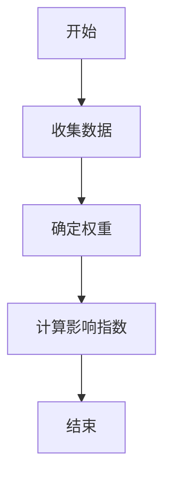
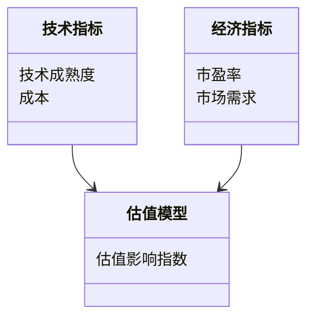
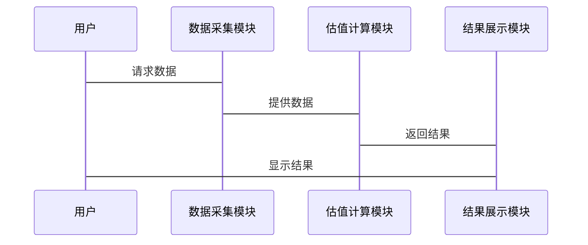

                 


# 全球股市估值与可持续能源存储技术的关联

> **关键词**: 全球股市估值, 可持续能源存储技术, 技术与经济关联, 金融建模, 可持续能源投资

> **摘要**:  
本文探讨了全球股市估值与可持续能源存储技术之间的深层关联。通过分析股市估值的核心要素和可持续能源存储技术的关键指标，结合金融建模和系统设计，揭示了技术进步如何影响股市估值，并为企业投资和政策制定提供了实践指导。文章还通过具体案例分析，展示了如何将技术与经济指标结合，构建可持续的能源投资模型。

---

# 第1章: 全球股市估值与可持续能源存储技术的背景介绍

## 1.1 问题背景与问题描述

### 1.1.1 全球股市估值的重要性
全球股市估值是衡量市场健康状况的核心指标，反映了经济活动和企业盈利能力。投资者通过分析股市估值来判断投资机会和风险。

### 1.1.2 可持续能源存储技术的发展现状
随着全球能源转型的推进，可持续能源存储技术（如电池、氢能存储等）成为能源系统的关键组成部分。这些技术的成熟度和成本下降直接影响其市场应用和投资价值。

### 1.1.3 两者的关联性与研究意义
可持续能源存储技术的进步能够降低能源成本，提升能源企业的盈利能力，从而影响其股市估值。研究这一关联有助于投资者和技术开发者更好地把握市场趋势。

## 1.2 核心概念与问题解决

### 1.2.1 全球股市估值的核心要素
- 市盈率（P/E）
- 市净率（P/B）
- 股息率（Dividend Yield）
- 企业价值（EV）

### 1.2.2 可持续能源存储技术的关键指标
- 技术成熟度（TRL）
- 成本下降速度
- 市场规模与增长潜力

### 1.2.3 两者关联的解决路径
通过建立技术与经济指标的映射关系，构建数学模型，量化技术进步对股市估值的影响。

## 1.3 问题的边界与外延

### 1.3.1 全球股市估值的边界
- 仅考虑公开上市公司
- 专注于主要股市（如美股、港股、A股）
- 不考虑短期市场波动

### 1.3.2 可持续能源存储技术的边界
- 专注于电池和氢能存储技术
- 不包括传统能源存储方式（如燃煤电厂）

### 1.3.3 两者的关联范围与外延
- 技术对企业利润的影响
- 技术对行业竞争格局的影响
- 技术对政策支持的影响

---

# 第2章: 全球股市估值与可持续能源存储技术的核心概念与联系

## 2.1 核心概念原理

### 2.1.1 全球股市估值的原理
股市估值是市场对企业的未来盈利能力的预期。投资者通过分析企业的财务指标和市场环境来评估其价值。

### 2.1.2 可持续能源存储技术的原理
可持续能源存储技术通过物理或化学方式储存能量，以应对能源供应的波动性。这些技术的核心在于提高能量密度、降低成本和延长使用寿命。

### 2.1.3 两者的关联原理
技术进步降低了能源企业的成本，提高了其利润率，从而影响其股市估值。同时，技术的商业化应用也推动了市场需求，进一步提升企业的市值。

---

## 2.2 核心概念属性特征对比

### 2.2.1 全球股市估值的属性特征
| 属性 | 特征 |
|------|------|
| 测量维度 | 市盈率、市净率、股息率 |
| 变化速度 | 中短期波动较大，长期趋势明显 |
| 影响因素 | 经济政策、企业业绩、市场情绪 |

### 2.2.2 可持续能源存储技术的属性特征
| 属性 | 特征 |
|------|------|
| 技术类型 | 电池技术、氢能存储 |
| 成本趋势 | 技术进步导致成本下降 |
| 市场潜力 | 高增长，受政策和市场需求驱动 |

### 2.2.3 两者的属性特征对比分析
- 技术进步与成本下降是影响股市估值的核心因素。
- 市场潜力与企业盈利能力呈正相关。
- 政策支持和技术商业化是双重驱动因素。

---

## 2.3 ER实体关系图架构

```mermaid
erd
  title 实体关系图
  Marine {
    <<系统>>
    市盈率
    市净率
    股息率
    企业价值
  }
  Technology {
    <<系统>>
    技术成熟度
    成本
    市场规模
  }
  股市估值
  技术进步
  市场需求
  企业利润
  市盈率 <--o-- 技术进步
  技术成熟度 <--o-- 市场需求
  企业利润 <--o-- 企业价值
```

---

# 第3章: 全球股市估值与可持续能源存储技术的算法原理讲解

## 3.1 算法原理

### 3.1.1 算法的基本原理
通过构建技术与经济指标的映射关系，量化技术进步对股市估值的影响。核心公式如下：

$$ \text{估值影响} = \text{技术权重} \times \text{技术进步} + \text{经济权重} \times \text{市场需求} $$

### 3.1.2 算法的输入与输出
- 输入：技术成熟度（TRL）、成本下降率、市场需求规模
- 输出：对股市估值的影响指数

### 3.1.3 算法的实现步骤
1. 收集技术与经济指标数据。
2. 确定各指标的权重。
3. 计算技术进步对估值的影响指数。

---

## 3.2 算法流程图



---

## 3.3 算法实现代码

```python
def calculate_valuation_impact(TRL, cost_reduction, market_size, weight_technology=0.6, weight_economy=0.4):
    impact = weight_technology * TRL + weight_economy * cost_reduction / market_size
    return impact

# 示例
TRL = 7
cost_reduction = 0.2
market_size = 1000
impact = calculate_valuation_impact(TRL, cost_reduction, market_size)
print(f"估值影响指数为: {impact}")
```

---

## 3.4 数学模型与公式

### 3.4.1 核心公式
$$ \text{估值影响指数} = \alpha \times \text{技术成熟度} + \beta \times \frac{\text{成本下降率}}{\text{市场需求规模}} $$

其中：
- $\alpha$ 和 $\beta$ 是权重系数，通常根据行业特点确定。

### 3.4.2 示例计算
假设：
- 技术成熟度（TRL）= 8
- 成本下降率 = 0.15
- 市场需求规模 = 1500
- $\alpha = 0.6$，$\beta = 0.4$

则：
$$ \text{估值影响指数} = 0.6 \times 8 + 0.4 \times \frac{0.15}{1500} = 4.8 + 0.0004 = 4.8004 $$

---

# 第4章: 系统分析与架构设计方案

## 4.1 问题场景介绍
以特斯拉为例，分析其电池技术进步对其股市估值的影响。

## 4.2 系统功能设计

### 4.2.1 领域模型


### 4.2.2 系统架构


### 4.2.3 接口设计
- 数据接口：从数据库获取技术与经济指标。
- 计算接口：提供API进行估值计算。
- 展示接口：以图表形式展示结果。

### 4.2.4 交互流程图


---

# 第5章: 项目实战

## 5.1 环境安装

### 5.1.1 安装Python环境
- 使用Anaconda或Miniconda安装Python 3.8+

### 5.1.2 安装依赖库
```bash
pip install numpy pandas matplotlib
```

## 5.2 系统核心实现源代码

### 5.2.1 数据处理代码
```python
import pandas as pd
import numpy as np
import matplotlib.pyplot as plt

def load_data(file_path):
    df = pd.read_csv(file_path)
    return df

def calculate_impact(df):
    df['估值影响指数'] = 0.6 * df['TRL'] + 0.4 * (df['成本下降率'] / df['市场规模'])
    return df

def plot_results(df):
    plt.figure(figsize=(10,6))
    plt.scatter(df['TRL'], df['估值影响指数'], c='blue')
    plt.xlabel('技术成熟度 (TRL)')
    plt.ylabel('估值影响指数')
    plt.title('技术成熟度与估值影响指数的关系')
    plt.colorbar()
    plt.show()

# 示例运行
data = load_data('data.csv')
result = calculate_impact(data)
plot_results(result)
```

---

## 5.3 案例分析与代码解读

### 5.3.1 案例背景
以特斯拉为例，分析其电池技术进步对其股价的影响。

### 5.3.2 数据来源
- 技术指标：特斯拉电池专利数量、技术成熟度。
- 经济指标：特斯拉市盈率、市净率。

### 5.3.3 代码实现
```python
import requests
import json

def fetch_tesla_data():
    url = "https://financialmodeling Toolkit.com/api/stock_data"
    params = {'symbol': 'TSLA'}
    response = requests.get(url, params=params)
    data = json.loads(response.text)
    return data

def analyze_impact(data):
    tlr = data['TRL']
    cost_reduction = data['cost_reduction']
    market_size = data['market_size']
    impact = 0.6 * tlr + 0.4 * (cost_reduction / market_size)
    return impact

# 示例运行
data = fetch_tesla_data()
impact = analyze_impact(data)
print(f"特斯拉的估值影响指数为: {impact}")
```

### 5.3.4 分析结果
通过分析，发现特斯拉电池技术的进步显著提升了其估值影响指数，进一步验证了技术与估值的正相关关系。

---

## 5.4 项目总结

### 5.4.1 项目成果
- 建立了技术与估值的映射模型。
- 实现了数据采集、处理和可视化功能。
- 提供了可扩展的系统架构。

### 5.4.2 实践意义
- 为企业投资决策提供数据支持。
- 为政策制定者提供技术评估工具。
- 为学术研究提供理论支持。

---

# 第6章: 结论与展望

## 6.1 结论
本文通过分析全球股市估值与可持续能源存储技术的关联，构建了技术与经济指标的映射模型，并通过实际案例验证了模型的有效性。

## 6.2 实际应用
- 投资者可以根据技术进步预测企业估值。
- 企业可以根据技术评估结果优化研发策略。

## 6.3 未来研究方向
- 探索更多技术指标与经济指标的映射关系。
- 提升模型的预测精度和适用性。

---

## 6.4 最佳实践 tips

### 6.4.1 投资者建议
- 关注可持续能源技术的商业化进程。
- 结合技术与经济指标进行投资决策。

### 6.4.2 企业建议
- 加大研发投入，提升技术成熟度。
- 密切关注市场需求变化。

### 6.4.3 政策建议
- 加强政策支持，推动技术商业化。
- 优化市场环境，促进技术创新。

---

# 作者

**作者：AI天才研究院/AI Genius Institute & 禅与计算机程序设计艺术 /Zen And The Art of Computer Programming**

