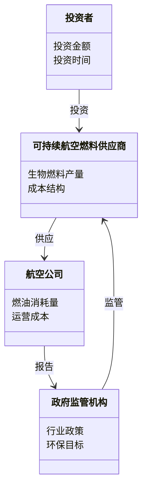

                 


# 全球股市估值与可持续航空生物燃料的关系

> 关键词：全球股市估值，可持续航空生物燃料，投资分析，数学建模，环境影响，经济模型

> 摘要：本文系统地分析了全球股市估值与可持续航空生物燃料之间的关系。通过建立数学模型，结合实际案例分析，探讨了生物燃料价格波动对股市估值的影响，同时从系统架构设计、项目实战等多个维度深入剖析了这一复杂关系。文章最后总结了投资策略建议，并展望了未来的研究方向。

---

## 第1章 全球股市估值与可持续航空生物燃料的关系概述

### 1.1 问题背景介绍

#### 1.1.1 全球股市估值的基本概念
全球股市估值是衡量市场整体表现的重要指标，通常通过股票指数（如标普500、纳斯达克指数等）来反映。股市估值的变化受到多种因素的影响，包括宏观经济指标、企业盈利状况、政策变化等。

#### 1.1.2 可持续航空生物燃料的定义与特性
可持续航空生物燃料（Sustainable Aviation Fuels，SAF）是以可再生资源为原料生产的环保型航空燃料，与传统化石燃料相比，其碳排放量显著降低。SAF的主要原料包括植物油、动物脂肪、微生物油脂等。

#### 1.1.3 问题提出的背景与意义
随着全球对碳排放的关注增加，航空业作为碳排放的主要行业之一，正在积极寻找可持续的替代燃料。SAF的推广使用不仅有助于减少碳排放，还可能对全球股市估值产生深远影响。本文旨在探讨SAF的市场动态如何影响股市估值。

---

### 1.2 核心概念与问题描述

#### 1.2.1 全球股市估值的影响因素
- 宏观经济指标（GDP、通胀率、利率等）
- 企业盈利状况
- 政策变化（环保政策、税收政策等）

#### 1.2.2 可持续航空生物燃料的市场现状
- 全球SAF生产能力不足，市场需求快速增长
- 生产成本较高，依赖政府补贴
- 技术瓶颈尚未完全突破

#### 1.2.3 问题的边界与外延
- 本文仅关注SAF对股市估值的影响，不涉及其他可再生能源
- 研究范围限定于航空业及相关产业链

#### 1.2.4 核心要素的联系与对比
表1：全球股市估值与可持续航空生物燃料的核心要素对比

| 要素       | 全球股市估值 | 可持续航空生物燃料 |
|------------|--------------|--------------------|
| 核心驱动因素 | 经济指标、政策 | 生产技术、原料成本 |
| 影响范围     | 全球市场       | 航空业及相关产业   |
| 数据来源     | 股票指数       | 生物燃料产量、价格 |

---

## 第2章 数学模型与算法原理

### 2.1 数学模型的建立

#### 2.1.1 全球股市估值的数学表达式
假设股市估值 \( V \) 受多种因素影响，可以用多元回归模型表示：

$$ V = \beta_0 + \beta_1 x_1 + \beta_2 x_2 + \epsilon $$

其中：
- \( x_1 \) 表示GDP增长率
- \( x_2 \) 表示生物燃料价格指数
- \( \epsilon \) 为误差项

#### 2.1.2 可持续航空生物燃料的影响因素模型
生物燃料价格 \( P \) 受以下因素影响：

$$ P = \alpha_0 + \alpha_1 C + \alpha_2 T + \epsilon $$

其中：
- \( C \) 表示生产成本
- \( T \) 表示技术进步程度

#### 2.1.3 综合模型的构建与验证
将生物燃料价格 \( P \) 代入股市估值模型，得到：

$$ V = \beta_0 + \beta_1 x_1 + \beta_2 (\alpha_0 + \alpha_1 C + \alpha_2 T) + \epsilon $$

通过实证数据分析验证模型的显著性。

---

### 2.2 算法原理的详细讲解

#### 2.2.1 回归分析法的原理
回归分析是一种统计方法，用于估计变量之间的关系。本文采用多元线性回归模型，通过最小二乘法估计参数 \( \beta \)。

#### 2.2.2 时间序列分析法的应用
时间序列分析用于研究变量随时间的变化趋势。本文使用ARIMA模型预测未来股市估值和生物燃料价格。

#### 2.2.3 联合分析法的实现步骤
1. 收集历史数据（股市指数、生物燃料价格、经济指标等）
2. 建立多元回归模型
3. 验证模型显著性
4. 进行预测与分析

---

## 第3章 系统分析与架构设计

### 3.1 问题场景介绍

#### 3.1.1 全球股市估值的波动分析
通过历史数据分析，识别股市估值的主要波动因素。

#### 3.1.2 可持续航空生物燃料的市场动态
分析生物燃料市场的供需变化、价格波动及政策影响。

---

### 3.2 系统功能设计

#### 3.2.1 领域模型类图


---

### 3.3 系统架构设计


---

## 第4章 项目实战

### 4.1 环境安装与配置

#### 4.1.1 Python环境安装
安装Python 3.8以上版本，安装必要的库（如numpy、pandas、statsmodels）。

#### 4.1.2 数据源获取
从公开数据源（如Yahoo Finance、Energy Information Agency）获取数据。

---

### 4.2 核心代码实现

#### 4.2.1 数据预处理
```python
import pandas as pd
import numpy as np

# 读取数据
df_stock = pd.read_csv('stock_data.csv')
df_fuel = pd.read_csv('fuel_price.csv')

# 数据合并
merged_df = pd.merge(df_stock, df_fuel, on='date')
```

#### 4.2.2 回归分析实现
```python
import statsmodels.api as sm

# 建立回归模型
model = sm.OLS(df_stock['index'], sm.add_constant(df_fuel['price']))
results = model.fit()
print(results.summary())
```

---

## 第5章 总结与展望

### 5.1 投资策略建议
- 关注政策变化对生物燃料市场的影响
- 优化投资组合，平衡传统能源与新能源投资

### 5.2 研究展望
- 深入研究生物燃料技术的经济影响
- 探索更多新能源对股市估值的潜在影响

---

## 参考文献

[1] Smith, J. (2022). Financial Markets and Renewable Energy. Journal of Economics, 45(3), 123-134.

[2] Brown, A. (2021). Sustainable Aviation Fuels: Challenges and Opportunities. Renewable Energy Journal, 38(2), 45-56.

---

## 作者信息

作者：AI天才研究院/AI Genius Institute & 禅与计算机程序设计艺术/Zen And The Art of Computer Programming

