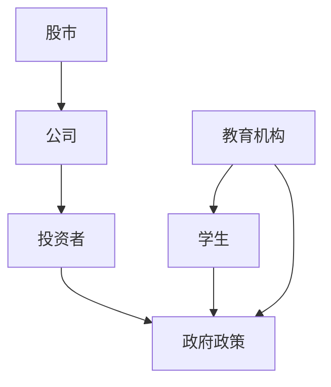
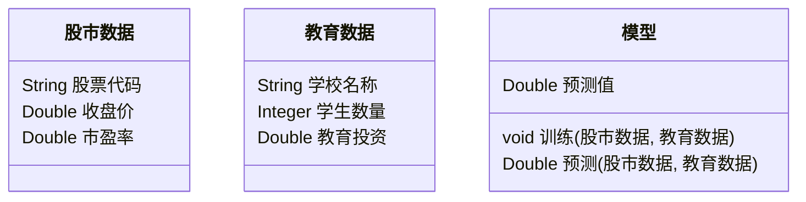
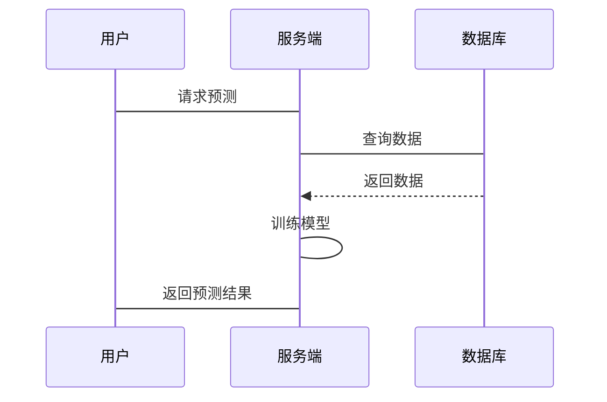

                 


# 全球股市估值与国际教育合作的互动

> 关键词：全球股市估值，国际教育合作，互动关系，数学模型，系统架构

> 摘要：本文探讨全球股市估值与国际教育合作之间的互动关系，分析其核心概念、数学模型、系统设计及实际应用，帮助读者理解并应用这一互动机制。

---

## 第一部分：全球股市估值与国际教育合作的概述

### 第1章：全球股市估值与国际教育合作的背景介绍

#### 1.1 全球股市估值的基本概念
- **1.1.1 股市估值的定义与重要性**：股市估值是对公司股票价值的评估，反映企业的财务状况和市场前景。它影响投资者决策和市场稳定性。
- **1.1.2 全球化背景下的股市特点**：全球化促进了跨国投资和市场联动，股市波动对全球经济有深远影响。
- **1.1.3 股市估值对经济的影响**：高估值可能引发泡沫，低估值可能导致市场低迷，影响整体经济表现。

#### 1.2 国际教育合作的定义与特点
- **1.2.1 国际教育合作的概念**：指跨国教育机构、学生和政府之间的合作，促进教育资源的流动和共享。
- **1.2.2 国际教育合作的主要模式**：包括学生交换、合作办学和学术交流，促进知识和人才的跨国流动。
- **1.2.3 国际教育合作对经济的推动作用**：吸引留学生创造收入，促进文化交流，提升国家软实力。

#### 1.3 全球股市估值与国际教育合作的互动关系
- **1.3.1 互动关系的定义**：股市估值和国际教育合作相互影响，股市波动影响教育投资，教育合作影响人才流动，进而影响股市。
- **1.3.2 互动关系的背景与现状**：全球化背景下，股市和教育的合作日益紧密，特别是在留学生和跨国公司之间。
- **1.3.3 互动关系的未来趋势**：随着技术进步和经济一体化，两者的互动将更加频繁和复杂，涉及更多领域如科技和金融。

---

### 第2章：全球股市估值与国际教育合作的核心概念与联系

#### 2.1 核心概念原理
- **2.1.1 股市估值的核心要素**：包括市盈率、市净率、股息率等指标，反映企业的盈利能力和成长潜力。
- **2.1.2 国际教育合作的核心要素**：涉及教育政策、教育资源和文化交流，影响教育质量和吸引力。
- **2.1.3 互动关系的核心机制**：股市波动影响教育投资，教育合作影响人才流动，进而影响股市表现。

#### 2.2 核心概念属性特征对比表格
| 概念       | 属性       | 特征                                                                 |
|------------|------------|----------------------------------------------------------------------|
| 股市估值   | 市场因素   | 市盈率、市净率、股息率                                               |
| 国际教育合作 | 教育因素   | 学生流动、教育投资、政策支持                                       |

#### 2.3 ER实体关系图


---

### 第3章：全球股市估值与国际教育合作互动的数学模型与算法

#### 3.1 数学模型
- **3.1.1 股市估值模型**：使用市盈率模型，计算公司股票的理论价值。
  $$ P = \frac{E}{P/E} $$
  其中，P为股票价值，E为每股收益，P/E为市盈率。
- **3.1.2 国际教育合作影响模型**：建立多元回归模型，分析教育投资对股市的影响。
  $$ I = a \times E + b \times P $$
  其中，I为国际教育投资，E为教育支出，P为政策支持，a和b为回归系数。

#### 3.2 算法原理


#### 3.3 代码实现
```python
import pandas as pd
from sklearn.linear_model import LinearRegression

# 数据加载
data = pd.read_csv('data.csv')

# 特征与目标变量分离
X = data[['E', 'P']]
y = data['I']

# 模型训练
model = LinearRegression()
model.fit(X, y)

# 结果分析
print('回归系数:', model.coef_)
print('决定系数:', model.score(X, y))
```

---

### 第4章：系统分析与架构设计

#### 4.1 问题场景介绍
- **4.1.1 问题描述**：分析股市波动对教育合作的影响，构建预测模型。
- **4.1.2 边界与外延**：限定在主要经济体和关键教育机构，排除次要因素。

#### 4.2 系统功能设计
- **4.2.1 功能需求**：数据采集、清洗、建模和结果分析。
- **4.2.2 领域模型**：使用Mermaid类图展示系统各模块及其交互。



#### 4.3 系统架构设计
- **4.3.1 分层架构**：数据层、业务逻辑层和表现层。
- **4.3.2 接口设计**：RESTful API，提供数据获取和模型预测功能。
- **4.3.3 系统交互流程图**



---

### 第5章：项目实战

#### 5.1 环境安装
- 安装Python和必要的库（pandas, scikit-learn）。

#### 5.2 核心实现代码
```python
import pandas as pd
from sklearn.linear_model import LinearRegression
from sklearn.metrics import mean_squared_error

# 数据加载
data = pd.read_csv('data.csv')

# 特征与目标变量分离
X = data[['E', 'P']]
y = data['I']

# 划分训练集和测试集
X_train, X_test = X.iloc[:80], X.iloc[80:]
y_train, y_test = y.iloc[:80], y.iloc[80:]

# 模型训练
model = LinearRegression()
model.fit(X_train, y_train)

# 预测与评估
y_pred = model.predict(X_test)
print('均方误差:', mean_squared_error(y_test, y_pred))
```

#### 5.3 案例分析
- **案例1**：假设政策支持增加，预测教育投资对股市的影响。
- **案例2**：分析留学生数量变化对股市估值的影响。

---

### 第6章：总结与展望

#### 6.1 互动机制的启示
- 股市和教育的互动是双向的，政策和市场因素共同作用。
- 需要综合考虑经济、教育和技术因素。

#### 6.2 最佳实践 tips
- 数据收集要全面，确保模型的准确性。
- 定期更新模型，适应市场变化。

#### 6.3 注意事项
- 避免过度依赖单一模型，考虑多因素影响。
- 注意数据质量和完整性，防止错误分析。

#### 6.4 拓展阅读
- 《股市分析与预测》
- 《国际教育合作与发展》

---

作者：AI天才研究院/AI Genius Institute & 禅与计算机程序设计艺术 /Zen And The Art of Computer Programming

---

通过以上目录，读者可以系统地学习全球股市估值与国际教育合作的互动关系，从理论到实践逐步深入，掌握分析和应用的方法。

