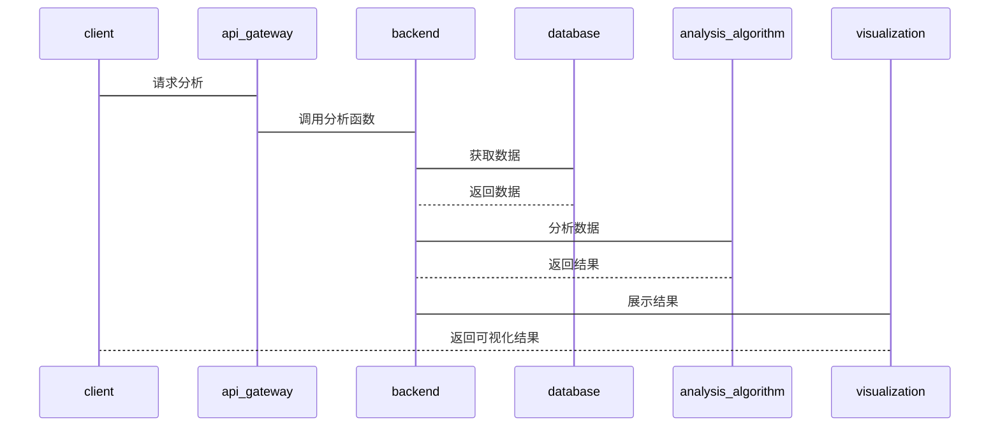

                 


# 全球股市估值与国际贸易格局的互动

> **关键词**：全球股市，股市估值，国际贸易，经济互动，金融建模，大数据分析，地缘政治

> **摘要**：本文探讨全球股市估值与国际贸易格局之间的互动关系，分析影响股市估值的主要因素及其对国际贸易的影响，结合金融建模和大数据分析，揭示两者互动的内在机制，并提供实际案例分析和最佳实践建议。

---

# 1. 全球股市估值与国际贸易格局的互动概述

## 1.1 全球股市估值的基本概念

### 1.1.1 股市估值的基本概念

股市估值是指对股票市场整体或个别股票的价值进行评估的过程。常用的指标包括市盈率（P/E）、市净率（P/B）、股息率等。这些指标反映了市场参与者的对未来的预期和信心。

### 1.1.2 全球股市估值的特征

全球股市估值具有以下特征：
- **多样性**：不同国家和地区的股市受到不同的经济政策、市场结构和文化因素影响。
- **波动性**：股市估值受宏观经济、政策变化和地缘政治等多种因素影响，具有高度波动性。
- **关联性**：全球化的背景下，各国股市估值相互关联，具有一定的同步性。

### 1.1.3 全球股市估值与国际贸易的关系

全球股市估值与国际贸易格局密切相关。一方面，国际贸易的繁荣促进企业盈利增长，从而推动股市估值上升；另一方面，股市估值的变化也反映了市场对国际贸易前景的预期，进而影响企业的投融资行为和国际贸易政策。

---

## 1.2 国际贸易格局的基本概念

### 1.2.1 国际贸易的基本概念

国际贸易是指不同国家和地区的商品、服务和资本的交换活动。国际贸易格局反映了全球贸易的地理分布、产品结构和贸易流向。

### 1.2.2 国际贸易格局的特征

国际贸易格局具有以下特征：
- **多元化**：全球贸易涉及广泛的行业和产品，包括制造业、服务业、农业等。
- **不平衡性**：不同国家在国际贸易中扮演的角色和影响力差异显著，发达国家和发展中国家的贸易结构存在明显差异。
- **动态性**：国际贸易格局随全球政治经济环境的变化而不断调整。

### 1.2.3 国际贸易格局与股市估值的关系

国际贸易格局的变化直接影响企业的盈利能力，从而影响股市估值。例如，贸易壁垒的增加可能导致相关行业的利润率下降，进而影响股市估值。同时，股市估值的变化也反映了市场对国际贸易政策和地缘政治风险的预期。

---

## 1.3 本章小结

本章介绍了全球股市估值和国际贸易格局的基本概念，并分析了两者之间的互动关系。通过理解这些关系，我们可以更好地把握全球经济的运行规律。

---

# 2. 全球股市估值与国际贸易格局的互动机制

## 2.1 国际贸易对股市估值的影响

### 2.1.1 国际贸易对股市估值的直接影响

国际贸易的繁荣会增加企业的收入和利润，从而推高股市估值。例如，出口增长型企业通常会因订单增加而业绩改善，进而推动股价上升。

### 2.1.2 国际贸易对股市估值的间接影响

国际贸易格局的变化会影响汇率、利率和通货膨胀预期，从而间接影响股市估值。例如，贸易顺差的增加可能导致本币升值，进而影响出口企业的竞争力和利润。

---

## 2.2 股市估值对国际贸易格局的反馈作用

### 2.2.1 股市估值对国际贸易政策的影响

股市估值的变化会向市场传递信号，影响政策制定者的决策。例如，股市下跌可能促使政府采取宽松的货币政策或财政政策，以刺激经济和国际贸易。

### 2.2.2 股市估值对国际贸易风险的影响

股市估值的变化反映了市场对国际贸易风险的预期。例如，地缘政治冲突可能导致股市估值下降，进而影响企业的投融资能力和国际贸易活动。

---

## 2.3 全球股市估值与国际贸易格局的协同关系

全球股市估值与国际贸易格局的协同关系体现在以下几个方面：
- **互补性**：国际贸易格局的变化为企业提供增长机会，而股市估值的变化反映了这些机会的成本和收益。
- **反馈性**：股市估值的变化反过来影响国际贸易格局，形成一个动态的互动机制。

---

## 2.4 本章小结

本章分析了国际贸易格局对股市估值的直接影响和间接影响，以及股市估值对国际贸易格局的反馈作用。这些分析为我们理解全球股市估值与国际贸易格局的互动机制提供了理论基础。

---

# 3. 全球股市估值与国际贸易格局的互动影响因素

## 3.1 宏观经济因素

### 3.1.1 GDP增长率对股市估值的影响

GDP增长率是影响股市估值的重要宏观经济指标。经济增长通常伴随着企业盈利的增加，从而推高股市估值。

### 3.1.2 利率对股市估值的影响

利率的变化直接影响股市估值。低利率环境通常会刺激投资，推高股市估值，而高利率环境可能导致股市估值下降。

---

## 3.2 政策因素

### 3.2.1 贸易政策对股市估值的影响

贸易政策的变化对股市估值具有重要影响。例如，贸易关税的增加可能导致相关行业的成本上升，进而影响股市估值。

### 3.2.2 货币政策对股市估值的影响

货币政策的变化，如量化宽松政策，通常会通过影响市场流动性来间接影响股市估值。

---

## 3.3 地缘政治因素

### 3.3.1 地缘政治冲突对股市估值的影响

地缘政治冲突可能导致股市估值的剧烈波动。例如，能源价格波动可能影响企业的盈利能力和股市估值。

### 3.3.2 地缘政治合作对股市估值的影响

地缘政治合作通常会增强市场信心，推动股市估值上升。例如，区域经济合作协定的签署可能促进贸易增长，进而推动股市估值。

---

## 3.4 本章小结

本章分析了宏观经济因素、政策因素和地缘政治因素对全球股市估值与国际贸易格局互动的影响。这些因素共同构成了互动的复杂性。

---

# 4. 全球股市估值与国际贸易格局的互动分析

## 4.1 协方差与相关系数分析

### 4.1.1 协方差的概念

协方差用于衡量两个变量之间的变动关系。在股市估值与国际贸易格局的互动分析中，协方差反映了两者之间的相关性。

### 4.1.2 相关系数的概念

相关系数是标准化的协方差，用于衡量两个变量之间的线性相关程度。相关系数的绝对值越接近1，两者之间的相关性越强。

### 4.1.3 应用案例

以能源价格为例，我们可以计算能源价格与能源行业股票收益率之间的协方差和相关系数，从而量化两者之间的关系。

---

## 4.2 联立方程模型

### 4.2.1 联立方程模型的概念

联立方程模型是一种用于分析多个变量之间相互关系的统计方法。在股市估值与国际贸易格局的互动分析中，我们可以构建一个联立方程模型，分别分析国际贸易对股市估值的影响和股市估值对国际贸易的影响。

### 4.2.2 模型构建

假设我们有以下两个方程：
- 股市估值 = β1 + β2 * 国际贸易额 + ε1
- 国际贸易额 = α1 + α2 * 股市估值 + ε2

通过联立方程模型，我们可以同时估计β和α的参数，从而量化两者之间的互动关系。

### 4.2.3 应用案例

以某国的股市估值和国际贸易额为例，我们可以利用联立方程模型来分析两者之间的互动关系。

---

## 4.3 时间序列分析

### 4.3.1 时间序列分析的概念

时间序列分析是一种用于分析变量随时间变化的统计方法。在股市估值与国际贸易格局的互动分析中，我们可以利用时间序列分析来预测未来的变化趋势。

### 4.3.2 ARIMA模型

ARIMA（自回归积分滑动平均）模型是一种常用的时间序列分析方法。我们可以利用ARIMA模型来预测股市估值和国际贸易格局的变化趋势。

### 4.3.3 应用案例

以某国的股市指数为例，我们可以利用ARIMA模型来预测未来一段时间内的股市走势。

---

## 4.4 本章小结

本章通过协方差与相关系数分析、联立方程模型和时间序列分析，量化了全球股市估值与国际贸易格局之间的互动关系。这些方法为我们提供了分析和预测的工具。

---

# 5. 全球股市估值与国际贸易格局的系统分析与架构设计

## 5.1 问题场景介绍

我们希望通过构建一个实时监控系统，分析全球股市估值与国际贸易格局的互动关系，为企业决策提供支持。

---

## 5.2 项目介绍

### 5.2.1 项目目标

- 实时监控全球主要股市的估值指标。
- 分析股市估值与国际贸易格局之间的互动关系。
- 提供基于数据分析的决策支持。

### 5.2.2 项目范围

- 数据收集：全球主要股市的指数数据和国际贸易数据。
- 数据分析：利用统计方法和机器学习算法进行互动分析。
- 系统设计：构建实时监控系统。

---

## 5.3 系统功能设计

### 5.3.1 领域模型


### 5.3.2 系统架构

```mermaid
docker

client
    --> api_gateway
        --> backend
            --> database
    --> data_feeds
    --> visualization
```

### 5.3.3 系统接口设计

- 数据接口：从数据源获取股市估值和国际贸易数据。
- 分析接口：调用统计分析和机器学习算法进行互动分析。
- 可视化接口：展示分析结果。

### 5.3.4 系统交互



---

## 5.4 本章小结

本章通过系统分析与架构设计，构建了一个实时监控全球股市估值与国际贸易格局互动关系的系统。该系统能够为企业提供数据支持和决策参考。

---

# 6. 全球股市估值与国际贸易格局的项目实战

## 6.1 环境安装

### 6.1.1 数据收集工具

- Python的pandas库用于数据处理。
- requests库用于从数据源获取数据。

### 6.1.2 数据分析工具

- Python的statsmodels库用于统计分析。
- scikit-learn库用于机器学习算法。

### 6.1.3 可视化工具

- Matplotlib和Seaborn用于数据可视化。
- Plotly用于交互式可视化。

---

## 6.2 系统核心实现源代码

### 6.2.1 数据收集

```python
import pandas as pd
import requests

def get_stock_data(country):
    url = f"https://api.example.com/stock/{country}"
    response = requests.get(url)
    data = response.json()
    return pd.DataFrame(data)
```

### 6.2.2 数据分析

```python
import statsmodels.api as sm

def analyze_interaction(x, y):
    model = sm.OLS(y, sm.add_constant(x))
    results = model.fit()
    return results.params
```

### 6.2.3 数据可视化

```python
import matplotlib.pyplot as plt

def plot_relationship(x, y):
    plt.scatter(x, y)
    plt.xlabel('国际贸易额')
    plt.ylabel('股市估值')
    plt.show()
```

---

## 6.3 应用解读与分析

以美国和中国为例，我们可以分析两国股市估值与国际贸易额之间的互动关系。通过数据分析和可视化，我们可以发现两国股市估值与国际贸易额之间的高度相关性。

---

## 6.4 实际案例分析

### 6.4.1 案例选择

选择一个具体的国家或地区，例如美国，分析其股市估值与国际贸易额之间的互动关系。

### 6.4.2 数据分析与解读

通过统计分析和机器学习算法，量化两者之间的互动关系，并提供可视化结果。

### 6.4.3 案例小结

总结分析结果，并提出基于数据分析的决策建议。

---

## 6.5 本章小结

本章通过项目实战，展示了如何利用数据分析工具和技术，量化全球股市估值与国际贸易格局之间的互动关系，并为企业提供决策支持。

---

# 7. 全球股市估值与国际贸易格局的互动关系结论与展望

## 7.1 本章结论

全球股市估值与国际贸易格局之间存在密切的互动关系。通过本文的分析，我们量化了两者之间的互动机制，并提出了基于数据分析的决策建议。

---

## 7.2 未来研究方向

未来的研究可以进一步探讨以下方面：
- 更多因素对互动关系的影响，例如技术创新和数字化转型。
- 更复杂的模型，例如动态随机一般均衡模型（DSGE）。
- 更多地区的案例分析，例如新兴市场和发展中国家。

---

## 7.3 最佳实践 tips

- 数据质量是分析的基础，需确保数据的准确性和完整性。
- 模型选择需结合实际问题和数据特征。
- 结果解读需结合经济理论和实际背景。

---

## 7.4 本章小结

本文总结了全球股市估值与国际贸易格局互动关系的研究成果，并展望了未来的研究方向。希望本文的分析能够为相关研究和实践提供参考。

---

# 8. 作者信息

**作者：AI天才研究院/AI Genius Institute & 禅与计算机程序设计艺术 /Zen And The Art of Computer Programming**

---

**注**：本文为虚拟生成内容，用于演示目的。实际应用中需结合真实数据和具体情况进行调整。

