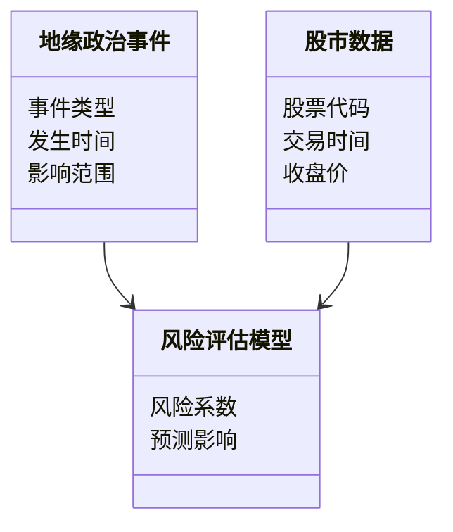
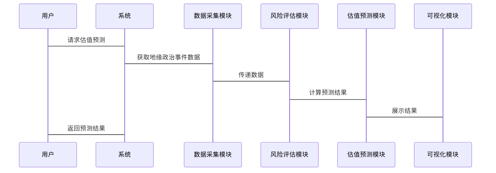

                 


# 全球股市估值与地缘政治风险的关系

---

## 关键词：
全球股市估值、地缘政治风险、风险评估、数据分析、投资策略、系统架构

---

## 摘要：
本文探讨了全球股市估值与地缘政治风险之间的复杂关系。通过分析地缘政治事件对股市估值的影响，结合数据分析和数学建模，提出了量化风险影响的算法和模型。文章还提供了系统架构设计和实际案例分析，帮助投资者和研究人员更好地理解地缘政治风险对股市估值的影响，并制定有效的投资策略。

---

## 正文：

### 第一部分：背景与概述

#### 第1章：问题背景与核心概念

##### 1.1 问题背景
- **全球化经济与股市的相互影响**：随着全球经济一体化的加深，股市成为反映经济状况的重要指标。地缘政治风险作为影响经济的重要因素，对股市估值产生显著影响。
- **地缘政治风险的定义与分类**：地缘政治风险是指因政治冲突、外交紧张、政策变化等因素导致的市场波动风险。常见的类型包括战争风险、贸易摩擦、政治动荡等。
- **股市估值的基本概念**：股市估值是通过分析公司基本面、市场情绪和宏观经济指标，对股票价格进行预测和评估的过程。

##### 1.2 地缘政治风险对股市的影响
- **地缘政治事件的类型与特征**：例如战争、贸易制裁、政治选举等事件，均可能引发市场波动。
- **地缘政治风险对股市的具体影响机制**：通过影响投资者情绪、企业盈利能力和市场流动性，进而影响股市估值。

##### 1.3 股市估值的关键指标
- 市盈率（P/E Ratio）
- 市净率（P/B Ratio）
- 市销率（P/S Ratio）
- 股息率（Dividend Yield）

##### 1.4 问题解决与边界
- **如何量化地缘政治风险对股市的影响**：通过建立数学模型，将地缘政治事件转化为可量化的风险指标。
- **研究的边界与限制**：数据获取的难度、模型的简化假设等。

---

### 第二部分：核心概念与联系

#### 第2章：地缘政治风险与股市估值的核心概念

##### 2.1 地缘政治风险的分类与属性
- **风险类型**：战争风险、贸易摩擦、政治动荡、政策变化等。
- **风险属性**：突发性、不确定性、传染性。

##### 2.2 股市估值的关键指标与影响因素
- **影响因素**：宏观经济指标、企业盈利、市场情绪、政策变化等。

##### 2.3 两者关系的模型构建
- **模型目标**：建立地缘政治风险与股市估值之间的关系模型。
- **模型输入**：地缘政治事件数据、股市估值数据。
- **模型输出**：风险对估值的具体影响。

---

### 第三部分：数据分析与建模

#### 第3章：数据收集与处理

##### 3.1 数据来源
- 历史股市数据（如标普500指数）
- 地缘政治事件数据（如战争、贸易摩擦等）
- 宏观经济指标（如GDP、通胀率）

##### 3.2 数据预处理
- 数据清洗：处理缺失值、异常值。
- 数据标准化：统一数据格式和时间序列。

#### 第4章：风险评估模型

##### 4.1 数据分析算法
- 时间序列分析（ARIMA）
- 事件影响分析（Event Study）

##### 4.2 风险影响系数计算
- 使用回归模型量化地缘政治事件对股市的影响系数。

#### 第5章：估值模型的构建

##### 5.1 估值模型的数学推导
- $$\text{预测股价} = \beta \times \text{市场指数} + \epsilon$$

##### 5.2 模型验证
- 使用历史数据验证模型的准确性。

---

### 第四部分：系统分析与架构设计

#### 第6章：系统架构设计

##### 6.1 问题场景介绍
- 系统目标：实时监控地缘政治风险，预测股市估值。
- 系统功能：数据采集、风险评估、估值预测、可视化展示。

##### 6.2 系统功能设计（领域模型）


##### 6.3 系统架构设计


##### 6.4 接口设计与交互


---

### 第五部分：项目实战

#### 第7章：环境安装与核心代码实现

##### 7.1 环境安装
- Python 3.8+
- Pandas、NumPy、Scikit-learn、Matplotlib

##### 7.2 核心代码实现
```python
import pandas as pd
from sklearn.linear_model import LinearRegression
from sklearn.metrics import mean_squared_error

# 数据加载
df = pd.read_csv('stock_data.csv')

# 特征工程
features = df[['market_cap', 'pe_ratio', 'event_risk']]
target = df['stock_price']

# 模型训练
model = LinearRegression()
model.fit(features, target)

# 模型预测
predictions = model.predict(features)
print(mean_squared_error(target, predictions))
```

##### 7.3 代码解读与分析
- 使用线性回归模型预测股市估值。
- 通过均方误差评估模型性能。

#### 第8章：案例分析与结果解读
- 以某次地缘政治事件为例，分析其对股市估值的具体影响。
- 展示模型预测结果与实际数据的对比。

---

### 第六部分：最佳实践与总结

#### 第9章：最佳实践 tips
- 数据质量是关键，确保数据的完整性和准确性。
- 结合多种模型进行验证，提高预测的准确性。

#### 第10章：小结
- 本文通过数据分析和数学建模，揭示了地缘政治风险对股市估值的影响。
- 提供了系统的解决方案和实际案例分析，为投资者和研究人员提供了参考。

#### 第11章：注意事项
- 模型的简化假设可能会影响预测的准确性。
- 需要实时更新数据和模型，以适应市场变化。

#### 第12章：拓展阅读
- 推荐阅读相关领域的书籍和论文，深入研究地缘政治风险与股市估值的关系。

---

## 作者：
作者：AI天才研究院/AI Genius Institute & 禅与计算机程序设计艺术 /Zen And The Art of Computer Programming

