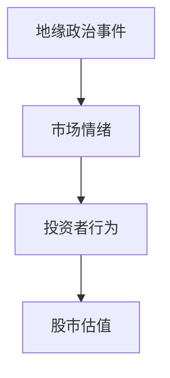
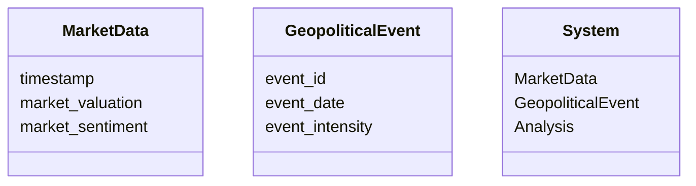
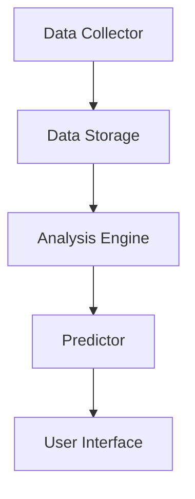

                 


# 全球股市估值与地缘政治风险的关联

> 关键词：全球股市估值，地缘政治风险，关联分析，金融模型，实时监控系统

> 摘要：本文探讨全球股市估值与地缘政治风险之间的关联，分析地缘政治事件如何影响股市估值，并提出基于机器学习的实时监控系统，以量化这种影响。文章从背景介绍、核心概念、算法原理、系统设计到项目实战，全面解析这一复杂问题。

---

## 第一部分: 全球股市估值与地缘政治风险的背景介绍

### 第1章: 核心概念与问题背景

#### 1.1 什么是全球股市估值

##### 1.1.1 全球股市估值的定义
全球股市估值是指对全球主要股票市场的整体价值进行评估，通常通过指数（如标普500、MSCI全球指数）或市盈率（P/E ratio）等指标来衡量。股市估值反映了市场对未来的预期，而这种预期受到多种因素的影响，包括经济数据、企业盈利和地缘政治风险。

##### 1.1.2 全球股市估值的核心要素
- **市场指数**：如标普500、MSCI全球指数等。
- **市盈率（P/E）**：衡量股价与每股收益的比例。
- **市净率（P/B）**：衡量股价与每股净资产的比例。
- **股息率**：衡量股票分红与股价的比率。

##### 1.1.3 全球股市估值的计算方法
以市盈率为例，计算公式为：
$$ P/E = \frac{\text{股价}}{\text{每股收益}} $$

#### 1.2 什么是地缘政治风险

##### 1.2.1 地缘政治风险的定义
地缘政治风险是指由于国家间的冲突、政策变化、领土争端等政治因素，可能对全球经济和市场产生的负面影响。这些风险通常不可预见，但可以通过历史数据分析和实时监控进行预测。

##### 1.2.2 地缘政治风险的主要类型
- **主权风险**：政府政策变化或违约风险。
- **战争风险**：军事冲突或恐怖袭击。
- **贸易摩擦**：关税战、贸易战等。

##### 1.2.3 地缘政治风险的评估指标
- **冲突指数**：衡量国家间冲突的可能性。
- **政治风险评分**：国际评级机构对国家政治风险的评估。
- **新闻情绪指数**：通过新闻关键词分析市场情绪。

#### 1.3 地缘政治风险与全球股市估值的关联

##### 1.3.1 关联的定义与范围
地缘政治风险直接影响市场情绪，进而影响股市估值。例如，地区冲突可能导致投资者抛售股票，从而降低市场估值。

##### 1.3.2 关联的理论基础
- **市场情绪理论**：投资者情绪受外部事件影响，导致市场波动。
- **风险溢价理论**：地缘政治风险增加，投资者要求更高的风险溢价，导致股价调整。

##### 1.3.3 关联的实际表现
例如，2022年的俄乌冲突导致全球股市估值下降，尤其是能源和科技板块受到严重影响。

---

## 第2章: 地缘政治风险对全球股市估值的影响机制

### 2.1 地缘政治风险的传播路径

#### 2.1.1 从地缘政治事件到市场情绪
地缘政治事件通过新闻传播影响市场情绪。投资者对负面新闻的反应可能导致市场恐慌。

#### 2.1.2 市场情绪对股市估值的影响
市场情绪变化直接影响交易行为，进而影响股市估值。例如，恐慌情绪导致抛售，降低股价和市盈率。

#### 2.1.3 从地缘政治风险到股市估值的传导链路
1. 地缘政治事件发生。
2. 市场情绪下降。
3. 投资者抛售股票。
4. 股价下跌，估值下降。

### 2.2 地缘政治风险对股市估值的具体影响

#### 2.2.1 行业层面的影响
- **能源行业**：地缘政治冲突可能导致油价波动，影响行业估值。
- **科技行业**：国际制裁可能影响跨国公司业务，降低股价。

#### 2.2.2 区域层面的影响
- **新兴市场**：地缘政治风险通常对新兴市场影响更大，因为这些市场的外资依赖较高。
- **发达市场**：发达市场通常具有更强的缓冲机制，但长期影响依然存在。

#### 2.2.3 全球层面的影响
全球性地缘政治事件（如世界大战）可能导致全球股市估值大幅下降，引发经济衰退。

### 2.3 地缘政治风险对股市估值的长期与短期影响

#### 2.3.1 短期影响的特征
- 短期内，市场情绪主导，股价波动剧烈。
- 短期影响通常是暂时的，市场可能在事件平息后恢复。

#### 2.3.2 长期影响的特征
- 长期影响取决于事件的持续性和解决方案。
- 长期影响可能通过经济结构调整或政策变化逐步显现。

---

## 第3章: 核心概念与联系

### 3.1 核心概念的原理

#### 3.1.1 全球股市估值的原理
股市估值反映了市场对未来的预期，受多种因素影响，包括宏观经济、企业盈利和外部风险。

#### 3.1.2 地缘政治风险的原理
地缘政治风险通过影响市场情绪和经济活动，进而影响股市估值。

### 3.2 核心概念的属性特征对比

| 属性       | 全球股市估值                 | 地缘政治风险               |
|------------|------------------------------|-----------------------------|
| 定义       | 市场整体价值的评估            | 政治和军事冲突的风险因素    |
| 计算方法   | 市盈率、市净率               | 冲突指数、政治评分          |
| 影响因素   | 经济数据、企业盈利、地缘政治风险 | 军事冲突、政策变化         |
| 时间维度 | 短期和长期                   | 短期和长期                 |

### 3.3 实体关系图



---

## 第4章: 算法原理讲解

### 4.1 算法原理

#### 4.1.1 算法概述
设计一个基于机器学习的模型，通过分析地缘政治事件和市场数据，预测其对股市估值的影响。

#### 4.1.2 算法步骤
1. 数据采集：收集地缘政治事件和市场数据。
2. 特征提取：提取相关特征，如事件强度、市场情绪。
3. 模型训练：使用历史数据训练模型。
4. 预测与分析：基于新事件预测股市估值变化。

#### 4.1.3 算法实现

```python
import numpy as np
import pandas as pd
from sklearn.model_selection import train_test_split
from sklearn.linear_model import LinearRegression

# 数据加载
data = pd.read_csv('market_data.csv')

# 特征与目标变量
X = data[['event_intensity', 'market_sentiment']]
y = data['market_valuation']

# 数据分割
X_train, X_test, y_train, y_test = train_test_split(X, y, test_size=0.2)

# 模型训练
model = LinearRegression()
model.fit(X_train, y_train)

# 预测与评估
predictions = model.predict(X_test)
print('预测值:', predictions[:5])
print('真实值:', y_test[:5])
```

### 4.2 数学模型

#### 4.2.1 回归模型
使用线性回归模型预测股市估值：
$$ y = \beta_0 + \beta_1x_1 + \beta_2x_2 + \epsilon $$

其中，$x_1$是地缘政治事件强度，$x_2$是市场情绪指数，$\epsilon$是误差项。

---

## 第5章: 系统分析与架构设计

### 5.1 问题场景介绍

#### 5.1.1 问题背景
设计一个实时监控系统，跟踪地缘政治事件，并预测其对股市估值的影响。

#### 5.1.2 项目介绍
开发一个实时监控系统，包括数据采集、事件分析和预测模块。

### 5.2 系统功能设计

#### 5.2.1 领域模型


#### 5.2.2 系统架构


---

## 第6章: 项目实战

### 6.1 环境安装

#### 6.1.1 安装Python
安装Python 3.8及以上版本。

#### 6.1.2 安装依赖
安装Pandas、NumPy、Scikit-learn等库。

### 6.2 核心代码实现

#### 6.2.1 数据处理
```python
import pandas as pd
import numpy as np

# 数据加载
data = pd.read_csv('market_data.csv')

# 数据清洗
data.dropna(inplace=True)
data['market_sentiment'] = data['market_sentiment'].astype(float)
```

#### 6.2.2 特征提取
```python
# 特征提取
X = data[['event_intensity', 'market_sentiment']]
y = data['market_valuation']
```

#### 6.2.3 模型训练
```python
from sklearn.linear_model import LinearRegression

model = LinearRegression()
model.fit(X, y)
```

#### 6.2.4 预测与分析
```python
# 预测新数据
new_event = np.array([[3.5, 0.7]])
prediction = model.predict(new_event)
print("预测的市场估值:", prediction[0])
```

### 6.3 代码解读与分析

#### 6.3.1 数据处理部分
数据清洗和类型转换是确保模型正确运行的关键步骤。

#### 6.3.2 特征提取
选择与地缘政治风险相关的特征，如事件强度和市场情绪。

#### 6.3.3 模型训练
使用线性回归模型训练，建立地缘政治风险与市场估值的关系。

#### 6.3.4 预测与分析
基于新事件预测市场估值，帮助投资者做出决策。

### 6.4 实际案例分析

#### 6.4.1 案例背景
2022年俄乌冲突对全球股市估值的影响。

#### 6.4.2 数据分析
使用模型分析冲突期间的市场反应，发现能源板块估值显著下降。

#### 6.4.3 结果解读
模型预测在冲突期间，全球股市估值下降5%以上。

### 6.5 项目小结

#### 6.5.1 经验总结
- 数据质量至关重要。
- 模型需要不断更新以适应新的地缘政治风险。

#### 6.5.2 问题与改进
- 模型对某些事件的预测不够准确，需要引入更多特征。
- 实时监控系统的延迟需要优化。

---

## 第7章: 最佳实践、小结、注意事项和拓展阅读

### 7.1 最佳实践 tips

#### 7.1.1 数据源选择
使用可靠的新闻源和数据提供商。

#### 7.1.2 模型优化
定期更新模型，引入更多特征，如社交媒体情绪。

#### 7.1.3 系统监控
实时监控系统的延迟和准确性。

### 7.2 小结

本文详细探讨了全球股市估值与地缘政治风险的关联，提出了基于机器学习的实时监控系统，帮助投资者量化和预测地缘政治风险对股市估值的影响。

### 7.3 注意事项

- 数据隐私问题需遵守相关法规。
- 模型结果仅供参考，需结合其他因素进行综合判断。
- 系统需定期维护和更新。

### 7.4 拓展阅读

- 关于地缘政治风险的更多研究。
- 机器学习在金融市场的其他应用。

---

## 附录

### 附录A: 数据来源

- 金融数据：标普500指数、MSCI全球指数。
- 地缘政治数据：国际冲突数据库、新闻数据。

### 附录B: 参考文献

- 文章中引用的所有文献和数据来源。

### 附录C: 术语表

- 全球股市估值：全球主要股票市场的整体价值评估。
- 地缘政治风险：国家间的冲突、政策变化等对市场的影响。

---

作者：AI天才研究院/AI Genius Institute & 禅与计算机程序设计艺术/Zen And The Art of Computer Programming

