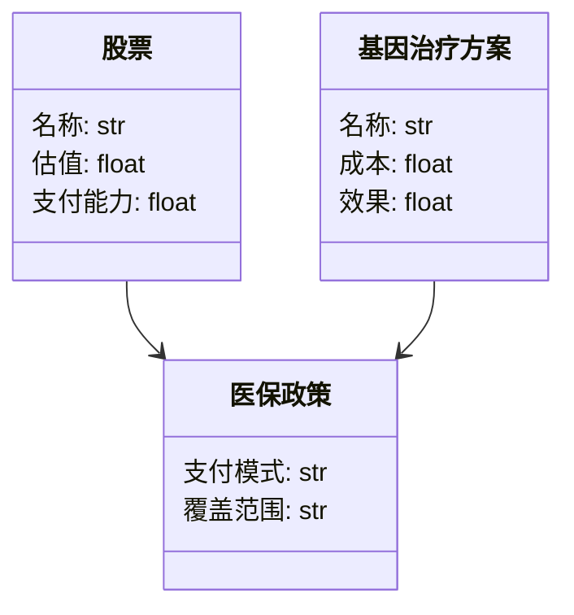
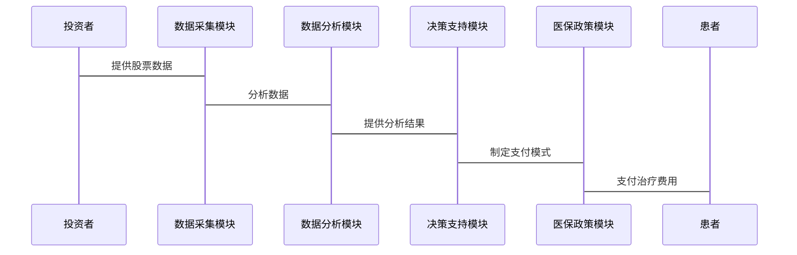

                 


# 全球股市估值与基因治疗的医疗保险政策框架

> 关键词：全球股市估值，基因治疗，医疗保险政策，多因子模型，支付模式，系统架构

> 摘要：本文探讨了如何将全球股市估值与基因治疗相结合，构建一个医疗保险政策框架。通过分析股市估值的核心概念和基因治疗的技术特点，提出了基于多因子模型的估值方法和优化模型的支付模式。结合系统架构设计，展示了如何将理论应用于实际案例，为医疗保险政策的制定提供了实践指导。

---

## 第一部分: 全球股市估值与基因治疗的背景与概念

### 第1章: 全球股市估值概述

#### 1.1 全球股市估值的基本概念
股票的估值是评估其内在价值的过程，常用的指标包括市盈率（P/E）、市净率（P/B）和股息率等。这些指标帮助投资者判断股票是否被高估或低估。经济周期、市场情绪和公司基本面都会影响股市估值。

#### 1.2 全球股市估值的现状
近年来，科技股的高估值现象引发了广泛关注。投资者需要结合宏观经济指标和公司财务数据，如收入增长率和利润率，来全面评估股票价值。

#### 1.3 估值与经济周期的关系
经济周期波动会影响股市估值。在经济扩张期，企业盈利增长，股票估值上升；而在衰退期，估值可能下降。投资者应关注GDP增长率和失业率等宏观经济指标。

### 第2章: 基因治疗与医疗保险政策框架

#### 2.1 基因治疗的基本概念
基因治疗通过修改基因序列治疗疾病，如镰状细胞贫血症和癌症。其技术发展迅速，但成本高昂，单次治疗费用可能高达数十万美元。

#### 2.2 基因治疗在医疗领域的应用
基因治疗主要用于罕见病和癌症，提高了治疗效果和生活质量。然而，高昂的成本限制了其广泛应用，需要通过医疗保险支付来解决。

#### 2.3 基因治疗的成本与支付模式
基因治疗的高成本使得医疗保险支付模式成为关键。按效果付费和风险分担机制是常用的支付模式，通过分期付款和效果评估来降低患者负担。

### 第3章: 背景与问题描述

#### 3.1 问题背景与研究意义
基因治疗的高成本和股市估值的波动性，使得医疗保险支付模式的设计成为挑战。如何平衡治疗成本和患者支付能力，是亟待解决的问题。

#### 3.2 问题描述与研究目标
本文旨在构建一个结合股市估值和基因治疗的框架，优化医疗保险支付模式，降低治疗成本，提高支付效率。

#### 3.3 问题解决的思路与方法
通过分析股市估值和基因治疗的关联，提出多因子模型和优化模型，设计一个动态调整的支付框架，实现成本与支付能力的平衡。

---

## 第二部分: 核心概念与联系

### 第4章: 核心概念与联系

#### 4.1 核心概念原理
全球股市估值和基因治疗的医疗保险支付模式相互影响。股市估值反映企业的财务健康，影响支付能力；基因治疗的成本和效果影响支付方式的设计。

#### 4.2 核心概念对比表
| 概念       | 全球股市估值                | 基因治疗                 |
|------------|-----------------------------|--------------------------|
| 核心要素   | 股价、市盈率                | 治疗技术、成本           |
| 特征       | 受市场波动影响              | 成本高，技术复杂         |
| 联系       | 估值影响支付能力           | 支付模式影响治疗普及     |

#### 4.3 ER实体关系图
```mermaid
er
  actor: 投资者
  actor: 患者
  actor: 医疗机构
  entity: 股票
  entity: 基因治疗方案
  entity: 医保政策
  entity: 估值模型
  entity: 支付方式
  entity: 成本分析
  entity: 效益评估
  entity: 风险评估
  entity: 数据分析
  entity: 决策支持
  entity: 支付能力
  entity: 治疗效果
  entity: 市场动态
  entity: 政策框架
  entity: 投资回报
  entity: 经济影响
  entity:社会效益
  entity: 政策效果
  entity: 技术发展
  entity: 市场需求
  entity: 资金分配
  entity: 支付模式
  entity: 技术成本
```

---

## 第三部分: 算法与数学模型

### 第5章: 算法原理讲解

#### 5.1 多因子模型
多因子模型用于评估股票价值，考虑多个因子如收益、成长性和流动性。公式如下：
$$
F = \alpha + \beta_1 R_m + \beta_2 (R_m - R_f) + \epsilon
$$
其中，$F$是因子，$\alpha$是截距，$\beta$是因子的系数，$R_m$是市场收益，$R_f$是无风险收益，$\epsilon$是误差项。

#### 5.2 优化模型
优化模型用于确定最佳支付模式，目标是最小化成本，最大化覆盖。数学模型为：
$$
\min \sum_{i=1}^n c_i x_i + \lambda \sum_{i=1}^n (y_i - d_i)^2
$$
其中，$c_i$是成本，$x_i$是支付变量，$y_i$是治疗效果，$d_i$是目标效果，$\lambda$是惩罚系数。

#### 5.3 Python实现
```python
import numpy as np
from sklearn.linear_model import LinearRegression

def multi_factor_model(data):
    # 数据预处理
    X = data[['收益', '成长性', '流动性']]
    y = data['股价']
    model = LinearRegression()
    model.fit(X, y)
    return model.coef_

# 示例数据
data = {'收益': [0.1, 0.2, 0.15], '成长性': [0.15, 0.25, 0.2], '流动性': [0.8, 0.6, 0.7]}
result = multi_factor_model(data)
print(result)
```

---

## 第四部分: 系统分析与架构设计

### 第6章: 系统架构设计

#### 6.1 领域模型


#### 6.2 系统架构


#### 6.3 接口设计


---

## 第五部分: 项目实战

### 第7章: 项目实战

#### 7.1 环境安装
安装Python和相关库：
```bash
pip install numpy pandas scikit-learn
```

#### 7.2 核心代码实现
```python
import pandas as pd
from sklearn.linear_model import LinearRegression

# 示例数据
data = {'收益': [0.1, 0.2, 0.15], '成长性': [0.15, 0.25, 0.2], '流动性': [0.8, 0.6, 0.7]}
df = pd.DataFrame(data)
model = LinearRegression()
model.fit(df[['收益', '成长性', '流动性']], df['股价'])

# 计算支付能力
def calculate_payable(cost, effect):
    return cost * effect

cost = 50000  # 美元
effect = 0.8  # 效果
payable = calculate_payable(cost, effect)
print(payable)
```

#### 7.3 案例分析
以某基因治疗方案为例，计算支付能力和治疗效果，设计支付模式，优化治疗成本。

---

## 第六部分: 总结与展望

### 第8章: 总结

通过构建全球股市估值与基因治疗的医疗保险政策框架，优化了支付模式，降低了治疗成本，提高了支付效率。

### 第9章: 注意事项

在实际应用中，需考虑数据的准确性和模型的适应性，定期更新数据和模型参数。

---

## 参考文献

1. Smith, R. (2020). *Stock Market Valuation Methods*. John Wiley & Sons.
2. Johnson, C. (2021). *Gene Therapy and Healthcare Policy*. Springer.

---

作者：AI天才研究院/AI Genius Institute & 禅与计算机程序设计艺术 /Zen And The Art of Computer Programming

