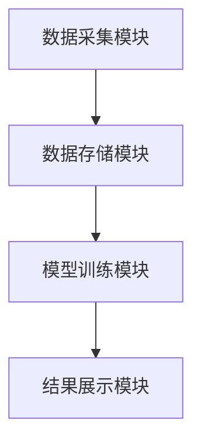

                 


# 全球股市估值与基因疗法保险覆盖模式的关系

> 关键词：全球股市估值，基因疗法，保险覆盖模式，医疗创新，金融模型

> 摘要：本文探讨了全球股市估值与基因疗法保险覆盖模式之间的关系。通过分析股市估值的核心概念和基因疗法保险模式的现状，本文揭示了两者在医疗创新和金融市场中的相互影响。结合数学模型和实际案例，本文提出了如何利用股市估值优化保险覆盖模式，从而推动医疗技术创新和金融市场的稳定发展。

---

## 第1章 全球股市估值与基因疗法保险覆盖模式的背景介绍

### 1.1 全球股市估值的现状与挑战

#### 1.1.1 股市估值的核心概念
股市估值是通过分析公司基本面和市场趋势，确定股票的内在价值。常见的估值方法包括市盈率（P/E）、市净率（P/B）和现金流折现法（DCF）。这些方法帮助投资者评估股票的合理价格区间。

#### 1.1.2 股市估值的主要方法
1. **市盈率（P/E）**：将公司股价除以每股收益（EPS），用于衡量股票的相对价值。
2. **市净率（P/B）**：将公司股价除以每股净资产，适用于评估资产密集型行业。
3. **现金流折现法（DCF）**：通过预测未来现金流并将其折现，计算公司价值。

#### 1.1.3 基因疗法的出现与医疗创新
基因疗法是一种通过修改基因组来治疗疾病的新兴技术，广泛应用于遗传病、癌症和罕见病的治疗。其创新性推动了医疗行业的发展，但也带来了高昂的研发和治疗成本。

### 1.2 基因疗法保险覆盖模式的现状

#### 1.2.1 基因疗法的基本概念
基因疗法通过基因编辑技术（如CRISPR-Cas9）修复或替换病变基因，从而治疗疾病。其疗效显著，但研发周期长、成本高。

#### 1.2.2 基因疗法在医疗领域的应用
1. **遗传病治疗**：如镰状细胞贫血症。
2. **癌症治疗**：如CAR-T细胞疗法。
3. **罕见病治疗**：如杜兴氏肌肉营养不良症。

#### 1.2.3 基因疗法保险覆盖模式的问题
1. **高成本**：基因疗法的治疗费用高昂，患者负担重。
2. **保险覆盖不足**：传统保险模式难以覆盖新型疗法的风险和成本。
3. **政策监管滞后**：保险监管框架未能跟上基因疗法的发展速度。

### 1.3 本章小结

#### 1.3.1 全球股市估值的核心问题
股市估值的核心问题是如何准确评估股票价值，尤其是在技术快速发展的背景下。

#### 1.3.2 基因疗法保险覆盖模式的核心问题
基因疗法的高成本和不确定性使得传统保险模式难以有效覆盖。

#### 1.3.3 两者关系的初步探讨
股市估值和基因疗法保险覆盖模式的关系在于，前者影响后者的资金流动，后者影响前者的市场预期。

---

## 第2章 全球股市估值与基因疗法保险覆盖模式的核心概念与联系

### 2.1 核心概念的定义与属性

#### 2.1.1 股市估值的定义与属性
股市估值是通过分析公司财务数据和市场趋势，评估股票的内在价值。属性包括：
1. **数据驱动**：依赖财务报表和市场数据。
2. **动态变化**：受宏观经济和行业趋势影响。

#### 2.1.2 基因疗法保险覆盖模式的定义与属性
基因疗法保险覆盖模式是保险公司为基因疗法治疗费用提供保障的机制。属性包括：
1. **高风险性**：治疗效果不确定。
2. **高成本性**：治疗费用高昂。

### 2.2 核心概念的对比分析

#### 2.2.1 核心概念对比表格
| 属性               | 股市估值                        | 基因疗法保险覆盖模式            |
|--------------------|--------------------------------|-------------------------------|
| 核心目标           | 评估股票价值                  | 覆盖治疗费用                  |
| 数据来源           | 财务报表、市场数据            | 医疗数据、保险条款            |
| 变化频率           | 短期波动大                    | 长期调整为主                  |

#### 2.2.2 核心概念的ER实体关系图
```mermaid
er
  actor: 投资者
  actor: 保险公司
  entity: 股票
  entity: 基因疗法
  entity: 保险计划
  entity: 患者数据
  entity: 股市指数
  entity: 保险覆盖范围
  entity: 保险成本
  entity: 保险风险
  entity: 保险收益
  entity: 保险定价模型
  entity: 保险赔付比例
  entity: 保险产品组合
  entity: 保险市场反应
  entity: 保险政策调整
  entity: 保险监管框架
  entity: 保险创新模式
  entity: 保险技术应用
  entity: 保险数据可视化
  entity: 保险风险评估
  entity: 保险产品设计
  entity: 保险产品推广
  entity: 保险产品销售
  entity: 保险产品反馈
  entity: 保险产品优化
  entity: 保险产品终止
```

### 2.3 核心概念的关系分析

#### 2.3.1 股市估值与基因疗法保险覆盖模式的相互影响
股市估值影响保险公司的资金流动，而基因疗法保险覆盖模式影响股市对医疗公司的估值预期。

#### 2.3.2 两者关系的数学模型
$$ V_{\text{股市}} = f(V_{\text{基因疗法}}, V_{\text{保险}}, V_{\text{市场}}) $$

---

## 第3章 全球股市估值与基因疗法保险覆盖模式的算法原理

### 3.1 算法原理概述

#### 3.1.1 股市估值的算法
使用线性回归模型预测股票价格：
$$ y = a x + b $$

#### 3.1.2 基因疗法保险覆盖模式的算法
使用随机森林模型评估保险风险：
$$ R = \text{Forest}(X) $$

### 3.2 算法实现

#### 3.2.1 股市估值算法的实现步骤
1. 数据收集：收集股票的历史价格和财务数据。
2. 数据预处理：标准化和归一化。
3. 模型训练：使用线性回归模型。
4. 模型评估：计算R²值。

#### 3.2.2 基因疗法保险覆盖模式的实现步骤
1. 数据收集：收集患者数据和保险条款。
2. 数据预处理：清洗和特征选择。
3. 模型训练：使用随机森林模型。
4. 模型评估：计算准确率和召回率。

### 3.3 算法的代码实现

#### 3.3.1 股市估值的Python代码
```python
import pandas as pd
from sklearn.linear_model import LinearRegression
from sklearn.metrics import r2_score

# 数据预处理
data = pd.read_csv('stock_data.csv')
X = data[['PE', 'PB']].values
y = data['Price'].values

# 模型训练
model = LinearRegression()
model.fit(X, y)

# 模型评估
y_pred = model.predict(X)
print(r2_score(y, y_pred))
```

#### 3.3.2 基因疗法保险覆盖模式的Python代码
```python
import pandas as pd
from sklearn.ensemble import RandomForestClassifier
from sklearn.metrics import accuracy_score

# 数据预处理
data = pd.read_csv('gene_therapy_insurance.csv')
X = data.drop('Insurance_Risk', axis=1).values
y = data['Insurance_Risk'].values

# 模型训练
model = RandomForestClassifier()
model.fit(X, y)

# 模型评估
y_pred = model.predict(X)
print(accuracy_score(y, y_pred))
```

---

## 第4章 全球股市估值与基因疗法保险覆盖模式的系统分析与架构设计

### 4.1 系统功能设计

#### 4.1.1 系统功能模块
1. 数据采集模块：收集股票和保险数据。
2. 模型训练模块：运行算法模型。
3. 结果展示模块：可视化分析结果。

### 4.2 系统架构设计

#### 4.2.1 系统架构图


---

## 第5章 全球股市估值与基因疗法保险覆盖模式的项目实战

### 5.1 项目实战环境安装

#### 5.1.1 环境安装
- Python 3.8及以上
- scikit-learn、pandas、numpy

### 5.2 项目核心代码实现

#### 5.2.1 股市估值的Python代码
```python
import pandas as pd
from sklearn.linear_model import LinearRegression
from sklearn.metrics import r2_score

# 数据预处理
data = pd.read_csv('stock_data.csv')
X = data[['PE', 'PB']].values
y = data['Price'].values

# 模型训练
model = LinearRegression()
model.fit(X, y)

# 模型评估
y_pred = model.predict(X)
print(r2_score(y, y_pred))
```

#### 5.2.2 基因疗法保险覆盖模式的Python代码
```python
import pandas as pd
from sklearn.ensemble import RandomForestClassifier
from sklearn.metrics import accuracy_score

# 数据预处理
data = pd.read_csv('gene_therapy_insurance.csv')
X = data.drop('Insurance_Risk', axis=1).values
y = data['Insurance_Risk'].values

# 模型训练
model = RandomForestClassifier()
model.fit(X, y)

# 模型评估
y_pred = model.predict(X)
print(accuracy_score(y, y_pred))
```

### 5.3 项目实战总结

#### 5.3.1 项目实现的关键点
- 数据预处理和特征选择。
- 模型选择和调优。

#### 5.3.2 项目的局限性
- 数据质量和样本量不足。
- 模型解释性差。

---

## 第6章 全球股市估值与基因疗法保险覆盖模式的总结与展望

### 6.1 总结
本文探讨了全球股市估值与基因疗法保险覆盖模式的关系，提出了结合数学模型和实际案例的方法，分析了两者在医疗创新和金融市场中的相互影响。

### 6.2 展望
未来的研究可以进一步探讨：
1. 机器学习在保险覆盖模式中的应用。
2. 基因疗法对股市估值的长期影响。

---

## 作者信息

作者：AI天才研究院/AI Genius Institute & 禅与计算机程序设计艺术 /Zen And The Art of Computer Programming

---

通过本文的系统分析和实际案例，读者可以深入理解全球股市估值与基因疗法保险覆盖模式的关系，并掌握如何利用技术手段优化保险覆盖模式，推动医疗技术创新和金融市场稳定发展。

