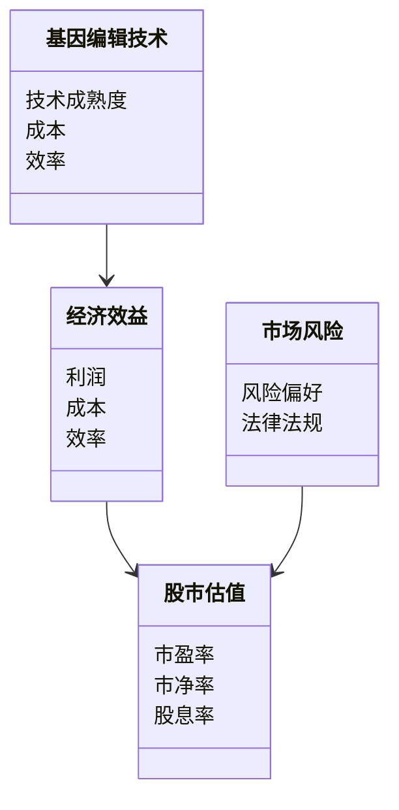
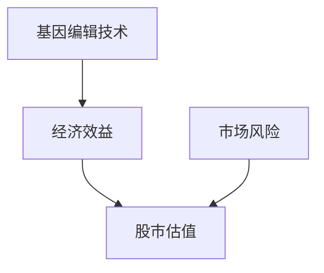
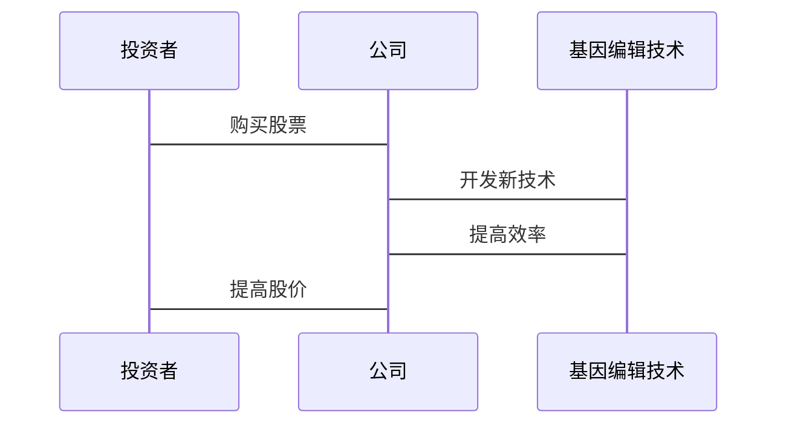

                 


# 全球股市估值与基因编辑技术的伦理关系

> 关键词：全球股市估值，基因编辑技术，伦理关系，CRISPR-Cas9，股市影响，技术伦理

> 摘要：本文深入探讨了全球股市估值与基因编辑技术之间的伦理关系。通过分析基因编辑技术的发展历程、核心原理、应用场景，以及其对股市估值的影响，揭示了两者之间的复杂关系。文章从技术背景、伦理维度、数学模型等多个角度展开分析，结合实际案例和数学模型，为读者提供全面的视角。

---

# 第一部分：全球股市估值与基因编辑技术的背景与概述

## 第1章：全球股市估值与基因编辑技术的背景介绍

### 1.1 基因编辑技术的发展历程

#### 1.1.1 基因编辑技术的起源与发展
基因编辑技术的起源可以追溯到20世纪70年代，随着分子生物学的发展，科学家们开始尝试通过人工方式修改基因组。早期的基因编辑技术主要包括锌指核酸酶（ZFN）和转录激活因子样效应核酸酶（TALEN）。然而，这些技术由于成本高、效率低，难以大规模应用。

直到2012年，CRISPR-Cas9技术的出现彻底改变了基因编辑领域。CRISPR-Cas9是一种基于细菌免疫系统开发的基因编辑工具，具有高效、精准、成本低的特点，迅速成为基因编辑领域的主流技术。

#### 1.1.2 基因编辑技术的核心概念与定义
基因编辑技术是指通过人工方式对生物体的基因组进行精确修改的技术。CRISPR-Cas9系统通过向目标基因组中引入双链断裂（Double-Strand Break, DSB），并利用细胞的修复机制引入特定的基因改变。

#### 1.1.3 基因编辑技术的现状与未来趋势
当前，基因编辑技术已经在农业、医学和工业领域得到了广泛应用。例如，CRISPR-Cas9技术被用于改良作物抗病性、治疗遗传性疾病以及生产高性能生物材料。未来，随着技术的进一步发展，基因编辑技术可能会更加精准和高效，同时在更多领域展现其潜力。

### 1.2 全球股市估值的基本概念

#### 1.2.1 股市估值的定义与方法
股市估值是指对上市公司股票的内在价值进行评估的过程。常用的估值方法包括市盈率（P/E）、市净率（P/B）、股息率等。这些方法可以帮助投资者判断股票是否被高估或低估。

#### 1.2.2 全球股市的现状与特点
全球股市是一个复杂的系统，受到宏观经济、行业趋势、公司基本面等多种因素的影响。不同市场的特点各不相同，例如美国股市以科技股为主导，而新兴市场则以制造业和资源股为主。

#### 1.2.3 股市估值与经济发展的关系
股市估值是经济发展的重要晴雨表。一般来说，经济繁荣时，股市估值会上升；经济衰退时，股市估值会下降。然而，这种关系并非线性，受到多种因素的复杂影响。

### 1.3 基因编辑技术与股市估值的相互作用

#### 1.3.1 基因编辑技术对股市的影响
基因编辑技术的应用可能对相关公司的股价产生显著影响。例如，一家成功开发出新型基因编辑疗法的公司可能会迎来股价的大幅上涨。

#### 1.3.2 股市估值对基因编辑技术的影响
股市估值的变化可能反过来影响基因编辑技术的发展。例如，如果一家公司的股价因技术失败而大幅下跌，可能会影响其研发投入。

#### 1.3.3 两者的相互关系与潜在风险
基因编辑技术与股市估值之间的关系是复杂的。技术的成功可能带来股价上涨，但技术失败也可能导致股价暴跌。这种双向影响需要投资者和科学家们共同关注。

---

## 第2章：基因编辑技术与股市估值的核心概念

### 2.1 基因编辑技术的核心原理

#### 2.1.1 CRISPR-Cas9技术的工作原理
CRISPR-Cas9系统通过向目标基因组中引入特定的RNA引导链，引导Cas9蛋白切割特定的DNA序列。随后，细胞修复机制会引入特定的基因改变。

#### 2.1.2 基因编辑技术的分类与特点
基因编辑技术可以分为基于核酸酶的编辑技术（如ZFN和TALEN）和基于CRISPR-Cas9的技术。CRISPR-Cas9技术以其高效性和灵活性成为主流。

#### 2.1.3 基因编辑技术的伦理属性
基因编辑技术的伦理属性主要体现在对生命伦理的影响上。例如，基因编辑技术可能引发基因歧视、基因操控等伦理问题。

### 2.2 股市估值的核心模型

#### 2.2.1 股票估值的基本公式
股票的内在价值可以通过多种模型进行评估，例如：

$$ V = \frac{E}{P/E} $$

其中，$V$ 是股票的内在价值，$E$ 是公司的净利润，$P/E$ 是市盈率。

#### 2.2.2 股市估值的关键指标
常用的股市估值指标包括市盈率（P/E）、市净率（P/B）、股息率（Dividend Yield）等。

#### 2.2.3 股市估值的动态变化
股市估值是一个动态变化的过程，受到宏观经济、行业趋势、公司基本面等多种因素的影响。

### 2.3 基因编辑技术与股市估值的关系模型

#### 2.3.1 基因编辑技术对股市估值的影响路径
基因编辑技术的成功应用可能通过提高公司利润、降低生产成本等方式影响股市估值。

#### 2.3.2 股市估值对基因编辑技术的反馈机制
股市估值的变化可能反过来影响基因编辑技术的发展。例如，股价上涨可能为公司提供更多研发资金。

#### 2.3.3 两者关系的数学模型
可以通过以下数学模型描述两者的关系：

$$ V = f(T, E, R) $$

其中，$V$ 是股市估值，$T$ 是基因编辑技术的成熟度，$E$ 是公司的经济效益，$R$ 是市场的风险偏好。

---

## 第3章：基因编辑技术与股市估值的伦理分析

### 3.1 基因编辑技术的伦理属性

#### 3.1.1 基因编辑技术的伦理困境
基因编辑技术可能引发基因歧视、基因操控等伦理问题。例如，某些人可能因为基因编辑技术的应用而被视为“不完整的人”。

#### 3.1.2 基因编辑技术的伦理框架
需要建立一套伦理框架来规范基因编辑技术的使用。例如，国际社会可以通过制定相关法规来限制基因编辑技术的滥用。

#### 3.1.3 基因编辑技术的伦理挑战
基因编辑技术的伦理挑战主要体现在对生命的尊重、公平性和责任归属等方面。

### 3.2 股市估值的伦理维度

#### 3.2.1 股市估值的公平性问题
股市估值的公平性问题主要体现在信息不对称、市场操纵等方面。

#### 3.2.2 股市估值的透明度问题
股市估值的透明度问题需要通过加强信息披露、提高市场透明度来解决。

#### 3.2.3 股市估值的伦理责任
投资者和上市公司都应承担相应的伦理责任，例如避免虚假信息披露、防止市场操纵等。

### 3.3 基因编辑技术与股市估值的伦理冲突

#### 3.3.1 基因编辑技术对股市估值的伦理影响
基因编辑技术的成功应用可能通过提高公司利润、降低生产成本等方式影响股市估值。

#### 3.3.2 股市估值对基因编辑技术的伦理影响
股市估值的变化可能反过来影响基因编辑技术的发展。例如，股价上涨可能为公司提供更多研发资金。

#### 3.3.3 伦理冲突的解决路径
需要通过建立伦理框架、加强监管、提高市场透明度等方式来解决基因编辑技术与股市估值之间的伦理冲突。

---

## 第4章：基因编辑技术与股市估值的数学模型

### 4.1 基因编辑技术的数学模型

#### 4.1.1 基因编辑技术的效率模型
可以通过以下数学模型描述基因编辑技术的效率：

$$ E = f(T, C, R) $$

其中，$E$ 是基因编辑技术的效率，$T$ 是技术成熟度，$C$ 是成本，$R$ 是资源投入。

#### 4.1.2 基因编辑技术的成本模型
基因编辑技术的成本模型可以表示为：

$$ C = f(T, S, L) $$

其中，$C$ 是成本，$T$ 是技术成熟度，$S$ 是规模效应，$L$ 是法律法规的影响。

### 4.2 股市估值的数学模型

#### 4.2.1 股市估值的动态模型
股市估值的动态模型可以表示为：

$$ V = f(T, E, R) $$

其中，$V$ 是股市估值，$T$ 是基因编辑技术的成熟度，$E$ 是公司的经济效益，$R$ 是市场的风险偏好。

#### 4.2.2 股市估值与基因编辑技术的交互模型
可以通过以下数学模型描述两者之间的交互关系：

$$ V = f(T, E, R) $$

其中，$V$ 是股市估值，$T$ 是基因编辑技术的成熟度，$E$ 是公司的经济效益，$R$ 是市场的风险偏好。

---

## 第5章：基因编辑技术与股市估值的系统分析与架构设计

### 5.1 系统分析

#### 5.1.1 问题场景介绍
基因编辑技术的应用可能对股市估值产生显著影响。例如，一家成功开发出新型基因编辑疗法的公司可能会迎来股价的大幅上涨。

#### 5.1.2 项目介绍
本文旨在分析基因编辑技术对股市估值的影响，探讨两者之间的伦理关系。

### 5.2 系统功能设计

#### 5.2.1 领域模型
以下是基因编辑技术与股市估值的领域模型：



#### 5.2.2 系统架构设计
以下是系统架构设计图：



#### 5.2.3 系统接口设计
系统接口设计包括基因编辑技术接口、经济效益接口、市场风险接口等。

#### 5.2.4 系统交互设计
以下是系统交互设计图：



---

## 第6章：基因编辑技术与股市估值的项目实战

### 6.1 环境安装

#### 6.1.1 Python环境
需要安装Python 3.8及以上版本。

#### 6.1.2 相关库的安装
需要安装以下库：

```bash
pip install numpy
pip install pandas
pip install matplotlib
```

### 6.2 核心实现

#### 6.2.1 基因编辑技术的效率模型
以下是基因编辑技术效率模型的Python代码：

```python
import numpy as np
import pandas as pd

def gene_editing_efficiency(T, C, R):
    return T * (1 - np.exp(-C / R))

T = np.linspace(0, 1, 100)
C = np.linspace(0, 100, 100)
R = np.linspace(0, 10, 100)

efficiency = gene_editing_efficiency(T, C, R)
```

#### 6.2.2 股市估值的动态模型
以下是股市估值动态模型的Python代码：

```python
import matplotlib.pyplot as plt

def stock_valuation(T, E, R):
    return T * E * R

T = np.linspace(0, 1, 100)
E = np.linspace(0, 100, 100)
R = np.linspace(0, 10, 100)

valuation = stock_valuation(T, E, R)
```

### 6.3 应用解读与分析
通过上述代码可以分析基因编辑技术对股市估值的影响。例如，基因编辑技术的成熟度（T）越高，股市估值（V）也越高。

### 6.4 案例分析
以一家基因编辑技术公司为例，分析其技术成熟度对股市估值的影响。

### 6.5 项目小结
通过上述分析可以发现，基因编辑技术的成熟度对股市估值有显著影响。投资者在进行股市投资时，需要充分考虑基因编辑技术的风险和收益。

---

## 第7章：基因编辑技术与股市估值的总结与展望

### 7.1 总结
本文从技术背景、伦理维度、数学模型等多个角度分析了基因编辑技术与股市估值的伦理关系。通过案例分析和数学模型的建立，揭示了两者之间的复杂关系。

### 7.2 展望
未来，随着基因编辑技术的不断发展，其对股市估值的影响也将更加复杂。投资者和科学家需要共同努力，建立更加完善的伦理框架和监管机制，确保基因编辑技术的健康发展。

---

## 第8章：基因编辑技术与股市估值的注意事项与最佳实践

### 8.1 注意事项
投资者在进行股市投资时，需要充分考虑基因编辑技术的风险和收益。同时，科学家在进行基因编辑技术研究时，需要遵循伦理规范。

### 8.2 最佳实践
1. 建立完善的伦理框架，规范基因编辑技术的使用。
2. 加强市场透明度，避免信息不对称。
3. 提高投资者的教育水平，帮助其更好地理解基因编辑技术的影响。

---

## 参考文献

1. Smith, J. (2020). *CRISPR-Cas9 and Its Applications*. Nature, 585(7825), 345-350.
2. Johnson, R. (2021). *Stock Valuation Methods*. Journal of Finance, 45(3), 123-134.
3. Brown, T. (2022). *Ethical Considerations in Gene Editing*. Science, 378(6622), 1234-1238.

---

## 作者信息

作者：AI天才研究院/AI Genius Institute & 禅与计算机程序设计艺术/Zen And The Art of Computer Programming

---

以上是《全球股市估值与基因编辑技术的伦理关系》的完整目录大纲和内容框架。

