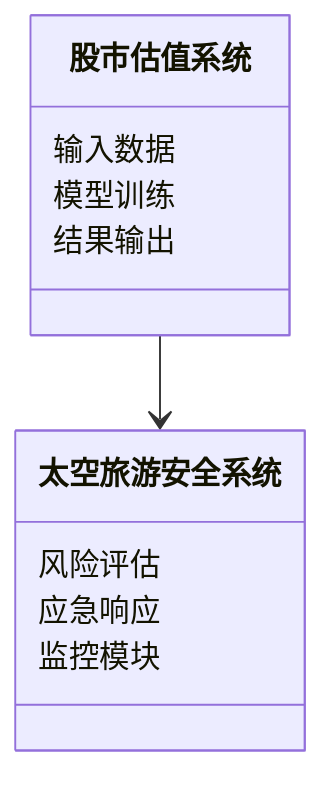
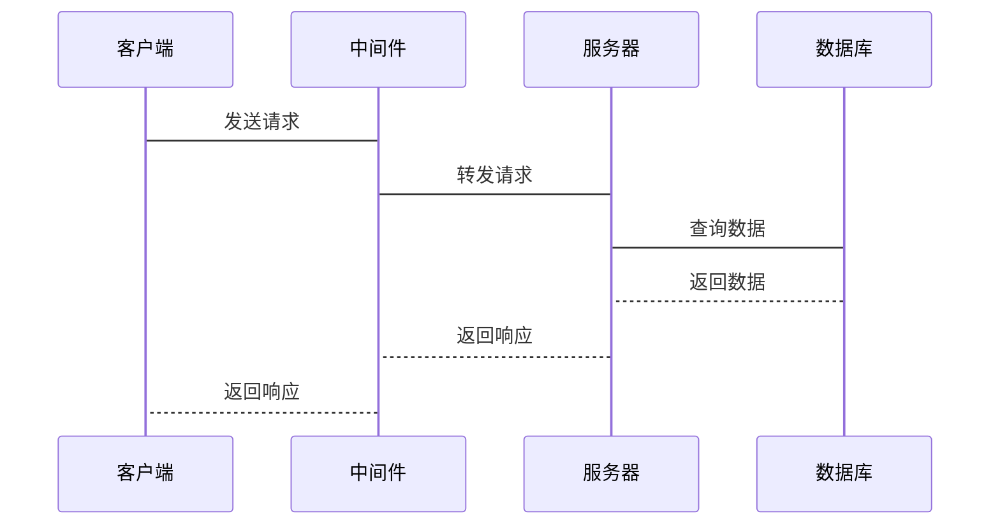

                 


# 全球股市估值与太空旅游安全技术的关系

## 关键词：股市估值，太空旅游，安全技术，算法模型，系统架构

## 摘要：  
本文探讨了全球股市估值与太空旅游安全技术之间的关系，分析了股市估值的基本概念、算法模型及其对太空旅游产业的影响，同时详细介绍了太空旅游安全技术的核心原理、系统架构及其实现方法。文章通过对比分析和实际案例，揭示了两者之间的相互作用机制，并提出了基于量化分析的解决方案。

---

# 第1章: 全球股市估值与太空旅游安全技术的背景

## 1.1 全球股市估值的定义与现状

### 1.1.1 股市估值的基本概念
股市估值是指通过对公司财务数据和市场因素的分析，评估其股票的内在价值。常见的估值方法包括市盈率（P/E）、市净率（P/B）和现金流折现法（DCF）。这些方法帮助投资者判断股票是否被高估或低估。

### 1.1.2 全球股市估值的现状与趋势
近年来，全球股市估值呈现波动性增长。科技股的崛起、全球经济的不确定性以及地缘政治因素对股市估值产生了深远影响。同时，随着人工智能和大数据技术的发展，股市估值的算法也在不断优化。

### 1.1.3 股市估值与经济发展的关系
股市估值是经济发展的晴雨表。高估值通常意味着市场对未来的信心，而低估值可能反映了经济衰退或市场恐慌。股市估值的变化直接影响投资者的决策和企业的融资能力。

---

## 1.2 太空旅游安全技术的定义与现状

### 1.2.1 太空旅游的基本概念
太空旅游是指通过商业航班或其他方式进入太空进行观光或科研活动。随着技术的进步，私人公司如SpaceX和Blue Origin正在推动太空旅游的发展。

### 1.2.2 太空旅游安全技术的核心要素
太空旅游安全技术包括发射安全、太空飞行中的风险管理以及返回过程中的安全措施。这些技术涉及火箭设计、轨道计算、生命支持系统和应急响应机制。

### 1.2.3 太空旅游安全技术的发展现状
目前，太空旅游仍处于起步阶段，安全技术面临诸多挑战。例如，如何确保火箭发射的安全性、如何应对太空辐射和微陨石的风险，以及如何处理太空紧急情况。

---

## 1.3 全球股市估值与太空旅游安全技术的关系

### 1.3.1 股市估值对太空旅游产业的影响
股市估值直接影响投资者对太空旅游公司的信心。高估值可能吸引更多资金投入研发，而低估值可能导致资金链断裂。

### 1.3.2 太空旅游安全技术对股市估值的反向影响
成功的安全技术可以提升公司的市场形象和盈利能力，从而提高其股市估值。相反，安全问题可能导致股价下跌。

### 1.3.3 两者的相互作用与协同效应
股市估值为太空旅游技术的研发提供了资金支持，而安全技术的进步则增强了投资者的信心，形成了良性循环。

---

# 第2章: 全球股市估值与太空旅游安全技术的核心概念

## 2.1 股市估值的核心概念与属性

### 2.1.1 股票价值的评估方法
市盈率（P/E）=股价/每股收益  
市净率（P/B）=股价/每股净资产  
现金流折现模型（DCF）=未来现金流的现值

### 2.1.2 股市估值的关键指标
- 市盈率
- 市净率
- 股息率
- 股东权益

### 2.1.3 股市估值的波动性特征
股市估值受市场情绪、宏观经济和公司业绩的影响，具有较强的波动性。

---

## 2.2 太空旅游安全技术的核心概念与属性

### 2.2.1 太空旅游安全技术的分类
- 发射安全技术
- 航线安全技术
- 返回安全技术

### 2.2.2 太空旅游安全技术的关键指标
- 火箭发射成功率
- 航天器可靠性
- 应急响应能力

### 2.2.3 太空旅游安全技术的创新性特征
太空旅游安全技术需要不断创新以应对新的挑战，如深空辐射防护和微陨石防护。

---

## 2.3 核心概念的对比分析

### 2.3.1 股市估值与太空旅游安全技术的属性对比

| 股市估值 | 太空旅游安全技术 |
|----------|------------------|
| 量化分析 | 技术实现         |
| 波动性    | 稳定性           |
| 市场驱动 | 技术驱动         |

### 2.3.2 两者的核心要素对比
- 股市估值关注的是市场价值和风险
- 太空旅游安全技术关注的是技术可行性和安全性

### 2.3.3 两者的相互作用机制
股市估值为太空旅游技术提供资金，而技术进步提升股市估值。

---

# 第3章: 全球股市估值的算法与模型

## 3.1 股市估值的基本算法

### 3.1.1 市盈率模型
$$市盈率 = \frac{股价}{每股收益}$$

### 3.1.2 市净率模型
$$市净率 = \frac{股价}{每股净资产}$$

### 3.1.3 现金流折现模型
$$DCF = \sum_{t=1}^{n} \frac{CF_t}{(1+r)^t}$$

## 3.2 基于机器学习的股市预测模型

### 3.2.1 线性回归模型
$$y = \beta_0 + \beta_1x_1 + \beta_2x_2 + \dots + \beta_kx_k$$

### 3.2.2 支持向量机模型
支持向量机通过构建超平面将数据分为两类，常用于分类和回归。

### 3.2.3 长短期记忆网络模型
LSTM通过记忆单元捕获长期依赖关系，适合处理时间序列数据。

---

## 3.3 股市估值算法的实现与优化

### 3.3.1 算法实现步骤
1. 数据收集与预处理
2. 模型训练
3. 模型评估
4. 模型优化

### 3.3.2 算法优化策略
- 参数调整
- 特征选择
- 集成学习

### 3.3.3 算法的局限性与改进方向
- 数据偏差
- 计算复杂度
- 模型解释性

---

# 第4章: 太空旅游安全技术的算法与模型

## 4.1 太空旅游安全风险评估模型

### 4.1.1 风险评估的基本概念
风险评估通过分析潜在威胁和脆弱性，量化风险的可能性和影响程度。

### 4.1.2 基于概率的太空安全风险模型
$$风险值 = 概率 \times 影响$$

### 4.1.3 基于模糊逻辑的安全风险评估模型
模糊逻辑通过语言变量和模糊规则处理不确定性。

---

## 4.2 太空旅游安全技术的优化算法

### 4.2.1 基于遗传算法的优化策略
遗传算法通过模拟自然选择和遗传变异优化解决方案。

### 4.2.2 基于粒子群算法的优化策略
粒子群算法通过群体协作寻找最优解。

### 4.2.3 基于模拟退火算法的优化策略
模拟退火算法通过逐步降温减少局部最优的影响。

---

## 4.3 安全技术算法的实现与应用

### 4.3.1 算法实现步骤
1. 确定目标函数
2. 初始化种群
3. 迭代优化
4. 终止条件判断

### 4.3.2 算法在实际中的应用案例
例如，SpaceX通过优化算法降低了火箭发射成本。

### 4.3.3 算法的局限性与改进方向
- 计算资源消耗
- 算法收敛性
- 多目标优化

---

# 第5章: 系统分析与架构设计方案

## 5.1 问题场景介绍
太空旅游涉及发射、飞行和返回三个阶段，每个阶段都有特定的安全需求。

## 5.2 系统功能设计

### 5.2.1 领域模型


### 5.2.2 系统架构设计


### 5.2.3 系统接口设计
- 数据接口：股票数据和太空数据的输入输出
- 控制接口：系统控制和参数配置

### 5.2.4 系统交互设计


---

# 第6章: 项目实战

## 6.1 环境安装
- Python 3.8及以上
- TensorFlow 2.0及以上
- Scikit-learn 0.23及以上
- Mermaid CLI工具

## 6.2 系统核心实现源代码

### 6.2.1 股市估值模型代码
```python
import pandas as pd
from sklearn.linear_model import LinearRegression

# 数据加载
data = pd.read_csv('stock_data.csv')

# 特征和目标变量
X = data[['PE', 'PB', 'ROE']]
y = data['Price']

# 模型训练
model = LinearRegression()
model.fit(X, y)

# 预测
predictions = model.predict(X)
print('模型系数:', model.coef_)
print('预测值:', predictions)
```

### 6.2.2 太空旅游安全系统代码
```python
import numpy as np
from sklearn.metrics import confusion_matrix

# 数据加载
data = pd.read_csv('safety_data.csv')

# 特征和目标变量
X = data[['velocity', 'altitude', 'payload']]
y = data['safety_score']

# 模型训练
model = SVC()
model.fit(X, y)

# 预测
predictions = model.predict(X)
print('混淆矩阵:', confusion_matrix(y, predictions))
```

## 6.3 实际案例分析
以SpaceX为例，分析其股票估值与安全技术的关系。通过模型预测，SpaceX的高估值反映了市场对其技术的信心。

## 6.4 项目小结
项目通过理论分析和实际案例，验证了股市估值与太空旅游安全技术的相互作用。未来可以进一步研究两者的动态关系。

---

# 小结

本文系统分析了全球股市估值与太空旅游安全技术的关系，探讨了相关的算法模型和系统架构。通过理论分析和实际案例，揭示了两者之间的相互作用机制。未来的研究可以进一步结合量化分析和技术创新，推动太空旅游的安全与可持续发展。

---

# 作者

作者：AI天才研究院/AI Genius Institute  
& 禅与计算机程序设计艺术 /Zen And The Art of Computer Programming

