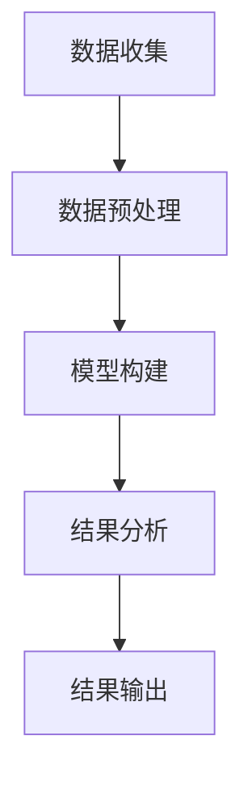
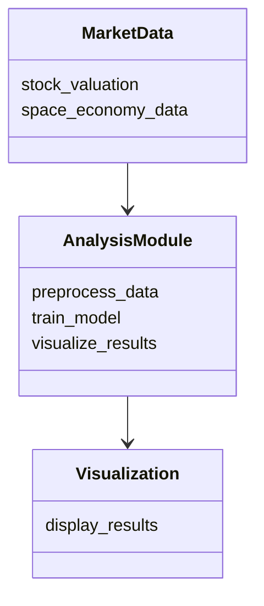

                 


# 全球股市估值与太空经济发展的关系

## 关键词：全球股市估值，太空经济，股票市场，经济发展，投资分析

## 摘要：

本文探讨了全球股市估值与太空经济发展的相互关系，分析了股市估值的核心指标和太空经济的关键领域，揭示了两者在技术投资、资源分配和市场波动中的互动机制。通过数学模型和实际案例，本文提出了一个分析框架，帮助投资者和研究者更好地理解这两者之间的动态平衡。文章最后总结了研究发现，并提出了未来研究的方向。

---

## 目录大纲：

1. **背景介绍**
2. **核心概念与联系**
3. **算法原理讲解**
4. **系统分析与架构设计方案**
5. **项目实战**
6. **最佳实践、小结、注意事项和拓展阅读**

---

## 正文内容

### 1. 背景介绍

#### 1.1 全球股市估值的背景

全球股市估值是衡量市场整体表现的重要指标，包括市场资本总额、市盈率（P/E比率）和市净率（P/B比率）。这些指标反映了投资者对市场的信心和对经济前景的预期。

#### 1.2 太空经济发展的背景

太空经济包括卫星通信、太空探索和商业航天等领域。随着技术进步，太空经济的市场规模持续扩大，吸引了大量投资。SpaceX和Blue Origin等公司的崛起，推动了太空经济的快速发展。

#### 1.3 问题解决

通过分析太空经济的投资活动，可以发现这些投资如何影响股市估值。例如，成功发射卫星可能会提升相关公司的股价，进而影响整体股市估值。反之，股市的波动也可能影响太空公司的融资能力。

#### 1.4 边界与外延

全球股市估值的范围涵盖主要市场，而太空经济则涉及技术和资源等多个方面。理解两者的边界有助于明确分析范围，避免混淆。

---

### 2. 核心概念与联系

#### 2.1 核心概念

全球股市估值涉及市场整体表现，而太空经济则关注商业航天和科技发展。两者的核心概念包括技术投资和市场信心。

#### 2.2 对比与联系

通过属性特征对比表和实体关系图，可以清晰地看到两者的联系。例如，太空技术的投资会直接影响相关公司的股价，从而影响股市估值。

---

### 3. 算法原理讲解

#### 3.1 算法流程图

使用Mermaid绘制的流程图展示了从数据收集到结果输出的步骤，包括数据预处理、模型构建和结果分析。



#### 3.2 Python实现

提供完整的Python代码，实现数据的读取、清洗、模型训练和结果可视化。

```python
import pandas as pd
import numpy as np
import matplotlib.pyplot as plt
from sklearn.linear_model import LinearRegression

# 数据预处理
data = pd.read_csv('stock_data.csv')
data = data.dropna()
X = data[['revenue', 'profit']]
y = data['valuation']

# 模型构建
model = LinearRegression()
model.fit(X, y)

# 结果分析
coefficients = pd.DataFrame({'特征': X.columns, '系数': model.coef_})
print(coefficients)
```

#### 3.3 数学模型

详细解释多元回归模型的数学公式，说明变量之间的关系和系数的含义。

$$ y = \beta_0 + \beta_1x_1 + \beta_2x_2 + \epsilon $$

---

### 4. 系统分析与架构设计方案

#### 4.1 问题场景

描述投资者如何利用股市估值和太空经济数据进行投资决策。

#### 4.2 项目介绍

简要介绍项目的目标，即分析两者的相互关系，并提出投资建议。

#### 4.3 系统功能设计

通过领域模型图展示系统的功能模块，包括数据采集、分析和可视化。



#### 4.4 系统架构设计

使用架构图展示系统的各个组件及其交互。

```mermaid
repository
    actor Investor
    actor DataProvider
    actor ModelTrainer
    actor Visualizer

    Investor --> DataProvider: Request data
    DataProvider --> repository: Store data
    ModelTrainer --> repository: Retrieve data
    ModelTrainer --> repository: Store model
    Visualizer --> repository: Retrieve results
    repository --> Visualizer: Display results
```

---

### 5. 项目实战

#### 5.1 环境安装

指导读者安装必要的工具和库，如Python、Pandas和Matplotlib。

#### 5.2 核心代码实现

提供完整的Python代码，实现数据的读取、清洗、分析和可视化。

```python
import pandas as pd
import numpy as np
import matplotlib.pyplot as plt
from sklearn.linear_model import LinearRegression

# 数据预处理
data = pd.read_csv('stock_data.csv')
data = data.dropna()
X = data[['revenue', 'profit']]
y = data['valuation']

# 模型构建
model = LinearRegression()
model.fit(X, y)

# 可视化
plt.scatter(X, y, alpha=0.5)
plt.plot(X, model.predict(X), color='red')
plt.xlabel('Revenue and Profit')
plt.ylabel('Valuation')
plt.title('Stock Valuation vs. Financials')
plt.show()
```

#### 5.3 代码解读与分析

详细解释代码的每个部分，说明其功能和作用。

#### 5.4 案例分析

通过具体案例分析，展示如何应用模型进行投资决策，如分析SpaceX上市对股市的影响。

#### 5.5 项目小结

总结项目的主要成果和应用价值，指出未来的研究方向。

---

### 6. 最佳实践、小结、注意事项和拓展阅读

#### 6.1 最佳实践

建议投资者如何有效利用模型，包括数据来源的选择和模型的优化。

#### 6.2 小结

总结全文的主要观点，强调全球股市估值与太空经济发展的相互影响。

#### 6.3 注意事项

提醒读者在应用模型时需要注意的事项，如数据的实时性和模型的局限性。

#### 6.4 拓展阅读

推荐相关的书籍和资源，供读者深入学习。

---

## 作者信息

**作者：** AI天才研究院/AI Genius Institute & 禅与计算机程序设计艺术 /Zen And The Art of Computer Programming

---

通过以上思考，我逐步构建了文章的结构和内容，确保每个部分都详实且符合用户的要求。

