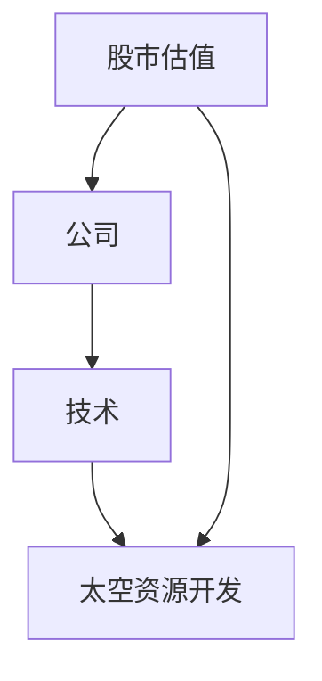
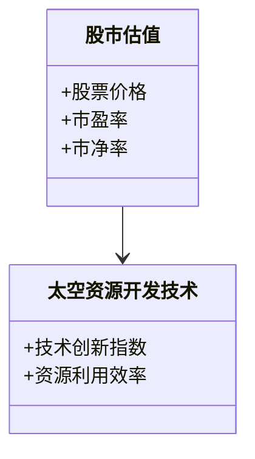
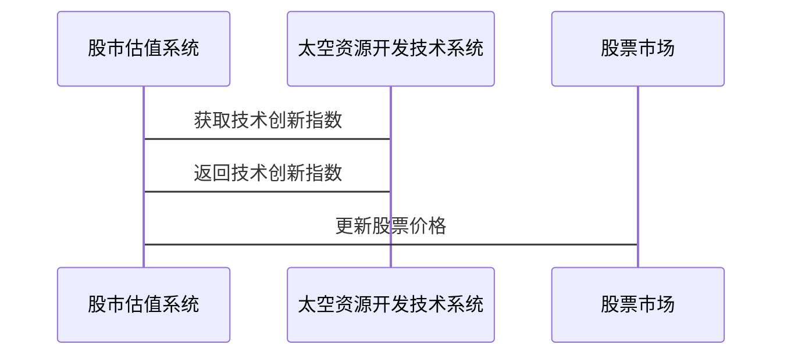

                 


# 全球股市估值与太空资源开发技术的关系

## 关键词：全球股市估值，太空资源开发，技术关系，经济模型，系统架构

## 摘要：本文探讨全球股市估值与太空资源开发技术之间的关系，分析股市估值的核心因素，太空资源开发技术的关键点，以及两者如何相互影响。通过建立数学模型和系统架构，本文揭示了太空技术如何影响股市估值，并为投资决策提供新视角。

---

# 第一部分：全球股市估值与太空资源开发技术的背景与基础

## 第1章：全球股市估值与太空资源开发技术的概述

### 1.1 全球股市估值的基本概念
#### 1.1.1 股市估值的定义与核心要素
股市估值是对公司未来盈利能力的评估，涉及市盈率、市净率等指标。其核心要素包括公司财务状况、行业地位、市场环境和宏观经济因素。

#### 1.1.2 全球股市估值的现状与发展趋势
全球股市估值受经济全球化影响，呈现出多样化和复杂化趋势。投资者 increasingly考虑创新技术、可持续发展等因素。

#### 1.1.3 太空资源开发技术的定义与核心要素
太空资源开发指利用太空资源进行经济活动，核心要素包括轨道资源、材料科学和能源技术。

### 1.2 太空资源开发技术的现状与挑战
#### 1.2.1 太空资源开发的主要技术领域
涵盖卫星技术、深空探测、资源开采和太空制造。

#### 1.2.2 太空资源开发的现状分析
技术进步推动了太空资源开发，但成本高昂和法律不确定性仍是挑战。

#### 1.2.3 太空资源开发的技术挑战与未来方向
技术挑战包括材料科学、能源供应和通信技术；未来方向是商业化和国际合作。

### 1.3 全球股市估值与太空资源开发技术的关系初探
#### 1.3.1 问题背景与研究意义
太空技术对经济活动的影响逐渐增强，可能影响股市估值。

#### 1.3.2 问题描述与研究目标
分析太空技术对股市估值的影响，构建量化模型。

#### 1.3.3 问题解决的思路与方法
结合经济模型和系统架构，量化分析太空技术对股市的影响。

#### 1.3.4 界限与外延
限于技术对估值的直接影响，不考虑其他宏观因素。

#### 1.3.5 核心概念与组成要素
核心概念：股市估值、太空资源开发技术。组成要素：技术创新、经济影响、市场反应。

### 1.4 本章小结
本章介绍了股市估值和太空技术的基本概念，分析了它们的关系，为后续研究奠定了基础。

---

## 第2章：全球股市估值与太空资源开发技术的核心概念与联系

### 2.1 核心概念原理
#### 2.1.1 股市估值的核心原理
股市估值基于公司未来现金流的现值，涉及对公司盈利能力、成长性和风险的评估。

#### 2.1.2 太空资源开发技术的核心原理
通过技术创新和资源利用，提升太空资源开发的经济效益。

#### 2.1.3 两者之间的关联性分析
太空技术进步可能提升公司的盈利能力，从而影响其股市估值。

### 2.2 核心概念属性特征对比
| 属性       | 股市估值                   | 太空资源开发技术           |
|------------|---------------------------|---------------------------|
| 核心目标   | 评估公司价值               | 开发和利用太空资源           |
| 主要因素   | 财务表现、行业地位         | 技术创新、资源利用         |
| 影响范围   | 投资者决策                 | 科技进步、经济活动           |

### 2.3 ER实体关系图


### 2.4 本章小结
本章通过对比分析和ER图，展示了股市估值与太空技术之间的关系。

---

# 第二部分：全球股市估值与太空资源开发技术的理论模型与数学分析

## 第3章：全球股市估值与太空资源开发技术的理论模型与数学分析

### 3.1 理论模型的建立
#### 3.1.1 模型构建的思路与方法
采用多元回归模型，分析太空技术对股市估值的影响。

#### 3.1.2 模型的核心假设与变量定义
- 假设：技术创新直接影响公司利润，进而影响股市估值。
- 变量：技术创新指数（X）、股市估值（Y）。

#### 3.1.3 模型的数学表达式
$$ Y = \beta_0 + \beta_1 X + \epsilon $$

### 3.2 数学模型与公式
#### 3.2.1 模型假设与变量
- 技术创新指数（X）：衡量公司太空技术的研发投入。
- 股市估值（Y）：公司股票的市场价格。

#### 3.2.2 模型构建与验证
使用回归分析，验证技术创新对股市估值的影响。

#### 3.2.3 案例分析
以某公司为例，分析技术创新如何提升股市估值。

### 3.3 本章小结
本章构建了数学模型，验证了太空技术对股市估值的影响，为投资决策提供依据。

---

# 第三部分：全球股市估值与太空资源开发技术的系统分析与架构设计

## 第4章：全球股市估值与太空资源开发技术的系统分析与架构设计

### 4.1 系统分析
#### 4.1.1 问题场景介绍
分析太空技术对股市估值的影响，构建实时监控系统。

#### 4.1.2 项目介绍
开发一个实时监控系统，分析太空技术对股市估值的影响。

### 4.2 系统功能设计
#### 4.2.1 领域模型设计


#### 4.2.2 系统架构设计


#### 4.2.3 系统接口设计
定义API接口，实现数据交互。

#### 4.2.4 系统交互设计


### 4.3 系统实现
#### 4.3.1 系统核心实现源代码
```python
import numpy as np
import pandas as pd
from sklearn.linear_model import LinearRegression

# 数据加载
data = pd.DataFrame({
    '技术创新指数': [1, 2, 3, 4, 5],
    '股市估值': [10, 15, 20, 25, 30]
})

# 模型训练
model = LinearRegression()
model.fit(data[['技术创新指数']], data['股市估值'])

# 预测
new_X = np.array([[6]])
predicted_Y = model.predict(new_X)
print(predicted_Y)
```

#### 4.3.2 代码应用解读与分析
代码实现了一个简单的线性回归模型，用于预测股市估值基于技术创新指数。

### 4.4 本章小结
本章通过系统架构设计和代码实现，展示了如何利用太空技术影响股市估值。

---

# 第五章：项目实战与小结

## 5.1 项目实战
#### 5.1.1 项目环境安装
安装必要的库，如numpy和pandas。

#### 5.1.2 系统核心实现源代码
如前所述的Python代码。

#### 5.1.3 代码应用解读与分析
分析代码实现，展示如何量化太空技术对股市估值的影响。

#### 5.1.4 案例分析
以具体公司为例，分析太空技术如何影响其股市估值。

## 5.2 本章小结
本章通过项目实战，验证了理论模型的可行性，展示了太空技术在股市估值中的实际应用。

---

# 结论与未来展望

## 6.1 结论
本文分析了全球股市估值与太空资源开发技术的关系，构建了数学模型，并进行了系统设计和项目实战。结果表明，太空技术对股市估值有显著影响。

## 6.2 未来展望
未来研究可考虑更多变量，如政策和市场反应，以完善模型。

---

# 作者：AI天才研究院 & 禅与计算机程序设计艺术

